<!--
QIITA 投稿前ドラフト (llcore #1) — private 限定共有想定。
公開時チェック (memory feedback_qiita_svg_path_and_cache):
  ① SVG は相対パス禁止 → raw 絶対 URL (GitHub raw) に差し替え
  ② raw URL を HTTP 200 で確認
  ③ Qiita は imgix プロキシでラスタライズ=アニメ不可・静止のみ → 静止フレーム版を別途用意 / ?v=N で cache-bust
  ④ ローカルパス D:\ は本文に出さない (この HTML コメントは publish 前に削除)
本ドラフトの SVG 参照は assets/articles/*.svg (GitHub repo view では動く)。Qiita 公開時は raw URL + 静止フォールバック。
-->

# 小さな LLM を「暴走しないと“証明”しながら」進化させる — llcore 開発記 #1

## この記事の主役は「賢さ」ではない。「暴走しないと言い切れること」だ

「LLM を進化させる」と言うと格好いい。構造をオンラインで growth させ、タスクに合わせて自分を作り替える——夢がある。

でも、ひとつ意地悪な問いを置きたい。

> **進化させた結果が“暴走”したら、あなたはそれを事前に止められますか? しかも“証明つき”で。**

llcore はこの問いに正面から答えるための小さな実験フレームワークだ。土台は **SmolLM2-135M(凍結)**。その上に載せた**ごく小さな recurrent adapter** の構造を進化させる。ただし一個ずつ、「この個体は摂動が減衰する(= 発散しない)」ことを**数学的に証明できる候補だけ**を採用する。

先に正直に言っておく。**この枠組みは“賢く”はならない**。後半でデータごと開示するが、進化は素直な勾配法に負ける。それでも本記事を書くのは、**「賢くする」のとは別の軸 ——「壊れないと保証する」——にこそ、まだ誰も埋めていない席があると考えているからだ。**

---

## ρ < 1: 「摂動が減衰する」を測る

進化させた構造が安全かどうかを、llcore は **echo-state property** で測る。入力にわずかな揺れ(摂動)を与えたとき、それが時間とともに**減衰する**なら安全、**増幅する**なら発散だ。この増幅率の指標を ρ(スペクトル的な量)と書く。

- **ρ < 1**: 揺れは消えていく。状態は予測可能に収束する。✅
- **ρ ≥ 1**: 揺れは育つ。やがて振る舞いは予測不能になる。⚠️

落とし穴がひとつある。adapter は tanh で有界化されているので、出力ノルムは見かけ上いつも収まって見える。**「ノルムが爆発しないから安全」は嘘**だ。だから llcore は出力の見た目ではなく ρ で測る。

---

## fail-closed gate: 「証明できないなら採らない」

進化の各ステップで、新しい構造候補を **certifier(証明器)**にかける。

- ρ < 1 が**証明できた**ら admit(採用)。
- 証明**できなかった**ら——たとえ実際は安全かもしれなくても—— reject。安全側に倒す。これが **fail-closed**。

当然これは「採用候補を絞りすぎる」。でも ρ の定義上、発散を確実に防ぐには避けられない。安全と探索のトレードオフを、**安全側に固定**するという設計判断だ。

---

## 実際に回した画面 — M2 gate comparison

ここからは実機の話。下は実際に `m2_gate_comparison.py` を 15 seed で回したときの**生のターミナル出力**を、そのまま流したものだ(数値は `out/m2_gate_comparison.json` のまま)。

3 つの gate を比べている:

- **none**(gate なし): 何でも採用。最良個体の ρ は 1.4〜2.8。**速いが暴走側**。
- **stable_exp**(緩い経験則): 発散個体をかなり通してしまう。
- **cert_inf**(∞-norm の閉形式で証明): ρ ≥ 1 の誤許可(false-admit)が——

事前登録した判定はこうだった:

| 判定 | 結果 | 意味 |
|---|---|---|
| 無 gate の最良個体が発散した seed | **15 / 15** | 放っておくと進化は毎回“暴走側”に着地する |
| cert_inf の false-admit (ρ≥1) | **0 / 15** | 証明つきは一度も誤って発散個体を通さなかった |
| cert_inf の heldout 安全税(平均) | **−0.0526** | 安全税はむしろ**マイナス**(汎化はわずかに改善) |

最後の行が地味に効いている。「安全にすると性能が落ちる」と思いきや、この設定では heldout がむしろ少し良くなった。**安全制約が過学習の歯止めになった**可能性がある。

---

## 適応度の山頂は「発散側」にある

ここが llcore の核心であり、いちばん面白いところだ。下の疑似カラーは適応度の地形(模式図 / 数値は実データ)。点が下から登っていく。

- **no gate の点**は安全境界(ρ=1)を**越えて**、いちばん高い山頂(発散ゾーン)に着く。賢いが暴走。
- **cert の点**は安全境界の**手前**でいちばん高いところに着く。少しだけ低いが、**証明つきで安全**。

つまり——**適応度(賢さ)と安全性(ρ)は、この地形でほぼ直交している**。会話の教師信号は「学習できる」が、「安全な遺伝子を選ぶ圧」を一切持たない。だから gate なしで fitness だけを追うと、必ず崖の向こうへ歩いていく。

> 進化は、gate の有無にかかわらず**安定境界を目指す**。違うのは「どちら側に着地するか」だけだ。

---

## 正直な開示 — この進化は勾配に負ける

記事の冒頭で予告したとおり、都合の悪いことも全部書く。

- **capability は NEGATIVE(確定)**。MAP-Elites による進化は、弱い有限差分勾配には 20/20 で勝つが、**強い解析勾配には 19/20 で負ける**。「進化で賢くなった」という見かけの勝利は、弱いベースラインのアーティファクトだった。
- **高次元で“navigable かつ sound”な証明器は現存しない**。スケールする cert_inf は小さい n では band が開かず、navigable な cert は 2ⁿ の壁でスケールしない。検証つき構造進化は当面 **小さい n(≤6)限定**。これは制約ではなく、**第一級の negative 知見**として記録している。

だから「llcore は質疑応答や三段論法ができる賢い AI です」とは言わない。**今はできない**。135M の土台にできるのはせいぜい不確実なテキスト生成で、推論を看板にするのは過大主張だ。llcore が示しているのは賢さではなく、**「進化させても暴走しないと“証明”できる小さな領域が、確かに存在する」**という一点だ。

---

## 次回予告 — 「忘れない」ことまで証明できるか?

ρ < 1 は「発散しない」を保証する。でも「**忘却しない(過去に学んだことを壊さない)**」までは保証しない。ここが次の崖だ。

次回 #2 では:

- **M2.2 忘却測定** — 会話の前半で適応 → 後半で継続 → 前半の性能がどれだけ劣化するかを事前登録で測る。証明が「発散」だけでなく「破壊的忘却」もガードできるのか。
- **M3: 49 分野の世界知識(RAD)への接地** — 約 5 万件の外部知識に教師信号を接地し、circularity(自己参照的に賢くなったフリ)を断つ。会話 probe を世界知識に埋もれさせない防衛(復元 MRR **0.947**)の話も。

そして、いちばん作りたい絵がある。**この記事の地形図を、手描きの模式図ではなく、実際の MAP-Elites が訪れた座標の記録から、実データのメッシュとして描き直す。** 点が実際に登った軌跡を、そのまま見せたい。

——その「実座標で登る山」を、次回お見せできるように準備している。

<!-- #2 へ続く -->
