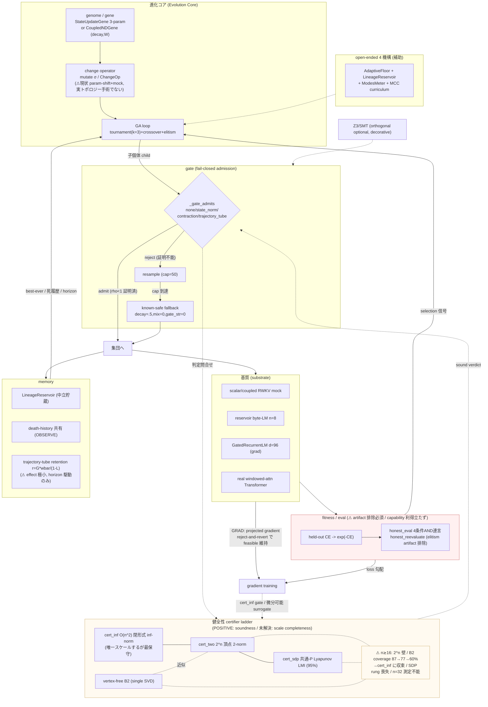

# llcore 体系化 — 「進化が実現可能な構造」フレームワーク

**作成**: 2026-06-09
**組織化テーゼ**: *a structure in which evolution is realizable*(進化が実現可能な構造)
**目的**: HD-1 / Stage-B / M3 / viability / trajectory-tube / 勾配内蔵 supervision / SDP gate / multi-arch / R-LLM / L3 等、累積した「乱雑な組合せ」を 1 つの coherent framework に統合し、**進化可能な実 LLM への pivot の土台**にする。
**産出方法**: 14 研究スレッドの並列読解 → 統合 → 3 敵対レビュー(honest-disclosure / capability-vs-guarantee / coherence-completeness)。本 doc はそのレビュー指摘 ~25 件を反映した確定版。
**読者**: ユーザー(主・レビュアー兼方向性決定者)+ 次セッションの Claude + 将来の co-author。

> **本ドキュメントの規律(最初に明示)**: 全編 honest-disclosure。NEGATIVE を前景化する。**capability(進化が性能=perplexity/CE で勾配を上回ること)と guarantee(進化した個体が証明付きで安定であること)を決して混同しない**。確立済(confirmatory)と未解明(open / 反証待ち / NEGATIVE)を曖昧にしない。load-bearing な定義は `src/llcore/` で一次照合済(`genes.py` / `minimal_ga.py` / `verifier/backends.py` / `evolution/honest_eval.py` / `__init__.py`)。実験数値は各 research VERDICT 由来。

---

## 0. エグゼクティブ・サマリ(3 段の結論)

llcore は「recurrent LM のコアアルゴリズムを低次元 gene 化し、健全性 certifier ladder(閉形式 ∞-norm / 頂点 2-norm / Lyapunov SDP)を進化ループ内に **fail-closed admission gate** として挟み、open-ended 機構で開放端性を狙う」研究フレームワークである。14 スレッドの累積実験を貫く核心結論は、相反する結果の統合として 3 点に結晶化する。

1. **GUARANTEE は立つ(YES、ただし強度を正直に限定)** — 「進化した gene を収縮的(echo-state property, ρ<1)に保つ」骨格は、合成タスク・実 byte-LM・実 windowed-attention Transformer のすべてで成立し、全次元・全証明器で **0 *観測* false-admit** を守る。**ただしこの soundness は「機械検証された定理」ではなく「float `eigvalsh>0` の数値検査 + JSR oracle の片側有限長下界 + 独立 eigen 再検査」のレベル**であり、確立は linear-toy / 小スケール基質(n=8 reservoir, ~0.5M param char-LM)に限られ、**実 LLM 大型への transfer は未検証**。よって正確には「証明付き安定の *設計原理* が成立、scale 転移は賭け」。

2. **CAPABILITY は立たない(決定的 NEGATIVE)** — 「進化(QD/GA)が同予算 random / gradient を perplexity で有意に上回る」は **不成立**。律速は進化機構の弱さではなく、(a) **fitness landscape の平坦さ**(M3: 検証コア部分空間=4,160 dims の素の next-token-CE は「つるつる擂り鉢・欺瞞ゼロ」で、MAP-Elites 含む全選択法が warm core から動けず勾配のみ降下)、(b) **3-param gene 空間の低次元縮退**。L3 の「強い verifier が perplexity を解放」効果も red-team で **navigability(最適化現象)であって language learning ではない**と縮小され、honest-null が tie しない(構造非依存)ことまで開示済。

3. **「進化が実現可能な構造」の条件が特定された** — 進化が capability で意味を持つのは、基質が **発散しうる(viability を脅かす)**か、地形が **多峰(欺瞞的)**な regime に限られる(§6 の 4 必要条件)。素の擂り鉢では gradient が直接解くので進化に付加価値はない。進化の durable な価値は **guarantee-niche** にあり、capability ではない。実 LLM pivot は make-or-break の存在賭けで、(i) 地形の多峰化(または進化を勾配の解けない離散自由度へ移す)と (ii) 2^n 壁を破る vertex-free sound certifier の 2 点に賭かっている。

> **⚠ 系統的反証圧の警告(honest)**: 「entity が自分の verifier を持つ/内的化が autonomy 優位を生む」を主張する仮説は **系統的に NULL/not-supported に集まっている**(HD-1 H2 repair 学習保存 Holm p=0.058 / R-endo H2 内的化 autonomy NULL Δ=−0.04 p=0.67 / viability autonomy NULL)。paper §8 の上位目標「真の内的化」はこの系統的反証圧の上に立つ ⇒ **内的化テーゼは最大の未解決リスク**。

---

## 1. 統一定義 — framework の構成要素(7 中核 + 1 補助)

### 1.1 進化コア(Evolution Core)

決定論的 GA loop。4 つの下位概念。

- **genome / gene** — 進化対象の表現。基本形 `StateUpdateGene`(frozen dataclass, 3 param `decay∈[0,1]` / `mix∈[-1,1]` / `gate_str∈[-2,2]`, `clipped()`)。更新式は RWKV-style leak integrator: `s' = decay·s + (1−decay)·tanh(mix·x + gate_str·s)`。convex combination `decay·s + (1−decay)·φ` で有界性を構造的に自動確保(v1 zero-attractor を v2 で構造解消)。多次元拡張 `CoupledNDGene`: `s' = decay⊙s + (1−decay)⊙tanh(Ws+Vx)`, genome=`(decay,W)` の `n+n²` 実数(V=I 固定)。
- **change operator** — gene への atomic 変更。(1) ランダム変異(`uniform_mutate`, 各 param gaussian σ=0.15)、(2) 構造変更 `ChangeOp`(`op_type ∈ {decay_shift, mix_shift, gate_shift, kernel_swap_mock}`, magnitude=|delta|)、(3) 合成 `ChangeOpSequence`(ε加法的)。**⚠ honest: 現 ChangeOp は parameter shift + mock kernel swap であって、実 node/branch 手術ではない**(コード明記「実 NN kernel 交換ではない」)。pivot の「トポロジー進化」はこの ChangeOp を実構造手術へ拡張する必要がある。
- **GA loop** — `tournament_select(k=3)` + `uniform_mutate(σ=0.15)` + `crossover_uniform(rate=0.5)` + `elitism(top-N を再評価せず凍結持越し)`。`evolve()` は `codec=None` で RWKV 旧パスと byte-identical、codec 指定で gene 型非依存。
- **役割**: 進化の駆動部。**ただし進化が *capability* を生むかは GA loop の質ではなく基質と地形に依存(§6)**。

### 1.2 健全性 certifier ladder(Health Certifier Ladder)

gene の「reachable-t box 上で ρ(J)<1 が **sound に証明できる**」(echo-state property)かを判定する保守的→richer の階梯。**Z3/SMT は ladder の段ではなく orthogonal な optional 不変量チェック**(`__init__.py` 準拠: 「証明の主役は収縮 certifier、Z3 は optional」。Track-C で scalar/対角は閉形式と 0/3270 不一致=Z3 decorative)。

| 段 | certifier | 計算量 | カバレッジ(300-gene pool, CLARABEL) | スケール性 |
|---|---|---|---|---|
| 1 | `cert_inf` 閉形式 ∞-norm `sup‖J‖∞<1` | O(n²) | 88 (29%) | **唯一スケール**(頂点列挙なし) |
| 2 | `cert_two` 2^n box 頂点で `σ_max(J)<1` | O(2^n·n³) | 137 (46%) | n 小のみ(2^n 壁) |
| 3 | `cert_sdp` 共通 P≻0 二次 Lyapunov LMI | O(2^n LMI) | 286 (95%) **workhorse** | n 小のみ |
| 4 | degree-4/6/8 SOS | LMI on Kron 冪 | 289/290/~292 | **次数を上げても switched-expansive 残差(~63%)は任意次数の共通 Lyapunov で証明不能=R2A 確定**(1 増分は到達集合 tighten でなく境界 gene の偶発回収) |
| 5 | JSR bracket(Gripenberg 下界 + SOS 上界) | NP-hard tail | near-boundary ~2 gene 未閉 | — |
| 拡張 | vertex-free `B2=σ(|M|+R)`(single SVD) | O(n³) | n=8 で cert_two reach の 77.6%, inf∪B2=87.2% | **2^n 壁を *小 n で* 破る。だが coverage が次元崩壊(下記⚠)** |

- **⚠ vertex-free の scale 限界(最重要 honest)**: `inf∪B2` coverage は **n=8/12/16 で 87.2→77.3→60.0% と degrade し、n=16 で cert_inf に収束**(B2 単独は n=16 で 57.1% < cert_inf 60.0% = cert_inf より保守的に)。つまり vertex-free は「壁突破の scale 解」**ではなく**「小 n で cheap、大 n では cert_inf に潰れ SDP rung を回収しない」。target n=32 で robust-LMI が coverage を再動機化しうるが、そこでは `cert_two` 自体が不能(1099 GB)で測定がブロックされる open question。
- **健全性の保証範囲**: 全次元・全証明器で 0 *観測* false-admit(劣化は false-negative=保守性のみ)。**機械検証された証明ではない**(数値検査ベース)。
- **役割**: 進化の **安全装置**。「証明された安全な構造変更だけが世代を越える」を実現。

### 1.3 gate(Admission Gate)

certifier 判定を進化ループの admit/reject に焼く fail-closed フィルタ(`minimal_ga._gate_admits`):
- `none`(control, byte-identical) / `state_norm`(Z3 |s|≤1) / `contraction`(Z3 free-t L<1, hard True のみ) / `trajectory_tube`(`tracking_tube` 閉形式 Banach 系 `r=G·w̄/(1−L)≤r_max`)。
- reject 時 `resample_cap=50` 回再生成 → cap 到達で **known-safe fallback gene**(`decay=0.5, mix=0, gate_str=0`; 閉形式 L=0.5<1)。
- **⚠ honest: trajectory_tube の L は achievable-t box 上の閉形式比較で、`contraction` の free-t Z3 unsat とは別の L 定義(non-comparable)。「Z3-exact contraction」と呼んではいけない。**
- **役割**: 進化を「証明済み安定領域に制約された探索」へ変える homeostatic constraint。fail-closed=FullSense の責任ある AI 哲学と整合。

### 1.4 基質(Substrate)

進化対象 dynamics。スケールの梯子: (1) scalar RWKV mock(n=1) → (2) n=2 coupled RWKV(次元壁測定) → (3) **reservoir/ESN byte-LM**(n=8, fixed embedding + per-gene closed-form logistic readout, 実 LLM に最も近い足場, L0-L3 基質) → (4) GatedRecurrentLM(d=96, gradient-trained, HD-1) → (5) 実 windowed-attention Transformer(StageBLM 2 block, Stage-B) → (6) 非 Transformer arch(NeuralODE/GNN/SNN)。
- **⚠ honest: 3-6 はすべて proxy fitness / mock invariant / 小スケール。実テキスト生成(decode/sample)は一切未実施(held-out CE 比較のみ)。1B 級 scratch CPU 学習は不可能と明言。**
- **役割**: 進化が回る場。**基質の発散性・多峰性が進化実現の鍵(§6)**。

### 1.5 evolution+gradient ループ

進化(EA=gated random mutation)と勾配(GRAD=projected / reject-and-revert gradient)の 2 経路を同一 core で対比。
- **役割**: 「なぜ勾配があるのに進化か」の検定軸。結論(§6/§7): 勾配が使える regime では進化の navigability 利得は消える。進化の役割は (a) 勾配が使えない離散/非微分構造、(b) 両 optimizer が共有する soundness-gated substrate の提供、(c) 勾配が固定する genome/architecture 空間の探索。

### 1.6 fitness / eval

- proxy fitness(CopyTask)→ held-out CE / perplexity → `fitness=exp(−CE)`。
- `honest_eval` falsification ハーネス: `honest_reevaluate`(elitism 凍結持越し artifact を構造排除)+ 同予算 random との多 seed paired 比較。合格 = `diff>0 ∧ 片側 Wilcoxon p<0.05 ∧ n_seeds≥15 ∧ |paired_sign_delta|≥0.147` の **4 条件 AND 連言**。**⚠ `paired_sign_delta` は教科書的 Cliff's delta ではない**(`honest_eval.py` が自己規律として明記; 本 doc も以後この名で統一)。
- **役割**: 進化の駆動信号。**最重要 NEGATIVE: 報告 `best_fitness_curve` は elitism の noisy fitness 凍結で水増しされる artifact。「best 単調上昇=進化成立」は誤り**(honest 信号は集団 mean)。

### 1.7 memory

- `LineageReservoir`(persona 別 best-ever 貯蔵 + `reinject_extinct` で絶滅復活=中立貯蔵庫)/ trajectory-tube retention(reservoir capacity ∝ 1/(1−ρ))/ 死履歴の seed 間共有(OBSERVE active ingredient)。
- **役割**: 開放端な累積を支える。「復活がないと経験が記憶に残らない」(REVIVE 集団レベル実証)、「他個体の死から学ぶ」(OBSERVE_P2)。**⚠ effect size 極小(pooled Δ≈+0.0134)+ SSGM が理論先取り**=条件4 は弱い positive。

### 1.8 open-ended 4 機構(補助)

`AdaptiveFloorGate`(適応難易度 ratchet, 単調非減少)+ `LineageReservoir`(中立貯蔵)+ `ModesMeter`(A_new + diversity AND gate)+ MCC curriculum(POET-lite 風)。単一機構では不足、4 機構協調で初めて開放端性が成立。

---

## 2. ブロック図(Mermaid)

**図の読み方(2 経路)**:
- **進化経路**: genome → change-op → GA loop → **gate(reject/admit ループ)** → 集団 → 基質 → fitness → selection で GA loop へ。reject→resample→cap→fallback。
- **勾配経路**: 基質 → gradient training →(cert_inf gate / 微分可能 surrogate で feasible 維持)→ loss 勾配。
- **共有点**: certifier ladder は両経路から問い合わせ。fitness は両経路に供給。memory は進化経路を横断。
- **着色**: LADDER は「POSITIVE(soundness)+ 未解決(scale completeness)」の 2 相。FITNESS は NEGATIVE 前景化。

---

## 3. 構成要素の詳細(到達点 / 保証範囲 / 限界)

### 3.1 進化コア
- **到達点**: minimal GA が決定論的に回り、3 plug-point(`GeneCodec`=基質 / `Objective`=方向 / `VerifierBackend`=安全)で拡張が 1 オブジェクト変更になる骨組み確立。clean **toy 単峰**合成 landscape では GA が random を圧勝(GA−RAND=+0.122, p<1e-4, **paired_sign_delta=+0.97**, 30/0/0)。**← ただし toy 限定。実 small-LLM 地形では M3 で否定(擂り鉢・bit-identical)。この圧勝も単峰・人工的容易さの産物でないか内訳要検証(linear-toy 懸念)。**
- **限界(NEGATIVE)**: 本番 CopyTask では GA=random(p=0.77)。律速は landscape 平坦 + 3-param 低次元縮退。elitism artifact(+0.29 水増し、`honest_reevaluate` で排除)。

### 3.2 健全性 certifier ladder
- **到達点**: SDP/Lyapunov を src/ に production backend 昇格(cvxpy optional, fail-closed, CLARABEL pin, 255 test, 0 regression)。rump hardening(machine-checked PD + 2-solver OR)。
- **保証範囲**: achievable-t box 上の ρ(J)<1。Lemma 1-3 で全 reachable Jacobian を被覆。0 *観測* false-admit。
- **限界**: (a) **完全性が次元崩壊**(n=2 92-95% → n=4 48%、残差 ~63% は switched-expansive で任意次数の共通 Lyapunov で証明不能)。(b) **スケール天井**(2^n で n≈16 memory wall、n=32 は 1099 GB 不可能 → 実 LLM 次元では最弱・最保守の cert_inf のみ残る)。(c) SCS solver artifact の大規模訂正(CLARABEL pin で是正)。

### 3.3 gate
- **到達点**: 4 モード。trajectory_tube を additive 配線(`none` byte-identical)。640 reject + 0/180 empirical violation で判別力実証。coupling-awareness load-bearing(対角 scalar heuristic は 1267/3270 誤 admit)。
- **限界**: 実 LM では cert_inf が EVO に admit 0(全 n restrictive)= 純 random mutation 進化は高次元で warm base から動けない(HD-1)。

### 3.4 基質
- **到達点**: reservoir byte-LM(n=8)が実 LM として機能(L0 PASS, unigram +0.40-0.53 nats)。実 Transformer 内で verified core load-bearing(Stage-B B-G1, benefit が core dim と増大)。
- **限界**: gradient-trained 真 Transformer でない(reservoir/ESN, fixed embedding, per-gene closed-form readout)。実テキスト生成未実施。絶対 perplexity 弱い(inf gate は unigram を僅か +0.0003 nats 上回るのみ)。n=8 固定・1 layer・1 corpus。

### 3.5 evolution+gradient ループ
- **到達点**: GRAD は gate 強度に CE 上 indifferent(inf≈sdp≈none ~2.485, all≪unigram)。gradient は inf trap 回避(BG10 GPU 再現)。微分可能 surrogate(gated-logsumexp)で sound 量をモデル勾配に内蔵でき numpy 正本と max abs err 3.55e-15 一致 **(=実装正しさの検証値であって capability/死削減の証拠ではない)**。
- **限界**: gradient-embedded confirmatory は **n=64 単独**(n=128 running, n=256 HTTPError=未取得)。HD-1 H2 が 16 seeds で n=128 を落とした前例があり n=64 PASS で完了は over-claim。

### 3.6 fitness / eval
- **到達点**: 4 条件 AND 連言 + `honest_reevaluate`。統計的厳密性 6 装置(事前登録→結果順 / Holm 連言 / アーティファクト規律 / 反証条項 / 自己検出力監査 / 反 over-claim critic)を framework 化。
- **限界**: 4 条件 AND は最弱条件律速で検出力を削る。strict gate が小 n(n=8/6)で構造的盲点。

### 3.7 memory
- **到達点**: trajectory-tube が memory horizon dose-response(delay 8 で fitness 改善, pooled n=40 Δ≈+0.0134, p=0.0021)。death-history 共有(OBSERVE_P2)が H1 PASS の active ingredient。
- **限界**: 外乱振幅軸 NEGATIVE(w̄=0.20 p=0.59, non-monotone; dose-response は分母=horizon 駆動)。self-history-only(OBSERVE_P1)は無効〜有害。effect size 極小 + SSGM 理論先取り。

---

## 4. 全実験 → framework 対応表(14 スレッド + CPU 第三軸補足)

| # | スレッド | 検証した構成要素 | 確定知見(POSITIVE) | honest 留保(NEGATIVE 含む) | 進化実現への含意 |
|---|---|---|---|---|---|
| 1 | 進化コア本体(minimal GA + gene + open-ended + change-op + honest_eval) | 進化コア / ladder / gate / fitness / memory | 3 公理配線済、toy 単峰で GA 圧勝(sign-delta +0.97) | **③(進化>random)不成立**(GA−RAND=−0.011, p=0.77)。best_fitness は elitism artifact。律速=landscape 平坦+低次元縮退 | guarantee は立つが capability は立たない。鍵は機構改良でなく gene 表現力・非平坦 regime |
| 2 | verified evolution: certifier ladder + contraction gate | ladder / gate / 基質 / 進化コア | 「より強い sound verifier が到達可能 fitness を単調解放」を rotation 合成で実証(sdp vs inf Δ=+0.448, p=3.1e-5)。SDP workhorse 95% | **real-LM perplexity では未検証(open, null も valid)**。合成/proxy 基質ゆえの構造的容易さ要疑義。SCS artifact 訂正 | 進化を「証明済み安定領域に制約された探索」にする設計原理。payoff の real-LM 転移が pivot 核心未解決 |
| 3 | 基盤 + multi-arch 移植性(RWKV/NeuralODE/GNN/SNN/Izhikevich) | ladder/gate transferability / 進化コア / 基質 / open-ended | design pattern 5/5 arch 成立。AdaptiveFloorGate 直接 reuse 5/5 | **「same verifier stack」撤回(5/5)→ same design pattern + partial reuse**。本線 gate は Z3 でなく閉形式 certifier。OTHERARCH_VERDICT は 13 Findings(1 実装修正+12 降格)+ Izhikevich sub-PoC 追加。取込は ablation 待ち・行列化 interface 変更要(中長期) | コア構造はアーキ非依存に再現。移植できるのは pattern であって stack でない |
| 4 | soundness 厳密性と次元/完全性の壁 | ladder / gate / 基質 / fitness | 0 観測 false-admit を全次元維持。証明器は相補的(UNION 最強)。SCS→CLARABEL 監査が thesis 強化 | **完全性が次元崩壊(n=2 92%→n=4 48%)**。残差 63% switched-expansive(次数非依存)。normalization_confound は地形多峰性を **計測不能**(eval ノイズ>>谷閾) | 束縛は Lyapunov 次数でなく到達集合過近似。fitness 地形の instrument 問題が pivot 前提課題 |
| 5 | R-LLM L0/L1/L2/L3(verified core を実 byte-LM に) | 基質 / ladder / gate / 進化コア / fitness | L0/L1/L2 PASS。proxy gap を閉じた。実 LM に最も近い到達点 | **L3 は language learning でなく evolvability/navigability**(red-team 縮小)。null tie せず(構造非依存)。実テキスト生成未着手。絶対 perplexity 弱い | 進化×検証コアが本物の LM で回ることは成立。verifier payoff は「言語獲得」でなく「EA を navigable に」 |
| 6 | L3 frontier + navigability(EA vs gradient, BG10) | ladder / gate / evo+grad / 基質 / fitness | sound 緩和が inf gate を上回る(10/10 seeds, p=0.000977) | **CORE PIVOT NEGATIVE: navigability は EA 固有・最適化 artifact**。null tie せず。gradient はトラップ回避。**⚠ BG10 では trap は child-admit-rate に出るが final EVO CE には出ない**(gradient-warm wrapper が loss を担い inf 2.6138≈none 2.6198, 非単調) | 「なぜ勾配があるのに進化か」の核心。**進化は perplexity で勾配に勝たない**。価値は (a)勾配不可領域 (b)共有 soundness 基質 (c)勾配が固定する空間 |
| 7 | HD-1: 高次元・gradient 下の gate | gate / 基質 / evo+grad / ladder cheap 端 / memory | sound≫empirical 監督階層が gradient 基質で confirmatory(H1 PASS, Holm p=0.027)。死履歴 seed 間共有が active ingredient。S7 vertex-free B2 で 2^n 壁を **小 n で**突破 | ungated GRAD 自身が ρ→1.95 越境、drift は entropic。**gate コストは full budget で実在(0.03-0.12 nats)**。cert_inf は EVO に admit 0。EVO 利得 n=256 崩壊。**H2 not supported(Holm p=0.058=borderline; 効果無し確証でなく underpowered 可能性も、ただし n=128 で連言破れ=消失方向)** | 進化は放置すると健全性を失うのが基底状態。健全性と性能のトレードオフは無料でない |
| 8 | R-LLM Stage-B: verified core を実 Transformer 内唯一 long-range path に | ladder / evo+grad 接合点 / 基質 | certified channel が実 gradient-trained Transformer 内で **真に load-bearing**(B-G1 4/4, benefit が core dim と増大, null で消失)。**post-hoc certify は 17-19x 高い** | tiny(~0.5M), char-level, 1 corpus, T4。B-G2 n=64 borderline(dp/Δf=0.76 vs 0.75)。core は依然 drift(ρ≥1) | **検証は訓練(探索)ループの内側に住まねばならない**(B-G4) |
| 9 | M3 / 第三軸 GPU(③=QD が実 LLM 損失地形で load-bearing か) | fitness / 基質 / 進化コア / evo+grad | P+ deceptive corridor で MAP-E decisively load-bearing(0.98-1.00)。N0 false-positive 0。harness valid | **③ NEGATIVE(decisive)**: **M1=M2=M3=M4 bit-identical**(全選択法 warm core から動けず)、**勾配のみ降下**(M5 1.844→1.562)、0/600 random 未到達。**⚠ scope: 測定は core subspace 4,160 dims の raw CE であって full weight space でない / σ=0.12・warm-start 固定で別 σ・non-warm は untested / 基質 proxy 性(reservoir+fixed-embed+3-param 縮退)ゆえ「この基質では擂り鉢」に限定** | **arc 最重要 NEGATIVE**: 素の CE では進化は勾配に付加価値ゼロ。「bowl は discover でなく deform せよ」 |
| 9b | (CPU 第三軸 THIRD_AXIS_SETTLE) | fitness / 進化コア | **③ は欺瞞 corridor では robustly load-bearing(paired_sign_delta=+1.0)** + N0 健全 | C-gen4b fresh n=64 は gate PASS だが still_inconclusive。proxy 地形は smooth | **テーゼ必要条件2(多峰性)の直接 POSITIVE 実証**: 地形が多峰なら ③ が立つ(hand-waving でなく実測由来) |
| 10 | viability 基質 × 記憶形成(κ-divergent 基質, 5-arm) | 基質 / ladder / gate / 進化コア / fitness / memory | **2 valid 発散基質(linear/highgain)で ENDO が定常死 0**(vs NONE 27.2, p<0.001, robust 12/12)。sound≫empirical を死回避軸で実証。REVIVE が記憶保存(Δ=+0.060, p=0.001)。**← guarantee/safety 軸(致命 gene の sound reject + 記憶保存)であって capability ではない** | **softsat 基質 INVALID(3 中 1, 死境界 inactive)**。中心仮説が linear-toy 依存。**R-endo H2(内的化 autonomy)NULL**(Δ=−0.04, p=0.67) | **「進化が実現可能な構造」の POSITIVE 核**: 基質が viability を脅かす(発散しうる)必要。無条件有界では内的検証器に仕事がない |
| 11 | trajectory-tube gate(verified memory evolution) | gate / ladder / 基質 / memory / evo+grad | P1 soundness PASS(0/180)。P2 判別力 PASS(640 reject)。memory horizon dose-response(pooled p=0.0021) | **外乱軸 NEGATIVE**(w̄=0.20 p=0.59)。effect 極小(~+0.013)。**SSGM(arXiv:2603.11768)が理論先取り**。R-endo Gödel Machine over-claim 訂正 | 単段不変量を軌道保証へ昇格しても navigable に回る。価値は horizon に比例し外乱負荷には比例しない(narrow) |
| 12 | 勾配内蔵 supervision | evo+grad / ladder(sound surrogate)/ gate | sound 上界の微分可能 surrogate 化(numpy 一致 3.55e-15=実装検証値)。pull-back latency で .max() NO-GO / logsumexp GO。stage-2 n=64 で H1/H2 PASS | **死削減は変種非依存**(surrogate が在る事だけが効く)。confirmatory n=64 単独。**安定性研究であり capability でない**。真の内的化は未到達 | 「進化が制約を発見、勾配が安く満たす」分業を支える経路が構造として存在 |
| 13 | 統計的厳密性と honest-disclosure 規律 | ladder 上位メタ層 / gate / fitness | 6 装置を framework 化(自己検出力監査で gate が n=15 で健全、suppress=False)。HD1 接地で H1 confirmatory に転移 | **null does NOT tie**(gate-gap は structure-independent な最適化 artifact)。**H2 not supported**(n=128 連言破り)。K4 ridge clip over-claim 訂正 | 進化の「勝ち」を falsifiable に保つ meta-gate。**この方法論層なしに「進化が本物」と主張する権利は成立しない** |
| 14 | PAPER_DRAFT positioning & roadmap | 全構成要素横断の正本 | 中核主張を結晶化: **L3 payoff は evolvability であって language learning でない**。四点交差で差別化定義 | null tie せず。Not claimed 明示(strict monotone ladder / two-vs-sdp / corpus-robust ceiling / better-verifier-unlocks-learning) | pivot 道筋(gate を勾配ループ内 + vertex-free cert で scale)は見えるが、payoff を language learning と取り違えない honest disclosure が前提 |

---

## 5. 確立済 vs 未解明 の整理表

### 5.1 Confirmatory に確立済(claim できる)

> 脚注: 合成基質 POSITIVE 群(rotation Δ=+0.448 p=3.1e-5 / 10/10 seeds p=0.000977 / clean sign-delta +0.97)はいずれも単峰・低次元・人工 rotation deception の合成/proxy 基質結果。`feedback_benchmark_honest_disclosure` に従い、構造的容易さの産物でないか内訳要検証(real-LM 転移は §5.2 open)。

| 主張 | 証拠 | スレッド |
|---|---|---|
| certifier は 0 *観測* false-admit(全次元・全証明器、機械証明でなく数値検査+独立 eigen 再検査) | CLARABEL, 300-gene + Track-D + 8000 stress | 2,4 |
| gate は load-bearing(無拘束は drift, gate で排除)**← 拘束力の実証であって perplexity 改善ではない**(絶対 perplexity は unigram +0.0003 nats 僅差) | 実 LM non_certified 78.9% expansive → certified 0% | 2,5,7 |
| 「より強い sound verifier が到達可能 fitness を単調解放」**(合成タスク限定)** | rotation sdp vs inf Δ=+0.448, p=3.1e-5 | 2 |
| design *pattern* はアーキ非依存に移植可(5 arch)**← stack ではない、取込は ablation 待ち** | AdaptiveFloorGate 直接 reuse 5/5 | 3 |
| L0/L1/L2: verified core が実 byte-LM として機能 | unigram +0.40-0.53 nats, certified 0% expansive | 5 |
| sound 緩和が inf gate を上回る(held-out CE) | 10/10 paired seeds, p=0.000977 | 5,6 |
| gradient は inf trap を回避(gate-indifferent CE) | GRAD inf≈sdp≈none ~2.485 | 6 |
| certified core は実 Transformer 内で真に load-bearing | Stage-B B-G1 4/4, benefit が core dim と増大 | 8 |
| 検証は訓練ループ内必須(post-hoc は 17-19x 高い) | Stage-B B-G4 | 8 |
| **2 valid 発散基質**(linear/highgain)で sound 内的検証器が定常死 0 **← guarantee/safety 軸** | ENDO 0.0 vs 27.2, p<0.001, robust 12/12 | 10 |
| sound≫empirical 監督階層が gradient 基質で成立 | HD-1 H1 PASS, Holm p=0.027 | 7,10,13 |
| ③ は欺瞞 corridor で load-bearing(多峰性条件の直接実証) | THIRD_AXIS_SETTLE paired_sign_delta=+1.0 | 9b |
| trajectory-tube soundness + 判別力 | P1 0/180, P2 640 reject | 11 |
| vertex-free B2 が **小 n で** cert_two reach の 77.6% を single SVD で回収 **← scale では崩壊(§5.2)** | n=8 で inf∪B2=87.2%, 12,520x 高速(n=16), 0 violation | 7,8 |
| 統計的厳密性 6 装置が gate を falsifiable に保つ | power audit suppress=False | 13 |

### 5.2 未解明 / 反証待ち / NEGATIVE(claim してはいけない)

| 状態 | 主張 | 根拠 | スレッド |
|---|---|---|---|
| **NEGATIVE(decisive)** | 進化(QD)が実 small-LLM 損失地形で勾配に capability で勝つ | M3: M1=M2=M3=M4 bit-identical, 勾配のみ降下(core subspace 4,160 dims, この基質では擂り鉢) | 9 |
| **NEGATIVE** | 進化が同予算 random を perplexity で有意に上回る | honest_eval passes=False, p=0.77 | 1 |
| **NEGATIVE** | L3 verifier payoff は language learning | navigability に縮小, null tie せず | 5,6,14 |
| **NEGATIVE** | navigability 利得が gradient に転移 | gradient は gate-indifferent, トラップ回避 | 6 |
| **NEGATIVE** | 完全性が次元でスケール | n=2 92%→n=4 48%, 残差 63% switched-expansive | 4 |
| **NEGATIVE** | vertex-free B2 が scale 解 | coverage n=8/12/16 で 87→77→60%→cert_inf に収束、SDP rung 回収せず | 7,8,14 |
| **NEGATIVE** | trajectory-tube 価値が外乱負荷に比例 | w̄=0.20 p=0.59, horizon 駆動のみ | 11 |
| **NEGATIVE** | 内的化が autonomy 優位 | R-endo H2 NULL Δ=−0.04 p=0.67 | 10 |
| **not supported** | certificate-preserving repair が gradient 基質で学習保存 | HD-1 H2 Holm p=0.058(borderline), n=128 連言破り | 7,10,12 |
| **open(pre-registered)** | real-LM perplexity で「強い verifier が fitness 解放」成立 | 全実証が合成/proxy | 2,14 |
| **open** | n=32+ で vertex-free sound certifier が soundness を保つか | 2^n 壁, cert_inf のみスケール, R-LLM-1 未実装 | 4,8,14 |
| **open** | 多峰化した地形で ③ が立つか(実 LLM 規模で) | CPU corridor では立つ(9b)が full-LLM 地形は M3 が raw bowl 確定のみ | 9,9b |
| **open** | gradient-embedded supervision の大 n confirmatory | n=64 単独, n=128 running, n=256 未取得 | 12 |
| **open(系統的反証圧)** | 真の内的化(モデルが自分の certificate を設計) | H2 系 3 件が系統的に NULL/not-supported | 10,12 |
| **未測定** | B2 が落とす ~22% tail が navigable low-perplexity dynamics を担うか | unmeasured | 7,8,14 |

---

## 6. 「進化が実現可能な構造」テーゼ(横断統合の核心)

### 6.1 相反する 4 観測の統合

| 観測 | 結果 | 意味 |
|---|---|---|
| **M3 NEGATIVE**(9) | 検証コア部分空間(4,160 dims)の素の next-token-CE は擂り鉢(この基質では欺瞞ゼロ)、全選択法が動けず勾配のみ降下 | 平坦・単峰地形では進化に登る先がない。gradient が直接解く |
| **viability POSITIVE**(10) | κ を上げ発散しうる 2 valid 基質を作ると、内的検証器(ENDO)に仕事が生まれ進化が立つ(定常死 0) | 基質が viability を脅かすとき進化の選択圧が **guarantee 軸で** load-bearing |
| **HD-1 budget 依存**(7) | gradient は短 budget で収縮域に留まるように見えるが full budget で越境(ρ→1.95) | 「安全に見える」は予算 artifact。スケールの default geometry は健全性喪失 |
| **BG10 navigability**(6) | sound 緩和が EA 到達 CE を下げるが EA 固有(gradient は escape; trap は admit-rate に出て final CE には出ない) | navigability 利得は進化×制約集合幾何の最適化現象であって language learning でない |

### 6.2 統合: 「進化が実現可能な構造」の 4 必要条件

**必要条件 1 — 基質の発散性(viability threat)**
無条件有界基質では「生存と収縮がデカップル」し進化の選択に意味がない(R-endo H2 NULL)。基質が放置すると発散する(κ·a>1)とき初めて健全性ゲートに仕事が生まれ、進化が「生存=収縮」を選別する圧を得る(viability POSITIVE)。**⚠ ただしこの POSITIVE は 2 valid 基質限定(softsat INVALID、中心仮説 linear-toy 依存)。実 LLM core が発散性を持つことは HD-1 単一基質(d=96 tiny-shakespeare)からの推測であり、「必ず」「本質的に」とは言えない=linear-toy → 実 LLM transfer は未検証。**

**必要条件 2 — 地形の多峰性(deceptiveness)**
進化(特に QD/MAP-Elites の archive ratchet=stepping-stone diversity)が gradient に付加価値を持つのは地形が多峰・欺瞞的で gradient が局所最適に捕まる場合に限る。**CPU corridor では実証済(9b, sign-delta +1.0)が、素の next-token-CE は実 small-LLM core 部分空間で擂り鉢(M3, ただし core subspace 4,160 dims・特定 σ/warm-start・基質 proxy 性の限定つき)** なので進化が登る先がなく勾配のみ降下。**結論: bowl は discover でなく deform せよ** — 進化を活かすには verifier-shell / reasoning-chain / riddle / shiritori 等で地形を多峰化するか、進化を gradient の解けない離散自由度(architecture, genome の 2 階層)へ移す。

**必要条件 3 — 検証ゲートの navigability**
gate が strict すぎる(cert_inf)と feasible set が痩せて EA が unigram に collapse する(inf-gated EA は seed-identical)。sound 緩和(two/sdp)で navigable になると EA が良い gene に到達。**ただし EA 固有** — gradient は痩せた feasible set 内でも feasible descent を見つけトラップを回避。したがって **gradient が使える regime では verifier を navigability で選ぶ理由は消え、soundness/coverage だけで選べばよい**。

**必要条件 4 — memory horizon 依存性**
verified memory evolution の価値は memory horizon(保持余裕 1/(1−L))に比例し外乱負荷には比例しない(外乱軸 NEGATIVE)。reservoir capacity ∝ 1/(1−ρ)。**⚠ ただし effect size 極小 + SSGM 理論先取り**=4 本柱中最も弱い positive(条件1/2 の強い実証と非対称)。

### 6.3 テーゼの結論

> **「進化が実現可能な構造」とは、(1) 基質が発散しうる(viability を脅かす)ことで健全性ゲートに仕事が生まれ、(2) 地形が多峰(欺瞞的)であることで選択圧が gradient に対し load-bearing になり、(3) 検証ゲートが navigable な feasible set を持つことで EA が探索でき、(4) memory horizon が長いタスクで記憶構造の価値が顕在化する — この 4 条件を満たす構造である。**

実 LLM の現状を 4 条件に照らす(測定スコープの限定つき):
- **条件 1(発散性)**: ✅(toy/単一基質で示唆。実 LLM 大型への transfer は未検証)
- **条件 2(多峰性)**: ❌ **満たさない**(検証コア部分空間 4,160 dims の素の next-token-CE は擂り鉢。full weight space は未測定)← **make-or-break のボトルネック**
- **条件 3(navigability)**: 部分的(sound 緩和で navigable だが、gradient が使える限り進化を選ぶ理由が弱い)
- **条件 4(horizon)**: タスク依存、効果量小

**したがって、進化が capability で意味を持つには条件 2(地形の多峰化)が必須であり、これが pivot の最大の構造的賭けである。** guarantee(健全性)は条件 1 のおかげで実 LLM で原理的に立つ(transfer 未検証)が、capability(進化が勾配を上回る)は地形を改造しない限り立たない。

---

## 7. 進化可能な LLM pivot への含意

### 7.1 capability vs guarantee の正直な線引き

このフレームワーク全体が確立したのは **guarantee であって capability ではない**(混同しないことが pivot の前提)。

- **guarantee(確立、ただし強度限定)**: 「進化した gene を収縮的(echo-state, ρ<1)に保つ」骨格は合成・実 byte-LM・実 Transformer で成立し 0 *観測* false-admit を守る。**ただし機械証明でなく数値検査、確立は小スケール基質。価値は guarantee-niche** — 「証明付きで安定な再帰コア」という保証は、**Stage-B で load-bearing と確認された範囲で支持される**(大型 LM では未検証)。
- **capability(NEGATIVE)**: 「進化が perplexity/CE で gradient を上回る」は M3(擂り鉢で進化が動けず勾配のみ降下)と honest_eval(③ p=0.77)で不成立。L3 の見かけの優位も navigability(最適化 artifact)。**むしろ擂り鉢では gradient が優位。**

> **pivot で言ってはいけない**: 「verified evolution が LLM の capability を上げる」「gate が perplexity を改善する」「進化が gradient より良い LM を作る」。
> **pivot で言ってよい**: 「verified evolution は証明付きで安定な(echo-state)再帰コアを *設計原理として* 保証しうる(transfer は賭け)」「健全性ゲートは実 Transformer 内で long-range memory channel として load-bearing(Stage-B 範囲)」「検証を訓練ループ内に常駐させれば post-hoc の 17-19x コストを回避できる」。

### 7.2 設計示唆: どの構造を・どの基質で・どの gate で進化させれば立つ可能性があるか

1. **どの gate で**: 実 LLM 次元(n=32+)では 2^n 頂点列挙が破綻するため **cert_inf(O(n²))または vertex-free B2(small n で cert_two の 77.6% 回収)** を訓練ループ内 gate に。SDP/SOS rung は n 小でしか使えない。**⚠ vertex-free も coverage が n=16 で cert_inf に潰れるので「壁突破」は未解決。** soundness-first(slightly-loose bound は unsound admit → measure 前に theorem-level soundness を証明、R-reach trap 回避)。**vertex-free sound certifier(R-LLM-1)の構成が pivot 成否を握る。**
2. **どの基質で**: gate は **訓練ループ内に常駐**(B-G4: post-hoc は 17-19x + 学習破壊)。基質は gradient-trained Transformer の verified recurrent core を唯一の long-range path に(Stage-B load-bearing 確認済)。
3. **どの構造を進化させれば capability が立つか**: 素の next-token-CE 地形は擂り鉢なので **進化を loss landscape 探索に使ってはいけない**(gradient が直接解く)。2 択:
   - **(a) 地形を多峰化(terrain-design)**: fitness を verifier-shell / reasoning-chain / riddle / shiritori 等で deform。**⚠ ただし多峰化で ③ が立っても、それが capability(進化固有の優位)か navigability/最適化 artifact(BG10 前例)かを falsify する meta-gate を同時に課す**こと(CPU corridor では立った=9b が、full-LLM で再現するかは open)。
   - **(b) 進化を勾配の解けない自由度へ移す**: architecture, genome の 2 階層(プロンプト層+重み層), discrete/非微分構造。gradient が固定する空間を進化が探索する分業。
4. **role 分担(evolution+gradient ハイブリッド)**: gradient=optimizer(perplexity を下げる), evolution=(a)勾配不可 regime (b)共有 soundness 基質 (c)勾配が固定する genome/architecture 空間の探索。**進化を「perplexity で gradient に勝つ optimizer」として positioning してはいけない。**

### 7.3 make-or-break の存在賭け(明記)

- **賭け 1(capability の存否)**: 素の next-token-CE が擂り鉢である以上、**進化が capability を生む regime が存在するか自体が未証明**(M3 NEGATIVE、terrain-design は CPU corridor で示唆=9b だが full-LLM 未検証)。立たねば pivot の動機は guarantee-niche だけに縮小。
- **賭け 2(スケール)**: 2^n 壁(n=32 で 1099 GB)を vertex-free sound certifier で破れるか。**⚠ 現 B2 は coverage が n=16 で cert_inf に収束**=破れねば cert_inf(最弱・最保守)のみ残る。
- **賭け 3(transfer)**: 全実証が proxy fitness / mock / 小スケール(n=8 reservoir, ~0.5M param Transformer)。実 gradient-trained 大型 LLM への transfer は未検証、1B 級 scratch CPU 学習は不可能。
- **賭け 4(guarantee の scale 連結崩壊)**: 実 LLM 次元で cert_inf 単独に縮退すると、**唯一の POSITIVE 物語(「強い sound verifier が到達可能 fitness を単調解放」L3/§2)が検証不能になる** — verifier ladder の階梯価値そのものが実 LLM scale で消える可能性。

**honest な最強防御可能 verdict**:
> 「verified evolution は *guarantee*(証明付き echo-state 安定の設計原理)を実 LM core に提供しうる候補で、これは訓練ループ内 cheap gate(cert_inf / vertex-free)で実 LLM scale へ *運べるかもしれない*(賭け2/3 が前提、transfer 未検証)。一方 *capability*(進化が perplexity で gradient を上回る)は素の損失地形では立たず(M3 decisive NEGATIVE)、capability で進化を立てるには地形の多峰化または非微分自由度への移行という未検証の構造改造が必須であり、これが pivot の make-or-break の賭けである。」

---

## 付録: 一次照合済みの load-bearing 実装事実

- **gene 表現**: `StateUpdateGene` frozen dataclass, 範囲 `[0,1]/[-1,1]/[-2,2]`, 更新式 `genes.py:160-163`。
- **endogenous self-judge**: `is_verified_trajectory_tube` が production gate と同一 `tracking_tube` を呼ぶ `genes.py:97-126`。
- **4 gate モード**: `_gate_admits` の `none/state_norm/contraction/trajectory_tube` + fallback `(0.5,0,0)` + `resample_cap=50` `minimal_ga.py:223-308`。
- **certifier ladder**: `ClosedFormScalarBackend / InfNormBackend / TwoNormBackend / SdpLyapunovBackend`, `_infnorm_sup` 閉形式, cvxpy optional, fail-closed `backends.py:69-203`。
- **`__init__.py` framing**: 「sound contraction-certifier ladder で破綻させずに進化させる。Z3/SMT は optional の不変量チェック(証明の主役は収縮 certifier)」=本線が Z3 でなく閉形式 certifier である看板訂正が src に反映済。
- **honest_eval**: 4 条件 AND 連言、`paired_sign_delta`(教科書 Cliff's delta ではないと明記)、min_effect=0.147 / min_seeds=15。
- **change operator**: `ChangeOp` は parameter shift + `kernel_swap_mock`(実 NN kernel 交換ではない=実トポロジー手術は未実装)。

---

## 関連 doc / memory

- 旧 `docs/ARCHITECTURE_LANDSCAPE.md`(2026-05-29, multi-arch 移植性軸の体系)— 本 doc が研究弧全体へ拡張・更新。
- `research/paper/PAPER_DRAFT.md`(正本, §1-10 + related work)
- `research/rllm_pivot/topology_evolution_prior_art.md`(prior-art マップ, 2026-06-08)
- memory: `[[project_llcore_gpu_3experiments_2026_06_06]]` / `[[feedback_llcore_must_become_llm_relevant]]` / `[[feedback_benchmark_honest_disclosure]]`

> **次工程**: 本体系化を土台に「進化可能な LLM」フレームワークの計画再設計(Phase C)。条件 2(多峰性)の make-or-break と賭け 1-4 を直視した、実在小型 LLM base + 最初の 1 構造部品 + verified gate + Kaggle feasibility + 事前登録 existence-bet(capability 封印・guarantee 主軸)の設計へ。
