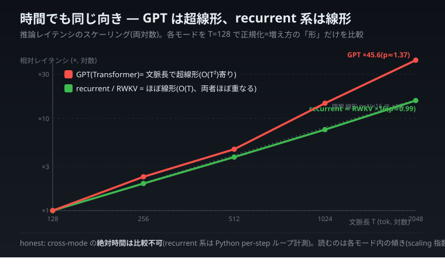
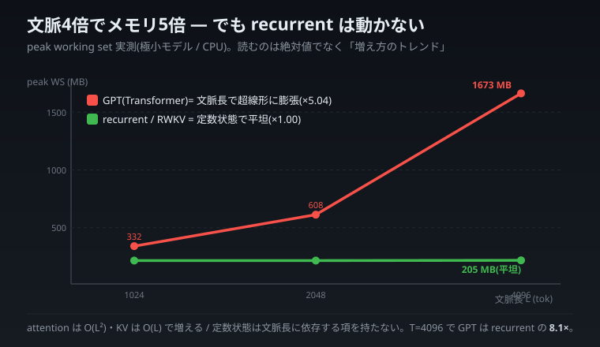

# 構造で勝つ — 定数状態・支配項・設計の臭い

> 連載「自宅 CPU から見た 2026 年 6 月の LLM 業界」**アーク A** 統合版。
> 4 本の記事(制御理論 × SSM / 文脈メモリ膨張 / 静的支配項 / テストの臭い)を 1 本に編み直しました。
> 通底するテーマはただ 1 つ ──「**bit を下げるな、アーキテクチャと支配項を攻めろ**」。
> 量子化で重みを数 MB 削ることに気を取られている間に、本当に効く項(文脈で膨らむ二次項、言語ランタイムの足場)を
> 見落としていた、という自分の失敗の連鎖を、自宅 CPU の実測曲線で順に潰していきます。

---

> **【連載共通の但し書き(本アークでも一度だけ固定)】**
> 本連載の全 llcore 実測は **自宅 CPU の極小モデル(0.81M〜130M パラメータの char-LM、n_embd 256 / 4 層級)PoC** であり、
> 大手の実 LLM(12B〜64B)の性能を直接反証・凌駕するものではありません。比較は **手法・思想・計測規律** の次元で行います。
> 量子化の数値は footprint(占有バイト)= 実測ですが、**simulated quant = 推論速度は未測**です。
>
> 本アークに出てくる「×1.00」「×2.65」「×7.53」「142×」などはすべて **極小モデルの CPU 実測**です。読むべきは
> **絶対値ではなく「増え方の形・どの項が支配的か」というトレンド**です。recurrent(RWKV/Mamba 系)を **状態空間モデル
> として読む**のは literature 上正統な接続ですが、**「制御理論が解いたのだから recurrent が Transformer に総合的に勝つ」
> とは言いません**。むしろ「メモリ軸では構造的に勝つが、capability(賢さ)軸では recurrent が Transformer に劣る
> 可能性がある」ことを、llcore 自身の null 結果として正直に書きます。

---

## はじめに — 「bit を下げる」ではなく「構造を攻める」

AI を軽くしようとすると、人はまず「中身を圧縮して薄くする」方を考えます。重みを fp32 から int8 へ、さらに 2bit へ。私もそうでした。せっせとモデルの重みを削っていました。

ところが自宅の GPU なし PC で実測を重ねるうちに、削っていた項が **そもそも支配項ではなかった** ことが次々に分かってきました。本当に効くのは「bit を下げる」ことではなく、「**長くなるほど膨らむ項を、そもそも持たないアーキテクチャを選ぶ**」「**一番大きい足場を測って攻める**」という、もっと構造的な選択でした。

この記事は、その気づきを 4 段で渡します。

1. **a7 — 橋を架ける:** recurrent(RWKV/Mamba)を「定数状態で過去を運ぶ」状態空間モデルとして読むと、それは 60 年前の制御工学の再演だと分かる。
2. **a8 — 動的支配項:** 文脈長を伸ばすと Transformer はメモリ・時間とも超線形に膨らみ、recurrent は平坦(実機実測)。
3. **a9 — 静的支配項:** int8 で数 MB 削った隣で torch ランタイムが 184MB 食っていた。Rust に書き直す前に支配項を測れ。
4. **a11 — 普遍教訓:** テストが flaky なのは設計の臭い。判定を純関数に分離せよ。

通底するのは「**bit でなくアーキ/支配項を攻めろ**」。では順に橋を渡ります。

---

# 第 1 部(a7)— 制御理論はとっくに「定数状態で過去を運ぶ」を解いていた

## フック — 私の計測値が、60 年前の教科書に載っていた

ある晩、自宅の GPU なし PC で、こんな実験をしていました。

「文脈長 T(モデルが一度に見るトークン数)を 256 から 2048 へ、8 倍に伸ばしたら、推論中のメモリ実使用量(peak working set)はどう変わるか?」

別プロセスに隔離して、OS が報告する実 RSS(Resident Set Size)を測りました。結果はこうです。

| 文脈長 T | GPT(Transformer)peak WS | Recurrent peak WS | RWKV peak WS |
|---|---|---|---|
| 256 | 229.8 MB | 205.0 MB | 215.3 MB |
| 512 | 247.3 MB | 205.1 MB | 216.0 MB |
| 1024 | 330.5 MB | 204.8 MB | 215.7 MB |
| 2048 | **607.9 MB** | 204.8 MB | 215.2 MB |

(`scripts/recurrent_runtime_rss.py` / `out/recurrent_runtime_rss.json`。Windows 11 / Python 3.11 / torch 2.12.0+cpu。)

文脈を 8 倍にすると、**Transformer は peak が ×2.65 に膨らみ、Recurrent と RWKV は ×1.00、つまり平坦**でした。固定の baseline(~205MB = torch ランタイム + 重み)を引くと、Transformer の「文脈に依存して増えるコスト」だけが ~25MB → ~403MB と **超線形**に伸びていきます(1024→2048 だけで +277MB)。

> **かみくだき(working set とは何か):** プロセスが「いま実際に物理 RAM に載せているページ」の量です。
> ディスクにあるだけ・確保しただけのメモリは含まれません。「実際に触っているメモリの実量」だと思ってください。
> peak WS はその最大値。長文を処理するときにメモリが足りなくなるかどうかは、確保量ではなく **この実使用ピーク**が
> 効きます。だから「解析上こうなるはず」ではなく、わざわざ OS が報告する RSS で裏取りしました。

> **計測の honest 留保(項分解はしていない):** この「超線形」を「二次項 O(T²) が大きな T で支配し始めた」と
> 読むのは、**KV キャッシュが線形・attention 行列が二次という解析モデルからの解釈**です。私が測ったのは
> プロセスの **合算 peak RSS だけ**であり、その増分を「KV 線形分」と「attention 二次分」と「中間バッファ分」に
> **項分解して実測したわけではありません**。観測事実は「Transformer の文脈依存コストが超線形に伸びた」までで、
> 「その超線形が二次項の顕在化である」は解析モデルに基づく解釈である、と区別しておきます。

### 時間軸でも同じ向きが出る(scaling 指数)

メモリだけでなく **推論にかかる時間**も同じ T 掃引で測りました(`scripts/recurrent_latency_sweep.py` / `out/recurrent_latency_sweep.json`、各点 11 回測定、`torch.set_num_threads(1)`)。T を 128→2048(×16)に伸ばしたときの **scaling 指数 p**(time ∝ Tᵖ を log-log 最小二乗で推定。混雑に強い min ベース)は、**GPT が p≈1.37(明確に超線形、O(T²) 寄り、×16 文脈で ×45.6)/ Recurrent が p≈1.00 / RWKV が p≈0.99(どちらもほぼ線形、O(T)、×16)**。メモリで見えた「Transformer は文脈で膨らむ / recurrent・RWKV は構造的に軽い」が、**時間軸でも同じ向き**で再現しました。

> **honest 留保(cross-mode の絶対 ms は比較不可):** recurrent/RWKV はここでは **Python の per-step ループ**(T 回の関数呼び出し)で測っており、インタプリタ呼び出しオーバーヘッドが支配的 ──「recurrent の方が速い/遅い」を絶対値で語るのは無意味で、読むのは **各モード内の伸び方(scaling 指数)だけ**。なお当初 repeats=7 では RWKV の T=128 が startup ノイズで外れ値になり傾きが汚れた(p≈0.5)が、**repeats=11 に増やすと RWKV も p≈0.99 に収束** ── ノイズだった点を消さず、増やして潰した経緯ごと残します。


> 各モードを自分の T=128 で正規化しているので、見るのは「上がり方の急さ」だけ。GPT だけが理想線形(p=1 の破線)から上に外れる=超線形。recurrent と RWKV はほぼ重なって破線に沿う=線形。

### さらに鋭い軸 ── decode(1 トークンずつ生成)と amortization

ここまでは「長さ T を **まとめて 1 回** forward する」prefill/batch のコストでした。でもチャットの体感遅延を支配するのは、**既に T トークンの文脈がある状態で、次の 1 トークンを出す** decode のコストです。同じプロセス・同じモデル・同じ条件で、**prefill(状態を作る/全文脈を読む)と decode(次の 1 トークン)を両方**計時しました(`scripts/decode_latency_sweep.py` / `out/decode_latency_sweep.json`。**計測はメモリ圧の無いクリーンな runner** で実施)。

実測(n_embd=256/L4, T=128→2048・×16)はこうです:**Recurrent と RWKV は prefill では O(T) で伸びる(×15.6 / ×17.5、指数 p≈1.0)のに、decode では平坦 O(1) に落ちる(×0.98 / ×1.10、p≈-0.002 / 0.03)**。一方 **GPT は prefill と decode がどの T でもほぼ一致**(各 T で prefill≈decode、例:99≈96ms / 958≈957ms)し、両方とも **同じ指数 p≈1.37 で増える**。この **GPT の decode 指数(1.365)が prefill 指数(1.372)とぴたり一致する**ことが、「cache 無し GPT の decode は prefill と同一計算」の何よりの裏付けです。


**核心は recurrent の amortization です。** ここで言う「状態(state)」とは、**これまでの全部を要約した固定サイズの手帳のようなもの**だと思ってください。recurrent は「文脈を作る(prefill, T 個のトークンで状態を T 回更新=O(T))」と「作った状態に 1 手足す(decode, O(1))」を**分けて払える**。長い生成では prefill は最初の一度きりで、その後の毎トークンは O(1) ── これが streaming の体感を決めます。GPT(cache 無)はこの分離ができず、**decode の 1 step が結局 prefill と同じ「全文脈の再 forward」**になる。**同じ 1 ランで測ったので、この「recurrent だけ O(T)→O(1) に落ち、GPT は落ちない」が別ラン比較でなく直接の対比として出ています。**

> **honest 留保:** (1) prefill 同様 **cross-mode の絶対 ms は比較不可**(recurrent/RWKV は Python per-step ループ計測)。(2) **この GPT は KV cache を持ちません**。production の LLM serving は KV cache で decode を O(T)/token に落としますが、**cache を入れても GPT の decode は T とともに増え続け、recurrent の O(1) 平坦とは質的に別物**です。(3) GPT の指数が理論上の 2(O(T²))でなく ~1.37 に留まるのは、この小モデル(n_embd=256)では二次項が完全支配に入りきらない regime。

この差を見たとき、私はそれを「新しい発見」だと一瞬思いました。でも違いました。これは **1960 年代の制御工学が「可観測な系を、有界な状態で運ぶ」問題として整理し尽くしていた**ことの再演です。RWKV や Mamba が属する **状態空間モデル(State-Space Model, SSM)** の「S」は、State(状態)の S です。偶然ではありません。

## まず Transformer 側 — なぜ文脈で膨らむのか(KV キャッシュという「全部とっておく」設計)

Transformer の中核は **self-attention(自己注意)** です。新しいトークンを処理するとき、それまでの全トークンと「どれくらい関係あるか」を内積で測り、関係の強いものを重み付きで足し込みます。長所は **位置を問わず厳密に照合できる**こと。「3000 トークン前に出た固有名詞」にも、減衰なしで直接アクセスできます。代償は **過去を全部とっておかないと照合できない**こと。各トークンの Key(鍵)と Value(値)を **KV キャッシュ**として保持し続けます。

> **かみくだき(KV キャッシュとは):** attention は各トークンから Query(問い合わせ)・Key(鍵)・Value(中身)
> の 3 つを作ります。生成を 1 トークンずつ進めるとき、過去全部の Key と Value を毎回作り直すのは無駄なので、
> いったん作った Key/Value を貯めておく。これが KV キャッシュです。**便利な作業メモリですが、トークンが増えるほど
> 線形に増え続けます**。「過去の全観測を生のまま保管する非圧縮メモリ」だと思ってください。

文脈長 T に対するメモリの増え方を、構造プロット(config から計算した理論値)で出すとこうなります。

| T(文脈長) | Recurrent state(実測) | RWKV state(実測) | GPT KV キャッシュ(解析) | GPT attention 行列(解析) |
|---|---|---|---|---|
| 64 | 2,048 B | 10,240 B | 262,144 B | 65,536 B |
| 1024 | 2,048 B | 10,240 B | 4,194,304 B | 16,777,216 B |
| 倍率(文脈 ×16) | **×1.00** | **×1.00** | **×16(線形)** | **×256(二次)** |

(`scripts/memory_footprint_harness.py` / `out/mem_footprint.json`。state_bytes は実バイト測定、KV/attn は config 由来の解析値。)

Transformer には増えるものが 2 つあります。**KV キャッシュ**は T に **線形**(×16 文脈で ×16)、厳密な長文脈 attention のスコア行列は T×T なので T に **二次**(×16 文脈で ×256)。フックの実機 peak RSS で「文脈コストが ~25MB→~403MB と超線形」だったのは、大きな T で **この二次項(O(T²))が支配し始めた**ためだと解釈できます(ただし前述どおり、これは解析モデルからの読みであって項分解の実測ではありません)。

> **honest 留保:** 実装上の GPT.generate は内部で文脈を block_size に切り詰める(crop)ので、走らせるだけなら有界です。
> 上の「線形・二次」は **block_size を伸ばして厳密に長文脈を attention する**場合に必要になる量です。正確には
> 「Transformer は必ず爆発する」ではなく「**厳密長文脈を諦めない限り**、文脈長に線形/二次でコストを払う構造だ」。

## recurrent 側 — なぜ平坦なのか(過去を有限の状態に「畳む」)

recurrent モデルは、過去を全部とっておきません。代わりに **固定サイズの状態 `s`** を 1 つ持ち、新しい観測が来るたびに `s` を更新します。

```
s_t = f(s_{t-1}, x_t)      # 状態を、前の状態と新入力から更新
y_t = g(s_t)               # 出力は、いまの状態から作る
```

ポイントは、`s_t` のサイズが **T によらず一定**であること。10 トークン処理しても 1 万トークン処理しても、状態テンソルのバイト数は同じです。上表で recurrent state が常に 2,048 B、RWKV state が 10,240 B で一定なのは、これが理由です。

> **かみくだき(料理のたとえ):** Transformer は「これまで使った全食材を冷蔵庫に全部とっておく」やり方、
> recurrent は「一つの鍋に次々と具を入れて煮込み続け、鍋の中身(=状態)だけを次に渡す」やり方です。
> 鍋のサイズは決まっているので、どれだけ煮込んでも置き場所は増えません。**ただし煮込むほど、最初に入れた
> 具の味は薄れます**(= 古い情報の損失)。この「薄れる」が後半の壊れる箇所につながります。

## ここで橋を渡す:状態空間モデル(SSM)と制御理論

ここからが第 1 部の核です。recurrent の「定数状態に過去を畳む」は、**制御工学の状態空間モデル(SSM)の語彙**で書き直せます。これは literature 上の正統な接続です。"Structured State Spaces" は SSM 系 LLM の前身である **S4 論文**(Gu et al., 2022)のタイトルであり、**Mamba**(Gu & Dao, 2023)はその直系の発展です。いずれも **状態空間モデル(SSM)は signal processing / control の標準概念**です。

なお本節の「書き直せる」は**構造的アナロジー**であり、数式的同一性の主張ではありません。橋が成り立つのは「逐次状態更新で過去を有限表現に畳む」という骨格のレベルであって、RWKV/Mamba が文字通り線形時不変な状態空間モデルや Kalman フィルタである、という意味ではありません。

### 状態空間モデルとは(制御工学の 60 年の標準形)

線形時不変な状態空間モデルは、教科書的にはこう書かれます。

```
x_{t+1} = A x_t + B u_t      # 状態方程式:次の状態 = A×いまの状態 + B×入力
y_t     = C x_t + D u_t      # 観測方程式:出力 = C×状態 (+ D×入力)
```

- `x` = **状態(state)**。系の「これまでの全履歴を要約した有限次元ベクトル」。
- `A` = 状態遷移行列。「過去の状態をどれだけ次に引き継ぐか」を決める。

決定的なのは、**`x` が有限次元で固定サイズ**であること。制御工学は最初から「無限に続く入力の歴史を、有限の状態に圧縮して運ぶ」ことを前提に組み立てられています。RWKV/Mamba の `s_t = f(s_{t-1}, x_t)` は、まさにこの状態方程式の(非線形ゲート付きの)親戚です。

> **かみくだき(なぜ制御工学はこの形なのか):** 工場のプラントやロケットの姿勢制御では、過去のセンサー値を
> 全部保存して毎回参照する余裕などありません。「いまの状態さえ分かれば、次にどう動くか決められる」形に
> しておく必要がある。だから制御工学は、最初から「**過去全部を有限の状態に畳む**」を出発点にしたのです。
> LLM の長文脈問題で recurrent が再発見したのは、この 60 年来の出発点でした。

### 可観測性 — 「有限の状態に過去を畳んで本当に足りるのか?」

制御工学には **可観測性(observability)** という概念があります。ざっくり「出力 `y` の履歴を見れば、内部状態 `x` を一意に復元できるか?」という性質です。これが recurrent の「定数状態で本当に大丈夫か」という不安に、そのまま対応します。**状態次元が、区別したい過去の弁別に対して不足していれば**、区別すべき 2 つの過去が同じ状態に潰れてしまう(可観測でなくなる)。逆に状態次元が必要な弁別に対して十分なら、定数状態でも必要な区別は保たれます。Transformer が「過去を全部とっておく」のは、可観測性を **力技で常に保証している**とも読めます。

### Kalman フィルタ — 「観測を状態の更新に畳み続ける」発想の元祖

1960 年、ルドルフ・カルマン博士(Rudolf E. Kálmán)が定式化した **Kalman フィルタ**(*A New Approach to Linear Filtering and Prediction Problems*, 1960)は、まさに「次々と来る観測を、固定サイズの状態推定(と共分散)に畳み込み続ける」アルゴリズムです。新しい観測が来るたびに、過去全部を再計算せず、いまの状態推定を更新するだけ。RWKV/Mamba が「KV キャッシュを捨てて、固定状態を更新し続ける」のは、構造としては Kalman 以来の「逐次状態更新」の発想と同じ骨格です。Transformer の KV キャッシュは、この対極 ── **観測を畳まずに生のまま全部ためる非圧縮表現**です。

> **★ここが「橋が折れる箇所」その 1(文字通り Kalman ではない):** RWKV/Mamba を「Kalman フィルタだ」と
> 言い切るのは **誤り**です。Kalman フィルタは線形ガウス系の最適推定で、明示的な観測モデル・ノイズ共分散・
> 最適性の証明を持ちます。RWKV/Mamba は **非線形ゲート**(tanh / sigmoid / 入力依存の遷移)を持ち、行列は
> データから学習され、最適性の保証もありません。両者が共有するのは「**逐次状態更新で過去を有限表現に畳む**」
> という構造的骨格だけです。本記事の主張は終始 **構造的アナロジー**であって、数式的同一性ではありません。

### だから recurrent の「平坦さ」は config の偶然ではなく構造的必然

ここまで来ると、フックの「recurrent peak WS が T によらず ×1.00」が、私の実験設定の偶然ではないと分かります。状態空間モデルは **定義からして** 状態が有限次元固定です。文脈をいくら伸ばしても、運ぶのは同じサイズの `x`(状態)だけ。**両者の差は実装の調整幅ではなく、過去をどう表現するか(畳むか/ためるか)というアーキテクチャの根本選択**です。

## ★最重要 fix — ρ(収縮性)を「過剰接続」しない

この種のクロスドメイン記事が一番やらかしやすい混同を、先回りして潰します。制御工学を持ち出すと、つい **「安定性(収縮性)」と「学習が安定境界に張り付く」を一緒くたにして、きれいな物語にしてしまう**。これは間違いです。

**(A) 収縮写像 ρ<1 = 安定性の証明(構造的に要求するもの)**
llcore の別アーク(検証付き可塑性)では、frozen な LLM の隠れ状態に小さな recurrent アダプタ `s' = decay⊙s + (1−decay)⊙tanh(Ws + x)` を後付けし、その安定性を証明付きで担保しています。ヤコビアン `J` のスペクトル半径 `ρ(J)<1` なら、状態更新は **収縮写像**になり、小さな摂動は時間とともに減衰します(echo-state property)。llcore の証明器(`cert_inf`: ‖J‖_∞<1、`cert_two`: 全頂点で σ_max<1、`cert_sdp`: 共通 Lyapunov LMI)は **`ρ(J)<1` を満たすものだけを fail-closed で通します**。`empirical_rho`(下から固有値を詰める独立オラクル)が証明の健全性をチェックします。

> **かみくだき(収縮写像とは):** 入力をちょっとずらしたとき、出力のずれが **元のずれより必ず小さくなる**写像。
> 何度繰り返してもずれが拡大しないので、系は暴走せず一点に落ち着きます。`ρ<1` がその数学的な合格ライン。

**(B) 学習が安定境界 ρ≈1 に張り付く(表現力との緊張、観測される現象)**
別の実験(M2)では、進化探索で **fitness 最良の個体の `empirical_rho` が 1.000 に張り付く**という観測が出ました。これは「表現力を最大化しようとすると、状態更新が **安定性の崖っぷち(ρ→1)** に寄っていく」という、リザバー計算や recurrent 学習で知られた **表現力 vs 安定性のトレードオフ**の現れです。

ここで「制御理論が `ρ<1` を安定の条件と言い、学習も `ρ≈1` に行く。だから制御理論が edge of chaos まで予言していた!」と **一本の美しい物語に縫い合わせたくなる**。これが過剰接続です。両者は **方向が逆**です。(A) は「`ρ<1` に **留めておけ**」(私たちが課す上限規範)。(B) は「`ρ` が 1 に **寄っていく**」(最適化が見せる挙動)。同じ記号 `ρ` を使うので一見つながって見えますが、**論理的には独立**です。

> **だから本記事の正しい言い方:** 制御理論は **(A)「定数状態で過去を運ぶ + その安定性を `ρ<1` で
> 特徴づける」**を 60 年前に解いていた。一方 **(B)「安定境界 `ρ≈1` に表現力が張り付く」は、安定性と表現力の
> 緊張という、制御と機械学習の双方が別々に知っている既知のトレードオフ**であって、(A) から自動的に出てくる
> ものではない。両者を区別したうえで並べる — これが honest な接続です。

## ★橋が折れるもう 1 つの箇所 — recurrent は capability で Transformer に劣る「かもしれない」

ここまで recurrent の **メモリ軸の構造的勝ち**を書いてきました。しかしこれを「だから recurrent が Transformer に勝つ」で締めたら我田引水であり、連載トップの caveat に反します。正直に書きます。

llcore の進化探索アークでは、recurrent 系アダプタの **capability(賢さ — perplexity / cross-entropy で勾配を上回るか)** を測った結果、地形は **NULL_TIE / NEGATIVE**(進化が baseline に対して有意差なし〜むしろ微害)でした。つまり llcore 自身が「**この特定の実験設定では、recurrent の進化に capability の勝ち筋は確認できなかった**」と認めています(`project_llcore_memory_efficiency_pivot`、北極星を capability から memory へ転換した直接の理由)。

> **honest disclosure / ソースの境界:** 次に述べる literature 一般傾向と、いま述べた llcore の null 結果は、
> **出どころが違います**。前者は **SSM 文献で一般に指摘される傾向**=本記事では llcore 実測で直接検証していない
> 外部知識です。後者(NULL_TIE / NEGATIVE)は **llcore の特定実験設定での自前 null 結果**=ソースは llcore 実測です。

その literature 一般傾向はこうです ── KV キャッシュの「全観測を厳密に保持する」性質は、**位置を問わない厳密な long-range recall(長距離の正確な呼び戻し)** で recurrent の lossy 圧縮状態に勝ちやすい、と SSM 文献で一般に指摘されます。recall 重視のタスクでは純 recurrent がしばしば Transformer に劣るとされ、だからこそ実用 SSM の多くが attention 層を織り交ぜる **hybrid** に向かう、というのが文献上よく見る整理です(例:Jamba は Mamba と Transformer を交互に積むハイブリッド)。

料理のたとえで触れた「煮込むほど最初の具の味が薄れる」── あれが capability 側で効いてくる症状です。**状態次元が、必要な弁別に対して不足する場合に**、固定サイズの状態に過去を畳む過程で、どこかで弁別すべき過去が潰れる。メモリで勝つ仕組みが、状態次元が不足したときには capability の弱点の源にもなりうる、ということです。

**だから本記事の主張は「メモリ軸に限定」されます。** 「recurrent は文脈長によらず定数メモリで動く」は構造的に正しい(私の実測 ×1.00 が示す)。しかし「recurrent が総合的に Transformer より優れる」とは **言いません**。むしろ llcore は、この設定で capability の勝ち筋を確認できなかったと認めたうえで、勝てる軸(メモリ効率)へ北極星を移した — その正直な敗北の上に、この記事は立っています。

## 第 1 部の比喩 — 「日記を全文保管する人」と「要約だけ更新する人」

2 人の人が毎日 日記をつけています。

- **A さん(Transformer)** は、毎日の出来事を **全文そのまま**ノートに書き溜めます。何年前のことでも、ページをめくれば一字一句 正確に思い出せます。代わりにノートは年々分厚くなり、ある日とうとう本棚に入りきらなくなります(KV キャッシュの線形膨張)。さらに「過去の全ページ同士を突き合わせる」癖があるので、ページ数の二乗で手間が増えます(attention の O(T²))。
- **B さん(recurrent / SSM)** は、毎晩 **その日の出来事を一文の要約に畳んで、たった 1 枚の「現在のまとめカード」を更新する**だけです。カードは何年経っても 1 枚のまま。本棚は一切増えません(定数状態 ×1.00)。制御工学者やカルマン博士が 60 年前に「これで十分なことが多い」と整理したやり方です。

**この比喩がどこで折れるか:** (1) B さんのカードは **要約**なので、「3 年前の何月何日に誰が何と言ったか」を一字一句問われると A さんに負けます(lossy 圧縮 = capability の弱点)。(2) 要約欄(=状態次元)が必要な弁別に対して狭すぎると、区別すべき 2 日が同じ要約に潰れます(可観測性の喪失)。情報を詰め込みすぎるとカード更新が安定の崖っぷち(ρ≈1)に近づきます ── ただしこれは「カードを 1 枚に保つ」設計とは別の話で、混ぜてはいけません。(3) そもそも B さんは「カルマン博士と同じこと」をしているわけではなく、骨格が似ているだけで非線形・最適性保証なしです。

比喩は理解の足場であって、証明ではない。足場が崩れる場所を示したうえで使う ── これが本連載の作法です。

---

# 第 2 部(a8)— 文脈を 4 倍にしたら Transformer のメモリは 5 倍に膨れ、recurrent は 1mm も動かなかった

第 1 部で「制御理論はとっくに『定数状態で過去を運ぶ』を解いていた」という橋を架けました。第 2 部はその**実機メモリでの帰結**です。**動的支配項** ── 文脈長で伸びる項を、曲線で見せます。

別の記事で、私は長文脈の検索性能を測ろうとして **自宅マシン(RAM 3.6GB)のメモリが先に音を上げた**話を書きました。2048 トークンの full-attention forward が working set 3.9GB に膨れてスワップした。あれは事故のように見えて、実は**構造が予告していた必然**です。

> **結論を先に:** 文脈長を 1024 → 4096 トークン(4 倍)にしたとき、Transformer(GPT)の peak メモリは
> 331.8MB → 1673.0MB と約 **5.04 倍**に膨れた。同じ条件で recurrent は 205.4MB → 205.6MB、つまり **1mm も動かなかった**。

## 数字の全公開 ── 点でなく曲線で読む

軽量モデルを 3 アーキテクチャ用意し(GPT / recurrent / RWKV)、文脈長を変えながら **別プロセスに隔離して peak working set(WinAPI の `PeakWorkingSetSize`)を実測**しました。`scripts/recurrent_runtime_rss.py --lengths 128,256,512,1024,2048,4096`(実機 2026-06、極小モデル n_embd 256 / 4 層 / 8 head)。単点でなく **32 倍レンジの曲線**で見ます。

| 文脈長 L | GPT peak WS | recurrent peak WS | RWKV peak WS |
|---:|---:|---:|---:|
| 128 | 222.3 MB | 205.5 MB | 215.4 MB |
| 256 | 230.7 MB | 205.2 MB | 215.7 MB |
| 512 | 247.7 MB | 205.3 MB | 216.1 MB |
| 1024 | 331.8 MB | 205.4 MB | 216.0 MB |
| 2048 | 607.9 MB | 205.6 MB | 216.0 MB |
| 4096 | **1673.0 MB** | **205.6 MB** | 215.9 MB |
| **128→4096(×32)の倍率** | **×7.53** | **×1.00** | **×1.00** |

**曲線の形が一番の証拠です。** GPT の膨張率は計測レンジに依存します:128→512(×4)では **×1.11** とほぼ平坦 ── この領域は固定重み(モデル本体)が peak を支配し、attention の O(L²) 項はまだ誤差に埋もれます。ところが 512→4096(×8)では **×6.75** ── ここで二次項が固定床を追い越し、曲線が跳ね上がります。「文脈 ×N でメモリ ×M」という単一の見出しは、**どこから測ったかで M が激変する**(同じ装置で ×1.11 にも ×6.75 にもなる)。だから単点でなく曲線で出します。recurrent / RWKV は全域で 205 / 216 MB に貼り付き(×1.00)、定数状態が文脈長と無関係であることを 32 倍レンジで裏取りしました。

> 補足: 1024 と 2048 の点は別日の独立ラン(`out/recurrent_runtime_rss_long.json`)と 0.1 MB 差で一致し、クロスラン再現性も確認済み。



*図:横軸は対数。GPT(赤)は短文脈で固定重み床に隠れてほぼ平坦、長文脈で二次項が顔を出し急騰(全レンジ 128→4096 で ×7.53)。recurrent/RWKV(緑)は定数状態で全域平坦(×1.00)。T=4096 で GPT は recurrent の 8.1×。*

読みどころは 3 つです。

1. **GPT は超線形に膨れる。** 文脈 4 倍(1024→4096)で **メモリ 5.04 倍**、全レンジ 32 倍で **7.53 倍**。attention のスコア行列が L×L、つまり **O(L²)** で増えるため。伸び方は一定でなく、短い文脈ほど固定重みに隠れて平坦、長くなるほど二次項が顔を出して鋭くなる。
2. **recurrent と RWKV は動かない。** 文脈 4 倍でも **×1.00**。過去を固定サイズの状態に畳むので、文脈長に依存する項が原理的に無い。
3. **T=4096 で GPT 1673MB は recurrent 205MB の 8.1 倍。** 外挿すると **T=8192 で GPT は約 6.5GB** ── 私の自宅マシン(3.6GB RAM)では**物理的に載らない壁**。一方 recurrent は 205MB のまま、びくともしない。

私のマシンがスワップした 3.9GB は、まさにこの曲線の上の点でした。事故ではなく、**O(L²) の予告どおり**だったわけです。

> **かみくだき(会議のたとえ):** 10 人の会議で全員が「他の全員の発言」をいちいち確認しながら話すと、確認の
> 組み合わせは人数の **2 乗**で増える(5 人なら 25 通り、10 人なら 100 通り)。これが Transformer の O(L²)。
> 一方 recurrent は「一冊のノートを回し、各人が要点だけ書き足して次へ渡す」やり方 ── ノートの厚さは人数が
> 増えても変わらない。ただしこの“まとめノート”は lossy で一語一句は復元できません(平坦なメモリの代償)。

## なぜこうなるのか(構造の話)

GPT の attention は「全トークンが全トークンを見る」総当たりです。トークンが L 個あれば見る組み合わせは L×L だから、メモリも計算も **O(L²)**。さらに KV キャッシュは **O(L)** でメモリを食い続けます。recurrent / RWKV は発想が逆で、過去を 1 つずつ読みながら**固定サイズの状態ベクトルに畳み込み**、それを次へ運ぶ。状態の大きさは文脈長に依存しない(中身は数 KB の定数)。これは第 1 部の「制御理論の状態空間モデル」そのもの。理論が「定数状態で過去を運べる」と言っていたことが、実機の peak WS で**平坦な直線**として現れた、という話です。

## 隠さない但し書き(この数字の限界)

- **極小・未学習モデルです。** n_embd 256 / 4 層のランダム初期化モデル。メモリ挙動はアーキテクチャで決まり学習状態に依存しない(ので計測には妥当)ですが、**絶対値**を大手 LLM にそのまま当てはめないでください。読むべきは**増え方のトレンド**です。
- **peak WS は「素の torch ランタイム + 固定の重み + 文脈依存バッファ」の合算です。** recurrent の「平坦 205MB」の大半は torch のベースライン(第 3 部で測る支配項)で、定数状態そのものは KB オーダー。つまり 205MB は「定数状態が重い」のではなく「**伸びる項が無い**」ことを示しています。
- **GPT は実運用では block_size で文脈を切り詰める**ので、ここまで素直には膨れません。本測定は「厳密に長文脈を保持するなら最低どれだけ要るか」の必要量を見たものです。

## 第 2 部の教訓 — 「速さ」より「予測可能性」

長文脈の時代に効いてくるのは、ピーク性能より **「メモリが文脈長に対してどう振る舞うか予測できること」** です。GPT は速いし強い。でも文脈が伸びると、メモリが O(L²) で**予測不能な崖**に向かう。recurrent は遅くても、**何トークン来ても 205MB で平らなまま** ── 予測できる。

> 量子化は「今あるものを薄く削る」。
> アーキテクチャ選択は「伸びる項を最初から持たない」。
> 長文脈ほど、後者が構造で前者を引き離す。

この「量子化(bit を削る)では頭打ちがある、本命は動的支配項を持たないアーキテクチャを選ぶこと」という結論が、次の第 3 部 ── **静的支配項** ── にそのまま接続します。

---

# 第 3 部(a9)— 最適化する項を間違えていた:int8 で 4MB 削った隣で、言語ランタイムが 184MB 食っていた

第 2 部は「文脈を長くすると Transformer のメモリが 2 乗で膨らむ」という**動的な支配項**の話でした。第 3 部はその裏側、**静的な支配項**の話です。

きっかけは、よくある一言でした。

> 「メモリ効率を徹底するなら、いっそ Rust で書き直したら? そのほうが効率的でしょ。」

もっともらしい。でも私は、この種の「○○にすれば効率が上がる」を**自動で正しいと信じない**ことにしています。なので測りました。結果は、私の最適化の前提を引っくり返すものでした。

> **int8 量子化でモデルの重みを約 4 分の 1(数 MB)に削っていたその隣で、Python+torch の言語ランタイムが、
> 何もしなくても 184MB を食っていた。** 削っていた項が、そもそも支配項ではなかったのです。

## 数字の全公開と、衝撃の比率

`ctypes` から Windows の `GetProcessMemoryInfo`(WorkingSetSize)を直接叩き、プロセスの RSS を段階的に実測しました。

| 段階 | プロセス RSS |
|---|---:|
| Python インタプリタ baseline | 13.4 MB |
| `import torch` 後 | 197.3 MB(**+183.9 MB の "torch 税"**) |
| モデルロード後 | 213.6 MB |
| **モデル int8 重みの実体** | **1.51 MB** |

ここから出る比率が効きます。

> **プロセス RSS 213.6MB は、モデル本体 1.51MB の約 142 倍。**

私は int8 量子化で「重みを 4 分の 1!」と数 MB を削ることに集中していました。でも全体像は、**1.51MB の本体の周りに、212MB の"足場"が組まれている**状態だったのです。数 MB の節約は、142 倍の足場の前では誤差に近い。

> **かみくだき(荷物と台車のたとえ):** 引っ越しで荷物を 4kg 軽くしようと一生懸命パッキングを見直した。えらい。
> でも、その荷物を載せている**台車そのものが 184kg あった**としたら? 4kg の節約は、184kg の台車の前では
> ほとんど意味がありません。**軽くすべきだったのは荷物じゃなくて、台車のほう**だった。私の AI で、まさに
> これが起きていました。


*削っていた項(int8 本体 1.51MB)は、同じ横スケールでは細い線にしかならない。支配項は torch 税 183.9MB の足場だった。*

> **再現性(コミット済みハーネスで裏取り):** この一回限りの計測を、後日 **再走可能なハーネス**
> (`scripts/runtime_floor_rss.py` / `out/runtime_floor_rss.json`、各ステージを別プロセス隔離で 3 回測定の中央値)に
> 固めて測り直しました。結果は **`import torch` 後 197.8 MB(初回 197.3 とほぼ完全一致)/ torch 税 179.7 MB
> (初回 +183.9 と ~2% 差)** ── 主役である **torch ランタイム税が ~180MB であること**は別ランでも揺るぎません
> でした。一方 baseline は 13.4→18.1 MB と少し上振れし、足場比は **モデルの大きさで変わります**:本文の 1.51MB
> モデルでは 142×、ハーネス既定の 2.8MB モデル(n_embd=176)では 73×。比の絶対値は config 依存ですが、
> **「本体より足場が桁違いに大きい」という構図は不変** ── そこが load-bearing です。

## 「支配項を攻めろ」— どの項を削るかが全て

最適化には鉄則があります。**一番大きい項(支配項)を攻めろ**。小さい項をいくら磨いても全体はほとんど動かない。

- **動的な支配項**は文脈長で伸びる attention/KV(第 2 部で測った O(L²))。
- **静的な支配項**は、この第 3 部の **言語ランタイムの baseline(torch だけで +184MB)**。

豆モデル規模では、後者(184MB の torch 税)が圧倒的に支配的でした。だとすれば、**本当に効くのは int8 の数 MB ではなく、この 184MB の足場をどう減らすか**。

そして**ここが「Rust にすれば?」の真の効きどころ**です。lean な native バイナリ(C++ の llama.cpp、Rust の candle / mistral.rs 等)は、ランタイム baseline が桁違いに小さい(典型で数 MB〜十数 MB)。**184MB 規模の削減**は、int8 の数 MB とは比較にならない大きさで、「working set を小さく予測可能に」という北極星に直結します。さらに Rust なら allocator を自分で握れるので、「解放した fp32 を torch の caching allocator が OS に返さず、平時のピークが下がらない」という別の積年の問題も、`madvise(MADV_DONTNEED)` や明示解放で正攻法で潰せます。

## 隠さない反対側(「Rust=効率↑」も自動ではない)

ここで止まると「Rust 万能論」になってしまう。honest disclosure として反対側を明示します。

- **Rust は int8 を小さくも、mmap を良くも、定数状態を定数にもしません。** これらの勝ちは表現・OS・アルゴリズム由来で **言語非依存**。Rust に移しても 1 バイトも改善しない。Rust が効くのは **baseline(足場)** の項だけです。
- **素の Rust の行列積は、torch の BLAS(MKL/OpenBLAS)より遅い。** 「Rust=速い」も自動ではありません。速度を出すには candle や BLAS バインディングが要る。
- **規模依存が肝。** 184MB の税が支配的なのは**豆モデル規模だから**。GB 級の重みになれば baseline は相対的に無視できる。つまり **Rust の baseline 優位は、llcore が実際に住む領域(小モデル・小 RAM)で最大、重みが支配する大規模で最小**。
- **これは llama.cpp が既に実証済みの動き。** 立ち位置としては「**再導出**」であり、誠実な独自性はそこ(言語)ではなく、別記事で書いた cap-gate(能力ゲート)の運用にあります。
- **未確証(honest gap)。** Rust/candle 版の baseline RSS は**まだ測っていません**。「native なら baseline が桁違いに小さい」は文献・既存実装からの妥当な推定で、最終確証には candle 実測が要ります。

## 第 3 部の教訓 — Rust に書き直す前に、baseline を測れ

> 「○○にすれば効率が上がる」と聞いたら、書き直す前に**今の支配項を測れ**。
> 私の支配項は int8 で削れる重みではなく、torch を import した瞬間の 184MB だった。

もし測らずに「メモリ効率のために Rust へ全面移植」と走っていたら、労力の大半は「言語非依存の勝ち(int8/mmap/定数状態)を Rust で**書き直すだけ**」に消え、本当に効く 184MB の baseline 削減という主目的が埋もれていたでしょう。**狙いを『推論パスを native 化して interpreter 税を消す』に絞る** ── それが、測ってはじめて見えた正しい移植方針でした(速度狙いではなく、足場狙い)。

最適化は、磨く前に「どの項が大きいか」を測る。当たり前のようで、4MB を削りながら 184MB を見落としていた私自身が、一番それを忘れていました。この「**測ってから手を動かせ**」という規律が、最後の第 4 部の普遍教訓につながります。

---

# 第 4 部(a11)— テストが flaky なのは、テストのせいではなく設計のサインだった

ここまでは AI アーキテクチャの支配項の話でした。最後はやや毛色を変えて、**「テストの書きにくさが、設計の臭いを教えてくれた」**という普遍的なエンジニアリングの一場面です。AI 固有ではなく、ものづくり全般に効く小ネタ ── でも「支配項を測れ」と同じく、**症状の出どころを取り違えるな**という同じ規律の話です。

## やりたかったことと、揺れたテスト

「**能力検収(cap-gate)に PASS したときだけ、量子化済みモデルを保存する**」という昇格ゲートを TDD(テスト駆動)で書こうとしました。仕様はシンプル: gate が PASS → 書く、FAIL → 書かない。

ところが、テストが **flaky(実行のたびに結果が揺れる)**になりました。あるときは合格、あるときは不合格。これでは「ちゃんと動く」と言い切れません。

原因は、テスト対象に使った**未学習(ランダム初期化)モデル**でした。ランダムモデルの「次トークン予測」はほぼ一様分布です。そこへ int8 量子化のわずかなノイズが乗ると、**top-1(最有力候補)が境界をまたいで入れ替わる**。結果、retention(能力維持率)が合格ラインの上下をフラフラし、「PASS のとき書く」を CLI 経由で丸ごとテストすると、PASS/FAIL が実行ごとに変わってしまう。

> **かみくだき(top-1 とは):** モデルが「次に来る最有力候補」として 1 位に挙げる選択肢のこと。候補がほぼ
> 横並び(一様分布)のとき、ごくわずかなノイズで 1 位と 2 位が入れ替わります。これが判定のブレの源でした。

ここで「テストにリトライを入れて誤魔化す」のは悪手です。flaky は、たいてい**テストの問題ではなく設計の問題**だからです。

## TDD の格言 — 「テストしにくい = 設計が不明瞭」

テスト駆動開発に、こういう経験則があります。

> **テストが書きにくいときは、テストが悪いのではなく、設計が不明瞭か、結合が強すぎる。**

このレンズで自分のコードを見ると、原因が見えました。**「昇格するか否かの判定ロジック」と「ファイルを書くという入出力(I/O)」が、1 つの関数に混ざっていた**のです。判定と I/O が癒着しているから、判定だけを単体で確かめられず、毎回 I/O 込みの非決定的な経路を通すしかなかった。

> **かみくだき(料理のたとえ):** 味見をしたいのに「味付け」と「盛り付け」を同じ一手でやってしまっている
> 料理人を想像してください。味だけ確かめたいのに、毎回お皿に盛るところまでやらないと味が分からない。
> しかも盛り付けの出来が日によってブレるので、味の判定までブレてしまう。私のプログラムがまさにこれでした。

## 直し方 — 判定を純関数に切り出す

そこで、判定だけを**純関数**(同じ入力なら必ず同じ出力を返し、副作用が無い関数)に切り出しました。

```
_should_promote(report, force) -> (bool, reason)
```

`report`(能力検収の結果)と `force`(強制フラグ)を渡すと、「昇格すべきか」と「その理由」を返すだけ。ファイルは書かない。すると ──

- **判定ロジック**は、手作りの検収結果(gate = PASS / FAIL / 未測定 の 3 通り × force 有無)を渡して、**決定的に**テストできる。
- **CLI 統合テスト**は、非決定性を避けて**決定的な経路だけ**に限定する(「retention 下限を 0.0 にして必ず PASS」「コーパス未指定で必ず拒否」)。

flaky は消えました。テストにリトライを足したのではなく、**判定と I/O を分離した**から。


_判定と I/O の癒着(左)を、判定の純関数化で分離(右)した前後比較。_

## 第 4 部の教訓 — flaky を「テストの不運」で片付けない

flaky なテストを見ると、つい「環境のせい」「たまたま」と片付けたくなります。でも多くの場合、それは**設計が何かを混ぜているサイン**です。

> テストが書きにくい・揺れる ──
> それは「テストを直せ」ではなく「**設計を分けろ**」という信号。

今回は「判定」と「入出力」が癒着していた。分離したら、テストは決定的になり、コードも読みやすくなった。**テストの難しさは、設計の改善ポイントを指し示す無料のレビュアー**です。AI の小さなツールづくりでも、この古典的な原則はそのまま効きました。

---

# 統合の自己監査 / honest disclosure

career-grade の規律として、本アーク全体の主張に自分で刃を当てます。

- **規模:** すべての実測値(×1.00 / ×2.65 / ×7.53 / 142× / 状態 2,048〜10,240 B / torch 税 184MB)は **0.81M〜130M の tiny char-LM を CPU で**測ったものです。12B〜64B の実 LLM で同じ平坦さ・同じ膨張が **同じ比率で**出る保証はありません。傾きの **向き**は literature と整合しますが、**絶対値の外挿は未保証**です。
- **計測のクリーンさ(項分解はしていない):** peak WS は torch ランタイム + 固定重み + 文脈依存バッファの **合算**で、クリーンな信号は固定 baseline(~205MB)を引いた **増分トレンド**です。その増分を「KV 線形分」「attention 二次分」に項分解して実測したわけではなく、「超線形 = 二次項の顕在化」は解析モデルからの解釈です。
- **アナロジーの留保:** SSM / 可観測性 / 収縮写像 / Kalman フィルタとの対応は **構造的アナロジー**です。RWKV/Mamba が文字通り状態空間モデルや Kalman フィルタである、とは主張しません(非線形ゲート・学習行列・最適性なし)。
- **ρ の非混同:** 「`ρ<1` = 安定性の証明(課す制約)」と「`ρ≈1` への張り付き = 表現力 vs 安定性のトレードオフ(観測される現象)」を区別しました。前者から後者は自動で出ません。
- **ソースの境界:** capability 結論の **NULL_TIE / NEGATIVE は llcore の自前 null 実測**、**「純 recurrent は recall で劣りがち / 実用 SSM は hybrid に向かう」は SSM 文献の一般傾向(本記事では未検証の外部知識)**です。
- **capability の正直な敗北:** recurrent の capability 地形は llcore 自身が NULL_TIE / NEGATIVE と認定済み。本アークの優位主張は **メモリ軸に限定**で、総合的な capability 優位ではありません。
- **Rust の未確証:** Rust/candle の baseline RSS は未計測。「native なら baseline が桁違いに小さい」は文献・既存実装からの推定で、最終確証には candle 実測が要ります。
- **アナロジーは 1 本柱:** SSM / 制御理論の 1 本のみに絞り、edge of chaos やリザバー計算の別アナロジーを足していません(過剰接続の回避)。

---

# 結び — 「再演」を恥じず、「同一」を誇張せず、支配項を測れ

このアークで私が自宅 CPU で測ったもの ── 「文脈長 ×8 で Transformer ×2.65 / recurrent ×1.00」「×32 で ×7.53 vs ×1.00」「int8 本体 1.51MB の隣で torch 税 184MB」── は、どれも新発見ではありません。**60 年前の制御工学が「定数状態で過去を運ぶ + その安定性を `ρ<1` で特徴づける」を整理し尽くしていた問題の、char-LM スケールでの再演**であり、最適化の鉄則「支配項を攻めろ」の素直な適用です。

でも、再演には価値があります。

1. **構造が腑に落ちる。** recurrent の平坦さは config の偶然ではなく、状態空間モデルの定義からくる構造的必然だと分かる。だから「**この族はメモリ軸で構造的に勝つ**」と言える。
2. **過大主張を防げる。** 制御理論の語彙を借りると同時に、その語彙が **どこで折れるか**(文字通り Kalman ではない / capability では劣りうる / `ρ<1` と `ρ≈1` は別 / (A) は解けても (B) は予言していない)も見える。借り物の権威で論を盛らずに済む。

そして 4 本を貫く通底テーマは一貫しています ── **「bit を下げる」のではなく「アーキテクチャと支配項を攻める」**。

- 量子化で int8 の数 MB を削るより、**文脈で伸びる動的支配項(O(L²))を持たないアーキテクチャを選ぶ**方が、長文脈では桁違いに効く(第 2 部)。
- Rust に書き直す前に、**静的支配項(184MB の言語ランタイム足場)を測る**方が、削るべき項を間違えずに済む(第 3 部)。
- そして、テストが揺れたら**症状の出どころ(設計の癒着)を測って分離する** ── これも「一番効く所を測ってから手を動かせ」という同じ規律です(第 4 部)。

LLM の長文脈・低メモリ競争は、突き詰めると **「過去をどこにどう持つか」「どの項が支配的か」** という、制御工学と最適化の古典が半世紀前に向き合った問いに収束します。Transformer は「全部とっておく」で位置厳密性を買い、メモリで払う。recurrent/SSM は「有限状態に畳む」でメモリを節約し、弁別の鋭さで払う。**どちらが正しいかではなく、どの軸で払うかの選択**であり、その地図の (A) の部分を制御工学はとっくに描いていた ── それが、本アーク「構造で勝つ」の渡り終わりです。

次のアークでは、この「構造で勝つ」思想を、計測規律そのもの(自分の勝ちを疑う honest disclosure)と、ローカル / on-prem という FullSense の文脈接続へと広げていきます。

---

### 参照(Qiita 投稿時は commit / file 参照に置換)

- llcore 実測正本: `docs/MEMORY_EFFICIENCY_FINDINGS.md`
- harness: `scripts/memory_footprint_harness.py`(`out/mem_footprint.json`)、`scripts/recurrent_runtime_rss.py`(`out/recurrent_runtime_rss.json` / 32×曲線 `out/recurrent_runtime_rss_curve32.json`)、`scripts/recurrent_latency_sweep.py`(`out/recurrent_latency_sweep.json`)、`scripts/decode_latency_sweep.py`(`out/decode_latency_sweep.json`)、`scripts/runtime_floor_rss.py`(`out/runtime_floor_rss.json`)
- `ρ<1` 証明器と `empirical_rho`: 検証付き可塑性アーク(`cert_inf` / `cert_two` / `cert_sdp`、`empirical_rho` 独立オラクル)
- a11 実装: `src/llcore/memory.py` の `_should_promote`(純関数)、`tests/unit/test_memory_facade.py`
- 制御理論側(一次概念): 状態空間モデル(SSM)/ 可観測性 / 収縮写像 `ρ<1` / Kalman フィルタ(R. E. Kálmán, 1960, *A New Approach to Linear Filtering and Prediction Problems*)
- SSM 系 LLM: S4(Gu et al., 2022, *Efficiently Modeling Long Sequences with Structured State Spaces*)/ Mamba(Gu & Dao, 2023, *Mamba: Linear-Time Sequence Modeling with Selective State Spaces*)/ RWKV / hybrid 例 Jamba(Mamba × Transformer 交互)
- capability 留保: `project_llcore_memory_efficiency_pivot`(北極星を capability → memory へ転換、recurrent capability = NULL_TIE / NEGATIVE = llcore 自前 null 実測)
