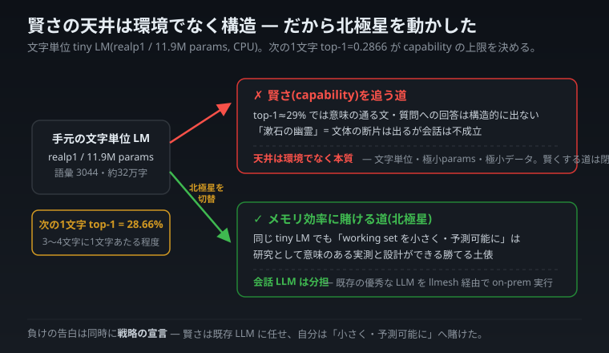
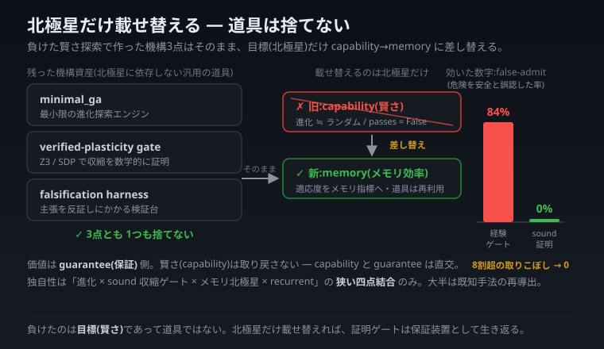
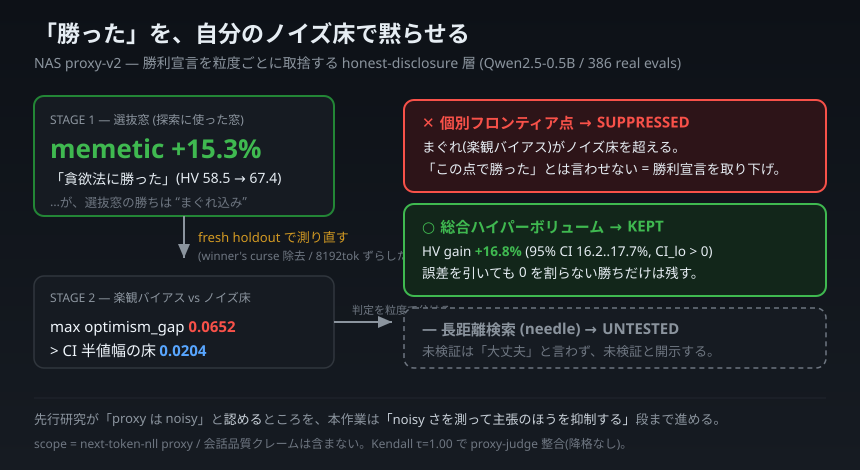
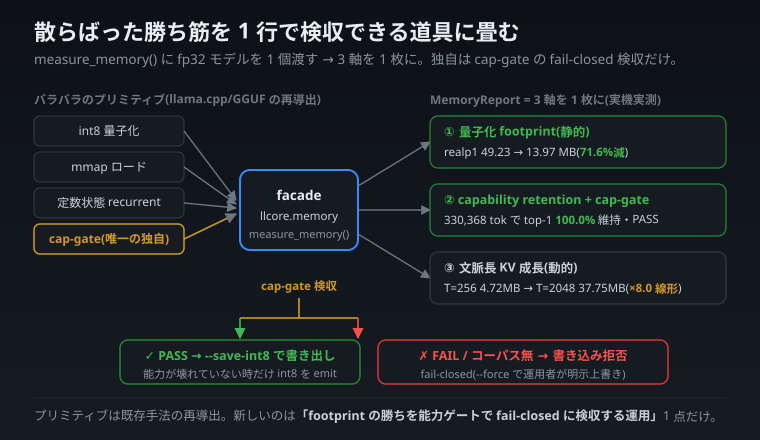

# 展示失败 —— honest disclosure 的故事(从自家 CPU 看 2026 年 6 月的 LLM 行业·第 2 部)

技术文章的高潮，往往是"超越竞品 X 达 Y%"。读起来痛快,写的人也痛快。

然而,正是这种"痛快感",在我看来才是侵蚀技术文章公信力的最大毒素。**因为主张胜利的数字,要多少有多少**。只摆出擅长的案例、把会输的维度从表里删掉、只在自家环境里测量 —— 这些并非舞弊,而是作为"行业惯例"被日常地施行着。

于是,我把这个连载的一部分,押在了**"展示失败"**上。不隐藏、不稀释、不流于训诫,必定刺进数字里展示出来。为什么要做这种事?**因为比起讲胜利,展示失败更能赢得信任**。这不是精神论。到这一部分结束时,我会把自己"用自己定的规则,亲手否定自己功劳的瞬间"一一并陈。正是这些"失败"的累积,才是我作为个人能递出的最强名片。

这篇文章,是把连载中分别写过的 7 个"失败(以及约束失败的机制)",折叠成一条故事线。顺序是有意义的 —— 从宣告本连载伦理的 **b1** 开始,用实际输出展示自制 LLM 能力天花板并切换北极星的 **b5**、用第一手证据推翻 AI 审阅者误判的 **b3**、安全门变得冗余这一耐人寻味的失败 **b4**、把落败研究的工具转载到能赢的赛场上的 **b7**、用自己的噪声地板压制胜利宣言的 **b2**,最后续到把胜势折叠成可一行验收的工具的 **b6**。

---

> **本连载全部 llcore 实测的射程(免责声明,在此郑重地大书一次)**
>
> 全部数值都是**自家 CPU 上极小模型(0.81M〜130M char-LM,本连载仅一部分用 0.5B 的现成模型做 CPU 转换)PoC** 的实测。**并非直接反证或凌驾大厂实 LLM(12B〜64B)的性能。**比较是在**方法、思想、计测纪律的维度**上进行的。量化的 footprint 是实测值,推理速度因为是 simulated quant 所以未测量。分数是 next-token-nll proxy(下一 token 预测困惑度的代理),不包含对话质量的主张。复现用的代码与输出 JSON(`scripts/*.py` / `out/*.json` / `src/llcore/lm/eval.py` 等)已在 GitHub 公开。

这一句话,我在进入正文之前郑重地大书一遍。通常是在文章末尾小小附上的"免责声明",我特意放在开头,是因为这一部分里做的事情大半都是**"没成功的事"**。而本连载,恰恰把这群败北推上主角的位置。

---

## 共享的标尺 —— PPL·top-1·honest disclosure·定数状态(开头只讲一次)

各章里反复出现的词,我在这里一次性嚼碎讲清。之后的章节,都以这些定义为前提推进。

**PPL(perplexity / 困惑度)。**这是用**概率分布的整体**来衡量模型"对下一个字到底有多没把握"的指标。它把"下一个是 a 占 40%,b 占 30%,c 占 20%……"这样的整个分布的好坏取平均。越低越好。这里有一个弱点。**即使 top-1(概率最高的候选)崩坏、被替换掉了,只要概率的长尾(第 2 名以下的分布)还像模像样地保留着,平均值就可能勉强被救回来**。

**top-1 accuracy。**就是"预测概率最高的那个字"与实际正确答案一致的比例。越低意味着"一针见血命中的能力"越差。如果说 PPL 是整个分布的平均,那么 top-1 就是一针见血的一锤定音。正如后面会看到的,这两者并不一定同步变动。

**honest disclosure(诚实的开示)。**这是"一旦出现异常好的结果,在自我感觉胜利之前,务必怀疑其内部构成。不消除失败,把它作为教训留下"的纪律,是本连载一切的根基。它不是面向别人,而是首先面向自己。本连载的另一条规则 —— **外部 AI(哪怕是审阅 AI)的指摘,都要用实代码、第一手信息逐条验证后才采纳** —— 也在这条延长线上(在 b3 章里实际发挥了作用)。

**定数状态(constant-state)recurrent。**这是即使把上下文(至今为止的对话)拉长,内存也不增加、保持**平**的一种机制。后面会出现的"内存效率"这一北极星,几乎全押在这个性质上。打个比方,就像把旧话重新整理成一张摘要便笺一直随身携带的机制。不过它也有"文本越长越失效"的弱点,这一点我也不隐藏地测出来(b2 章)。

放一个体检的比喻在这里。在人体检中即便全部项目都在标准值内,可以安心的前提,**也只在那项检查被设计得能够确实捕捉到异常时才成立**。如果血压计坏了,永远显示"120/80",那么"正常"这个输出就毫无价值。检查的可信度,不取决于"出了好结果",而取决于**"在应该出坏结果的时候,能确实地出坏结果"**。本连载,就是讲如何打造这套"能出坏结果的机制"的故事。

---

## b1. 我做的不是"超越外部的基准",而是"叫停自己的裁判"

通常,技术文章的高潮是"超越竞品 X 达 Y%"。正如开头所写,那种痛快会变成毒。于是在 llcore(在自家 CPU 上跑的极小 char-LM 研究)里,我把方针反转了。**不再做超越外部的基准,而把精力投向做一个叫停自己的裁判**。

足球裁判,通常是中立的。但我做的,是一个**对自己球队的犯规吹得尤其严的裁判**。具体来说,我在评估代码 `src/llcore/lm/eval.py` 里放了两道合格/不合格的门。

```python
def passes_gate(model_ppl: float, unigram_ppl: float, margin: float = 0.85) -> bool:
    # PPL 门: 模型 PPL 在 unigram baseline 的 0.85 倍以下则 PASS
    return model_ppl <= margin * unigram_ppl

def passes_capability_gate(
    model_top1: float, reference_top1: float, min_retention: float = 0.97
) -> bool:
    # 能力门: 没有保持基准(fp32)top-1 的 97% 以上则 FAIL
    if reference_top1 <= 0.0:
        return model_top1 >= 0.0
    return model_top1 >= min_retention * reference_top1
```

`passes_gate` 看的是"PPL 是否明确低于 unigram(不看顺序、只看字符出现频率的基线)"。`passes_capability_gate`(以下称 **cap-gate**)看的是"是否保持了 fp32 模型 top-1 的 97% 以上"。

把后者**特意设得很严(保持 97%)**才是关键。如果相对基准模型的 top-1 保持率不到 97% 就判 FAIL,这是**一道为了叫停自己而设的关卡**。看起来稍微好一点的程度,绝对不放过。

### 用实数据说明为什么需要"两道门"

做 cap-gate 的直接契机,是量化的位宽扫描。把权重从 8bit 一步步压到 2bit,同时测量 PPL 和 top-1 两者。

**multi_smoke(1.36M params,词表 4358,日语多语料。fp32 PPL 24.88 / top1 36.28%)**的 per-channel 量化:

| bits | 削减率 | PPL | ΔPPL% | top1 | Δtop1(pp) | PPL 门 |
|---|---|---|---|---|---|---|
| 8 | 74.0% | 24.886 | +0.01% | 36.28% | −0.00 | PASS |
| 5 | 83.3% | 24.935 | +0.21% | 36.25% | −0.04 | PASS |
| 4 | 86.4% | 25.295 | +1.66% | 36.08% | −0.20 | PASS |
| 3 | 89.5% | 27.761 | +11.57% | 34.30% | −1.98 | PASS |
| 2 | 92.6% | 269.716 | **+983.95%** | 7.49% | **−28.80** | **FAIL** |

multi_smoke 在 2bit 时 PPL 和 top1 一起崩了,所以 PPL 门正确地判了 FAIL。问题出在**更大的 realp1(11.9M params,词表 3044,日语单一书籍。fp32 PPL 38.32 / top1 28.66%)**那边。

| bits | 削减率 | PPL | ΔPPL% | top1 | Δtop1(pp) | PPL 门 |
|---|---|---|---|---|---|---|
| 8 | 74.6% | 38.316 | +0.00% | 28.66% | −0.02 | PASS |
| 4 | 87.1% | 38.599 | +0.74% | 28.42% | −0.25 | PASS |
| 3 | 90.2% | 40.154 | +4.80% | 27.97% | −0.70 | PASS |
| 2 | 93.3% | 101.114 | **+163.90%** | 15.21% | **−13.46** | **PASS** |

**请看 realp1 的 2bit。top1 从 28.66% → 15.21%,−13.46pp,几乎腰斩。能力明显坏掉了。然而 PPL 门却是 PASS。**因为 PPL 是 101,低于 unigram baseline(215)的 0.85 倍(=约 183)。正因为只看了一个宽松的分数(PPL),才把能力腰斩的模型放了过去。

在这里,我把自己最初想写的夸张,亲手订正一下。会想说"PPL 是**原理上**隐藏能力的指标"。但实数据并没有把话说到那么强。**realp1 的 2bit 上,PPL 也大幅劣化了 +163.9%,top1 和 PPL 几乎是同步(lockstep)崩坏的**。准确的观测是这样的 —— **不是"PPL 隐藏了能力",而是"合格阈值 0.85 倍太粗,把坏掉的 2bit 放了 PASS"**。两个指标都捕捉到了劣化。只是我设门的方式太松了。

事先立的假设("top1 应当比 PPL 更早劣化"),在本数据上也**没有成立**。这也不消除地记录下来。假设落空这一事实本身,成了把 cap-gate 重新设计为"**把阈值重新收紧**的检查",而非"抢在 PPL 之前的检查"的依据。

接受这一发现后,我在 eval 里增设了 cap-gate 并把它接进扫描,结果**PPL 门虽 PASS 但被 cap-gate 叫停的位宽 = multi_smoke 3bit / realp1 2bit** 真的被捕捉到了。我自己的评估基盘,靠自己堵上了自己的一层松懈。

### 败北日志(1) —— 自我反证"2bit 即便用 QAT/LSQ 也越不过 cap-gate"

从这里开始才是正题的败北群。第一个,是我最死磕、却仍然输了的故事。

"如果 2bit 也能在几乎不掉 top-1 的情况下量化,自家 CPU char-LM 的内存效率就能戏剧性提升。"这要是实现了就是连载的招牌。于是我把 PTQ(训练后量化)的方法逐级加强。

**multi_smoke 2bit(fp32 ref: PPL 24.88 / top1 36.28%),逐级提升方法时的 top-1 保持率:**

| 方法 | PPL | top1 | retention(保持率) | cap-gate |
|---|---|---|---|---|
| PTQ RTN(朴素取整) | 236.9 | 7.98% | 22% | FAIL |
| PTQ GPTQ(误差补偿) | 138.7 | 12.07% | 33% | FAIL |
| QAT(固定 scale 训练) | 38.15 | 30.10% | 82.9% | FAIL |
| **QAT + LSQ(可学习 scale)** | **36.79** | **30.48%** | **84.0%** | **FAIL** |

每提升一级方法,damage 确实在减少。RTN 的 22% → GPTQ 的 33% → QAT 的 82.9%。到了 QAT(quantization-aware training,以压到 2bit 为前提重新训练),把 top-1 恢复到了 30.10%,保持了 RTN 的约 3.8 倍、GPTQ 的约 2.5 倍。

于是我再死磕一级,把 **LSQ(Learned Step Size Quantization)** —— 让量化的步幅(scale)不取固定值而**靠学习去动**的方法(Esser 等,ICLR 2020),按论文公式自行实现(梯度的均衡化 g=1/√(N·Q_P),初始化 s=2·mean(|w|)/√Q_P)。结果是 **top-1 30.48%、保持率 84.0%**。确实超过了固定 scale QAT(82.9%),但**那点差距是 +1.1pp。**谱系从 RTN 22% → GPTQ 33% → QAT 82.9% → LSQ 84.0% 一路单调改善到最后,但增长已经彻底见顶,**纵使搬出 LSQ,也对 97% 的关卡 FAIL。**

这里藏着这个败北最重要的含义。**增长见顶,不是因为方法不够,而是因为规模不够。**LSQ 自己的论文就报告:在把参数削到极限的小型模型(SqueezeNext)上,2bit 会崩 −14pt(在更大的 ResNet 上是 −2.9pt)。量化的标度律(Dettmers 等 2023、QiD 2024)也异口同声地说"小模型没有冗余,吸收不了 2bit 的量化噪声"。事实上,报告 2bit 能有 90% 后半保持率的场合,都是把 VQ codebook 或长时间 QAT 组合到 7B 以上的大型模型上时(EfficientQAT 上 7B=92.7%、70B=95.9%)。**1.36M 的 char-LM,无论方法怎么提升,在 2bit 都够不到 97%,这从一开始就被预言了的失败**。所以我不把这个"+1.1pp"当作胜利报告。我把它作为**"即便用可学习 scale,也越不过规模这堵墙"**的失败确定,记录下来。

(射程注记:这个 82.9% 是 **multi_smoke(1.36M)** 的数字。realp1 上 GPTQ 的 top1 保持率是 77.7%。无论如何 2bit 都够不到 97%。)

如果当初没做 cap-gate,我多半会以"QAT 把 2bit top-1 保持到 82.9%!RTN 的约 3.8 倍!"这样喜气洋洋的标题来写文章。那标题不是谎言。但**"够不到 97%=在这个规模上没能征服 2bit"这一关键的失败,应该会被我对读者漏报**。我亲手做的裁判,叫停了我自己的乐观。

### 败北日志(2) —— "mmap 永远省内存"并非如此

第二个。这是把"内存效率"立为北极星的我,扎在根上的败北。

我期待:用 `mmap`(把文件直接映射到内存、只读入需要的页的机制。llama.cpp 等会用),即便是巨大模型,也只会"用了多少就载多少"到内存。

**realp1(11.9M params,model.pt 49.3MB,param 53.91MB):**

| 模式 | load 时 ΔRSS | touch 后 ΔRSS |
|---|---|---|
| eager(`mmap=False`) | **50.77MB**(≈模型全载) | 51.64MB |
| mmap(`mmap=True`) | **1.42MB(×0.028)** | 51.54MB |

加载刚结束时,eager 立刻把全部权重(约 51MB)读入内存,而 mmap **只载 1.42MB,仅仅 2.8%**。我以为"就是它了"。然而请看 **touch 后 ΔRSS** 这一列。即便是 mmap,一旦实际访问了全部权重(forward 推理把它们全用上),最终也会膨胀到 **51.54MB**。和 eager(51.64MB)几乎一样。

也就是说,**在必定会把全部权重至少用一次的工作负载(=普通的推理)下,mmap 的最终内存会收敛到 eager**。准确的主张不是"**永远省内存**",而是"**只把需要的部分,延迟地**载入"。恩惠真正成立,只限于:(a) 只用到 working set 的一部分时,(b) 多模型共享页缓存时,(c) 能容忍冷启动延迟时。

(不过,这个性质另有用途。只读的 mmap 页是"clean"的,所以一旦有内存压力,OS 可以不回写到 pagefile 就丢弃,再访问时从磁盘重读。用这个,即便"可用物理 RAM < 模型大小",也能跑完 forward —— 实际把 522MB 的模型在 358MB 的 working-set 上限下跑完,logits 的 checksum 也完全一致。否定"永远省内存"的同时,把"超 RAM 也能转"作为另一套机制肯定下来。两边都用数字划线。)

### 败北日志(3) —— int8 streaming,没有压力时 peak 几乎不动

第三个。这是"中途为止道理都对,可一上实机被打脸"的典型。想法是这样 —— 让权重以 int8 常驻,在 forward 之中**逐层**还原(dequant)到 fp32 后立即释放。这样,常驻内存和推理中的 peak(峰值)内存,两者应该都会下降。

**130M params(n_embd=1024 / L=10),dense(全层一次还原)vs stream(逐层还原):**

| mode | 常驻(resident) | peak WS | logits checksum |
|---|---|---|---|
| dense | 538.6MB(fp32 全载) | 963.8MB | −192.1 |
| stream | **148.9MB(int8, ×0.285)** | 882.2MB | −192.1 |

**常驻内存稳稳地赢了。538.6MB → 148.9MB,削减 72%**。这是真的。但请看 **peak WS** 这一列。963.8MB → 882.2MB。**几乎没动。**

明明是逐层丢弃的,为什么峰值不降?原因在 torch 的 caching allocator。**一旦分配出来的 fp32 内存,即便释放也不还给 OS,而是揣在自己的池子里**。再加上推理中临时的激活(activation)也压上来。所以在"不施压的平时",峰值几乎不变。准确地说是**"常驻降 72%,但平时的 peak 几乎不变"**。削减只在**施加内存压力时**才显现(强制 working-set 上限 368MB 时,dense 的常驻 539MB 装不下而跑不动,但 stream 能在 368MB 下跑完)。

三个结果(dense / stream / stream-capped)的 logits checksum 全部是 −192.1,完全一致。内存优化没有改变结果。**把"正确的部分(常驻减 72%)"和"出乎意料的部分(平时 peak 不变)",并排放进同一张表里展示出来** —— 这就是我的 honest disclosure 的做法。

### 败北日志(4) —— "进化以 20/20 取胜",被我自己的元门判为 ARTIFACT

第四个,是四个里最让人"自我感觉胜利"的那个。也正因如此,是最大的收获。

在另一条线的研究(给冻结的小型 LLM 后接一个小小的 recurrent adapter,并把其结构在线进化的框架)里,出现了这样的结果。**在源自实 SmolLM2-135M 的交叉熵地形上,进化(MAP-Elites)以 20/20 战胜了 finite-difference 梯度。**20 次里 20 次赢。p 值也是 9.5e-7。"进化战胜梯度" —— 一个有梦想的标题。

然而我的框架里,嵌入了一个在赢的瞬间**自动召唤强力对手的元门(strong-gradient meta-gate)**。它不是 finite-diff,而是把基于 backprop 的**强力解析梯度(torch Adam)**重新砸过来。

**held-out(未训练数据)平均 fitness(= −CE,越高越好):**

| method | held-out 平均 | 备注 |
|---|---|---|
| **strong analytic gradient(torch Adam)** | **−1.446** | 全 method 最佳 |
| MAP-Elites(进化) | −1.454 | 第 2 |
| random | −1.473 | |
| finite-diff gradient | −1.483 | 垫底 |

强梯度(−1.446)反超了进化(−1.454)。**在进化 vs 强解析梯度上,19/20 由梯度逆转(p=3.5e-4)**。预注册的 4 条件 AND 不成立。判定确定为 **ARTIFACT(表面的胜利)+ NEGATIVE(在能力上落败)**。

这里,我把这场胜负的机理准确地写下来。这是 critic 指摘出的最尖锐的一点。**这次比较的"同预算",意思是 forward CE 评估次数相同,而非有效更新步数相同。**torch Adam 能更新 2000 步,而 finite-diff / evolution 在预算内只能推进约 95 步(因为 finite-diff 用维数 +1 次的评估才推进 1 step)。**这个"更新次数的不对称"正是 ARTIFACT 的真身**。进化之所以赢了 finite-diff,是因为 finite-diff 背着冷启动只能推进约 95 步的让步。同样的评估预算下,只要"正确地"(用 backprop exact 地)使用梯度,就能推进 2000 步,胜负就翻盘。也就是说,进化表面的胜利,是**弱基线的 artifact**。

如果没有元门,我应该会把"进化在实地形上 20/20 capability 胜利"这一 **false-positive,堂而皇之地公开**。而它,被我自己的框架在 publish 前实际叫停了 1 件。这不是"失败的报告"。而是**"自我怀疑的纪律,在数据之上发挥了作用的报告"**。把"在自我感觉胜利之前,怀疑内部构成"不作为精神论、而作为装置实现出来,并且它真的把我自己的一件功劳打落下来 —— 这就是我能递出的、最强的证据。


*把同一个实验送进两段裁判 —— 弱对手下出现的"20/20 胜利",被强对手的自动重赛判为 ARTIFACT。*

### 把对准竞品的刀刃,也公平地对准自己

这里,我写下一条对自己的告诫。前面我一直以批判的笔调引用"删掉会输维度的行业惯例"。作为代表例,我举出某大厂面向自动驾驶的模型(Cosmos,self-report / 技报时点)的数字。技报里**Driving 79.3 vs 47.2(自家 vs 比较对象)**这样的赢的维度被推到前面,而**Robotics 57.8 vs 58.2 / General 73.7 vs 77.5**这样的输的维度则往往被从表里隐去(数值为技报、技报时点标签,第三方未验证)。

不过,要做到公平,这把刀刃也必须对准自己。**Robotics 的 57.8 vs 58.2,差距是 0.4。这完全有可能在测量误差圈内。**"隐去输的维度"这一批判是妥当的,但同时把"那场失败是僅差、是否显著值得怀疑"这一事实一并写出才公平。删掉输的维度是夸张,把僅差的失败夸大地写成"败北"同样也是夸张。82.9% 既是"QAT 改善了 3.8 倍"的胜,也是"够不到 97%"的负。963.8 → 882.2MB 既是"常驻减 72%"的胜,也是"平时 peak 不变"的负。**把对准自己数字的刀刃,和对准竞品数字的刀刃,保持同样的锋利** —— 唯有做到这一点,失败的开示才会成为"信任的材料"。

---

## b5. 跟自制 LLM 搭话,出来了漱石的幽灵 —— 聪明是结构性的天花板

到这里一直在讲"叫停自己的裁判"。那么说到底,为什么我不拿"聪明"来一决高下?这个理由,我不用感想、而用**实际搭话的结果**来展示。

常被问到。"llcore 只要环境够好,也能像普通 LLM 那样对话吧?"我用的是手头最像样的模型(`realp1`:用青空文库训练的 11.9M 参数的字符级 LM,CPU)。我跟它搭了话(未编辑)。

> **我**:你好。
> **llcore**:『そうなには、何の長いのだ」「あの？おや、そんなさ、何だよ。先生はちゃいいい』
>
> **我**:日本最高的山是
> **llcore**:『長いであっている。それから君子を見たら一番ですから…寒月君は…芋の伯父さん…』

……富士山,没有出现。

希望注意的是,**唯独"像日语的感觉"莫名其妙地有**。"先生""寒月君""伯父さん" —— 这些是青空文库(夏目漱石『吾輩は猫である』等)里出现的**文体与登场人物名**。模型能吐出**模仿**漱石词汇与腔调的片段。但意思不通,也完全答不上问题。

> **漱石的"幽灵"能召唤出来。但"对话"做不到。**

为什么会这样。这个模型以**字符级(char-level)**预测"下一个字符"。其 top-1 约为 **29%(0.2866)**。大约每 3〜4 个字符命中 1 个(和 b1 章里看到的 realp1 fp32 top1 28.66% 是同一个数字)。以这个精度,"像那么回事的字面"能连起来,但意思通顺的句子、对问题的回答,结构上就出不来。词汇和知识都不够。它根本没有富士山这个事实,答不上来是理所当然。

> **"看环境能达到对话级别" —— 达不到。**约束不在环境,而在**本质**(字符级·极小参数·极小数据)。

如果有好的硬件呢?那只是"**能用更多数据训练更大的模型**"而已,而一旦这么做,llcore 就变成了别的东西(云规模的 LLM)。把手头的 CPU char-LM 维持原样变聪明的路,在结构上是关闭的。

### 所以把北极星从"聪明"挪到了"内存效率"

这里是整个连载的转折点。在 CPU 的字符级 tiny LM 上**追求 capability(聪明),是结构上见顶的失败路线**。承认这一点,是 honest disclosure 的出发点。与其在赢不了聪明的东西上继续用聪明去挑战,不如**换到能赢的赛场上**。

于是我把北极星切换为**内存效率**。"在自家的小机器上,把 working set 保持得又小又可预测" —— 在这个赛场上,即便是字符级 tiny LM,也能做出作为研究有意义的实测与设计(b1 章里看到的 mmap·int8 streaming·定数状态的话题就是它的成果)。

而且分工明确了。

- **如果想要能对话的 LLM**:在 FullSense 的设计里,经由 `llmesh`,把现有的优秀 LLM(Gemma 等)**在 on-prem(手边)跑**。
- **llcore 是什么**:不是聊天机器人,而是**研究载具**(进化探索·验证纪律·内存效率的实验场)。

不是"用自制 LLM 对抗 ChatGPT",而是"把自制的小模型,作为面向能赢的问题(内存效率)的实验台"。搭话只出来幽灵这件事,让我下定了这个取舍。



*天花板不在环境而在本质。所以把北极星从"聪明"挪向了"内存效率"。*

自制模型的输出语无伦次,通常是不愿展示的。但我认为,**正是这个"漱石的幽灵"应当展示**。诚实地展示能力的天花板,既是失败的告白,同时也是**战略的宣言**。不是放弃了聪明,而是把聪明交给现有 LLM,自己押在"又小又可预测"这一别的价值上 —— 这个分岔点,我连同实输出一起记录下来。

---

## b3. 被 AI 审阅者扣了顶"那个数字是捏造"的 CRITICAL 帽子

因为把北极星挪到了"内存效率",从这里开始就是怎么对待内存**数字**的话题了。换个趣味,这一次是**他者(AI 审阅者)的指摘弄错了的一回**。不过主角不是"AI 错了",而是**"把貌似有理的指摘,不囫囵吞下、用第一手证据去核实,结果是错的"这个验证过程本身**。

事情的起因,是给自制的内存计测工具包做对抗性审阅的时候。AI 批评家(我称它为 `gem-critic`)如此断言。

> **"realp1 的 footprint 49.23MB → 13.97MB 是捏造。正确的是 47.66MB → 12.10MB。这是 CRITICAL 级别的不准确。"**

捏造。CRITICAL。措辞很强。通常是会慌忙改数字的场面。但我没改。遵照共享标尺一章里提到的规则 —— **外部 AI 的指摘,要用实代码、第一手信息逐条验证后才采纳** —— 我没囫囵吞下批评家的"正确数字",而是**把两个数字各自从哪里来**一路追溯到代码。

### 把 1.57MB 的差,逐字节追下去

我的工具的值和批评家的"正确值"之差,在 fp32 上是 **49.23MB − 47.66MB = 1.57MB**。换成字节:

- 我的值:**49,231,872 B**(= 49.23MB)
- 批评家的"正":**47,659,008 B**(= 11,914,752 参数 × 4 字节)
- 差:**1,572,864 B**

把这个 1,572,864 做素因数分解 —— **6 × 256 × 256 × 4**。`realp1` 是 6 层、上下文长 256 的模型。每层都以 fp32(4 字节)持有一个 `256 × 256` 的 **causal-mask(因果掩码)buffer**。6 层的量恰好是 1,572,864 字节。**差的真身是 causal-mask buffer。**

行李箱的比喻也许好懂。两个人量同一个行李箱的重量,A 量的是"只装内容物",B 量的是"连箱体一起"。**两个人都没说谎。**只是"把什么算进去量的"不同而已。不过这个箱体里有一部分,跟内容物不同、折叠不小(附属品=mask)—— 这一点连着后面的话。

- 我的工具 `int8_footprint_bytes`,在模型的 `parameters()` **之外**还扫 `buffers()`,是**"resident-weight-byte 会计"**。它数的是实际常驻在 RAM 里的权重系字节,所以也含 causal-mask buffer。
- 批评家定为"正"的旧脚本数字,是 **params-only 会计**。只数学习对象的参数,不数 buffer。

两个数字,在各自的会计基准下都是正确的。**不是"捏造",而是"会计基准的不一致"。**


*把差 1.57MB 逐字节素因数分解,恰好对上 6 层的 causal-mask buffer。*

而且有趣的是方向。把无法量化的 mask 以 fp32 原样算进去,到 int8 的削减率就显得**保守**,只有 **71.6%**(mask 不能 int8,所以拖了削减的后腿)。也就是说,我的会计**非但没有夸大削减效果,反而显得偏保守地小(underclaim)**。非但没有用捏造把效果做漂亮,反而是往诚实方向偏严的数字。

### 教训 —— 内存数值要明示"会计",AI 的指摘要用第一手证据

内存的事,至少有 4 种不同的"数法"。**params-only**(只数学习参数)/ **params + buffers**(resident-weight,含 mask 等固定 buffer)/ **peak RSS / working set**(运行时进程在物理内存里持有的最大量)/ **on-disk**(文件大小)。它们动辄相差几百 MB。同一个模型,如果不写明"指的是哪一个",读者就会拿着别人的数字去比较。这次的"捏造"风波,说到底就是因为**把 params-only 和 params+buffers 撞到了一起**才发生的。

而且,如果当初囫囵吞下批评家的"CRITICAL·捏造",我就会**特意把正确的(更保守、更诚实的)自己的数字,改成 params-only**。验证,叫停了这次的改坏。

> AI 的"CRITICAL",不是结论,而是**调查的起点**。
> 在把 1.57MB 素因数分解之前,哪边对都还不知道。

这不是一篇炫成果的文章。但"怀疑自己的数字,也怀疑他者的指摘,最后用逐字节的第一手证据了结" —— 这套朴素的验证纪律,正是让自家 CPU 的小实验变得可信的脊梁。

---

## b4. 做了安全门,却被自己的目标函数弄成了冗余

回到"展示失败"系列。这次的失败,味道稍有不同。**不是 bug,也不是性能不足,而是"自己备好的安全装置,根本没有能发挥的场面"**这种失败。

我在架构探索(用进化计算去搜 AI 的结构)里,接入了一道**数学上健全的安全门**。具体来说,用 **Z3(定理证明器)证明**"这个结构是否稳定(状态是否发散)",证明不出来的就 fail-closed 地拒绝。理论上是强力的机关。设计时的主张(我称之为 G2)是这样的。

> **"没有门的话,安全的个体只出约 6%。有门的话约 100% 安全。所以门是必须的。"**

这里的"约 6%",是为了给门提供动机而放的**事先估计**(以另一设定为前提的设想值),并非本实验实测的安全率。一实测,这个主张就被**反证**了。

我跑了门的有/无 2×2 实验来测安全率(safe_rate),结果 —— **即便没有门,safe_rate 也已经是 95〜100%**。哪里是"6% → 100%",加了门也只是**safe_rate 从 0.95 → 1.00 略微上升**(retention 优先臂的 safe_rate 从 none 0.95 → gate 1.00)。安全率本来就高。我以为"应该有效"的安全门,**在这个设定下,几乎没活可干**。


_左边的"6%→100%"是事先的估计(另一设定的期望值),右边是实测。实测里即便无门也已是高安全率,门几乎没有出场。_

### 为什么门变冗余了

在悬崖边的路上装了护栏,**结果车本来就都有靠崖对侧的山壁开的习性** —— 没人往崖边凑,所以护栏堂堂正正立着,却没有一辆车撞上来。追究原因,正是这个结构。

我探索的**目标函数(奖励)**有两个 —— **内存效率**(降低状态的收缩率 = 偏好不吃内存的结构)与 **retention**(偏好能好好复现过去的结构)。然而**这两个奖励,都偏好"有界的(不暴走的)结构"**。不吃内存的结构,正确复现过去的结构,最终都偏向"状态不发散"的那一侧。

> **目标函数,已经在奖励安全那一侧了。**所以后加的安全门,只是把已经被选中的安全个体,再"认定一次安全"而已。
>
> **安全门的价值,只在"目标函数偏好危险侧(发散侧)时"才显现。**如果目标已经在奖励安全,门就变冗余。

这是一条设计判断的边界条件:"在做安全机构之前,先看目标函数在奖励哪一侧。"光是弄清它"无效",反而比"有效"更推进了对设计的理解。

### 附带的发现,与不隐藏的但书

还看见了一个没预想到的代价。内存效率的奖励把 footprint(占用量的指标)从 **0.375 → 0.149 几乎腰斩**。如愿。但那代价,不止是 retention 的微减。**retention 优先的个体**的 capability 比随机初始化**高出 +0.012**(passes=True),而**内存优先的个体**虽然 footprint 小,但其超过随机的 capability 余量**缩到 +0.004,判定为 passes=False**。也就是说,内存攻得太猛,就进入了**连"比随机更聪明"这一最低限度的优势(capability edge)都丢掉**的区域。本以为权衡是"内存 vs retention",实际却走到了"内存 vs 超过随机的能力本身"这个更严苛的地方。

但书不隐藏地放上。**footprint 是 state-boundedness 的 proxy**,而非实 RSS(实内存)(P1 保留)。而且这是**极小 PoC**。换一个目标函数(容许·偏好发散的那种),同一道门完全有可能起决定性作用。Z3 确实在运转(196 个体中拒绝了 71、回退 0),门机构本身健全地工作了。**不是"门坏了",而是"门没轮到出场"** —— 这个区分,是本章的关键。

通常,做了安全机构能写"100% 生效"是痛快的。但这次得到的是"**做出来一看,在这个目标函数下没生效**"这个结果。比起夸耀一道 100% 生效的门,能用实测划出"何时生效、何时冗余"的线,才是对下一次设计更有用的资产。失败就是失败。但这个失败,值得记录。

---

## b7. 把落败研究的工具,重新接线到能赢的赛场

在 b5 章我写过"因为追求聪明(capability)是结构性的失败路线,所以把北极星 pivot 到了内存效率"。这次讲那个 pivot 的**实务**。一提 pivot 容易联想成"丢掉失败重做",但还有更划算的招。**落败研究里做出的工具(机构)不丢,只换北极星。**

**落败的东西**:capability(聪明)的进化探索。"进化出的结构 ≒ 随机结构"(`evolution_vs_random().passes = False`),没出现聪明上的增量(和 b4 章 capability edge 的话题同样确定的失败路线)。

**留下的东西(机构资产)**:在跑那条失败路线的过程中做出的一整套工具,原封不动地留了下来。**minimal_ga**(最小限度的进化探索引擎)、**verified-plasticity gate**(用 Z3 / SDP 数学地证明"结构稳定=收缩"的门)、**falsification harness**(去反证主张的验证台)。这些虽然是为了"聪明探索"而做的,但**作为工具并不依赖于北极星**。

钓鱼的比喻很灵。为了钓某种鱼(聪明)备齐了气派的鱼竿、网、鱼群探测器,可那鱼怎么努力都钓不上来。这时候连工具都全扔了就太可惜。鱼竿不知道"要钓哪种鱼"。垂下钓线、感知咬钩、把鱼拉起 —— 这套功用,无论瞄准的猎物是什么都不变。**工具不依赖于"目标"。**所以只要换瞄准的鱼(北极星)就行。

于是我把这套机构整个转用到**内存效率的探索**。进化引擎原样**把适应度(奖励)换成内存指标**,证明门原样**用作 sound 地保证"探索结果是否稳定"的门**,反证台原样**用作怀疑内存效率主张的验证**。只换北极星(capability → memory),机构一个不丢。



*只替换目标(北极星),工具一个不丢。把价值重新摆到 guarantee 一侧。*

### 诚实的立场 —— 大部分是"再推导"

这里要是含糊就会失去信任,所以写明。**这个设计的大半,是已知方法的再推导。**"把内存指标当作适应度"→ HW-NAS(MnasNet)·HAQ 的常识。"把 accuracy × memory 标量化"→ 多目标优化(Deb 2000)的定式。"fail-closed 的带约束进化"→ 带约束 NSGA-II 的定式。"把验证器当作门"→ CEGIS(反例引导合成)的框架。哪一个都不是我的发明(prior-art 的把握度高)。

那么诚实的独创性是什么?**只是窄窄四点的结合** —— 进化 × sound 的收缩门 × 内存北极星 × recurrent 动力学,把这个特定的组合,在自家 CPU 上可复现地跑起来。此外,还有一个可测的独自贡献。

### 生效的数字 —— "经验门"与"sound 证明"判别力之差

门有两种。**经验门**(用经验法则判"大致像是稳定")和 **sound 证明门**(用 Z3/SDP 数学地证明"是稳定的")。一测这两者的**判别力**,差距显著。

> **经验门的 false-admit(把危险的误认为安全)是 84%。**
> **sound 证明门的 false-admit 是 0%。**

这里说的 false-admit 是**把危险的东西"安全"地放过去这个方向的错误**,和把安全的东西保险起见挡下来的错误(过度谨慎)方向相反。这一种直接关乎事故。"大致像是稳定"放过去的东西里,八成以上其实并不安全。另一边,数学地证明过的,漏放为零。经验检查从过去见过的例子推测"跟这个像,应该没问题",所以不像的危险东西会溜过去。而证明的装置把结构改写成数式,**用逻辑死磕"通往暴走的路径一条都不存在"** —— 所以"碰巧漏看"在原理上不会发生。这就是漏放 0% 的真身。**"貌似的安全"与"被证明的安全"是两回事**,这件事用数字摆出来了。

### 不隐藏的但书 —— branch A 不会找回聪明

最重要的 honest disclosure。**这个转用,不会找回 capability(聪明)。**价值终究在 **guarantee(保证)一侧**。不是"变聪明",而是"**稳定可证明**"。capability 和 guarantee 是正交的,在聪明上落败,并不意味着连保证的价值也丢了。把落败路线的工具转到能赢的路线,意思是**把价值重新摆到能赢的轴(保证)上**。保留:footprint 是 state-boundedness 的 proxy,而非实 RSS(P1)。把实 footprint 当作适应度是将来的事(P2)。prior-art = MnasNet / HAQ / NSGA-II / Deb 2000 / CEGIS / Dohare 2024。

> 落败的是"目标(聪明)",而非"工具(进化·证明·反证)"。
> 只要换载目标,工具就在能赢的赛场上复活。

为聪明探索而做的证明门,作为内存效率探索里"以 0% false-admit 保证安全"的装置复活了。**失败,如果连机构一起扔掉就是双重损失。**只换北极星 —— 这才是把失败变成资产的最现实的做法。

---

## b2. 把"以 +15.3% 取胜"用自己的噪声地板封口

到这里主要是"展示失败"的话题。这次再往前一步 —— **眼看要说"赢了",却用自己做的噪声标尺,撤回了那句胜利宣言的故事**。

我在自家 CPU 上跑了一夜(约 6.6 小时,386 次实评估)的架构探索(NAS),最初这样喊。

> `memetic frontier dominates greedy: hypervolume +15.3%`

用进化计算(NSGA-II)搜出的设计群,在超体积上**比朴素的贪婪法基线高出 +15.3%**。是胜利宣言。然而同一次运行的 **headline 判定**却是这样。

> **verdict: suppressed(抑制主张)— selection optimism exceeds noise floor**

同一次运行,一张嘴说"以 +15.3% 取胜",另一张嘴说"那个胜利别拿出来"。**正是这个矛盾,是这次特意埋下的机制**。

题材是**内存 vs 质量的 Pareto 探索**。把 Transformer 各层的注意力机构(attention mixer),是保持沉重的 softmax,还是替换成轻量的 sliding window 或 linear attention —— 替换得越多内存越省(KV 缓存变小),但质量会劣化(下一 token 更难命中)。对象是把现成的 `Qwen2.5-0.5B-Instruct`(24 层)在 CPU 上转换得来的。基准(全层 softmax)的 nll 是 4.4155(ppl ≈ 82.72)。比较两种搜法。**greedy**(逐层加上"当下最划算的替换"的朴素方法)与 **memetic**(NSGA-II + 局部搜索的精巧方法)。问题是"精巧的 memetic,真的赢得了朴素的 greedy 吗?"

### 为什么不能立刻相信"赢了"

有两个陷阱。这不是我的灵机一动,而是 NAS 的先行研究早已警告过的确立问题。

**陷阱 A:proxy 本身就 noisy。**认真评估候选太贵,所以用 proxy(代理指标,这次是"下一 token 的预测困惑度")。它便宜但 **noisy**,常和实性能错位。MTF-PDNS(Pareto Dominance-based Novelty Search with Multiple Training-Free metrics, Vo & Luong 等, arXiv:2407.20656, 2024)自己就写道:"performance objectives do not fully align with the actual performance ... as is often the case with training-free metrics(proxy 指标常与 actual performance 背离)"。这里明确一下这不是重新发明轮子 —— MTF-PDNS 对这个问题的对策是"用 novelty/多样性分数把探索空间保持得宽"。**本工作的对策方向完全不同,是"把 proxy 的不确定性本身定量化,从而抑制胜利的主张"**。一边用多样性应对,一边测不确定性来约束主张。解的谱系不同,所以不是已确立领域的炒冷饭。

**陷阱 B:winner's curse(赢家的诅咒)。**评估了一大堆候选并选出最好的,被选中的值里就混入了"实力 + 碰巧在那个评估窗里运气好的部分"。用同一个窗测出来的胜幅,结构上是**高估**。和 A/B 测试或 GWAS 里有名的"把挑选出来的东西用同一份数据自夸会注水"是同一现象。zero-shot 的 `+15.3%`,正是用挑选所用的那个窗测出来的胜利。

用模拟考的比喻来说 —— 用新学习法把分提高了 15%,但那场模拟考用的,是你为了打磨新学习法反复做过的题。要确认真实的实力,只能用一次都没见过的别的题重测。

### 埋下的答案 —— 把搜索的窗,和裁判的窗,物理地分开

于是这次的核心。**把探索(挑选)用的窗,和最终判定用的窗,按 token 位置不撞地分离**。探索用(fast pool)是 8 个窗,判定用(holdout)是从那里**错开 8,192 token、互不重叠的另外 12 个窗**。把挑选里胜出的设计,用一个都没用于挑选的全新窗重测,就能逼出**乐观偏差(optimism_gap = selection − holdout)**(Δnll 越低越好)。

| 内存节省 | Δnll(挑选窗) | Δnll(**holdout**) | optimism gap | 95% CI |
|---:|---:|---:|---:|:--:|
| 11.5% | 0.0184 | 0.0170 | 0.0014 | 0.0144..0.0200 |
| 27.1% | 0.0754 | 0.0696 | 0.0058 | 0.0632..0.0767 |
| 45.9% | 0.3675 | 0.3404 | 0.0271 | 0.3216..0.3587 |
| 61.3% | 0.5962 | 0.5419 | 0.0543 | 0.5203..0.5653 |
| **68.5%** | 0.6667 | 0.6015 | **0.0652** | 0.5774..0.6232 |
| 72.2% | 1.1744 | 1.1107 | 0.0637 | 1.0776..1.1422 |
| 83.9% | 1.2436 | 1.1818 | 0.0618 | 1.1500..1.2109 |

挑选窗的值(第 2 列),**几乎每一行都比 holdout(第 3 列)看起来更好**。那个差就是 optimism gap。最大是 68.5% 节省点的 **0.0652**。判定逻辑是这样的。

> **最大 optimism_gap(0.0652),超过了 bootstrap CI 半值宽的地板(0.0204)→ 抑制(suppress)各个 frontier 点的胜利主张。**

如果乐观偏差大于噪声地板,就不许说"在这个点赢了"。**把自己的胜利,用自己的噪声标尺封了口**。

### 但不是全部封口 —— 按粒度数自信

这里是这次我最喜欢的设计。**不把"胜利"当成铁板一块。**frontier 的**各个点**的胜利主张,如上所述抑制了。但把整个 frontier 折叠成一个的**超体积(HV,frontier 覆盖的面积=综合的好)**,另行得出了这样的结果。

> **HV gain(memetic − greedy, holdout)= +16.8%(95% CI 16.2..17.7%, p_memetic_wins 1.000)**

而且这个"胜利"是设计成**只在 CI 下限超过 0 时才触发**的(点估计绝对不触发)。这次 CI 下限 16.2% > 0,所以只把 HV 维度的 memetic 优势**这一项**留下了。

也许有人会卡住:"挑选窗 +15.3% 用全新窗重测过了,holdout 的 HV gain 却是 +16.8%、**胜幅反而增大**了嘛。"这不是矛盾。**各个点的 optimism_gap(selection − holdout)在全新窗里确实缩小**,而**HV 是另一基准的量**。+15.3% 是挑选窗 frontier 覆盖的面积比,+16.8% 是 holdout 窗 frontier 覆盖的面积比,而构成面积的点的摆法、参考点的取法都随窗而变。**面积量(HV)之间,不是能用"缩/伸"直接相比的标尺**。正因如此,HV 的胜利不靠"比 +15.3% 大所以强",而**只靠 CI 下限超过 0 这一独立的根据**留下来。



*图:把挑选窗出现的"+15.3% 胜利"用 fresh holdout 重测。乐观偏差(最大 0.0652)超过噪声地板(0.0204),所以抑制各个 frontier 点的胜利(SUPPRESSED),只留下综合 HV gain +16.8%(CI_lo>0)(KEPT),长距离检索作为未验证(UNTESTED)开示。*

施加抑制的关卡有 5 段。(1) **paired multi-window bootstrap CI** —— 给 proxy 本身加上窗对再抽样的置信区间,不让它用点估计说话。(2) **用 fresh holdout 去除 winner's curse** —— 超过地板就抑制 verdict。(3) **proxy-vs-judge 的 Kendall τ** —— 若 τ<0.7 则把 positive verdict 降格为 'suggestive(示唆的)'(这次是 **τ=1.00**,无降格)。(4) **HV gain 仅在 CI_lo>0 时触发**。(5) **memetic ≈ greedy 作为 honest negative 明示**。先行研究承认"proxy 是 noisy"的地方,本工作推进到了"把那种 noisy 实际测出来,转而抑制主张"这一步。不是发明了新的探索算子,而是**把价值放在把不确定性定量化、用以约束 verdict 的 disclosure 层**这一点上。

### 不隐藏的未验证缺口(honest gap)

诚实,不只取决于"测了的地方",也取决于"申报没测的地方"。

- **context 长扫描到 256/512/1024 为止。长距离检索(needle / passkey)在 2048 以上也未实测。**在最激进的设计(节省 83.9%)上振上下文长,Δnll 随文本变长劣化加剧:**256:0.761 → 512:1.012 → 1024:1.182**(定数状态弱点伸张的征兆)。这也和理论侧吻合 —— 把线性递归模型的长距离记忆劣化归结到 decay spectrum 的先行研究(*Optimal Decay Spectra for Linear Recurrences*, arXiv:2604.07658)证明:在随机初始化下,最小谱隙坍缩到 O(N⁻²),长上下文里误差**实质上以代数(sub-exponential)方式劣化**。另外,即便真能测 needle,**也不会只靠满分来定案** —— 追踪长上下文持续预训练学习动态的先行研究(*Revealing the Learning Dynamics of Long-Context Continual Pre-training*, arXiv:2604.02650)报告:NIAH(needle-in-a-haystack)分数比内在的收敛更早地呈现 "deceptive saturation(表面的饱和)",而基于 PPL 的分析更能正确追踪实际的改善。"needle 满分所以长距离记忆没问题"这种读法,正是本稿所戒的"自我感觉胜利"的一种形态。
- **想去测那里,结果我自己机器的内存先坏了(诚实的包袱)。**最初的草稿里写过"2048 因为 inner-loop 长是 1024,所以结构上出不来",但这是**错的**(扫描处理与 inner-loop 长无关、能切任意长的窗,语料也有 230 万 token 足够长)。订正之后实际重跑 2048 的扫描 + needle 检索,结果 —— **在自家 CPU(物理 RAM 3.6GB)上,2048 token 的 full-attention forward 把 working set 膨胀到 3.9GB、超出 RAM 触发 swap thrashing**。试了 2 次,2 次都没跑完。这里有个可笑的反讽 —— **本章的主题是"定数状态模型在长上下文里把内存溢出"这个失败模式,而想去测它的我的机器,恰恰在长上下文里把内存溢出了**。下一步正确的招是向 GPU 卸载,在那之前就把 **2048+ 的 long-context retrieval 诚实地放在"未验证"**。我**不会说**"所以长距离检索没问题"。
- **attention-KL 是诊断专用,未接入 fitness。**各层的 forward KL(softmax‖student)mean 3.68 / max 7.67(layer 9)。这是为看劣化所在的诊断,没有放进探索的目标函数。

行业的排行榜被"赢了"填满。但那个胜利是挑选窗的乐观偏差,还是新窗里也留下的实力,把这个用同样的精度开示出来的例子并不多。

> 在自我感觉胜利之前,怀疑内部构成。把那份"怀疑",不当作感想、而当作**阈值**。

前一段的"展示失败"之后,是"能自己抑制胜利"。诚实,从展示之物变为**机制之物**。

---

## b6. 把胜势,折叠成谁都能一行验收的形态

至此叠了几回"展示失败"(2bit 的败北、安全门的扑空、AI 审阅的误判、不能对话的自制 LLM),又在 b2 看了"自己抑制胜利"。最后是它**成对的一回**。不是失败,而是**把胜势折叠成工具的故事**。不过主角不是新发明,而是**"做成谁都能一行验收的形态"这份朴素的诚实**。

llcore 里有好几个内存效率的**已验证 primitive** —— int8 量化(把权重压到四分之一)、mmap 流式加载、定数状态 recurrent(长上下文也内存持平)、cap-gate(验收能力是否坏掉的门)。问题是,这些**零散地散落在** `scripts/` 和 `lm/` 里。厨房的工具东一件西一件塞在抽屉里,"调哪个能知道什么"从外面看不出来。胜势有,却用不上。

于是我做了一个 `llcore.memory` 这样的 **facade(受理窗口)**,加上了 `measure_memory()`。**递给它一个 fp32 模型,它就一次性返回"能小多少、为此失去什么"**。返回的 `MemoryReport` 把三个轴折叠到一张上。(1) **量化 footprint(静态)** int8 下能小多少,(2) **capability retention + cap-gate** 能力是否保住(坏了就在验收处叫停),(3) **上下文长 KV 增长(动态)** 拉长上下文时内存怎么增长。



_把已知方法的再推导折叠进一个受理窗口,把唯一的独创性 cap-gate 验收作为 fail-closed 的分支嵌入的全貌。_

### 实机的诚实数字

实训练模型上的实测(footprint 是 params+buffers 的 resident-weight 会计,与 on-disk 是两回事 —— 直接接上 b3 章的会计话题):

| 模型 | fp32 | int8 | 削减 |
|---|---:|---:|---:|
| realp1 | 49.23 MB | 13.97 MB | **减 71.6%** |
| multi_smoke | 5.50 MB | 1.51 MB | **减 72.6%** |

能力那边,在青空文库多文全文(330,368 token)上 **top-1 retention 100.0%**(fp32 0.3629 → int8 0.3631),cap-gate PASS。这里有一条**重要的诚实注记**:

> int8 "高出" fp32 0.0002,**不是改善**。是同分 argmax 的测量噪声。

在这个规模上 int8 量化的能力成本实质为零 —— 这是对别篇文章"per-channel int8 劣化 <0.1%"的追认,绝非"int8 变更聪明了"的主张。越是出现好数字,越要怀疑内部构成、诚实地写。这也是 packaging 的一部分。

第三个轴(上下文长 KV 增长)也在同一份报告里出:realp1 上从 T=256 的 4.72MB → T=2048 的 37.75MB,**×8.0 的线性增长**(而 `constant_state_bytes` 不依赖上下文长、恒定)。共享标尺一章里提到的"会伸的项 vs 持平的项",靠一个工具谁都能复现。

### 把验收做成 fail-closed —— 这是唯一诚实的独创性

诚实地写下立场。**primitive 本身不是新发明。**int8 / mmap / 定数状态是 llama.cpp 或 GGUF 早已确立的方法的**再推导**。那么我诚实的独创性是什么?**"把 footprint 的胜利,用能力门 fail-closed 地验收的运用"** —— 仅此一点。

具体来说,CLI 的 `--save-int8` **只在 cap-gate PASS 时**才写出 int8 checkpoint。能力验收失败(FAIL),或因未指定语料而无法测能力时,**fail-closed 地拒绝写入**(运维者可用 `--force` 显式覆盖)。`measure_memory` 在没有评估数据时把 capability 返回为 `None`,**"不捏造没有的东西"**。

为什么需要这个。如前 b1 章所见,**只有 PPL 的门,会若无其事地把 top-1 腰斩的坏掉的低位模型放 PASS**。把"变小了"误当成"能用"的事故,在验收处结构性地叫停 —— 这是 packaging 里寄托的唯一主张。用做菜的菜谱来说,即便一个人发现了"超好吃的窍门",分量和步骤都含糊就没法复现。只有写成带检验步骤的菜谱"材料几克、火候在这、尝味确认这里",别人才能做出同样的味道,而且还能防住"这个糊了不能上桌"的事故。

但书不隐藏地放上。footprint 是 **resident-weight 会计(params + buffers)**,连无法量化的 causal-mask 的 fp32 都含进去,是保守侧,与 on-disk 文件大小是两回事。"硬件越好越生效"的设计指针(int8 → GPU 的真 int8 GEMM / mmap → 大 RAM 的共享页缓存 / 定数状态 → 长上下文)都是**设计假说、未计测**,速度在本连载里没测。我是在 870 件单元测试通过的状态下组的 facade,但这担保的是"接线正确",而非"算法新颖"。

> 研究的价值,不只在新颖性的炫目,也在**"把既有的胜势,做成谁都能复现·验收的工具"**。

把 frontier 在自家 CPU 上再推导,再把它变成用一条命令回答"变小了吗?坏了吗?"的工具。朴素。但在诚实展示失败的连载的最后,该放的就是这份**"把胜势,做成可验收的工具留下来"**的姿态。

---

## 落地 —— 为什么"失败",会成为个人职业生涯的核

贯穿 7 个章节,我的成果一次又一次被自己的裁判叫停。2bit QAT、mmap 的过度泛化、int8 streaming 对 peak 的期待、进化的 20/20、NAS 的 +15.3%。安全门没有出场,聪明的天花板在结构上关闭。AI 审阅者的"是捏造"被第一手证据推翻,落败研究的工具在别的赛场上复活,胜势折叠成可一行验收的工具。

**第一,胜利的主张可以无限制造,但失败的开示无法说谎。**"够不到 97%""peak 几乎不变""自己否定了自己的 20/20""把 +15.3% 用自己的噪声地板封口" —— 这种数字,注水也不划算。反而注水自己吃亏。正因如此,主动把这些拿出来的人,会被推定为"这个人的好数字,大概也是用同样的诚实拿出来的"。**败北的开示,是担保胜利数字可信度的保证金**。

**第二,我做的不是"聪明的模型",而是"叫停自己的机制"。**cap-gate(保持 97%)也好,strong-gradient meta-gate 也好,去除 winner's curse 的 holdout 窗也好,cap-gate fail-closed 的验收也好,都不是为了超越外面某个人的装置。而是**为了在公开前自己叫停自己乐观的装置**。而且它真的叫停了。比起做一个超越外部的基准,**做一个叫停自己的内在裁判,要难得多,也被信任得多**。

**第三,这正因为是自家 CPU 的极小模型才做得到。**正如开头免责所述,这里展示的数字是 0.81M〜130M 的 char-LM PoC(仅 b2 章用 0.5B 的现成模型做 CPU 转换),并非反证 12B〜64B 实 LLM 的性能。和大厂在"聪明"上对打没有胜算。**所以我从聪明的赛场上退下来,把立足点移到了计测纪律这个赛场。**"哪个数字可信、哪个数字不可信",在自己的小实验上不隐藏地划线展示出来。这样一来,即便不持有 12B 的模型,也能成为个人能递出的价值。

胜利的故事,读完就被忘掉。**把失败,刺进数字里、诚实地敞开展示出来的故事,会作为信任留下来。**把自家 PoC 的败北日志,变成信任的材料 —— 这就是这一部分一直在做的事情的真身。越是出现异常好的结果,越要在自我感觉胜利之前怀疑内部构成 —— 不是面向别人,而是首先面向自己。这,是本连载一切的根基。

---

> **再揭(本文的射程)**:全部数值都是自家 CPU·极小 char-LM(0.81M〜130M,仅 b2 章用 0.5B 的现成模型做 CPU 转换)PoC 的实测。量化的 footprint 是实测值,推理速度因为是 simulated quant 所以未测量。分数是 next-token-nll proxy,不包含对话质量主张。这不是在性能上直接反证·凌驾大厂实 LLM(12B〜64B)的主张,而是**在方法·思想·计测纪律的维度上的比较**。复现用的代码与输出 JSON(`scripts/*.py` / `out/*.json` / `src/llcore/lm/eval.py` / `src/llcore/lm/quant.py` / `src/llcore/runtime/eval_proxy.py` / `src/llcore/fitness/memory_objective.py` / `src/llcore/memory.py` 等)已在 GitHub 公开。
