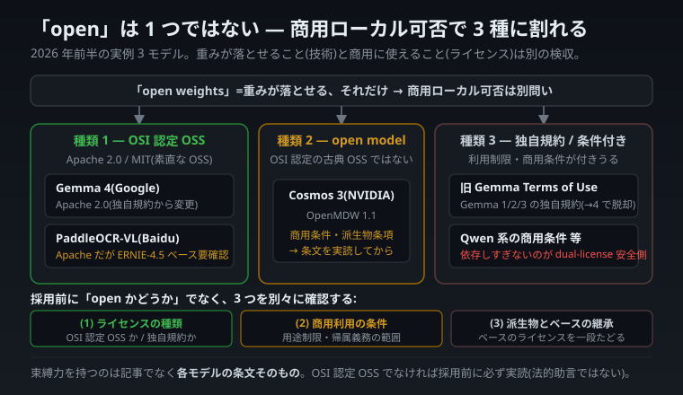

# 技術の外の支配項 — ライセンス・成長・記憶

LLM の話をしていると、つい「賢さ」や「速さ」といった技術指標に目が吸い寄せられます。けれど 2026 年前半の業界を自宅 CPU から眺めていて、繰り返し思い知らされたのは別のことでした。**プロダクトの命運を握るのは、しばしば技術そのものではなく、技術の「外側」にある支配項だ** —— ということです。

支配項(dominant term)とは、結果を一番大きく左右する項のこと。性能を 2 倍にしても、商用ライセンスが合わなければ採用できない。学習ループを高速化しても、誤りを止める仕組みがなければ「使うほど劣化」する。記憶機構を磨いても、どのドメインで何を畳むかを取り違えれば一貫性は得られない。本稿(連載「自宅 CPU から見た 2026 年 6 月の LLM 業界」エコシステム編)は、その「技術の外の支配項」を **ライセンス → 成長 → 記憶** の 3 段で巡ります。

---

> ### 共通の免責(本連載すべてに掛かるバナー)
>
> 本連載の中心(llcore)で示す**実測値は、すべて自宅 CPU 上の極小モデル PoC の honest disclosure** です。大手の実 LLM を直接反証したり凌駕したりする話ではありません。本稿で大手・他社・他プロジェクトと比較する場面が出てきますが、比較しているのは**手法・思想・計測規律の次元**であって、絶対性能の優劣ではありません。そして本稿は **法的助言でも投資助言でもありません**。他社(Google / NVIDIA / Baidu / Nous Research / MangaFlow 著者ら)への言及はすべて公開情報の 2026 年 6 月時点の理解で、数値には出典を併記します。本連載の作法どおり、**他者を斬る刃は最後に必ず自分(FullSense / llcore / llive)にも向けます**。

本稿で何度か出てくる共通語を、ここで一度だけ定義しておきます(各章で繰り返しません)。

- **honest disclosure(正直な開示)**: 「うまくいった」と主張する前に、その内訳を疑い、未証明の部分・条件・反例を隠さず開示する規律。本連載の背骨です。異常に良い数字が出たら、勝った気になる前に必ず分解する。
- **OSI 認定 OSS**: Open Source Initiative の定義(自由な利用・改変・再配布、分野差別なし等)を満たすライセンス。Apache 2.0 や MIT が代表。「open model ライセンス」を名乗るものの中には、これを**満たさない**ものがあります。
- **定数状態(constant state)**: 過去をどれだけ読んでも、固定サイズの「まとめ」に畳んで運ぶ方式。文章が長くなっても状態のサイズが増えない、recurrent / SSM 系の発想。第 3 章で詳しく扱います。

> **状態空間モデル(SSM, State Space Model)/ recurrent(再帰型)**: 過去を全部読み直さず、要点だけを決まった大きさの「状態」に持ち越しながら次を予測していく方式。長い物語でも「あらすじカード 1 枚」だけを携えて読み進めるイメージ。

---

# 第 1 章 — open weights のライセンスが 3 種に割れた

## 「open」の一語では、商用可否は決まらない

2026 年前半、注目の open モデルのリリースが相次ぎました(Gemma 4 は 4 月、Cosmos 3 / PaddleOCR は 6 月)。面白いのは、**ライセンスが 3 種類に割れた**ことです。「open(公開重み)」と一括りにすると、この差を見落とします。

「open weights」は「**重みがダウンロードできる**」という意味でしかありません。「商用に使える」「派生物を自由に出せる」「OSI 認定の古典的 OSS だ」は、**別々の話**です。重みが落とせても、商用利用に条件が付くもの、派生物に制約があるものがあります。だから「open だから安心」ではなく、**どの種類の open か**を見分ける必要があります。

### レンタル品のたとえ

「無料で貸し出します」と書かれた道具でも、よく見ると条件はバラバラです。

- **A:本当に自由**(改造も再配布も商用も OK)
- **B:借りられるが、商用には別条件**(契約書を読まないと分からない)
- **C:本体は自由だが、中の部品は別の貸主のもの**(部品側の条件も確認が要る)

「無料貸出」の貼り紙だけ見て全部 A だと思うと、後で困ります。AI の公開も、まさにこれと同じでした。

## 3 種に割れた実例(2026 年前半)

この時期に出た 3 つを、ライセンス軸で並べます。

| モデル | ライセンス | 種類 | 商用ローカル利用の見立て |
|---|---|---|---|
| **Gemma 4**(Google) | **Apache 2.0** | OSI 認定 OSS | 障壁ゼロ(後述の「変更」が大きい) |
| **Cosmos 3**(NVIDIA) | **OpenMDW 1.1** | open model ライセンス(OSI 認定の古典的 OSS ではない) | 商用条件・派生物条項を**条文実読**してから |
| **PaddleOCR-VL**(Baidu) | **Apache 2.0**(ただしベースに注意) | OSI 認定 OSS | Apache だが ERNIE-4.5 ベースの**派生ライセンス要確認** |

_「無料公開」でも条件は 3 種に割れる、という本章の要点を一枚にした図。_

### (a) Gemma 4 = Apache 2.0 への「変更」が本物の前進

Gemma は 1/2/3 まで、Google 独自の **Gemma Terms of Use** で配布されていました。これが Gemma 4 で **Apache 2.0 に変わった**のが大きい。独自規約には利用制限や再配布条件が付きがちですが、Apache 2.0 は OSI 認定の素直な OSS。**商用ローカル利用の障壁が実質ゼロ**になりました。「マイナーアップデート」ではなく、ライセンス面では**質的な前進**です。地味に見えて、仕事で使う障壁がほぼ消えた、大きな一歩でした。

### (b) Cosmos 3 = OpenMDW 1.1 は「open だが OSS ではない」

NVIDIA の Cosmos 3 は **OpenMDW 1.1**(Linux Foundation 系の model 中心ライセンス)。これは「open model」を名乗りますが、**OSI 認定の古典的 OSS とは別物**です。商用条件や派生物の扱いは、Apache のように一律「自由」とは限らない。**条文を読まずに「open だから商用 OK」と判断するのは危険**な型です。先ほどのレンタル品でいう「B:借りられるが商用には別条件」に当たります。

### (c) PaddleOCR = Apache 2.0、ただしベースに注意

PaddleOCR-VL は Apache 2.0。素直に見えますが、**ERNIE-4.5 をベースにしている**ため、ベースモデル側のライセンス継承を確認する必要があります。「ラッパーは Apache、でも中身の継承は別」というパターンは、派生モデルでよくある落とし穴。レンタル品でいう「C:本体は自由だが中の部品は別の貸主」です。

## なぜこれが FullSense / llmesh の戦略に効くか

ここからが本題の「だから何か」です。私の関わる FullSense は **Apache-2.0 + Commercial dual-license** で、その中の **llmesh** は「複数の LLM を on-prem(手元)で統合して配信するハブ」です。llmesh にとって、**ローカルで商用利用できるバックエンドモデルが増えること**は、そのまま選択肢の拡大=追い風です。

- **Apache 2.0 のローカル実行可能モデルが増えた**(Gemma 4 等)→ llmesh の on-prem バックエンド候補が、商用障壁なしで増える。
- 一方、**商用障壁のあるモデル(独自規約・条件付き open model ライセンス、あるいは Qwen 系のような商用条件)に依存しすぎない**のが、dual-license 製品としての安全側。FullSense は「Qwen 依存は商用障壁になりうる」という観点から、バックエンドの可搬性を重視しています。

そしてもう 1 つ、**llcore(自作の極小モデル研究)の立ち位置**を補強します。「Apache 2.0 の優秀なローカルモデルが増えた」世界では、**自作モデルで賢さを競う意味はますます薄い**。会話品質が要るなら llmesh 経由で Gemma 等を回せばいい。**llcore はモデルで競合せず、メモリ効率の研究ビークルに徹する** —— このライセンス地図は、その役割分担の正しさを裏側から支えます(この「メモリ効率」という賭けは、第 3 章でまた戻ってきます)。

## 第 1 章の持ち帰り — 「open」を 3 つの問いに分解する

公開モデルを採用候補にするとき、「open かどうか」ではなく、次の 3 つを**別々に**確認してください。

1. **ライセンスの種類**: OSI 認定 OSS(Apache/MIT)か、独自規約か、「open model」ライセンス(OpenMDW 等)か。
2. **商用利用の条件**: 商用に追加条件・制限はあるか(売上閾値・用途制限・帰属義務の範囲)。
3. **派生物とベースの継承**: 派生モデルを出せるか。ベースモデルのライセンスを継承していないか。

> **検出シグナル**: 「open weights!」の一言で商用可否を判断しない。ライセンス名を確認し、**OSI 認定 OSS でなければ必ず条文を実読**する。「Apache」と書いてあってもベースモデルの継承を一段たどる。

### honest な留保(第 1 章)

- 本章は **法的助言ではありません**。ライセンス分類は方向性の地図で、**束縛力を持つのは各モデルのライセンス条文そのもの**です。採用判断の前に原文を読んでください。
- 記載は **2026 年 6 月時点の理解**で、ライセンスは改定されえます(Gemma が 3→4 で変えたように)。
- 各モデルの細目(OpenMDW 1.1 の商用条件・派生物条項、ERNIE-4.5 ベースの継承範囲)は、本章では**条文の逐条確認まではしていません**。「要条文実読」と明記した箇所は、まさにそこが採用前の確認ポイントです。

ライセンスは「技術の外の支配項」の第一例でした。どれだけ性能が良くても、商用条件が合わなければ採用できない —— **重みが落とせること(技術)と、商用に使えること(ライセンス)を、別々に検収する**。これが honest disclosure をライセンス面に当てた作法です。次の章は、もう 1 つの「技術の外の支配項」 —— エージェントの「成長」を扱います。

---

# 第 2 章 — 「成長する」と「責任を持って成長する」は別物

## 「使うほど育つ」は、必ずしも「良くなる」ではない

ライセンスが「採用できるか」の支配項なら、自己成長エージェントにとっての支配項は「**育つ方向**」です。いま最もホットな謳い文句「自己成長するエージェント」を解剖します。

結論を先に言います。**「使うほど育つ」は魅力的な言葉ですが、"育つ"は"良くなる"を意味しません。** 間違った学びを溜め込めば、エージェントは「使うほど劣化」もしうる。この章は、その分岐点を「責任を持って成長する」という設計思想で捉え直します。

## Hermes Agent とは(公平に、まず長所から)

Nous Research の **Hermes Agent**(OSS、MIT ライセンス、**2026 年初頭リリース**)は、**built-in learning loop(内蔵学習ループ)**を売りにしたエージェントです。公開情報によれば、骨子は次の 5 点:

1. タスク完了後に **skill(再利用可能な手順)を自動生成**
2. 使用中に **skill を自己改善**
3. **記憶を永続化**
4. **FTS5 による全文横断検索**で過去を引く
5. **Honcho による user modeling**(ユーザー像の学習)

「使うほど自分用に育っていく」エージェント。これは本物の魅力で、GitHub star も非常に多い(後述、ただし star の質には留保)。そして、これは私の関わる **llive**(自己進化・4 層メモリ・派生集団進化を掲げる認知 OS)と、**真正面から競合**します。だからこそ、公平に、でも正直に見ていきます。

## ★核心 — 「成長」には、暗黙の前提がある

「使うほど育つ」という主張には、**語られない前提**があります。

> **学んだことが、常に正しいとは限らない。**

エージェントが「タスク後に skill を自動生成し、それを再利用する」とき、もしその skill が**間違っていたら**どうなるか。間違った手順が記憶に溜まり、次のタスクで再利用され、さらに別の skill の土台になる。**誤りが自己増殖する** —— これを私は「汚染ループ」と呼びます(二次情報でも同種のリスクが指摘されています)。

具体的にはこうです。AI が一度「この種の作業はこの手順で」と覚えた手順に小さな誤りがあったとします。すると次の似た作業でその誤った手順がそのまま呼び出され、さらにその上に「その手順を使った、より大きな手順」が積み上がっていく。こうなると元の小さな誤りを後から抜き取るのは難しく、土台ごと汚れた状態で AI が"成長"してしまう。

たとえるなら、**自己流の変なクセが付いたまま練習を続けるスポーツ選手**。練習すればするほど上手くなる——とは限りません。間違ったフォームを反復すれば、**練習するほど下手が固まる**こともある。「成長」を無条件に善とすると、この汚染ループが見えなくなります。**成長 = 改善、ではない。** 学習ループは、正しく学べば改善し、誤って学べば劣化する。両方向に開いた刃です。

_同じ学習ループでも、止める機構が architecture にあるかで「育つ」か「劣化する」かが分かれる。_

## だから問うべきは「成長するか」でなく「責任を持って成長するか」

ここに llive の設計思想の分岐点があります。llive は「成長する」より一歩進んで、**「誤った学びを止める仕組みを持って成長する」**を core に据えています。具体的な機構は:

- **Approval Bus**: 状態変化(skill 採用・記憶への昇格)を、無条件に通さず承認を要する関所に通す。
- **HITL(Human-in-the-Loop)**: 重要な学習の採否に人間(または上位の検証)を挟む。
- **honest disclosure**: 「成長した」と主張する前に、その学びが本当に改善かを疑い、内訳を開示する(本稿冒頭で定義した、あの規律です)。

これらは要するに、**「学習ループに fail-closed なゲートを噛ませる」**設計です。fail-closed とは「迷ったら通さず止める」既定動作のこと。要は、コーチが横について「そのフォーム、間違ってるよ」と止めてくれる仕組みを、**最初から組み込む**という発想です。気合で気をつけるのではなく、**architecture として誤学習を止める**。

> 成長するエージェント = 学習ループを回す。
> 責任を持って成長するエージェント = 学習ループに**承認ゲート**を噛ませ、汚染を止める。

FullSense の設計哲学(責任所在を architecture level に持ち込む)が、ここで具体化します。

## ★ここで自分に刃を向ける(競合だけ斬らない)

ここまでだと「llive すごい / Hermes 危ない」に読めてしまう。それは本連載が最も嫌う型です。公平に、両方に同じ物差しを当てます。

**Hermes 側への公平な評価:**

- Hermes は実在し、MIT で公開され、広く使われている本物の OSS です。「危ない」と決めつけるのは不当。
- ただし honest に見ると、**learning loop の有効性を示す独立ベンチ・査読論文は確認できません**(arXiv 検索 0 件、効果は公式の自称が主)。「育つと良くなる」は**まだ第三者検証されていない主張**です。
- GitHub star は **数万規模**(複数の独立レポートで 2026 年 4 月時点 約 47,000〜57,000、2026 年 2 月リリースから 2 か月での急増)で、確かに人気です。ただし **star の数値・質(bot / キャンペーン由来の比率)は出所により食い違い**、私が当初参照した「約 196,554」という値は他ソースで裏付けられませんでした(過大の疑い)。**「マインドシェア先行」の脅威は実在するが、規模の正確な数値は出所依存で確度に留保**が要ります。
- 直近リリースは公開情報では**既存 core の GUI ガワ寄り**で、新モデル・新フレームワークの追加ではない点も、誇張を避けるため明記します。

**llive 側(自分)への同じ刃:**

- **llive も同じく、未証明です。** Approval Bus + HITL が「汚染ループを実際に止める」ことを示す独立ベンチを、私はまだ出していません。「責任ある成長」は現時点で**設計思想であって、実証された優位ではない**。
- Hermes に「独立ベンチがない」と言うなら、llive にも同じ札が貼られます。違いは「**汚染を止める機構を architecture に持っているか**」という設計の有無だけで、その機構の有効性は**両者とも今後の検証待ち**です。
- 「成長 ≠ 改善」を掲げる以上、llive 自身の「進化」も、勝った気にならず内訳を疑う対象です。

つまり正直な結論は「llive が優れている」ではなく、**「両者とも未証明だが、llive は誤学習を止める機構を最初から architecture に組み込む側に賭けている」**という、設計選択の表明です。

## 第 2 章の持ち帰り — 「自己成長」を見たら 3 つを問う

「使うほど育つ AI」という売り文句を見たら、次の 3 つを確認してください。

1. **学びの正しさを誰が保証するか**: 自動生成した skill / 記憶を、無条件に採用していないか。承認・検証のゲートはあるか。
2. **汚染ループ対策はあるか**: 誤った学びが溜まり再利用される経路を、止める仕組みがあるか。
3. **「育つと良くなる」は検証済みか**: 独立ベンチ・査読があるか、それとも自称か(これは competitor にも自分にも問う)。

> **検出シグナル**: 「使うほど賢くなる」を無条件の善として語っていたら警戒。成長は両刃で、**止める機構の有無**が責任の分かれ目。

### honest な留保(第 2 章)

自己成長エージェントの競争は「どれだけ学べるか」で語られがちです。でも本当の分岐点は、**「誤って学んだとき、それを止められるか」**です。学習ループは、承認ゲートが無ければ汚染ループに反転する。ただし —— 本連載の作法どおり最後にもう一度言います —— **その機構が実際に汚染を止めることは、llive 自身もまだ証明していません。** Hermes も llive も、同じ「未証明」の段にいる。違うのは賭けている設計だけ。「責任ある成長」は、これから実測で証明すべき**約束**であって、達成済みの勝利ではありません。

責任を「運用で気をつける」ではなく **architecture に置く** —— ここで第 2 章に出てきた「記憶を永続化し、後で引く」という共通機構が、実は第 3 章の主役です。Hermes も llive も、その骨格を使っていました。最後の章は、その「記憶」が分野を超えて再演されることを見ます。

---

# 第 3 章 — 記憶による一貫性は、ドメイン横断の普遍部品

## 「過去を記憶に畳んで、後で引く」

第 2 章でエージェントは「記憶を永続化し、後で引く」機構を持っていました。実はこの「**過去を記憶に畳んで一貫性を保つ**」という発想は、LLM の長文脈やエージェントにとどまらず、**マルチモーダル生成(マンガ生成)でも同じ骨格で効いている**。この章はその傍証を集めます。

ここで冒頭に定義した **定数状態** を思い出してください。文章 AI が長文を扱うとき、過去をどれだけ読んでも固定サイズの「まとめ(状態)」に畳んで運ぶ。日記をその日のうちに 1 枚のまとめカードに圧縮しておき、翌日はカードだけ見れば済む —— あの発想です。recurrent / SSM 系はこれを使い、文章が長くなっても状態のサイズが増えません。

## MangaFlow とは(公平に、まず要点)

**MangaFlow**(東大 + 香港科技大広州、arXiv:2605.28173)は、マンガを生成する研究です。マンガ生成の難所の 1 つが、**コマをまたいだキャラクターの一貫性**——同じキャラが次のコマで別人のように描かれては困る。MangaFlow はこれを **story section memory(物語セクション記憶)**で担保します。

仕組みは、各セクションに**キャラ・シーン・オブジェクトの参照を紐づけ、コマ間で再利用する外部記憶**。「このキャラはこういう見た目」という参照を記憶に持ち、後のコマで引いてくる。ablation(その機構を外す実験)で寄与が出ています(後述・self-report)。

## ★骨格が同じ — 「過去を記憶に畳んで、後で引く」

ここで連載の本筋とつながります。MangaFlow の story section memory は、構造としては **llcore / llive で繰り返してきた「記憶で状態を保つ」発想と同じ骨格**です。

- **LLM の長文脈**: 定数状態 recurrent / SSM は、過去を固定サイズの状態に畳んで運び、後の予測に使う。
- **マンガ生成**(MangaFlow): キャラ参照を外部記憶に畳んで持ち、後のコマ生成で引く。
- **認知 OS**(llive の 4 層メモリ): 経験を階層化した記憶に畳み、後のタスクで引く。

ドメインは違う(テキスト予測 / 画像生成 / エージェント)のに、**「一貫性は、過去を記憶に保持して再利用することで得る」**という骨格が共通しています。これは「記憶機構は LLM 固有の小技ではなく、生成・推論の一貫性を支える普遍的な部品だ」という主張の、**他ドメインからの傍証**になります。

ablation の数字で寄与を見ます(いずれも論文 self-report):

| 指標 | 記憶あり | 記憶なし(ablation) |
|---|---:|---:|
| CIDS(キャラ一貫性系) | 0.619 | 0.582 |
| CSD(キャラ類似系) | 0.668 | 0.547 |

記憶を外すと一貫性指標が落ちる。**「記憶が一貫性に効いている」**ことを、別ドメインが自分の実験で示した——これが傍証の中身です。

_同じ「記憶に畳んで後で引く」骨格が、テキスト予測・画像生成・エージェントの 3 ドメインに渡って再演される。_

## ★honest な必須注記(MangaFlow を過大評価しないために)

この傍証を「だからマンガ生成 SOTA だ」と読むと誤ります。論文を honest に扱うため、4 つの注記を明示します。

1. **「作画」は MangaFlow 自体ではない。** ピクセルを生成するのは外部のクラウド拡散モデル(Gemini 2.5 Flash Image / FLUX.2 9B)で、MangaFlow が担うのは**その制御層**(レイアウトとキャラ参照の指示)です。「MangaFlow が絵を描く」と読むのは誤り。
2. **Layout IoU 100% / Coverage 99.98% は土俵が違う。** これは**幾何座標で明示配置する設計上ほぼ自明な自作メトリクス**で、ピクセルから生成するベースラインと同じ土俵で比べた数字ではありません。しかも自分で設計したテストなので、有利な数字が出やすい点にも注意が必要です。
3. **商用サイト mangaflow.studio は本論文と無関係の別製品。** 名前が同じだけで混同しないこと。
4. **査読前 v1・引用ゼロ・GitHub 公開記載なし。** つまり第三者検証は未了(信頼の梯子で言えば self-report の段)。

傍証として使えるのは「記憶が一貫性に効く方向性」までで、**絶対的な性能主張ではない**——この線引きが honest disclosure です。

## もう 1 つの接続 — MangaFlow の「弱点」が、別の取り組みの存在意義を裏づける

MangaFlow は自分の限界も書いています。**「stylized(様式化された)顔での話者帰属や吹き出し配置が困難」**。マンガ的にデフォルメされた顔だと、「誰が喋っているか」「吹き出しをどこに置くか」が難しい、と。

これは、私の別の取り組み(マンガのコマ理解ベンチ、特に「話者 ≠ 中央の被写体」のような hard case を突くもの)が**狙っているまさにその弱点**です。つまり MangaFlow の自認の限界は、「**様式化された絵での話者・発話の帰属は未解決の難所だ**」という、ベンチの存在意義の外部裏づけになります。生成側(MangaFlow)が「ここが難しい」と言う場所は、理解側のベンチが評価すべき場所と一致する。弱点の告白が、別の取り組みの存在意義を裏づけてくれたわけです。

## 第 3 章の持ち帰り — 「記憶機構」を見たら、骨格とドメインを分けて読む

新しい生成 AI が「一貫性を保つ記憶」を謳っていたら、次を分けて見てください。

1. **骨格は何か**: 過去を記憶に畳んで後で引く、という普遍的な部品か(多くはそう)。
2. **どのドメインの一貫性か**: テキストの文脈か、画像のキャラか、エージェントの経験か。骨格が同じでも、効く指標とコストは違う。
3. **数字の土俵**: その一貫性メトリクスは、ベースラインと同じ土俵で測ったものか、設計上自明な自作指標か。

> **検出シグナル**: 「記憶で一貫性を保つ」は強力だが普遍的な骨格。新規性は「骨格」でなく「**どのドメインで・どう畳むか**」にある。自作メトリクスの 100% は土俵を疑う。

### honest な留保(第 3 章)

記憶機構は LLM の小技ではない。**生成と推論の一貫性を支える、ドメイン横断の普遍部品**です。だからこそ FullSense は「記憶を architecture の中心に置く」(llive の 4 層メモリ)。ただし——本連載の作法どおり——MangaFlow の数字は査読前 self-report であり、傍証として使えるのは**方向性まで**。骨格の普遍性は支持できても、個別の性能主張は第三者検証を待つ、という線引きを保ちます。

---

# 着地 — honest disclosure を、業界とエコシステムの軸に拡張する

3 つの章は、別々の話に見えて 1 本の糸で繋がっています。**支配項は、しばしば技術の外にある。**

- **ライセンス(第 1 章)**: 性能がどれだけ良くても、商用条件が合わなければ採用できない。「open」の一語を 3 つの問いに分解する。
- **成長(第 2 章)**: 学べる量がどれだけ多くても、誤りを止める機構がなければ「使うほど劣化」する。責任を architecture に置く。
- **記憶(第 3 章)**: 記憶という骨格は普遍だが、新規性は「どのドメインで・どう畳むか」にある。自作指標の 100% は土俵を疑う。

そして 3 つすべてに、同じ規律 —— honest disclosure —— を当てました。本連載はもともと「自宅 CPU の極小モデルで、測り方を疑い、負けを見せる」ところから始まりました。本稿はその規律を、**自分の実測値だけでなく、業界の数字・他社の主張・他ドメインの傍証にまで拡張**したものです。

- 他社の数字(Hermes の star)を引くときも、自分の引用値を疑い、過大な値は撤回した。
- 他ドメインの数字(MangaFlow の ablation)を引くときも、土俵の違いと self-report 段であることを明記した。
- 競合を斬る刃は、最後に必ず自分(llive も未証明)に向けた。

「open だから安心」「使うほど賢くなる」「記憶で一貫性が出る」 —— どれも魅力的なフレーズですが、その一語を信じきらず、前提を 1 つずつ検品する。数字だけでなく、ライセンス・設計思想・分野横断の傍証にまで、同じ honest disclosure を貫く。それが、技術の外の支配項を見落とさないための作法でした。

---

_出典・確認状況(2026-06 時点)。**本稿は法的・投資助言ではない。**_

- **第 1 章**: Gemma 4(Apache 2.0、2026-04-02 リリース、Google 公式 blog「Expanding the Gemmaverse with Apache 2.0」で独自規約→Apache 2.0 の変更=商用制約撤廃を確認。サイズは E2B/E4B/26B MoE/31B Dense)/ Cosmos 3(arXiv:2606.02800、NVIDIA 2026-06-01、OpenMDW-1.1 License=Linux Foundation)/ PaddleOCR-VL(arXiv:2606.03264、Apache 2.0、NaViT+ERNIE-4.5-0.3B、OmniDocBench v1.6 96.33%)。いずれも 2026-06 時点の理解で、**条文の逐条確認は採用前に各自で必要**。FullSense 側の文脈 = Apache-2.0 + Commercial dual-license / llmesh on-prem バックエンド戦略 / Qwen 商用障壁の回避方針。
- **第 2 章**: Hermes Agent = GitHub `NousResearch/hermes-agent`(MIT、**2026 年 2 月リリース**)。learning loop(skill 自動生成/使用中改善/記憶永続化/過去検索/user modeling)は確認。有効性を示す独立ベンチ・査読論文は確認できず(=公式自称が主)。**star は複数レポートで 2026/4 時点 約 47k〜57k(数万規模)。当初参照した「約 196,554」は他ソースで裏付けられず過大の疑いとして撤回**。汚染ループ risk は二次情報指摘。**訂正履歴: 初稿は seed 由来で「作成 2025-07 / star 196,554」と記載したが、web 再照合で「2026-02 リリース / star 数万」に修正**。llive 側 = FullSense の Approval Bus + HITL + honest disclosure(本稿時点で独立ベンチ未提示=設計思想であり実証済み優位ではない)。
- **第 3 章**: MangaFlow = arXiv:2605.28173(東大+HKUST広州)。Table1/Table2 + ablation(CIDS 0.619→0.582 / CSD 0.668→0.547、いずれも論文 self-report)。**必須注記**: (1) 作画は外部クラウド拡散モデル(Gemini 2.5 Flash Image / FLUX.2 9B)で MangaFlow は制御層、(2) Layout IoU 100%/Coverage 99.98% は幾何明示配置の自作メトリクスで生成ベースラインと土俵が違う、(3) 商用 mangaflow.studio は無関係の別製品、(4) 査読前 v1・引用ゼロ・GitHub 公開記載なし(=self-report 段)。接続先 = llcore 定数状態 recurrent / llive 4 層メモリ / マンガコマ理解ベンチ(話者≠中央被写体の hard case)。本稿は性能 SOTA 主張ではなく方向性の傍証。_
