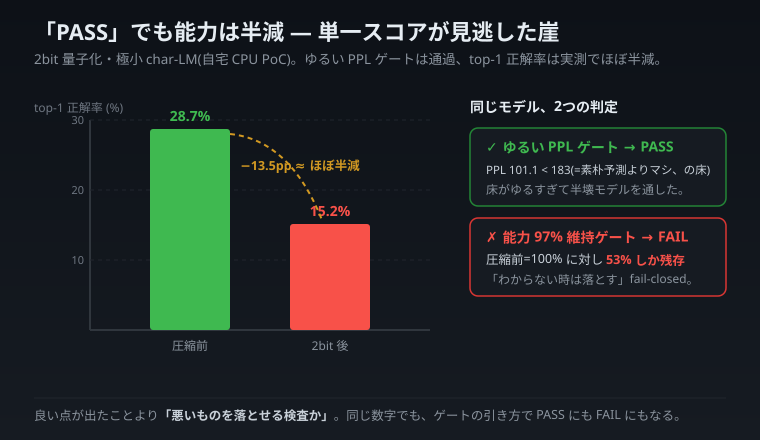

# 測り方を疑う — 単一スコアの罠と「超えた」の解剖学

> 連載「自宅 CPU から見た 2026 年 6 月の LLM 業界」第 1 部。

緑のチェックマークが出た。「このモデルは使える」とシステムは判定した。ところが同じモデルの「次の 1 文字をズバリ当てる正解率」を測ると、ほぼ半減していた。能力が崩れ落ちていたのに、検査は「合格」と言った——これが、本連載の出発点です。

このアークのテーマは派手な新手法ではありません。**「1 個の数字を信じすぎると、何を見落とすか」**——これを、まず自分の手元の失敗で正直に解剖し（第 I 部）、次に業界の「○○超え」ニュースが同じ穴をどう使っているかの分類学に広げ（第 II 部）、最後にその刃を自分自身へ向け直す（自己監査）。**測り方を疑う規律こそが、この連載全体の土台**です。だからこそ次のアークで、私たちは堂々と「負けを見せる」ことができる。

---

> **本連載の caveat（必ず先に読んでください）**
>
> 本連載の全 llcore 実測は、**自宅 CPU の極小モデル（0.81M〜130M パラメータの char-LM＝文字単位の言語モデル）PoC** であり、大手の実 LLM（12B〜64B）性能を直接反証・凌駕するものではありません。比較は**手法・思想・計測規律の次元**で行います。量子化の数値は footprint（メモリ使用量・常駐バイト数）= 実測ですが、**simulated quant（疑似量子化）であり、推論速度は一切未測**です。
>
> この但し書きを冒頭に置くのは、後半で大手モデルの公開スコアと「同じ構造の罠」として並べるからです。**数値の大小を比べているのではなく、評価のやり方の形（フォルム）を比べている**——この一点だけは、読み終わるまで握っておいてください。

---

## 第 I 部 — PPL が PASS でも、モデルは半分壊れていた

## 1. 発端：メモリ効率を追っていたら、別の崖が見えた

llcore（自宅 CPU で動かす超小型 LM の実験箱）で、いま追っている北極星は**メモリ効率**です。同じ賢さを、より少ないメモリで。その手段の王道が**量子化**——モデルの重みを fp32（32bit 浮動小数点）から、8bit / 4bit / 3bit / 2bit と、ビット幅を削って表現することです。

ビット幅を半分にすればメモリも概ね半分。footprint だけ見れば一直線に「お得」です。ですが当然、削りすぎれば精度は落ちる。**どこまで削ってよいか**を機械的に判定したい。そこで「品質ゲート」を設けました。

最初に置いたゲートはシンプルでした。

> **Perplexity（PPL）が、unigram ベースライン（語の出現頻度だけで予測する最弱モデル）の 0.85 倍を下回っていれば PASS。**

ここで連載を通して何度も出てくる **Perplexity（PPL）** を一度だけ丁寧に説明します。PPL は「モデルが次の単語にどれだけ驚いたか」を表す指標で、低いほど良い。直感的には「平均して何択で迷っているか」に近い。unigram の PPL は、文脈をまったく使わない最弱の予測者の数字なので、**それを大きく下回れない量子化モデルは『文脈を読む力を失った』**と見なして落とす——理屈は通っています。

このゲートに、各ビット幅の量子化モデルを通していきました。realp1 と呼んでいる 11.9M パラメータの char-LM が題材です。そして 2bit の番が来たとき、**事前の予想が外れました**。

---

## 2. 事前予想と、外れ方

実験前、私の頭の中にはこういう仮説がありました。

> 「PPL（平均的な驚き）はそこそこ保たれていても、**top-1 当たり率（最有力候補がドンピシャで当たる率）の方が先に崩れる**だろう。なぜなら PPL は分布全体のなだらかさを見るので鈍く、top-1 は『1 位が正解か』という鋭い判定だから、壊れが早く出るはずだ。」

ここで **top-1**（連載を通して使う、もう 1 つの基礎用語）を抑えておきます。top-1 当たり率は「モデルが一番自信を持って出した候補が、実際の正解とドンピシャで一致した割合」。10 文字に 3 文字近く当たっていた、というときの「3 文字近く」がこれです。

つまり私は「**PPL は無事そうに見えるのに top-1 は先に死ぬ**」——両者が**ズレる**ことを予想していました。もしそうなら「PPL ゲートは top-1 の劣化を隠す」というきれいな教訓記事が書けます。

結果はこうでした（realp1、fp32 を基準に各ビット幅を比較。**表示値は丸め、Δは実測の生値**）。

| ビット幅 | PPL | PPL の悪化 | top-1 当たり率 | top-1 の悪化(Δ) |
|---|---|---|---|---|
| fp32（基準） | 38.32 | — | 28.66% | — |
| 8bit | ほぼ同等 | わずか | ほぼ同等 | わずか |
| 4bit | やや悪化 | 小 | やや低下 | 小 |
| 3bit | 悪化 | 中 | 低下 | 中 |
| **2bit** | **101.114** | **+163.90%** | **15.21%** | **−13.46pp** |

> 脚注：丸め表示の 28.66% → 15.21% を手で引くと −13.45pp になりますが、表内の Δ = −13.46pp は**丸め前の実測生値**から算出しています。算術監査のために併記しておきます。

予想は外れました。**PPL と top-1 は、ズレなかった**。2bit では両方が同時に、足並みをそろえて崩れた——本記事ではこれを **lockstep（同時劣化）** と呼びます。PPL が +163.90% も悪化し、top-1 も 28.66% → 15.21% へほぼ半減。10 文字に 3 文字近く当てていたのが、1.5 文字しか当たらない。**片方だけが無事、という状況は起きなかった**のです。

ここで踏みとどまる必要があります。外れたのは「予想」であって、教訓が消えたわけではない。むしろ**外れた事実そのものが、この記事の主役**です。

---

## 3. では何が問題だったのか——主張を 2 行に絞る

「lockstep だったなら PPL ゲートで十分では？ top-1 も一緒に落ちるなら、PPL が落ちた時点で弾けるはずだ」——もっともな反論です。だからこそ、**何が実際に壊れたのか**を、誇張せずに正確に書きます。私の主張は次の 2 行だけです。

> **(1) 今回 PPL と top-1 は lockstep（同時劣化）であり、片方が先に死ぬという私の事前予想は外れた。**
> **(2) それでも 2bit は「品質ゲート」を PASS した。原因はゲートの閾値（0.85×）が粗すぎて、明らかに壊れた 2bit を通してしまったこと。**

数字で追います。unigram ベースラインの PPL は約 215。ゲートの合格ラインは **0.85 × 215 ≈ 183**。2bit の PPL は **101.114**。

**101.114 < 183。だから PASS。**

検査は嘘をついていません。設定どおり動いただけ。top-1 が半減していようが、ゲートは PPL という 1 本の物差ししか持っていません。その物差し上では「unigram より十分マシ」に見えてしまう。**lockstep で両方落ちていても、閾値が緩ければ、落ちきる前の中途半端な壊れ方を合格にしてしまう**——これが起きたことの全てです。

ここを取り違えないことが、この記事の honesty の核心です。私は **「PPL が原理的に capability（能力）を隠す」とは主張しません**。今回は隠していません。lockstep で一緒に落ちていました。問題は**指標の選択**ではなく**閾値の粗さ**でした。一般論に膨らませた瞬間、この記録は嘘になります。

PPL と top-1 は、そもそも**独立した別物ではありません**。どちらも同じ出力分布を別の角度から覗いているだけです。PPL は分布全体の「驚き」をならし、top-1 は「1 位が当たったか」を切り取る。**同じ景色の、引きの写真と寄りの写真**です。だから lockstep で動くこと自体は、よく考えれば不思議ではなかった。私の予想が雑だっただけです。



_同じモデル・同じ数字でも、ゲートの引き方ひとつで合否が反転する。_

---

## 4. 認知科学のレンズ：グッドハートの法則と construct validity

なぜ「1 個のスコアが PASS を出した」だけで、これほど警戒するのか。ここに本連載が繰り返し戻ってくる 3 つの概念があります。

### グッドハートの法則

経済学者チャールズ・グッドハート博士に由来する経験則です。平たく言えば——

> **「ある指標が目標（ターゲット）になった瞬間、その指標は良い指標であることをやめる。」**

元々は金融政策の話でした。中央銀行が「この通貨指標を制御すれば経済は安定する」と決めて指標を狙い始めると、人々の行動がその指標に最適化され、指標と実体の関係が壊れていく。**測っていたはずのものが、測れなくなる**。

量子化ゲートに引き写すと——「PPL が 183 を切れば合格」と決めた瞬間、私が本当に欲しかった**「モデルがちゃんと賢いか」**ではなく、**「PPL という数字が 183 を切るか」**だけが判定対象になる。今回は lockstep だったので破綻は浅くて済みましたが、構造としては**代理目標（proxy）に最適化した瞬間に、本来の目標から乖離しうる**という、まさにグッドハートの構図です。

### construct validity（構成概念妥当性）

心理測定の用語です。「測りたい抽象的なもの（構成概念 = construct）」と「実際に測っている操作的な指標」が、**ちゃんと対応しているか**を問う考え方。

- 測りたい construct：**モデルの言語能力**
- 実際の指標：**Perplexity 1 本**

PPL は言語能力の一側面を確かに捉えます。でも「次トークンを 1 位でドンピシャ当てる力」も、生成の体感品質も、構成概念の別の面です。**1 本の指標で construct 全体を代表させると、指標が拾わない面はノーチェックで通過する**。今回 top-1 は lockstep だったので一緒に落ちて目立ちましたが、もし別の壊れ方——たとえば「PPL は無事なのに特定構文だけ崩壊」——なら、PPL ゲートはそれを永遠に見ません。

### 代理目標の乖離 — 健康診断のたとえ

上の 2 つをひとことに縮めると、**「代理（proxy）で本物を測ったつもりになる」危うさ**です。

体重計だけで健康診断を済ませる、と想像してください。体重は健康の良い proxy です。でも**体重だけ正常で血圧が振り切れている人**を、体重計は健康と判定する。私の品質チェックも同じで、1 つの点数（体重計）だけを見て「合格」。その点数が拾わない面（能力の崩れ）は、ノーチェックで通過していた。

この比喩がどこで壊れるかも書いておきます。体重と血圧は**独立に動きうる**指標です。一方、今回の PPL と top-1 は——前述のとおり——**同じ出力分布を別角度から見ているだけで、独立ではありません**。だから健康診断の比喩は「複数の指標を見ろ」という教訓までは正しく運びますが、「PPL と top-1 は独立だから両方測れば安心」という方向に読むと**過剰**です。今回の本当の処方箋は「指標を増やす」ことそのものより、**閾値を厳しくし、しかも fp32 比という相対基準に変える**ことでした。次節に続きます。

---

## 5. 対策：retention 比の capability-gate を fail-closed で配線する

教訓を「気をつけよう」で終わらせると、必ず同じ崖から落ちます。なので**コードに落としました**。

新設したのは **capability-gate**。考え方はこうです。

- 旧ゲート：「PPL が unigram の 0.85 倍を切れば PASS」（**絶対 PPL の粗い閾値**）
- 新ゲート：「**fp32 比の top-1 retention が 97% 以上**でなければ FAIL」（**能力そのものの相対保持率**）

retention（保持率）は「量子化後の top-1 ÷ fp32 の top-1」。fp32 を満点 100% として、量子化で能力が何割残ったかを測ります。

2bit を当てはめると——top-1 は 28.66% → 15.21%。

> retention = 15.21 / 28.66 ≈ **53.1%**（= 約 **47%（46.9%）の能力喪失**）

閾値は 97%。**53% は 97% に遠く及ばないので FAIL**。新ゲートは 2bit をきっぱり落とします。旧ゲートが PASS させたものを、です。

実装の肝は **fail-closed** です（`src/llcore/lm/eval.py`）。`passes_capability_gate(min_retention=0.97)` は、retention が閾値**以上**（`>=`）のときだけ合格を返す。例外が出たとき・データが欠けたとき・比較対象（fp32 基準）が取れないとき——**判定不能はすべて FAIL に倒す**。「わからないものは通さない」を既定にする、という FullSense の MCP 系プロジェクトと共通の規律です。`held_out_top1_report` で held-out（学習に使っていない検証データ）上の top-1 を別途レポートし、teacher-forcing（正解を 1 文字ずつ与えながら次の 1 文字を当てさせる測り方）で測っています。

ここで設計上の判断を 1 つ明示しておきます。**新ゲートは PPL を捨てていません**。PPL ゲートは「文脈を読む基礎力があるか」の足切りとして残し、その上に「能力をどれだけ保持できたか」の retention ゲートを**重ねた**。1 本を別の 1 本に置き換えたのではなく、**測る面を増やしつつ、相対基準と厳しい閾値で締め直した**。グッドハート対策の定石どおりです。

> 再現に使ったもの：`scripts/quant_bitwidth_sweep.py`（8/4/3/2bit を順に量子化して評価）、出力は `out/quant_bitwidth_sweep*.json`、設計と数値の正本は `docs/MEMORY_EFFICIENCY_FINDINGS.md`。コード参照はすべて相対パスです。

健康診断の信頼は「全部正常でした」で決まるのではなく、「異常があったらちゃんと拾える設計か」で決まります。AI の品質チェックも同じ。**良い点が出たこと**より、**悪いものをちゃんと落とせる検査か**——これが第 I 部の核心です。

---

# 第 II 部 — 「proprietary 超え」の解剖学：cherry-pick 5 型

第 I 部では、自分のゲートが「単一スコア」の罠に落ちた具体例を解剖しました。同じ罠は、自宅の極小モデルだけのものではありません。**業界の「○○超え」ニュースが、まさにこの「1 個の数字で勝者を語る」形を使っている**——ここからは、その手口を 5 つの「型」に分類し、読者が自分で使えるチェックリストに変えます。

## 6. フック — 同じ見出しを 3 回見て、3 回とも内訳が違った

「OSS が大手を超えた」という見出しを、2026 年 6 月のひと月で 3 回見ました。Google の Gemma 4、NVIDIA の Cosmos 3、Baidu の PaddleOCR-VL。どれも本物のニュースで、どれも一次情報（公式ブログや arXiv 論文）が存在します。数字が捏造されているわけではありません。

ところが、3 回とも「超えた」の中身が違っていました。

- 1 回目は、**勝った軸だけ**を見出しに出していた（負けた軸は技報の奥のテーブルに、声を潜めて載っていた）。
- 2 回目は、**自分たちが得意な専用ベンチ**での首位だった（汎用能力の話ではなかった）。
- 3 回目は、**公式は「open なモデルの中で 1 位」としか言っていない**のに、二次メディアの見出しだけが「Gemini 超え」に育っていた。

派手な勝利は、決まって同じ 5 つの「型」のどれかで作られています。本記事は、その 5 型を **読者が自分で使える分類学（taxonomy、ものごとを型に分けて整理する道具立て）**として渡すことを目的とします。「数字を疑え」という根性論ではなく、「**どの型で勝利が演出されているかを当てる手順**」を持ち帰ってもらうのがゴールです。そして最後に、その 5 つの刃を、私自身の自宅 PoC である llcore に当て直します。批判は、鏡として自分に返ってこないと意味がないからです。

> ☕ ここで一度肩の力を抜いてください。これから出てくる数字は全部「実在する一次情報」です。悪役は誰もいません。問題は「数字」ではなく「数字に付いてくる主張の射程（どこまで言えるか）」のほうにあります。

> **規模差の内訳（1 行で正確に）**: 「約 15,000× の規模差」は、いちばん小さい char-LM（0.81M）と Gemma 4（11.95B）を比べたときの最大ギャップです。同じ PoC でも、後述する「RAM 超で回す」実証に使ったのは 130M モデルで、こちらは Gemma 比 約 92× にすぎません。**デモごとに規模差は違う**ので、「どのデモでも 15,000×」と読まないでください（最大ギャップだけを一律に当てるのは、それ自体が後述の型1 です）。

---

## 7. まず用語を 2 つだけ — この記事の土台

PPL や top-1 は第 I 部で説明したので、ここでは新しく必要になる 2 語だけ足します。**ベンチマーク**（モデルの能力を測る「共通テスト」。学校の模試に近いが、**誰が問題を作り、誰が採点したか**で結果の意味が大きく変わる）は直感でわかるとして——

**self-report（セルフレポート、自己申告）** — その数字を、**測定対象の本人（=モデルを作った会社）が自分で測って自分で発表した**状態。模試で言えば「自分で問題を作り、自分で解いて、自分で採点して、自分で『満点でした』と発表した」状態です。嘘とは限りません。が、第三者が同じ条件で測り直して確かめた（=再現した）わけでもない。**本記事に出てくる他社の数字は、明記しない限りすべて self-report です。** これは「だから信用するな」ではなく「**まだ再現待ちの段階だと札を貼っておこう**」という意味です。

**cherry-pick（チェリーピック、いいとこ取り）** — たくさんある結果の中から、**自分に都合のいいものだけを選んで見せる**こと。さくらんぼが一杯生っている木から、熟れた赤い実だけを摘むイメージです。重要なのは、**摘んだ実は本物**だということ。緑の実（=負けた軸）を見せていないだけ。だから cherry-pick は「嘘」ではなく「**主張の射程が、見出しが匂わせるより狭い**」という現象として捉えるのが正確です。

この「嘘ではなく射程が狭い」という線引きが、本記事を通底するトーンです。誰かを糾弾する記事ではありません。**数字の読み方の練習問題**です。

---

## 8. cherry-pick の 5 つの型（taxonomy）

ここからが本論です。2026 年 6 月の実例で、5 つの型を一つずつ解剖します。各型に「**検出シグナル（これを見たら疑う）**」を添えるので、読み終わったら自分のタイムラインに流れてくる「OSS が○○超え」に当ててみてください。

### 型1 — 負け軸の省略（Loss-Axis Omission）

**定義**: 複数の評価軸（カテゴリ）のうち、**勝った軸だけ**を前面に出し、負けた軸を伏せる（または技報の奥に小さく載せる）。

**実例: NVIDIA Cosmos 3**。Cosmos 3 は「Cosmos 3: Omnimodal World Models for Physical AI」（NVIDIA, 2026-06-01）として発表された、物理 AI 向けの大規模 world model です（技報・self-report・一次未照合=技報 PDF 未取得）。技報の Table 10 を見ると、Driving（自動運転）カテゴリで **79.3 vs Gemini 47.2** と大差で勝っています（技報時点・self-report・一次未照合）。これだけ見れば「Gemini を圧倒」です。

ところが、**同じ Table 10 は複数のカテゴリで構成されており**、別の行にはこう書いてあります（いずれも技報時点・self-report・一次未照合）。ここで「軸（=カテゴリ）」という言葉を使いますが、これは Table 10 の**評価カテゴリの数**を指します（後述する型4 の「ベンチの本数」とは別物なので、混同しないよう用語を分けます）。

| カテゴリ(軸) | Cosmos 3 | Gemini | 勝敗 |
|---|---|---|---|
| Driving(自動運転) | 79.3 | 47.2 | Cosmos の勝ち(大差) |
| Robotics(ロボティクス) | 57.8 | 58.2 | **Gemini の勝ち** |
| General(汎用) | 73.7 | 77.5 | **Gemini の勝ち** |
| SmartInfra(スマートインフラ) | 数値未取得 | 数値未取得 | **不明(要技報確認)** |

Table 10 は **4 カテゴリ（Driving / Robotics / General / SmartInfra）の category-average** で構成されています。私が一次の技報 PDF を取得できていない関係で、**SmartInfra の Cosmos / Gemini スコアは未取得**です——だからここは正直に空欄にしてあります（取得できないのに数字を埋めるのは、それこそ本記事が批判する作法です）。

判明している範囲で言えるのは、**Cosmos が勝っているのは Driving の 1 軸だけ、Robotics と General は Gemini に負け、SmartInfra は未取得で不明**ということです。つまり「Gemini 超え」という総括は、**4 カテゴリのうち判明している 3 つで 1 勝 2 敗、残り 1 つは不明**という像を、Driving 1 軸に圧縮したものです。

ここで自分への戒めを先に書いておきます。**私は今、まさに 4 軸目（SmartInfra）を「未取得」として空欄にしました。** 負け軸の省略を糾弾する記事が、4 つ目の軸を黙って落とせば、それは私自身が型1 を犯すことになる。だから「3 軸の話」に縮めず、**4 カテゴリあること・1 つは私の側の取得失敗で空欄であること**を明示します。

そして NVIDIA を擁護しておくと、**技報には（私が読めた範囲で）全カテゴリが載っています**。負けた数字を消してはいない。問題が大きく起きるのは主に二次拡散の側（後述の型5）で、技報そのものは誠実です。型1 は「悪意」より「要約の作法」の問題として捉えるべきです。要約は必ず情報を捨てるので、**何を捨てたかで主張の色が変わる**。

> **検出シグナル**: 「○○を超えた」の○○が単一タスク名・単一スコアのとき。複数カテゴリあるはずの能力（運転・操作・汎用・インフラ…）を 1 行に潰していたら、潰す前のテーブルを探しに行く。そしてテーブルの**カテゴリが全部見えているか**（誰かが——自分も含めて——伏せていないか）を数える。

### 型2 — 専用ベンチ（Bespoke-Benchmark）

**定義**: **自分が得意なタスクに特化したベンチ**での勝利を、あたかも汎用能力の勝利のように語る。

**実例: Baidu PaddleOCR-VL-1.6**（arXiv:2606.03264, Apache-2.0、arXiv ID は一次確認済み）。0.9B（NaViT 動的解像度エンコーダ + ERNIE-4.5-0.3B）という、わずか 9 億パラメータのモデルです。これが **OmniDocBench v1.6 で 96.33%**（self-report）を出し、「235B 級や Gemini を超えた」と語られました。0.9B が 235B を超えた——数字だけ見れば衝撃です。

でも、**OmniDocBench は「文書解析」専用のベンチ**です。スキャンした書類や PDF から、文字・表・レイアウトをどれだけ正確に読み取れるかを測ります。汎用的な「賢さ」ではなく、**文書を読むという 1 タスク**の点数です。しかも測ったのは Baidu 自身（self-report）。

これは「ズル」ではありません。文書解析に特化した 0.9B が、文書解析の専用ベンチで巨大汎用モデルを上回るのは、**むしろ専門特化の正しい成果**です。問題は数字ではなく、「**文書解析で勝った**」が「**Gemini を超えた**」に翻訳されるときに、射程がこっそり広がることです。100m 走で金メダルを取った選手を「世界最強のアスリート」と紹介するようなもので、100m は本当に世界一でも、マラソンや砲丸投げの話はしていない。

なお——第 I 部で見た私の PPL ゲートが「次トークンを 1 位で当てる力（top-1）」を見落としたのと同じく、**1 個の集約スコアは、その内訳のどこかが落ち込んでいても平均で覆い隠せてしまう**。OmniDocBench 96.33 は「文書解析を総合した平均的良さ」です。表組みの崩れ、特定言語の劣化、数式・縦書き・低解像度といった部分集合での弱さが、平均 96.33 の下でどう分布しているかは、1 つの数からは読めません（これは PaddleOCR を貶める話ではなく、むしろ self-report を明示する公式カードは誠実です）。**第 I 部の単一スコア問題が、規模を変えて再来している**わけです。

> **検出シグナル**: ベンチ名に対象タスクが書いてあるか（OmniDoc**Bench** = Doc=文書）。専用ベンチでの勝利が「汎用超え」に訳されていたら、そのベンチが何を測っているかを調べる。

### 型3 — 自前測定（Self-Measured / Home-Court）

**定義**: 比較に使った**全数値が、発表者自身の環境・自前ベンチで測られている**。第三者が同条件で再現していない。

これは型1・型2の土台にある、より根本的な型です。Cosmos 3 の Table 10 も、PaddleOCR の 96.33% も、**発表者（NVIDIA / Baidu）が自分の環境で測った self-report** です。相手モデル（Gemini など）を、**勝者側が自分のセットアップで走らせて採点している**ケースすらあります。

野球で言えば「**自分のホームグラウンドで、自分が審判をやった試合の結果**」です。ホームの利（球場の癖を知っている、観客が味方）も、審判の解釈も、全部こちら側にある。だからといって試合結果が偽物とは限りませんが、**中立球場・中立審判での再現**とは信頼度が一段違います。

ここで Gemma 4 の「26B 級に迫る」を取り上げると、**実は型3 の純粋な例にはなりません**。なぜなら、Gemma 4 の「26B 級」主張には、**一次情報に定量ベンチ表そのものが存在しない**からです（公式 blog の一般文で、比較相手の 26B が dense か MoE〔=一部のパラメータだけ動かす疎構成、active param は約 4B〕かも明示されていない）。つまりこれは「発表者が自前で測った数字」ですらなく、「**数字が提示されないまま一般文で強い主張がなされている**」状態です。だからこれは型3 というより、**型1（都合のいい比較相手の選び方を伏せる）や型5（一般文が見出しで断定に化ける）寄り**の例として扱うのが正確です——「自前測定の数値」と「そもそも数値が無い一般文」は別の問題なので、ここは分けておきます。

型3 が厄介なのは、**型1・型2より見えにくい**ことです。負け軸の省略（型1）は技報を読めば気づける。専用ベンチ（型2）はベンチ名で気づける。でも「これは self-report だ」は、明記されていないと見落とします。だからこそ、**デフォルトで「明記なき数字は self-report」と札を貼る**習慣が効きます。

> **検出シグナル**: 「誰が測ったか」が書いていない数字は、まず self-report と仮定する。第三者再現（独立した研究機関やコミュニティが同条件で測り直した）への言及があるかを探す。そして「強い主張なのに、そもそも定量ベンチ表が一次に無い」場合は、self-report 以前の問題として警戒する。

### 型4 — 母数が小さい（Small-N）

**定義**: 勝敗の根拠となる**標本（ベンチの本数・テスト項目の数）が少ない**。少ないほど順位はノイズで簡単に入れ替わり、少ないほど「言えること」が減る。

型1 で見た Cosmos の Driving 勝利（79.3 vs 47.2）を、もう一段深掘りします。**ここで言う「数」は、型1 の「カテゴリ（軸）の数」とは別物です。** 型1 では「Table 10 に 4 カテゴリある」という軸の数を数えました。型4 で数えるのは、**Driving という 1 カテゴリの中に、ベンチが何本あるか**です。そして Driving スコアは、**たった 3 本のベンチの平均**でした（技報時点・self-report・一次未照合）。

念のため明示します——この「3」は Table 10 の軸数（=4）ではなく、**Driving 1 軸を構成するベンチの本数**です。両方たまたま 1 桁の数なので混同されがちですが、「4 カテゴリある（型1）」と「Driving は 3 ベンチの平均（型4）」は指しているものが違います。

標本が 3 本しかないと何が起きるか。サイコロを 3 回振って全部 6 が出ても「このサイコロは 6 が出やすい」とは言えないのと同じで、**3 ベンチの平均は、たまたまの偏りを排除できません**。1 つのベンチがそのモデルにたまたま有利だっただけで、平均が大きく動きます。統計の言葉では「**分散（ばらつき）が大きく、信頼区間が広い**」状態です。

しかも、こういう小標本の主張では**分散や信頼区間そのものが報告されない**ことがほとんどです。平均値 79.3 だけが一人歩きする。本来は「79.3 ± いくつ」と幅を添えないと、47.2 との差が本物かまぐれかが判断できません。

ここでも「3 ベンチでは無価値」と切り捨てるのは行き過ぎです。**少数ベンチにも探索的な価値はあります**（新しいタスクの最初の手がかりとして）。主張すべきは「大標本こそ正義」ではなく、「**標本数と分散を開示せよ**」です。3 ベンチなら「3 ベンチの平均で、分散はこれくらい」と正直に書けばいい。

> **検出シグナル**: 「平均」「総合スコア」の裏にいくつの項目（ベンチ本数）があるかを数える。N（母数）が一桁なら、順位は容易に入れ替わると疑う。± が付いていない平均は、まず幅を疑う。「カテゴリ数」と「カテゴリ内のベンチ本数」を混同しない。

### 型5 — 二次情報の拡大解釈（Second-Hand Inflation）

**定義**: **公式の慎重な主張**が、二次メディア・SNS を経由するうちに**強い主張に膨張する**。発表者は限定していたのに、伝言ゲームで限定が外れる。

これが、本記事のフック「3 回とも内訳が違った」の正体に最も近い型です。

**実例: Cosmos 3 の「Gemini 超え」**。NVIDIA の公式 newsroom（プレスリリース）を読むと、慎重に「**open なモデルの中で 1 位**」という限定が付いています（self-report）。「全モデル中 1 位」でも「Gemini を超えた」でもない。**open（公開重み）モデル群の中での首位**、という射程の狭い主張です。

ところが、これが二次メディアやタイムラインに流れる過程で、「open 内 1 位」の **"open 内" がぽろりと落ちて**、「Gemini 超え」だけが残ります。発表者は限定していたのに、伝言ゲームで限定が剥がれる。Cosmos のライセンスが OpenMDW 1.1（OSI 承認の OSS ではない「open model」ライセンス）であることも、この文脈で重要です——そもそも「open の中で」という土俵設定自体に注釈が要るのです。

型5 が一番たちが悪いのは、**発表者に非がない**ことです。NVIDIA は正しく限定した。膨張させたのは受け手側。だから「NVIDIA が嘘をついた」と読むのは誤りで、正しくは「**一次情報に遡ると主張はもっと狭かった**」です。これは情報の流通構造の問題で、技術の問題ではありません。

> **検出シグナル**: 強い見出し（「Gemini 超え」）を見たら、**必ず一次情報（公式ブログ・論文・newsroom）に遡る**。一次の主張に付いている限定語（「open 内」「文書ベンチで」「特定タスクで」）が、見出しから消えていないかを照合する。

---

## 9. 5 型を 1 枚にまとめる

ここまでを、持ち帰り用のチェックリストに圧縮します。タイムラインに「OSS が○○超え」が流れてきたら、上から順に当ててみてください。

| 型 | 何をしているか | 検出シグナル | 2026-06 の実例 |
|---|---|---|---|
| 型1 負け軸省略 | 勝った軸(カテゴリ)だけ前面化 | 「超え」が単一スコア・単一タスク | Cosmos: Driving だけ出し Robotics/General(+SmartInfra)を伏せる |
| 型2 専用ベンチ | 得意タスク特化ベンチでの勝利を汎用勝利に | ベンチ名にタスクが入っている | PaddleOCR: OmniDoc**Bench** 96.33%(文書専用) |
| 型3 自前測定 | 全数値が発表者環境(または数値そのものが無い一般文) | 「誰が測ったか」が書いてない | Cosmos/PaddleOCR は self-report、Gemma「26B 級」は定量表すら一次に無い |
| 型4 母数小 | 標本(ベンチ本数)が少なく順位がノイズ | 平均の裏の N が一桁・± がない | Cosmos Driving は **3 ベンチ**の平均(カテゴリ数 4 とは別) |
| 型5 二次拡大解釈 | 公式の限定が伝言で剥がれる | 見出しが一次より強い | NVIDIA「open 内 1 位」→二次「Gemini 超え」 |

> 🎯 この 5 型は **排他的ではありません**。一つの「勝利」が型1+型3+型4 を同時に使っていることはごく普通です（Cosmos の Driving 勝利がまさにそれ）。だから「どの型か」を一つに絞るより、「**いくつ当てはまるか**」を数えるほうが実用的です。当てはまる型が多いほど、主張の射程は狭い。


*同じ 5 型を、他社の実例（中央）と llcore 自身（右）に並べて当てた一枚。批判は鏡として自分に返る。*

---

## 10. 比喩 — そして、その比喩が壊れる場所

5 型を一つの像にまとめる比喩として、**「スポーツの戦績ハイライト動画」**が便利です。

ハイライト動画は、選手の**決めたプレーだけ**を繋ぎます。空振りや凡退は映りません（型1）。しかもそのスポーツの中でも**得意な場面**が選ばれる（型2）。撮ったのは所属チームの広報（型3）。試合数が少なければ「絶好調」も偶然かもしれない（型4）。そして広報が「リーグ屈指の活躍」と添えたコメントが、ファンの間で「歴代最強」に育つ（型5）。**ハイライトの映像はどれも本物**です。捏造は一つもない。でも、それを見て「この選手は無敵だ」と思ったら、それは映像のせいではなく、**ハイライトという形式の性質**にやられたのです。

**この比喩が壊れる場所**も正直に言います。ハイライトは「意図的に良い場面を選んでいる」というニュアンスが強い。でも cherry-pick の 5 型は、**必ずしも作為的ではありません**。型5（二次拡大解釈）は発表者に作為がなく、受け手側で勝手に膨張します。型1 も、技報には全カテゴリ載っているのに要約で落ちるだけで、悪意とは限らない。だから「ハイライト動画=ズルい広報」という連想を強く持ちすぎると、**「企業が意図的に騙している」という陰謀論寄りの読み**に滑ります。実際の多くは、**要約と伝言という、情報処理の不可避な副作用**です。比喩は「形式が射程を狭める」という骨格を運ぶのには良いが、「**作為の有無**」までは運べない——ここで降りてください。

> ☕ 休憩ポイント。ここまでが「他人のベンチを読む道具」です。次の章から、この 5 本の刃を**自分に突き立てます**。ここが本記事の本番であり、FullSense の運用規律 `feedback_benchmark_honest_disclosure`（異常に良い結果が出たら、勝った気になる前に必ず内訳を疑う）を最も強く具現する部分です。

---

# 自己監査 — 同じ 5 型を、llcore 自身に当て直す

私は自宅の GPU なし PC で、llcore という極小モデルの実験群を走らせています。北極星は「賢さ」ではなく「メモリ効率」。その実測値で、私はいくつかの主張をしています。たとえば「int8 量子化で約 3.9× 圧縮」「使える RAM がモデルより小さくても回る」。

他社のベンチを 5 型で解剖した以上、**自分の主張にも同じ 5 本の刃を入れる**のが筋です。当てなければ、この記事はただのブーメランになります。

### 型3（自前測定）に対して — そもそも全部 self-report、しかも極小

最初に最も重い一撃から。**llcore の数値は、すべて私が自宅 CPU で測った self-report です。** 第三者再現どころか、対象は **tiny char-LM（0.81M〜130M パラメータ）の CPU PoC**。Gemma 4 が 11.95B（約 120 億）であることを思えば、最小モデル（0.81M）との比は **およそ 15,000 分の 1**。ただし——これも正直に分けますが——後述の「RAM 超で回す」実証に使ったのは 130M モデルで、こちらは Gemma 比 **約 92 分の 1** です。**「llcore はどれも 15,000 分の 1」と一律に書くと、130M デモには過大な（=自分に厳しすぎて、しかも不正確な）規模差を当てることになる**ので、デモごとに分けて書きます。いずれにせよ、他社の self-report を「再現待ち」と札を貼ったなら、自分の self-report には**もっと太い札**を貼らねば不公平です。だから llcore の主張は「実 LLM を超えた」では一切なく、「**手法・思想・計測規律のレベルで何が言えるか**」に限定します（これが連載 caveat の意味です）。

### 型1（負け軸省略）に対して — 「int8 で 3.9×」は基準を黙ると盛れる

私は「int8 weight-only 量子化で約 3.9× 圧縮（74〜75% 削減）、PPL 劣化 0.1% 未満」を実測しています（3 モデルで一貫、`src/llcore/lm/quant.py`）。数字は本物です。でも、**この「約 3.9×」は fp32（32bit 浮動小数点）を基準にしたときの値です**。

業界標準の量子化ツール（llama.cpp / GGUF）の慣習的な基準は **fp16（16bit）**です。fp16 を基準にすると、int8（8bit）は **約 1.9×** にしかなりません（GGUF の Q8_0=8.50 bpw は fp16 比 約 1.88×、fp32 比 約 3.76×）。だから「3.9×」と書くときに **fp32 比だと明記しないと、暗黙に有利な基準を選んで盛っている**ことになる。仮に切りよく「約 4×」と丸めて基準を黙れば、それは私自身がやりかねない**型1（都合のいい基準軸だけ見せる）**そのものです。だから本文でも表でも、ヘッドラインの数字を**「約 3.9×（fp32 基準）」に統一**し、fp16 基準なら 1.9× だと必ず併記することを自分の規律にしています。

### 型2（専用ベンチ）/ 型4（母数小）に対して — char-LM という超ニッチ、極小コーパス

他社を「文書専用ベンチで測った（型2）」と批判するなら、私の測定対象である **char-LM（文字単位の言語モデル）も、極めて特殊なニッチ**だと認めねばなりません。実 LLM の評価系（MMLU や HellaSwag のような汎用ベンチ）とは、規模も指標も別世界です。私の「PPL が下がった」は、**この極小・特殊な土俵での話**であって、汎用能力の話ではない。

母数（型4）も正直に。llcore のコーパスは小規模で、量子化スイープも限られたモデル数（0.81M / 1.36M / 11.9M / 130M）での観測です。「大モデルほど低ビットに頑健」という傾向は literature（Dettmers 博士ら（2023）等）と方向が一致しますが、**最大 11.9M での観測**であって、12B〜64B への外挿は保証できません。傾きの方向は文献整合、絶対値は未保証——これを本文に太字で書くのが私の型4 対策です。

### 型5（二次拡大解釈）に対して — 自分が膨張の発生源にならないために

最も注意すべきは、**私自身が型5 の「発生源」になりうる**ことです。たとえば「使える RAM がモデルより小さくても回る」という主張。これは実測です（fp32 522MB のモデルを、working-set 上限 358MB=モデルの 68% で forward 完走、出力の checksum 完全一致 -215.1。このデモのモデルは 130M=Gemma 比 約 92×）。

でも、**私のマシンは実装上 avail RAM が限られていた（実行時 約 3.6GB）**ため、実証したのは「**物理 RAM 総量を literally 超える巨大モデル**」ではなく、「**working-set 上限 < モデルサイズ**」という、同じ性質を持つ条件下での話です。ここで私が「RAM を超えるモデルが回った！」と限定を外して書けば、それは自分で **型5（限定の剥がれ）**をやることになる。だから JSON 出力に `cap_set_ok`（上限の強制に成功したか）と実測 peak をそのまま残し、成功を偽装しない。**自分の主張に、自分で限定語を貼り続ける**——これが発生源にならないための唯一の方法です。

### もう 2 つ、自分から差し出す負け

5 型の刃だけでなく、聞かれる前に自分から開示しておきます（これも honest disclosure の作法です）。

- **速度は一切測っていない**。llcore の量子化は **simulated quant（疑似量子化）**——保存した int8 を、推論時に fp32 に戻して計算しています。つまり「メモリは小さくなった（footprint=実測）」が、「速くなった」とは**一度も言えていない**（速度未測）。「2bit / int8 で速くなった」という誤読を構造的に防ぐため、これは caveat バナーにも書いた最重要の留保です。
- **2bit は、最善を尽くしても自前の品質ゲートを越えられなかった**。量子化を学習に織り込む QAT（学習時量子化）を実装しても、2bit の top-1 retention は **82.9%**。これは PTQ（学習後量子化）の RTN 22% / GPTQ 33% を大きく上回る前進ですが、第 I 部で新設した strict ゲート（fp32 比 97% 保持）には**届きませんでした**。これは隠したい負けですが、隠せば型1 そのものです。

---

## 11. 信頼の梯子 — self-report は最下段ではないが、最上段でもない

5 型を貫く一本の軸として、私は「**信頼の梯子（ladder of trust）**」という整理を使っています。数字を見たとき、それが梯子のどの段にいるかを当てる習慣です。

```
段4  独立査読   ← 第三者が査読論文として検証(最も信頼できる)
   ↑
段3  第三者再現  ← 別の人が同条件で測り直して一致した
   ↑
段2  self-report ← 本人が測って本人が発表した(再現待ち)
   ↑
段1  実在確認   ← その数字・その論文が実在することだけは確かめた
```

身近に言い換えると——いちばん下が**本人の自己採点**（模試を自分で作って自分で採点した状態）。その上が、**友達が同じ問題を解き直して同じ点になった**段。さらに上が、**公式の模試で第三者が採点した**段。いちばん上が、**専門家がきちんと査読した**段です。

大事なのは、**self-report（段2）は「嘘」ではない**ということです。段1（実在すらしない=捏造）よりは上です。**問題は「段2 を段3・段4 のように扱ってしまう」誤読**です。「本人が言っている」を「みんなが確かめた」と読み替えた瞬間に、梯子を 2 段飛ばしている。

ここで、本記事自身の「段1（実在確認）」の内訳を、ごまかさずに開示します——honest disclosure を看板に掲げる以上、自分の検証主張に偽の段を作ってはいけないからです。

- **PaddleOCR-VL-1.6（arXiv:2606.03264）**: arXiv ID を一次で確認済み（confirmed）。
- **Gemma 4 12B**: 公式 blog / HF model card を一次で確認済み（ただし「26B 級」は定量ベンチ表が一次に無い一般文）。
- **NVIDIA Cosmos 3（arXiv:2606.02800）**: arXiv ID の**実在は投稿時点で確認済み**（arXiv 上に「Cosmos 3: Omnimodal World Models for Physical AI」が存在）。**ただし、技報 PDF 本体は私の手元で取得できておらず、Table 10 の各スコア（79.3 / 47.2 / 57.8 / 58.2 / 73.7 / 77.5、SmartInfra は未取得）は二次情報依拠=一次未照合です。** 数字が実在することと、私がその数字を一次で目視照合したことは別の段なので、後者を主張してはいけません。Cosmos の数値はすべて「技報時点・self-report・一次未照合」の三重の札付きで読んでください。

つまり、他社数値の段は一律ではありません。**ID の実在（段1 の一部）まで届いた数字と、一次の数表まで自分で照合できた数字は、別の確かさを持つ**。それを「すべて照合済み」と一括りに書けば、それ自体が——本記事が型3 で警戒した——「検証していないのに検証したかのように見せる」行為になります。

そして llcore も、まったく同じ段2 にいます。私の数値も実在確認（段1）は済んでいる（JSON も再現スクリプトも公開意図）が、**第三者再現（段3）も独立査読（段4）も、まだ受けていません**。だから他社と llcore は、信頼の梯子の上では**同じ段**に立っている。違うのは規模（最小で 15,000×、RAM デモで 92×）と、「**自分で限定語を貼り続けているか**」という姿勢だけです。

「自分の数字は正しくて他社は怪しい」ではないのです。**全員が段2 にいて、全員が段3 を目指すべき**。その自覚があるかどうかが、本アークで言いたかった核心です。

---

## 12. このアークの着地 — 計測規律が連載の土台、だから次は「負けを見せる」

cherry-pick の 5 型（負け軸省略・専用ベンチ・自前測定・母数小・二次拡大解釈）は、他人を糾弾するための武器ではありません。**自分の主張が、見出しが匂わせるより狭い射程しか持っていないことに、自分で気づくための鏡**です。

私は第 I 部で、自分のゆるい PPL ゲートが半壊した 2bit に合格証を出す瞬間を解剖し、第 II 部で他社のベンチを 5 型で解剖し、その同じ 5 本の刃を llcore に当て直しました。その過程で、自分自身が 4 軸目（SmartInfra）を空欄にし、規模差を一律 15,000× と書きかけ、「約 4×」と丸めかけました——いずれも、止めなければ本記事が批判したはずの型を私自身が踏むところでした。結論はこうです——**llcore は他社より誠実な数字を出しているのではなく、他社と同じ段2（self-report）に、最小で 15,000 分の 1（RAM デモでは 92 分の 1）の規模で立っている**。違いは「自分で限定語を貼り続けているか」だけ。それすら、貼り忘れた瞬間に型5 の発生源になります。

だから、このアークから持ち帰る教訓を一つだけ挙げるとすれば、これです。

> **派手な勝利を見たら、まず一次情報に遡って 5 型を当てる。そして次に、自分の主張に同じ 5 型を当てる。前者だけやって後者を忘れると、批判はブーメランになって自分の射程の狭さを照らす。**

異常に良い結果が出たら、勝った気になる前に内訳を疑う。それは他人の数字に対してだけでなく、**何よりまず自分の数字に対して**——というのが、自宅 CPU の極小モデルから見えた、2026 年 6 月の景色でした。

そしてこの**計測規律こそが、連載全体の土台**です。測り方を疑い、単一スコアの罠を知り、自分の数字に自分で限定語を貼れるようになって初めて、私たちは堂々と「負けを見せる」ことができる。だから次のアークでは、勝った話ではなく、**自分が越えられなかった崖そのもの**を正面から展示します。

---

### 一次情報（本アークの数値の出典）

**検証の段は数字ごとに違うので、一括りに「照合済み」とは書きません。** 他社数値はすべて self-report（信頼の梯子・段2）。

- **NVIDIA Cosmos 3**: 「Cosmos 3: Omnimodal World Models for Physical AI」（NVIDIA, 2026-06-01, arXiv:2606.02800）。**arXiv ID の実在は投稿時点で確認済み。ただし技報 PDF 本体は未取得=数値は一次未照合（二次情報依拠）。** 技報 Table 10 は 4 カテゴリ（Driving / Robotics / General / SmartInfra）の category-average（技報時点・self-report・一次未照合）：Driving 79.3 vs Gemini 47.2 / Robotics 57.8 vs 58.2 / General 73.7 vs 77.5 / **SmartInfra は数値未取得（要技報確認）**。Driving は **3 ベンチの平均**（=型4 の母数小。Table 10 のカテゴリ数 4 とは別の数）。公式 newsroom は「open models 内 1 位」限定。ライセンス OpenMDW 1.1（OSI 承認 OSS ではない open model ライセンス）。
- **Baidu PaddleOCR-VL-1.6**: arXiv:2606.03264, Apache-2.0（arXiv ID 一次確認済み）。0.9B（NaViT + ERNIE-4.5-0.3B）。OmniDocBench v1.6 = 96.33%（文書解析専用ベンチ・Baidu 自前測定・self-report）。
- **Google Gemma 4 12B**: Apache 2.0、dense 11.95B（公式 blog / HF model card 一次確認済み）。「26B 級に迫る」は**定量ベンチ表が一次に無い一般文**で、数値そのものが提示されていない・比較相手の 26B は dense か MoE（active~4B）か未確定（=apples-to-oranges）。self-report 以前に数表が無い点に注意。
- **llama.cpp / GGUF**: Q8_0 = 8.50 bpw ≈ fp16 比 1.88× / fp32 比 3.76×（公式 quantize README・k-quants PR #1684、一次確認済み）。

### llcore 側の数値の出典（すべて自宅 CPU・char-LM・self-report）

正本 = `docs/MEMORY_EFFICIENCY_FINDINGS.md` / `docs/POSITIONING_VS_LLAMACPP.md`。評価実装 = `src/llcore/lm/eval.py`、量子化 = `src/llcore/lm/quant.py`、再現 = `scripts/quant_bitwidth_sweep.py` → `out/quant_bitwidth_sweep*.json`。

- 量子化ビット幅スイープ（realp1, 11.9M char-LM）: fp32 基準 PPL 38.32 / top-1 28.66%。2bit で PPL 101.114（+163.90%）・top-1 15.21%（−13.46pp、retention ≈ 53.1%、能力喪失 約 47%）。旧 PPL ゲート（0.85 × unigram 約 215 ≈ 183）は PASS、新 capability-gate（fp32 比 top-1 retention ≥ 97%, fail-closed）は FAIL。
- int8 weight-only 量子化: 重み常駐 **約 3.9×（74〜75% 削減、fp32 基準。fp16 基準なら約 1.9×）**・held-out PPL 劣化 0.1% 未満（3 モデル一貫）。
- int8 streaming-dequant 推論: 常駐モデル 72% 削減（dense fp32 約 539MB → stream int8 約 149MB）。`src/llcore/lm/eval.py` 経路。
- working-set 上限実証（モデル 130M=Gemma 比 約 92×）: fp32 522MB モデルを WS 上限 358MB（モデルの 68%）で forward 完走、capped/uncapped の logits checksum 完全一致（-215.1）。`cap_set_ok=true` は本環境結果。
- 2bit QAT capstone: top-1 retention 82.9%（strict cap-gate 97% 未達）。PTQ RTN 22% / GPTQ 33% を大きく上回るが、極小モデルでは 2bit 完全制覇に至らず。
- capability-gate: fp32 比 top-1 retention ≥ 97% を fail-closed で適用（`src/llcore/lm/eval.py`）。8B 級での通過は未実証。
- 全数値: tiny char-LM（0.81M〜130M）・CPU・simulated quant（**推論速度は未測**）。実 LLM（12B〜64B）との規模差は、最小モデルで 約 15,000×・RAM 超実証の 130M モデルで 約 92×。

> 運用規律: `feedback_benchmark_honest_disclosure`（異常に良い結果が出たら、勝った気になる前に必ず内訳を疑う）。本アークはこの規律の実演として書かれている。
