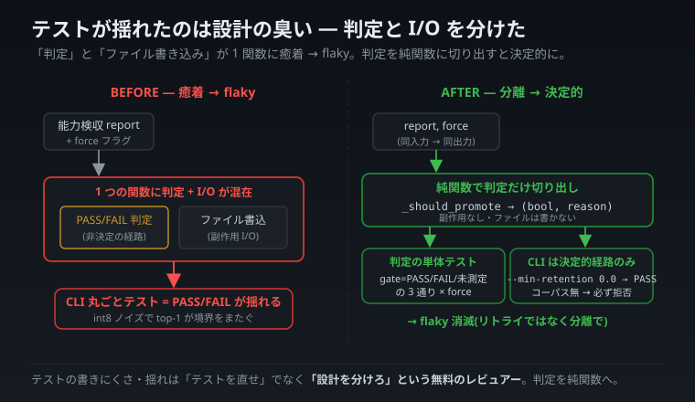

# テストが flaky なのは、テストのせいではなく設計のサインだった — 判定と入出力を分けた話

> **本連載の全 llcore 実測は、自宅 CPU の極小モデル PoC であり、大手の実 LLM の性能を直接反証・凌駕するものではない。本記事は普遍的なソフトウェア設計の小さな教訓で、特定モデルの優劣の話ではない。**

連載「自宅 CPU から見た 2026 年 6 月の LLM 業界」アーキテクチャ編の小ネタ。今回は AI 固有の話というより、**「テストの書きにくさが、設計の臭いを教えてくれた」**という普遍的なエンジニアリングの一場面です。

---

## 0. やりたかったこと

「**能力検収(cap-gate)に PASS したときだけ、量子化済みモデルを保存する**」という昇格ゲートを TDD(テスト駆動)で書こうとしました。仕様はシンプル: gate が PASS → 書く、FAIL → 書かない。

ところが、テストが **flaky(実行のたびに結果が揺れる)**になりました。

---

## 1. なぜ揺れたか

原因は、テスト対象に使った**未学習(ランダム初期化)モデル**でした。

ランダムモデルの「次トークン予測」はほぼ一様分布です。そこへ int8 量子化のわずかなノイズが乗ると、top-1(最有力候補)が**境界をまたいで入れ替わる**。結果、retention(能力維持率)が合格ラインの上下をフラフラし、**「PASS のとき書く」を CLI 経由で丸ごとテストすると、PASS/FAIL が実行ごとに変わってしまう**。

ここで「テストにリトライを入れて誤魔化す」のは悪手です。flaky は、たいてい**テストの問題ではなく設計の問題**だからです。

---

## 2. TDD の格言 — 「テストしにくい = 設計が不明瞭」

テスト駆動開発に、こういう経験則があります。

> **テストが書きにくいときは、テストが悪いのではなく、設計が不明瞭か、結合が強すぎる。**

このレンズで自分のコードを見ると、原因が見えました。**「昇格するか否かの判定ロジック」と「ファイルを書くという入出力(I/O)」が、1 つの関数に混ざっていた**のです。判定と I/O が癒着しているから、判定だけを単体で確かめられず、毎回 I/O 込みの非決定的な経路を通すしかなかった。

テストの難しさは、「この 2 つは分けるべきだ」という**設計の臭い**を教えていたのです。

---

## 3. 直し方 — 判定を純関数に切り出す

そこで、判定だけを**純関数**(同じ入力なら必ず同じ出力を返し、副作用が無い関数)に切り出しました。

```
_should_promote(report, force) -> (bool, reason)
```

`report`(能力検収の結果)と `force`(強制フラグ)を渡すと、「昇格すべきか」と「その理由」を返すだけ。ファイルは書かない。すると —

- **判定ロジック**は、手作りの検収結果(gate = PASS / FAIL / 未測定 の 3 通り × force 有無)を渡して、**決定的に**テストできる。
- **CLI 統合テスト**は、非決定性を避けて**決定的な経路だけ**に限定する(「retention 下限を 0.0 にして必ず PASS」「コーパス未指定で必ず拒否」)。

flaky は消えました。テストにリトライを足したのではなく、**判定と I/O を分離した**から。



_判定と I/O の癒着(左)を、判定の純関数化で分離(右)した前後比較。_

---

## 4. 教訓 — flaky を「テストの不運」で片付けない

flaky なテストを見ると、つい「環境のせい」「たまたま」と片付けたくなります。でも多くの場合、それは**設計が何かを混ぜているサイン**です。

> テストが書きにくい・揺れる ——
> それは「テストを直せ」ではなく「**設計を分けろ**」という信号。

今回は「判定」と「入出力」が癒着していた。分離したら、テストは決定的になり、コードも読みやすくなった。**テストの難しさは、設計の改善ポイントを指し示す無料のレビュアー**です。AI の小さなツールづくりでも、この古典的な原則はそのまま効きました。

---

_技術注記:`src/llcore/memory.py` の `_should_promote`(純関数)。`tests/unit/test_memory_facade.py` で `_should_promote` を gate True/False/None × force の組で決定的に単体テスト、CLI 統合は決定的経路(`--min-retention 0.0` で必ず PASS / コーパス無で必ず拒否)のみ。原則は test-driven-development の「test hard = design unclear / coupling too strong」。_
