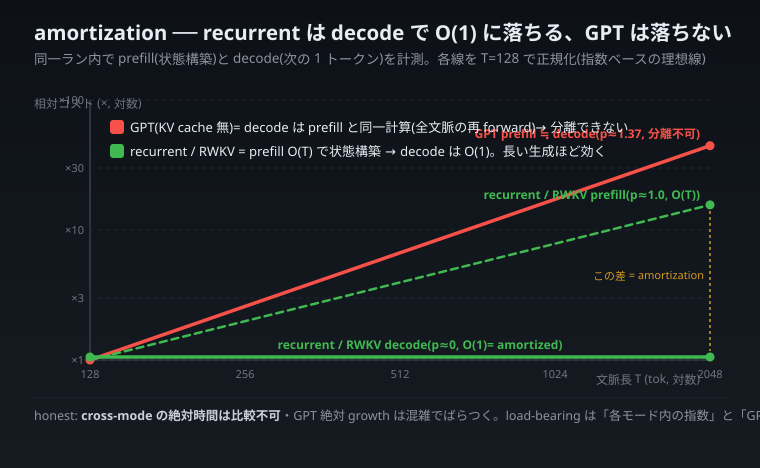

# 制御理論はとっくに「定数状態で過去を運ぶ」を解いていた — RWKV/Mamba を状態空間モデルとして読み直す

> 連載「自宅 CPU から見た 2026 年 6 月の LLM 業界」クロスドメイン編。
> 本記事は **1 本の橋(状態空間モデル / SSM)だけ**を渡します。複数の異分野アナロジーを束ねず、
> 「Transformer のメモリが文脈長で膨らみ、RWKV/Mamba は膨らまない」という自分の実機計測を、
> 60 年前の制御工学の語彙で読み直します。橋が **どこで折れるか** も同じ重さで書きます。

---

> **【連載共通の但し書き(全記事トップに固定)】**
> 本連載の全 llcore 実測は **自宅 CPU の極小モデル(0.81M〜130M パラメータの char-LM)PoC** であり、
> 大手の実 LLM(12B〜64B)の性能を直接反証・凌駕するものではありません。比較は **手法・思想・計測規律**
> の次元で行います。量子化の数値は footprint(占有バイト)= 実測ですが、**simulated quant = 推論速度は未測**です。
>
> 本記事に出てくる「×1.00」「×2.65」などはすべて **char-LM(0.81M〜130M)の CPU 実測**です。RWKV/Mamba を
> **状態空間モデルとして読む**のは literature 上正統な接続(後述)ですが、**「制御理論が解いたのだから
> recurrent が Transformer に勝つ」とは言いません**。むしろ「メモリ軸では構造的に勝つが、capability
> (賢さ)軸では recurrent が Transformer に劣る可能性がある」ことを、llcore 自身の null 結果として
> 後半に正直に書きます。

---

## 0. フック — 私の計測値が、60 年前の教科書に載っていた

ある晩、自宅の GPU なし PC で、こんな実験をしていました。

「文脈長 T(モデルが一度に見るトークン数)を 256 から 2048 へ、8 倍に伸ばしたら、推論中のメモリ実使用量(peak working set / 物理 RAM に実際に載っているページ量のピーク)はどう変わるか?」

別プロセスに隔離して、OS が報告する実 RSS(Resident Set Size)を測りました。結果はこうです。

| 文脈長 T | GPT(Transformer)peak WS | Recurrent peak WS | RWKV peak WS |
|---|---|---|---|
| 256 | 229.8 MB | 205.0 MB | 215.3 MB |
| 512 | 247.3 MB | 205.1 MB | 216.0 MB |
| 1024 | 330.5 MB | 204.8 MB | 215.7 MB |
| 2048 | **607.9 MB** | 204.8 MB | 215.2 MB |

(`scripts/recurrent_runtime_rss.py` / `out/recurrent_runtime_rss.json`。Windows 11 / Python 3.11 / torch 2.12.0+cpu。)

文脈を 8 倍にすると、**Transformer は peak が ×2.65 に膨らみ、Recurrent と RWKV は ×1.00、つまり平坦**でした。固定の baseline(~205MB = torch ランタイム + 重み)を引くと、Transformer の「文脈に依存して増えるコスト」だけが ~25MB → ~403MB と **超線形**に伸びていきます(1024→2048 だけで +277MB)。

> **再現性(別ランで裏取り):** この表の 256/512/1024/2048 は、後日の独立ラン(`out/recurrent_runtime_rss_curve32.json`、230.7 / 247.7 / 331.8 / 607.9 MB)と **~1MB 差で一致**しました。さらにレンジを 128→4096(×32)へ広げると、Transformer の膨張率は **計測の起点で激変**します——128→512 では ×1.11(固定重み床が支配)、512→4096 では ×6.75(二次項が顕在化)。「×2.65」は「8 倍」という特定レンジの値であり、点でなく曲線で読むべきこと、その全体像は [a8](a8-context-memory-blowup.md) に。

> **計測の honest 留保(項分解はしていない):** この「超線形」を「二次項 O(T²) が大きな T で支配し始めた」と
> 読むのは、**KV キャッシュが線形・attention 行列が二次という解析モデルからの解釈**です。私が測ったのは
> プロセスの **合算 peak RSS だけ**であり、その増分を「KV 線形分」と「attention 二次分」と「中間バッファ分」に
> **項分解して実測したわけではありません**。観測事実は「Transformer の文脈依存コストが超線形に伸びた」までで、
> 「その超線形が二次項の顕在化である」は解析モデルに基づく解釈である、と区別しておきます。

> **compute 軸でも裏取り(メモリと同じ向きが時間にも出る):** メモリだけでなく **推論にかかる時間**も同じ T 掃引で測りました(`scripts/recurrent_latency_sweep.py` / `out/recurrent_latency_sweep.json`、各点 11 回測定、`torch.set_num_threads(1)`)。T を 128→2048(×16)に伸ばしたときの **scaling 指数 p**(time ∝ Tᵖ を log-log 最小二乗で推定。混雑に強い min ベース)は、**GPT が p≈1.37(明確に超線形、O(T²) 寄り、×16 文脈で ×45.6)/ Recurrent が p≈1.00 / RWKV が p≈0.99(どちらもほぼ線形、O(T)、×16)**。メモリで見えた「Transformer は文脈で膨らむ / recurrent・RWKV は構造的に軽い」が、**時間軸でも同じ向き**で再現しました(数値は最終的に**メモリ圧の無いクリーンな runner**で取り直し、ローカル 3.6GB 機の contention スパイクを排除した単調な曲線)。
>
> ただし honest 留保。**cross-mode の絶対 ms は比較してはいけない。** recurrent/RWKV はここでは **Python の per-step ループ**(T 回の関数呼び出し)で測っており、インタプリタ呼び出しオーバーヘッドが支配的——「recurrent の方が速い/遅い」を絶対値で語るのは無意味で、読むのは **各モード内の伸び方(scaling 指数)だけ**。なお当初 repeats=7 では RWKV の T=128 が startup ノイズで外れ値になり傾きが汚れた(p≈0.5)が、**repeats=11 に増やすと RWKV も p≈0.99 に収束**——ノイズだった点を消さず、増やして潰した経緯ごと残します。なお本計測は**メモリ圧のかからない小モデル**(最大でも attention 行列 ~134MB ≪ 3.6GB)で行っており、計時は安定領域にあります。別実験で 130M 級モデルの forward を測ると RAM 圧の page-fault に飲まれて倍率が ×0.2〜×11 まで暴れた(=同じ指標でも環境が結論を動かす)ので、ここで指数を load-bearing にできるのは「圧力のない regime で測ったから」です。


> 各モードを自分の T=128 で正規化しているので、見るのは「上がり方の急さ」だけ。GPT だけが理想線形(p=1 の破線)から上に外れる=超線形。recurrent と RWKV はほぼ重なって破線に沿う=線形。

> **さらに鋭い軸 ── decode(1 トークンずつ生成する時間)と amortization:** ここまでは「長さ T を **まとめて 1 回** forward する」prefill/batch のコストでした。でもチャットの体感遅延を支配するのは、**既に T トークンの文脈がある状態で、次の 1 トークンを出す** decode のコストです。今回はその核心を**1 ラン内で airtight に**測りました ── 同じプロセス・同じモデル・同じ条件で、**prefill(状態を作る/全文脈を読む)と decode(次の 1 トークン)を両方**計時(`scripts/decode_latency_sweep.py` / `out/decode_latency_sweep.json`、別ラン比較を避けるため。**計測はメモリ圧の無いクリーンな runner**(GitHub Actions 7GB、ローカル 3.6GB 機の contention を排除)で実施)。実測(n_embd=256/L4, T=128→2048・×16)はこうです:**Recurrent と RWKV は prefill では O(T) で伸びる(×15.6 / ×17.5、指数 p≈1.0)のに、decode では平坦 O(1) に落ちる(×0.98 / ×1.10、p≈-0.002 / 0.03)**。一方 **GPT は prefill と decode がどの T でもほぼ一致**(各 T で prefill≈decode、例:99≈96ms / 958≈957ms)し、両方とも **同じ指数 p≈1.37 で増える**。この **GPT の decode 指数(1.365)が prefill 指数(1.372)とぴたり一致する**ことが、「cache 無し GPT の decode は prefill と同一計算」の何よりの裏付けです。
>
> 
>
> **核心は recurrent の amortization です。** recurrent は「文脈を作る(prefill, T 個のトークンで状態を T 回更新=O(T))」と「作った状態に 1 手足す(decode, O(1))」を**分けて払える**。長い生成では prefill は最初の一度きりで、その後の毎トークンは O(1) ── これが streaming の体感を決めます。GPT(cache 無)はこの分離ができず、**decode の 1 step が結局 prefill と同じ「全文脈の再 forward」**になる。だから実測でも GPT は prefill≈decode(同じ計算なので当然そうなる)。**同じ 1 ランで測ったので、この「recurrent だけ O(T)→O(1) に落ち、GPT は落ちない」が別ラン比較でなく直接の対比として出ています。** これが decode 軸の核心です。
>
> **honest 留保:** (1) prefill と同じく **cross-mode の絶対 ms は比較不可**(recurrent/RWKV は Python per-step ループ計測)。読むのは各モード内の傾きと、同一モード内の prefill vs decode の対比だけ。(2) **この GPT は KV cache を持ちません**。production の LLM serving は KV cache で decode を O(T)/token に落としますが、**cache を入れても GPT の decode は T とともに増え続け、recurrent の O(1) 平坦とは質的に別物**です。(3) 以前ローカルの 3.6GB 機で測ったときは system 混雑(T=1024 のスパイク等)で GPT の絶対 growth が暴れたが、**クリーンな runner で測り直して単調・再現的な曲線になった**(GPT prefill ×45.6 / decode ×44.5)。それでも load-bearing にするのは特定の ×N 値でなく「各モード内の指数」と「GPT は prefill≈decode、recurrent だけ decode が平坦」という質的対比です。(4) GPT の指数が理論上の 2(O(T²))でなく ~1.37 に留まるのは、この小モデル(n_embd=256)では二次項が完全支配に入りきらない regime(§0 のメモリ regime 依存と同じ理屈)。(5) RWKV の小 T が startup の外れ値で傾きが汚れる件は、**warmup を増やす(初回 lazy init を吸収する)と全 T が平坦に収束**することを特定済み(default warmup を引き上げ)── 消さず原因ごと残します。

この差を見たとき、私はそれを「新しい発見」だと一瞬思いました。でも違いました。これは **1960 年代の制御工学が「可観測な系を、有界な状態で運ぶ」問題として(A の枠組みについては)整理し尽くしていた**ことの再演です。RWKV や Mamba が属する **状態空間モデル(State-Space Model, SSM)** の「S」は、State(状態)の S です。偶然ではありません。

この記事は、その橋を 1 本だけ、丁寧に渡ります。

> **かみくだき(working set とは何か):** プロセスが「いま実際に物理 RAM に載せているページ」の量です。
> ディスクにあるだけ・確保しただけのメモリは含まれません。「実際に触っているメモリの実量」だと思ってください。
> peak WS はその最大値。長文を処理するときにメモリが足りなくなるかどうかは、確保量ではなく **この実使用ピーク**が
> 効きます。だから「解析上こうなるはず」ではなく、わざわざ OS が報告する RSS で裏取りしました。

---

## 1. まず Transformer 側 — なぜ文脈で膨らむのか(KV キャッシュという「全部とっておく」設計)

橋を渡る前に、両岸を整理します。まず膨らむ側、Transformer から。

### 1-1. attention は「全部の過去と照合する」

Transformer の中核は **self-attention(自己注意)** です。新しいトークンを処理するとき、それまでの全トークンと「どれくらい関係あるか」を内積で測り、関係の強いものを重み付きで足し込みます。長所は **位置を問わず厳密に照合できる**こと。「3000 トークン前に出た固有名詞」にも、減衰なしで直接アクセスできます。

代償は **過去を全部とっておかないと照合できない**ことです。具体的には、各トークンの Key(鍵)と Value(値)を **KV キャッシュ**として保持し続けます。

> **かみくだき(KV キャッシュとは):** attention は各トークンから Query(問い合わせ)・Key(鍵)・Value(中身)
> の 3 つを作ります。生成を 1 トークンずつ進めるとき、過去全部の Key と Value を毎回作り直すのは無駄なので、
> いったん作った Key/Value を貯めておく。これが KV キャッシュです。**便利な作業メモリですが、トークンが増えるほど
> 線形に増え続けます**。「過去の全観測を生のまま保管する非圧縮メモリ」だと思ってください。

### 1-2. 線形(KV)と二次(attention 行列)の二段ロケット

文脈長 T に対するメモリの増え方を、構造プロット(config から計算した理論値)で出すとこうなります。

| T(文脈長) | Recurrent state(実測) | RWKV state(実測) | GPT KV キャッシュ(解析) | GPT attention 行列(解析) |
|---|---|---|---|---|
| 64 | 2,048 B | 10,240 B | 262,144 B | 65,536 B |
| 1024 | 2,048 B | 10,240 B | 4,194,304 B | 16,777,216 B |
| 倍率(文脈 ×16) | **×1.00** | **×1.00** | **×16(線形)** | **×256(二次)** |

(`scripts/memory_footprint_harness.py` / `out/mem_footprint.json`。state_bytes は実バイト測定、KV/attn は config 由来の解析値で、§0 の peak RSS スイープで裏取り済み。)

Transformer には増えるものが 2 つあります。

1. **KV キャッシュ**は T に **線形**(×16 文脈で ×16)。
2. もし厳密な長文脈 attention を取るなら、attention スコア行列は T×T なので T に **二次**(×16 文脈で ×256)。

§0 の実機 peak RSS で「文脈コストが ~25MB→~403MB と超線形」だったのは、大きな T で **この二次項(O(T²))が支配し始めた**ためだと解釈できます。ただし §0 の留保どおり、これは **KV 線形 + attention 二次という解析モデルからの読み**であって、peak RSS の項分解を実測したものではありません(計測は合算 RSS のみ)。観測されたのは「文脈依存コストが超線形に伸びた」事実であり、上表の「線形 / 二次」はその構造的内訳の**理論的候補**です。

> **honest 留保(誇張しないための一言):** 実装上の GPT.generate は内部で文脈を block_size に切り詰める(crop)ので、
> 走らせるだけなら有界です。上の「線形・二次」は **block_size を伸ばして厳密に長文脈を attention する**場合に
> 必要になる量です。つまり「Transformer は必ず爆発する」ではなく、「**厳密長文脈を諦めない限り**、文脈長に
> 線形/二次でコストを払う構造だ」が正確な言い方です。

---

## 2. recurrent 側 — なぜ平坦なのか(過去を有限の状態に「畳む」)

橋の向こう岸、RWKV/Mamba 系(recurrent な状態更新)を見ます。

recurrent モデルは、過去を全部とっておきません。代わりに **固定サイズの状態 `s`** を 1 つ持ち、新しい観測が来るたびに `s` を更新します。模式的にはこうです。

```
s_t = f(s_{t-1}, x_t)      # 状態を、前の状態と新入力から更新
y_t = g(s_t)               # 出力は、いまの状態から作る
```

ポイントは、`s_t` のサイズが **T によらず一定**であること。10 トークン処理しても 1 万トークン処理しても、状態テンソルのバイト数は同じです。§1 の表で recurrent state が T=64 でも T=1024 でも 2,048 B、RWKV state が 10,240 B で一定なのは、これが理由です。

「過去全部を生で保管する(Transformer)」のではなく、「**過去の全履歴を、有限次元の状態に lossy(損失あり)で圧縮し続ける**(recurrent)」。これが平坦さの正体です。

> **かみくだき(なぜ「畳み込む」と呼ぶか):** 毎ステップ、新しい観測を状態に「混ぜ込んで」古い情報を少しずつ
> 押し出していきます。料理で言えば、Transformer は「これまで使った全食材を冷蔵庫に全部とっておく」やり方、
> recurrent は「一つの鍋に次々と具を入れて煮込み続け、鍋の中身(=状態)だけを次に渡す」やり方です。
> 鍋のサイズは決まっているので、どれだけ煮込んでも置き場所は増えません。**ただし煮込むほど、最初に入れた
> 具の味は薄れます**(= 古い情報の損失)。この「薄れる」が後半の壊れる箇所につながります。

---

## 3. 本論 — ここで橋を渡す:状態空間モデル(SSM)と制御理論

ここからが本記事の核です。recurrent の「定数状態に過去を畳む」は、**制御工学の状態空間モデル(SSM)の語彙**で書き直せます。我田引水ではなく、これは literature 上の正統な接続です。"Structured State Spaces" は SSM 系 LLM の前身である **S4 論文**(Gu et al., 2022, *Efficiently Modeling Long Sequences with Structured State Spaces*)のタイトルであり、**Mamba**(Gu & Dao, 2023, *Mamba: Linear-Time Sequence Modeling with Selective State Spaces*)はその直系の発展です。いずれにおいても **状態空間モデル(SSM)は signal processing / control の標準概念**であり、recurrent 系列モデルを制御工学の語彙で読むことは literature 上正統です。

なお本節の「書き直せる」は**構造的アナロジー**としての書き直しであり、数式的同一性の主張ではありません(この留保は §3-3・§7 で繰り返します)。先に一言だけ釘を刺しておくと、橋が成り立つのは「逐次状態更新で過去を有限表現に畳む」という骨格のレベルであって、RWKV/Mamba が文字通り線形時不変な状態空間モデルや Kalman フィルタである、という意味ではありません。

### 3-1. 状態空間モデルとは(制御工学の 60 年の標準形)

線形時不変な状態空間モデルは、教科書的にはこう書かれます。

```
x_{t+1} = A x_t + B u_t      # 状態方程式:次の状態 = A×いまの状態 + B×入力
y_t     = C x_t + D u_t      # 観測方程式:出力 = C×状態 (+ D×入力)
```

- `x` = **状態(state)**。系の「これまでの全履歴を要約した有限次元ベクトル」。
- `u` = 入力、`y` = 出力(観測)。
- `A` = 状態遷移行列。「過去の状態をどれだけ次に引き継ぐか」を決める。

ここで決定的なのは、**`x` が有限次元で固定サイズ**であること。制御工学は最初から「無限に続く入力の歴史を、有限の状態に圧縮して運ぶ」ことを前提に組み立てられています。RWKV/Mamba の `s_t = f(s_{t-1}, x_t)` は、まさにこの状態方程式の(非線形ゲート付きの)親戚です。

> **かみくだき(なぜ制御工学はこの形なのか):** 工場のプラントやロケットの姿勢制御では、過去のセンサー値を
> 全部保存して毎回参照する余裕などありません。「いまの状態さえ分かれば、次にどう動くか決められる」形に
> しておく必要がある。だから制御工学は、最初から「**過去全部を有限の状態に畳む**」を出発点にしたのです。
> LLM の長文脈問題で recurrent が再発見したのは、この 60 年来の出発点でした。

### 3-2. 可観測性 — 「有限の状態に過去を畳んで本当に足りるのか?」

制御工学には **可観測性(observability)** という概念があります。ざっくり言えば「出力 `y` の履歴を見れば、内部状態 `x` を一意に復元できるか?」という性質です。

これが recurrent の「定数状態で本当に大丈夫か」という不安に、そのまま対応します。**状態次元が、区別したい過去の弁別に対して不足していれば**、区別すべき 2 つの過去が同じ状態に潰れてしまう(可観測でなくなる)。逆に状態次元が必要な弁別に対して十分なら、定数状態でも必要な区別は保たれます。Transformer が「過去を全部とっておく」のは、可観測性を **力技で常に保証している**とも読めます。recurrent は「状態次元を賢く設計して、必要な弁別だけ可観測に保つ」賭けをしている、ということです。

### 3-3. Kalman フィルタ — 「観測を状態の更新に畳み続ける」発想の元祖

1960 年、ルドルフ・カルマン博士(Rudolf E. Kálmán)が定式化した **Kalman フィルタ**(*A New Approach to Linear Filtering and Prediction Problems*, 1960)は、まさに「次々と来る観測を、固定サイズの状態推定(と共分散)に畳み込み続ける」アルゴリズムです。新しい観測が来るたびに、過去全部を再計算せず、いまの状態推定を更新するだけ。

RWKV/Mamba が「KV キャッシュを捨てて、固定状態を更新し続ける」のは、構造としては Kalman 以来の「逐次状態更新」の発想と同じ骨格です。Transformer の KV キャッシュは、この対極 — **観測を畳まずに生のまま全部ためる非圧縮表現**です。だから O(T) で膨らみます。

> **★ここが「橋が折れる箇所」その 1(文字通り Kalman ではない):** RWKV/Mamba を「Kalman フィルタだ」と
> 言い切るのは **誤り**です。Kalman フィルタは線形ガウス系の最適推定で、明示的な観測モデル・ノイズ共分散・
> 最適性の証明を持ちます。RWKV/Mamba は **非線形ゲート**(tanh / sigmoid / 入力依存の遷移)を持ち、行列は
> データから学習され、最適性の保証もありません。両者が共有するのは「**逐次状態更新で過去を有限表現に畳む**」
> という構造的骨格だけです。本記事の主張は終始 **構造的アナロジー**であって、数式的同一性ではありません。
> ここを曖昧にすると、ただの「かっこいい比喩」に堕ちます。

### 3-4. だから recurrent の「平坦さ」は config の偶然ではなく構造的必然

ここまで来ると、§0 の「recurrent peak WS が T によらず ×1.00」が、私の実験設定の偶然ではないと分かります。状態空間モデルは **定義からして** 状態が有限次元固定です。文脈をいくら伸ばしても、運ぶのは同じサイズの `x`(状態)だけ。平坦になるのは構造の帰結です。

逆に Transformer の KV 線形・attention 二次も、「全観測を生で保持する」設計の構造的帰結。**両者の差は実装の調整幅ではなく、過去をどう表現するか(畳むか/ためるか)というアーキテクチャの根本選択**です。私の char-LM 実機計測は、その根本選択がメモリに現れる様子を、ただ目で見える形にしたにすぎません。

---

## 4. ★最重要 fix — ρ(収縮性)を「過剰接続」しない

ここで、この種のクロスドメイン記事が一番やらかしやすい混同を、先回りして潰します。制御工学を持ち出すと、つい **「安定性(収縮性)」と「学習が安定境界に張り付く」を一緒くたにして、きれいな物語にしてしまう**。これは間違いです。2 つは別の話です。

### 4-1. 2 つの ρ を、はっきり分ける

llcore の別アーク(検証付き可塑性 / verified-plasticity)では、frozen な LLM の隠れ状態に小さな recurrent アダプタ `s' = decay⊙s + (1−decay)⊙tanh(Ws + x)` を後付けし、その **安定性を証明付きで担保**しています。ここで 2 つの「ρ」が出てきます。混同厳禁です。

**(A) 収縮写像 ρ<1 = 安定性の証明(構造的に要求するもの)**
ヤコビアン `J` のスペクトル半径 `ρ(J)<1` なら、状態更新は **収縮写像**になり、小さな摂動は時間とともに減衰します(echo-state property = 過去の擾乱を忘れる性質)。llcore の証明器(`cert_inf`: ‖J‖_∞<1、`cert_two`: 全頂点で σ_max<1、`cert_sdp`: 共通 Lyapunov LMI)は **`ρ(J)<1` を満たすものだけを fail-closed で通します**。これは「安定であれ」という **homeostatic(恒常性)制約**で、適応は許すが発散・忘却の崩壊は禁じる、という設計です。`empirical_rho`(下から固有値を詰める独立オラクル)は、この証明の健全性をチェックします。

> **かみくだき(収縮写像とは):** 入力をちょっとずらしたとき、出力のずれが **元のずれより必ず小さくなる**写像。
> 何度繰り返してもずれが拡大しないので、系は暴走せず一点に落ち着きます。`ρ<1` がその数学的な合格ライン。
> 工場の制御で言えば「外乱が入っても勝手に増幅せず収まる」設計です。

**(B) 学習が安定境界 ρ≈1 に張り付く(表現力との緊張、観測される現象)**
別の実験(M2)では、進化探索で **fitness 最良の個体の `empirical_rho` が 1.000 に張り付く**という観測が出ました(`ARTICLE_SEEDS #16`)。これは「表現力(記憶を長く保つ・豊かなダイナミクスを持つ)を最大化しようとすると、状態更新が **安定性の崖っぷち(ρ→1)** に寄っていく」という、リザバー計算や recurrent 学習で知られた **表現力 vs 安定性のトレードオフ**の現れです。

### 4-2. なぜ「過剰接続」が罠なのか

ここで「制御理論が `ρ<1` を安定の条件と言い、学習も `ρ≈1` に行く。だから制御理論が edge of chaos まで予言していた!」と **一本の美しい物語に縫い合わせたくなる**。これが過剰接続です。落ち着いて分けます。

- **(A) の `ρ<1`** は、私たちが **設計として要求し、証明器で fail-closed に強制している境界条件**です。「安定であれ」という規範。
- **(B) の `ρ≈1`** は、**capability を最大化しようとした学習・進化が、結果として張り付いた経験的事実**です。「安定の限界ぎりぎりが一番表現力が高い」という観測。

両者は **方向が逆**です。(A) は「`ρ<1` に **留めておけ**」(上限を押さえる規範)。(B) は「`ρ` が 1 に **寄っていく**」(下から境界に迫る現象)。同じ記号 `ρ` を使うので一見つながって見えますが、**一方は私たちが課す制約、もう一方は最適化が見せる挙動**であり、論理的には独立です。

制御理論が教えてくれるのは「`ρ<1` が安定の境界だ」という **(A) の枠組み**まで。「学習が表現力のために (A) の境界へ張り付く」という **(B) のトレードオフ**は、制御理論の安定性定理が直接予言したものではなく、**機械学習側で観測される別の経験則**です。この 2 つを混ぜると、「制御理論がすべてを解いていた」という過大主張になり、橋が折れます。

> **だから本記事の正しい言い方はこうです:** 制御理論は **(A)「定数状態で過去を運ぶ + その安定性を `ρ<1` で
> 特徴づける」**を 60 年前に解いていた。一方 **(B)「安定境界 `ρ≈1` に表現力が張り付く」は、安定性と表現力の
> 緊張という、制御と機械学習の双方が別々に知っている既知のトレードオフ**であって、(A) から自動的に出てくる
> ものではない。両者を区別したうえで並べる — これが honest な接続です。

---

## 5. ★橋が折れるもう 1 つの箇所 — recurrent は capability で Transformer に劣る「かもしれない」

ここまで recurrent の **メモリ軸の構造的勝ち**を書いてきました。しかしこの記事を「だから recurrent が Transformer に勝つ」で締めたら、それは我田引水であり、連載トップの caveat に反します。1 段落、正直に書きます。

llcore の進化探索アークでは、recurrent 系アダプタの **capability(賢さ — perplexity / cross-entropy で勾配を上回るか)** を測った結果、地形は **NULL_TIE / NEGATIVE**(進化が baseline に対して有意差なし〜むしろ微害)でした。つまり llcore 自身が「**この特定の実験設定では(検証付き可塑性アダプタの進化探索という設定で)、recurrent の進化に capability の勝ち筋は確認できなかった**」と認めています(`project_llcore_memory_efficiency_pivot`、北極星を capability から memory へ転換した直接の理由)。

ここで **ソースの境界を明示**しておきます。次に述べる literature 一般傾向と、いま述べた llcore の null 結果は、**出どころが違います**。前者(下記)は **SSM 文献で一般に指摘される傾向**=本記事では llcore 実測で直接検証していない外部知識です。後者(NULL_TIE / NEGATIVE)は **llcore の特定実験設定での自前 null 結果**=ソースは llcore 実測です。地続きに読めますが、片方は外部の未検証一般化、もう片方は自前の実測 null であり、確からしさの根拠が異なります。

その literature 一般傾向はこうです — KV キャッシュの「全観測を厳密に保持する」性質は、**位置を問わない厳密な long-range recall(長距離の正確な呼び戻し)** で recurrent の lossy 圧縮状態に勝ちやすい、と SSM 文献で一般に指摘されます。recall 重視のタスクでは純 recurrent がしばしば Transformer に劣るとされ、だからこそ実用 SSM の多くが attention 層を織り交ぜる **hybrid** に向かう、というのが文献上よく見る整理です(例:Jamba は Mamba と Transformer を交互に積むハイブリッド、RWKV 系も後続版で attention 的機構の併用を探索しています)。**(以上の hybrid 化傾向は SSM 文献で一般に指摘される傾向であり、本記事では llcore 実測で直接検証していない外部知識です。)**

§2 のかみくだきで触れた「煮込むほど最初の具の味が薄れる」— あれが capability 側で効いてくる症状です。**状態次元が、必要な弁別に対して不足する場合に**、固定サイズの状態に過去を畳む過程で、どこかで弁別すべき過去が潰れる。これは「固定状態だから必ず潰れる」のではなく、「状態が必要な弁別量に足りなければ潰れうる」という条件付きの話です(§3-2 の可観測性議論と整合)。メモリで勝つ仕組みが、状態次元が不足したときには capability の弱点の源にもなりうる、ということです。

**だから本記事の主張は「メモリ軸に限定」されます。** 「recurrent は文脈長によらず定数メモリで動く」は構造的に正しい(私の実測 ×1.00 が示す)。しかし「recurrent が総合的に Transformer より優れる」とは **言いません**。むしろ llcore は、この設定で capability の勝ち筋を確認できなかったと認めたうえで、勝てる軸(メモリ効率)へ北極星を移した — その正直な敗北の上に、この記事は立っています。

---

## 6. 比喩 — 「日記を全文保管する人」と「要約だけ更新する人」

最後に、橋を 1 本の比喩で締めます(壊れる箇所も添えます)。

2 人の人が毎日 日記をつけています。

- **A さん(Transformer)** は、毎日の出来事を **全文そのまま**ノートに書き溜めます。何年前のことでも、ページをめくれば一字一句 正確に思い出せます。代わりに、ノートは年々分厚くなり、ある日とうとう本棚に入りきらなくなります(KV キャッシュの線形膨張)。さらに「過去の全ページ同士を突き合わせる」癖があるので、ページ数の二乗で手間が増えます(attention の O(T²))。

- **B さん(recurrent / SSM)** は、毎晩 **その日の出来事を一文の要約に畳んで、たった 1 枚の「現在のまとめカード」を更新する**だけです。カードは何年経っても 1 枚のまま。本棚は一切増えません(定数状態 ×1.00)。制御工学者やカルマン博士が 60 年前に「これで十分なことが多い」と整理したやり方です。

**この比喩がどこで折れるか:**
1. B さんのカードは **要約**なので、「3 年前の何月何日に誰が何と言ったか」を一字一句問われると、A さんに負けます(recurrent の lossy 圧縮 = capability の弱点、§5)。
2. B さんの「要約のしかた」が下手だったり、要約欄(=状態次元)が必要な弁別に対して狭すぎたりすると、区別すべき 2 日が同じ要約に潰れます(可観測性の喪失)。逆に要約を欲張って情報を詰め込みすぎると、カードの更新が **安定の崖っぷち**(ρ≈1)に近づきます(§4 の (B))。ただしこれは「カードを 1 枚に保つ(定数状態)」という設計とは **別の話**で、混ぜてはいけません。
3. そもそも B さんが「カルマン博士と同じことをしている」わけではありません。骨格(逐次更新で履歴を畳む)が似ているだけで、B さんのやり方は非線形で、最適性の保証もありません(§3-3)。

比喩は理解の足場であって、証明ではない。足場が崩れる場所を 3 つ示したうえで使う — これが本連載の作法です。

---

## 7. 自己監査 / honest disclosure

career-grade の規律として、この記事の主張に自分で刃を当てます。

- **規模:** すべての実測値(×1.00 / ×2.65 / 状態 2,048〜10,240 B)は **0.81M〜130M の tiny char-LM を CPU で**測ったものです。12B〜64B の実 LLM で同じ平坦さ・同じ膨張が **同じ比率で**出る保証はありません。傾きの **向き**(recurrent 平坦 / Transformer 文脈で膨張)は literature と整合しますが、**絶対値の外挿は未保証**です。
- **計測のクリーンさ(項分解はしていない):** peak WS は torch ランタイム + 固定重み + 文脈依存バッファの **合算**です。クリーンな信号は固定 baseline(~205MB)を引いた **増分トレンド**であって、絶対 RSS そのものではありません。さらに、その増分を「KV 線形分」「attention 二次分」に **項分解して実測したわけではなく**、「超線形 = 二次項の顕在化」は解析モデルからの解釈です(§0 / §1-2 の caveat)。GPT.generate は block_size crop で実行上有界 — 表の「線形/二次」は厳密長文脈を attention する想定の必要量です。
- **アナロジーの留保:** SSM / 可観測性 / 収縮写像 / Kalman フィルタとの対応は **構造的アナロジー**です。RWKV/Mamba が文字通り状態空間モデルや Kalman フィルタである、とは主張しません(非線形ゲート・学習行列・最適性なし、§3-3 / §6)。
- **ρ の非混同(本記事の核 fix):** 「`ρ<1` = 安定性の証明(課す制約)」と「`ρ≈1` への張り付き = 表現力 vs 安定性のトレードオフ(観測される現象)」を区別しました。前者から後者は自動で出ません(§4)。
- **ソースの境界:** §5 の capability 結論には 2 つのソースが混在します。**NULL_TIE / NEGATIVE は llcore の特定実験設定での自前 null 実測**、**「純 recurrent は recall で劣りがち / 実用 SSM は hybrid に向かう」は SSM 文献の一般傾向(本記事では未検証の外部知識)**です。両者を地続きに見せないよう、本文で境界を明示しました。
- **capability の正直な敗北:** recurrent の capability 地形は llcore 自身が NULL_TIE / NEGATIVE と認定済み。本記事の優位主張は **メモリ軸に限定**で、総合的な capability 優位ではありません(§5)。
- **アナロジーは 1 本柱:** 本記事は SSM / 制御理論の 1 本のみに絞り、edge of chaos やリザバー計算の別アナロジーを足していません(過剰接続の回避)。

---

## 8. 結論 — 「再演」を恥じず、「同一」を誇張しない

私が自宅 CPU で測った「文脈長 ×8 で Transformer ×2.65 / recurrent ×1.00」は、新発見ではありません。**60 年前の制御工学が「定数状態で過去を運ぶ + その安定性を `ρ<1` で特徴づける」という (A) の枠組みについては整理し尽くしていた問題の、char-LM スケールでの再演**です。ここで「整理し尽くした」のは (A) までであって、**(B)「学習が表現力のために安定境界 ρ≈1 に張り付く」までを制御理論が予言した、とは言いません**(§4)。

でも、再演には価値があります。

1. **構造が腑に落ちる。** recurrent の平坦さは config の偶然ではなく、状態空間モデルの定義からくる構造的必然だと分かる。だから「うちの設定だとたまたま平坦」ではなく「**この族はメモリ軸で構造的に勝つ**」と言える。
2. **過大主張を防げる。** 制御理論の語彙を借りると同時に、その語彙が **どこで折れるか**(文字通り Kalman ではない / capability では劣りうる / `ρ<1` と `ρ≈1` は別の話 / (A) は解けても (B) は予言していない)も見える。借り物の権威で論を盛らずに済む。

LLM の長文脈・低メモリ競争は、突き詰めると **「過去をどこにどう持つか」** という、制御工学が半世紀前に向き合った問いに収束します。Transformer は「全部とっておく」で位置厳密性を買い、メモリで払う。recurrent/SSM は「有限状態に畳む」でメモリを節約し、弁別の鋭さで払う。**どちらが正しいかではなく、どの軸で払うかの選択**であり、その選択の地図の (A) の部分を、制御工学はとっくに描いていた — それが、この 1 本の橋の渡り終わりです。

---

### 参照(Qiita 投稿時は commit / file 参照に置換)

- llcore 実測正本: `docs/MEMORY_EFFICIENCY_FINDINGS.md`(0)定数状態 vs 文脈線形 /(0')runtime peak RSS スイープ
- harness: `scripts/memory_footprint_harness.py`(`out/mem_footprint.json`)、`scripts/recurrent_runtime_rss.py`(`out/recurrent_runtime_rss.json` / 32×曲線 `out/recurrent_runtime_rss_curve32.json`)、`scripts/recurrent_latency_sweep.py`(`out/recurrent_latency_sweep.json`、compute 軸 = 推論レイテンシのスケーリング指数)
- `ρ<1` 証明器と `empirical_rho`: 検証付き可塑性アーク(`cert_inf` / `cert_two` / `cert_sdp`、`empirical_rho` 独立オラクル)
- 制御理論側(一次概念): 状態空間モデル(SSM)/ 可観測性 / 収縮写像 `ρ<1` / Kalman フィルタ(R. E. Kálmán, 1960, *A New Approach to Linear Filtering and Prediction Problems*)
- SSM 系 LLM: S4(Gu et al., 2022, *Efficiently Modeling Long Sequences with Structured State Spaces*)/ Mamba(Gu & Dao, 2023, *Mamba: Linear-Time Sequence Modeling with Selective State Spaces*)/ RWKV — attention を持たず(または部分的に併用しつつ)定数状態で系列を処理する系列モデル系譜。hybrid 例: Jamba(Mamba × Transformer 交互)/ TransXSSM(Wu et al., arXiv:2506.09507, 2026-06)— Transformer 層と SSM 層を **Unified RoPE** で整合させた hybrid で、4K 長の訓練/推論を 42.3%/29.5% 高速化しつつ LM ベンチで Transformer baseline を +4% 超。「純定数状態は long-range で弱い → attention を戻して hybrid 化する」という業界の解決方向の定量例(本記事では未検証の外部知識)
- 「履歴を状態に畳む」のクロスドメイン傍証(RAD コーパス, 2026-06-21 精読): *From History to State: Constant-Context Skill Learning for LLM Agents*(Xie et al., arXiv:2605.05413, 2026-05-06)。エージェントの手続き文脈を **prompt(伸びる履歴)から weights + compact state block(定数文脈)へ移す** context-to-weights 枠組みで、ReAct 系 baseline 比 **prompt token を 2–7× 削減**。本記事の「履歴を畳んで定数状態で運ぶ」骨格が、SSM 系列モデルだけでなく **エージェント skill 学習でも独立に prompt/メモリ削減として効く**ことの傍証(かつ privacy-cost-capability の緊張=on-prem/local の文脈は FullSense の枠組みと一致)。本記事のメモリ軸限定の主張を補強するが、capability 同等性は当該論文のタスク(ALFWorld/WebShop/SciWorld)での self-report であり本記事の char-LM 実測とは別系統。
- capability 留保: `project_llcore_memory_efficiency_pivot`(北極星を capability → memory へ転換、recurrent capability = NULL_TIE / NEGATIVE = llcore 自前 null 実測)
