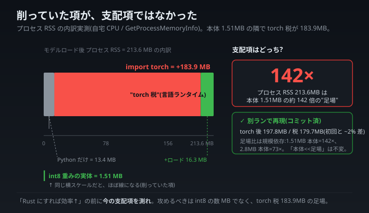

# 最適化する項を間違えていた — int8 で 4MB 削った隣で、言語ランタイムが 184MB 食っていた

> **本連載の全 llcore 実測は、自宅 CPU の極小モデル PoC であり、大手の実 LLM の性能を直接反証・凌駕するものではない。比較は手法・思想・計測規律の次元で行う。本記事の数値は実機の RSS(プロセスが OS から借りている物理メモリ)の実測で、対象は極小モデルゆえ「どの項が支配的か」を読む。**

連載「自宅 CPU から見た 2026 年 6 月の LLM 業界」アーキテクチャ編。前回([a8](a8-context-memory-blowup.md))は「文脈を長くすると Transformer のメモリが 2 乗で膨らむ」という**動的な支配項**の話でした。今回はその裏側、**静的な支配項**の話です。

きっかけは、よくある一言でした。

> 「メモリ効率を徹底するなら、いっそ Rust で書き直したら? そのほうが効率的でしょ。」

もっともらしい。でも私は、この種の「○○にすれば効率が上がる」を**自動で正しいと信じない**ことにしています。なので測りました。結果は、私の最適化の前提を引っくり返すものでした。

> **int8 量子化でモデルの重みを約 4 分の 1(数 MB)に削っていたその隣で、Python+torch の言語ランタイムが、何もしなくても 184MB を食っていた。**

削っていた項が、そもそも支配項ではなかったのです。

---

## 0. 何を測ったか(30 秒)

`ctypes` から Windows の `GetProcessMemoryInfo`(WorkingSetSize)を直接叩き、プロセスの RSS を段階的に実測しました。

- **Python インタプリタだけ**: 13.4 MB
- **`import torch` した直後**: 197.3 MB(= +183.9 MB)
- **豆モデルをロード後**: 213.6 MB

そして、そのモデルの int8 重みの実体は —— **1.51 MB**。

用語を 1 つだけ。

- **RSS(Resident Set Size)/ working set**: プロセスが今、物理メモリ上に実際に持っている量。「このプログラムを動かすのに RAM をどれだけ占有しているか」の実測値。

---

## 1. 数字の全公開と、衝撃の比率

| 段階 | プロセス RSS |
|---|---:|
| Python インタプリタ baseline | 13.4 MB |
| `import torch` 後 | 197.3 MB(**+183.9 MB の "torch 税"**) |
| モデルロード後 | 213.6 MB |
| **モデル int8 重みの実体** | **1.51 MB** |

ここから出る比率が効きます。

> **プロセス RSS 213.6MB は、モデル本体 1.51MB の約 142 倍。**

私は int8 量子化で「重みを 4 分の 1!」と数 MB を削ることに集中していました。でも全体像は、**1.51MB の本体の周りに、212MB の"足場"が組まれている**状態だったのです。数 MB の節約は、142 倍の足場の前では誤差に近い。

*削っていた項(int8 本体 1.51MB)は、同じ横スケールでは細い線にしかならない。支配項は torch 税 183.9MB の足場だった。*

> ここで言う「タイトルの 4MB」は、重みを fp32 から int8 に落としたときの**削減差分**(約数 MB 相当)を指します。int8 化した後の footprint 自体は **1.51MB** で、私が「削った量」と「残った本体」は別物です。いずれにせよ、この桁(数 MB)は 184MB の足場の前では誤差です。

> **再現性(コミット済みハーネスで裏取り):** この一回限りの計測を、後日 **再走可能なハーネス**(`scripts/runtime_floor_rss.py` / `out/runtime_floor_rss.json`、各ステージを別プロセス隔離で 3 回測定の中央値)に固めて測り直しました。結果は **`import torch` 後 197.8 MB(初回 197.3 とほぼ完全一致)/ torch 税 179.7 MB(初回 +183.9 と ~2% 差)** ——主役である **torch ランタイム税が ~180MB であること**は別ランでも揺るぎませんでした。一方 baseline は 13.4→18.1 MB と少し上振れし(Python/プロセス環境差)、足場比は **モデルの大きさで変わります**:本文の 1.51MB モデルでは 142×、ハーネス既定の 2.8MB モデル(n_embd=176)では 73× でした。比の絶対値は config 依存ですが、**「本体より足場が桁違いに大きい」という構図は不変**——そこが load-bearing です。

---

## 2. 「支配項を攻めろ」— どの項を削るかが全て

最適化には鉄則があります。**一番大きい項(支配項)を攻めろ**。小さい項をいくら磨いても、全体はほとんど動かない。

- **動的な支配項**は文脈長で伸びる attention/KV([a8](a8-context-memory-blowup.md) で測った O(L²))。
- **静的な支配項**は、この記事の **言語ランタイムの baseline(torch だけで +184MB)**。

豆モデル規模では、後者(184MB の torch 税)が圧倒的に支配的でした。だとすれば、**本当に効くのは int8 の数 MB ではなく、この 184MB の足場をどう減らすか**。

そして**ここが「Rust にすれば?」の真の効きどころ**です。lean な native バイナリ(C++ の llama.cpp、Rust の candle / mistral.rs 等)は、ランタイム baseline が桁違いに小さい(典型で数 MB〜十数 MB)。**184MB 規模の削減**は、int8 の数 MB とは比較にならない大きさで、「working set を小さく予測可能に」という北極星に直結します。さらに Rust なら allocator を自分で握れるので、「解放した fp32 を torch の caching allocator が OS に返さず、平時のピークが下がらない」という別の積年の問題も、`madvise(MADV_DONTNEED)` や明示解放で正攻法で潰せます。

---

## 3. 隠さない反対側(「Rust=効率↑」も自動ではない)

ただし、ここで止まると「Rust 万能論」になってしまう。honest disclosure として反対側を明示します。

- **Rust は int8 を小さくも、mmap を良くも、定数状態を定数にもしません。** これらの勝ちは表現・OS・アルゴリズム由来で **言語非依存**。Rust に移しても、これらは 1 バイトも改善しない。Rust が効くのは **baseline(足場)** の項だけです。
- **素の Rust の行列積は、torch の BLAS(MKL/OpenBLAS)より遅い。** 「Rust=速い」も自動ではありません。速度を出すには candle や BLAS バインディングが要る。
- **規模依存が肝。** 184MB の税が支配的なのは**豆モデル規模だから**。GB 級の重みになれば baseline は相対的に無視できる。つまり **Rust の baseline 優位は、llcore が実際に住む領域(小モデル・小 RAM)で最大、重みが支配する大規模で最小**。
- **これは llama.cpp が既に実証済みの動き。** 立ち位置としては「**再導出**」であり、私の誠実な独自性はそこ(言語)ではなく、別記事で書いた cap-gate(能力ゲート)の運用にあります。
- **未確証(honest gap)。** Rust/candle 版の baseline RSS は**まだ測っていません**。本記事の「native なら baseline が桁違いに小さい」は文献・既存実装からの妥当な推定で、最終確証には candle 実測が要ります。

---

## 4. 教訓 — Rust に書き直す前に、baseline を測れ

この記事の実用的な結論はシンプルです。

> 「○○にすれば効率が上がる」と聞いたら、書き直す前に**今の支配項を測れ**。
> 私の支配項は int8 で削れる重みではなく、torch を import した瞬間の 184MB だった。

もし測らずに「メモリ効率のために Rust へ全面移植」と走っていたら、労力の大半は「言語非依存の勝ち(int8/mmap/定数状態)を Rust で**書き直すだけ**」に消え、本当に効く 184MB の baseline 削減という主目的が埋もれていたでしょう。**狙いを『推論パスを native 化して interpreter 税を消す』に絞る**——それが、測ってはじめて見えた正しい移植方針でした(速度狙いではなく、足場狙い)。

最適化は、磨く前に「どの項が大きいか」を測る。当たり前のようで、4MB を削りながら 184MB を見落としていた私自身が、一番それを忘れていました。

---

_技術注記:`ctypes` 経由 `GetProcessMemoryInfo` WorkingSetSize の実測(初回 2026-06-19)= baseline 13.4MB / `import torch` 後 197.3MB(税 +183.9MB)/ モデルロード後 213.6MB。`int8_footprint_bytes` = 1.51MB → プロセス RSS は本体の 142×。**再現(コミット済みハーネス `scripts/runtime_floor_rss.py` / `out/runtime_floor_rss.json`、別プロセス隔離×3 中央値)**: torch 後 197.8MB / 税 179.7MB(初回と ~2% 差)で torch 税の支配は再現。baseline は 18.1MB に上振れ、足場比はモデル規模依存(1.51MB 本体で 142× / 2.8MB 本体で 73×)。Rust/candle の baseline RSS は未計測(主張の最終確証は要 candle 実測)。移植するなら「Python 成熟後に hot path のみ native 化」の規律に沿う。_
