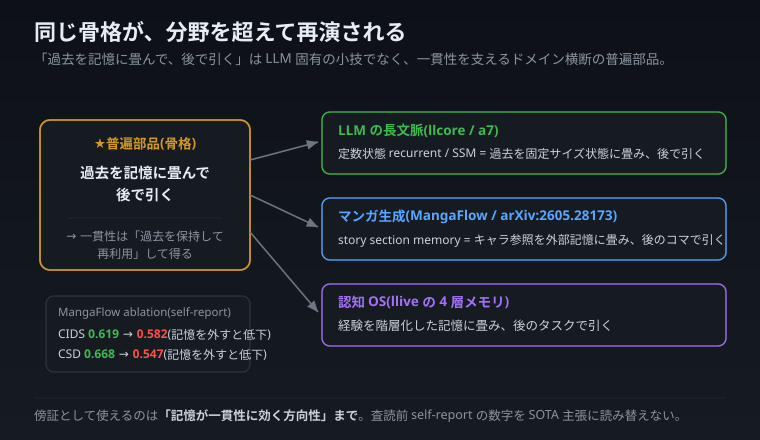

# 「記憶でつじつまを合わせる」発想は、文章 AI の外でも効いていた — マンガ生成の例

> この記事は、自宅で小さな AI 実験をしている者が書いた一般向け解説です。テーマは「過去を記憶に畳んで、後で引いて使う」という発想が、文章 AI だけでなくマンガ生成でも同じように効いている、という話です。他者の研究は出典と検証状況を正直に添えます。

---

## マンガ AI の悩み — 同じキャラが別人になる

マンガを自動生成するとき、難しいのが**コマをまたいだキャラの一貫性**です。1 コマ目の主人公が、2 コマ目で別人みたいな顔になっては困る。

東大などの研究 **MangaFlow** は、これを「**記憶**」で解決しました。各場面に「このキャラはこういう見た目」という参照を**記憶として持っておき、次のコマで引いてくる**。実験で「記憶を外すと一貫性が落ちる」ことも確かめています。

---

## 実は、文章 AI と同じ骨格

これは、私が連載で何度も書いてきた発想と**同じ骨格**です。

- **文章 AI**: 過去を固定サイズの「まとめ」に畳んで持ち、次の予測に使う(別記事の「日記のまとめカード」)。
- **マンガ AI**: キャラの見た目を記憶に持ち、次のコマで引く。
- **私たちの仕組み(llive)**: 経験を階層的な記憶に畳み、後のタスクで引く。

分野はバラバラ(文章・絵・作業)なのに、**「つじつまは、過去を記憶に持って使い回すことで合わせる」**という骨格は共通しています。つまり「記憶のしくみ」は、文章 AI だけの小技ではなく、**いろんな AI のつじつまを支える普遍的な部品**なのです。マンガ生成という別分野が、それを横から裏づけてくれました。

_同じ「記憶に畳んで後で引く」という骨格が、文章でも絵でも作業でも再演される。_

---

## でも、過大評価しないために(正直な注意書き)

この話を「だからこの研究がマンガ生成で最強だ」と読むと誤りです。正直に 4 つ注記します。

1. **絵そのものを描いているのは別の AI**。MangaFlow は「どこに何を配置するか」を指示する司令塔で、ピクセルを描くのは外部の画像生成 AI です。
2. **「配置の正確さ 100%」は土俵が違う**。座標で明示的に置く設計なら、ほぼ当たり前に出る自作の指標で、ゼロから絵を生成する手法と同じ土俵では比べられません。
3. **同じ名前の商用サイトは無関係の別物**です。
4. **まだ査読前で、第三者の検証は済んでいません**(自己申告の段階)。

だからこの話で言えるのは「**記憶がつじつま合わせに効く、という方向性**」までで、性能の優劣ではありません。

---

## おまけ — 弱点の告白が、別の取り組みを裏づける

MangaFlow は自分の弱点も書いています。「**マンガ的にデフォルメされた顔だと、誰が喋っているか・吹き出しをどこに置くかが難しい**」。

これは、私の別の取り組み(マンガのコマを AI が正しく理解できるか試すテスト、特に「喋っているのが中央の人物とは限らない」難しいケース)が狙っている、まさにその弱点です。作る側が「ここが難しい」と言う場所と、理解する側がテストすべき場所が一致している——弱点の告白が、別の取り組みの存在意義を裏づけてくれたわけです。

---

## 何が言いたかったか

> 「記憶に畳んで、後で引く」——この骨格は、分野を超えて再演される。
> 文章でも、絵でも、作業でも、つじつまは記憶で支えられている。

新しさは「記憶を使うこと」自体ではなく、「**どの分野で・どう畳むか**」にあります。記憶のしくみは AI の小技ではなく、いろんな AI のつじつまを支える普遍的な土台。だからこそ、私たちは記憶を仕組みの中心に置いています。ただし他者の数字は査読前の自己申告なので、**方向性の裏づけとしてだけ**使い、性能の断定は第三者の検証を待つ——その線引きを守ります。

---

_この記事は自宅の小さな AI 実験者による一般向け解説です。引用した研究は査読前の自己申告段階で、性能の断定ではなく方向性の裏づけとして扱っています。技術寄りの詳細版は別記事にあります。_
