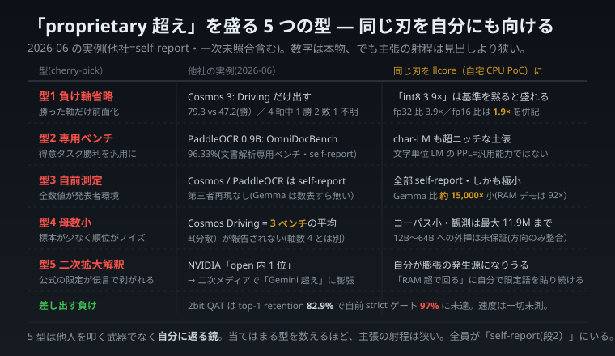

# 「○○超え」のカラクリを見抜く 5 つの型 — そして同じ物差しを自分にも当てる

> この記事は、自宅のふつうのパソコンで動かした小さな AI 実験をしている者が書いています。専門用語はできるだけ使わず、たとえ話で進めます。テーマは「すごい勝利ニュースの"盛られ方"を見抜き、しかも同じ目で自分の自慢もチェックする」ことです。

---

## 同じ見出しを 3 回見て、3 回とも中身が違った

2026 年 6 月の 1 か月で、「オープンな AI が大手を超えた!」という見出しを 3 回見ました。どれも本物のニュースで、数字も実在します。**捏造はありません。** でも、3 回とも「超えた」の中身が違っていました。

- 1 回目は、**勝った種目だけ**を見出しにして、負けた種目は奥に小さく載せていた。
- 2 回目は、**自分が得意な専用テスト**での 1 位だった(総合力の話ではない)。
- 3 回目は、公式は「**公開モデルの中で 1 位**」としか言っていないのに、ネットの見出しだけが「大手超え」に育っていた。

派手な勝利は、だいたい同じ 5 つの「型」のどれかで作られます。この記事は、その**見抜き方の手順**をお渡しします。そして最後に、同じ物差しを**自分の小さな AI 実験**にも当てます。批判は、自分に返ってこないと意味がないからです。

---

## まず大前提 — 「嘘」ではなく「射程が狭い」

大事な前提を 1 つ。これから挙げる型は、たいてい**嘘ではありません**。摘んできたさくらんぼは本物。ただ、緑の(=負けた)実を見せていないだけ。だから「捏造だ」と糾弾する話ではなく、**「その主張、見出しが匂わせるより狭い範囲しか言えてないよね」**という読み方の練習です。

---

## ハイライト動画のたとえ

スポーツのハイライト動画を思い浮かべてください。

- 決めたプレーだけを繋ぎ、空振りは映さない → **型1:負けた種目を省く**
- そのスポーツの中でも得意な場面が選ばれる → **型2:得意な専用テストでの勝利**
- 撮ったのは所属チームの広報(中立の第三者ではない)→ **型3:自前で測って自前で発表**
- 試合数が少なければ「絶好調」も偶然かも → **型4:サンプルが少なく順位がブレる**
- 広報の「リーグ屈指」が、ファンの間で「歴代最強」に育つ → **型5:伝言ゲームで限定が外れる**

**映像はどれも本物。捏造は 1 つもない。** でも見て「この選手は無敵だ」と思ったら、それは映像のせいではなく、**ハイライトという形式の性質**にやられたのです。

---

## 5 つの型(チェックリスト)

| 型 | やっていること | 見たら疑うサイン |
|---|---|---|
| 型1 負け軸の省略 | 勝った種目だけ前に出す | 「超え」が単一スコア・単一種目 |
| 型2 専用テスト | 得意分野のテストでの勝利を総合力のように語る | テスト名に分野が入っている(例: 文書解析専用) |
| 型3 自前測定 | 全部、発表者が自分で測った数字 | 「誰が測ったか」が書いていない |
| 型4 サンプル小 | 根拠のテスト本数が少なく順位がブレる | 平均の裏の本数が一桁・誤差(±)が無い |
| 型5 伝言ゲーム | 公式の慎重な限定が、拡散中に外れる | 見出しが公式発表より強い |

> これらは**排他的ではありません**。1 つの「勝利」が型1+型3+型4 を同時に使っていることはざら。だから「どの型か」を 1 つに絞るより、「**いくつ当てはまるか**」を数えるほうが実用的。当てはまるほど、主張の射程は狭い。

実践は 2 段階だけ。**(1) 強い見出しを見たら、必ず公式の一次情報まで遡る。(2) 一次に付いていた限定語(「公開モデル内で」「文書テストで」)が、見出しから消えていないか照合する。**

*同じ物差しを、大手の実例(中央)と自分の小さな実験(右)に並べて当てた一枚。*

---

## ここからが本番 — 同じ刃を自分に当てる

他人のニュースを 5 つの型で解剖したなら、**自分の自慢にも同じ刃を入れる**のが筋です。やらなければ、ただのブーメラン。私の小さな AI 実験で実際にやってみます。

- **型3(自前測定)**: 私の数字は**全部、自宅 PC で自分が測った自己申告**です。しかも対象はごく小さな実験 AI(大手の 1 万分の 1〜100 分の 1 の規模)。他人の自己申告に「再現待ち」の札を貼るなら、自分にはもっと太い札を貼らねば不公平。だから私は「大手を超えた」とは**一切言いません**。

> ここで「信頼の梯子」という見方を 1 つ。数字の確かさには段階があります。いちばん下が**本人の自己採点**(模試を自分で作って自分で採点した状態)。その上が、**友達が同じ問題を解き直して同じ点になった**段。さらに上が、**公式の模試で第三者が採点した**段。いちばん上が、**専門家がきちんと査読した**段です。上に行くほど信頼できます。大事なのは、自己採点は嘘ではないけれど、それを「みんなが確かめた」かのように読むのは一段飛ばし、ということ。今の私の数字も、他人の自己申告も、まだいちばん下の「本人の自己採点」の段にいます。
- **型1(負け軸省略)**: 「圧縮で約 3.9 倍小さくした」と書くとき、それは**ある基準(fp32)から測った値**。別の基準(fp16)なら約 1.9 倍。基準を黙れば、自分が都合のいい数字を選んで盛ることになる。だから必ず基準を併記します。
- **型2/型4(専用・少サンプル)**: 私のテスト対象は超ニッチな種類の AI で、サンプルも小規模。「成績が上がった」は**その特殊な土俵での話**で、総合力の話ではない、と明記します。
- **型5(伝言ゲームの発生源)**: 一番怖いのは、**自分が膨張の発生源になる**こと。「メモリが足りなくても動いた」という実証も、正確には「ある上限の条件下で」の話。限定を外して「巨大モデルが動いた!」と書けば、自分で型5 をやることになる。だから限定語を自分で貼り続けます。

おまけに、聞かれる前に負けも 2 つ差し出します。**(a) 速くなったとは一度も言えていない**(メモリは小さくしたが、速度は測っていない)。**(b) 最高難度の圧縮(2bit)は、最善を尽くしても自分の合格ラインを越えられなかった。** 8 割台までは来ましたが、私の合格ライン(97%)には届きませんでした。

---

## 何が言いたかったか

> すごい勝利を見たら、まず公式に遡って 5 つの型を当てる。
> そして次に、**自分の主張に同じ 5 つを当てる。**
> 前者だけで後者を忘れると、批判はブーメランになって自分の射程の狭さを照らす。

「自分の数字は正しくて他人は怪しい」ではありません。**みんな同じ「自己申告」の段にいて、みんな第三者の検証を目指すべき**。違いは規模と、「自分で限定語を貼り続けているか」という姿勢だけ。異常に良い結果が出たら、勝った気になる前に内訳を疑う——他人にではなく、**まず自分に**。それが、自宅 PC の小さな AI から見えた景色でした。

---

_この記事は自宅 CPU で動かした小規模な概念実証(PoC)の話です。技術的な詳細版(各社の実例・数値・出典つき)は別記事にあります。_
