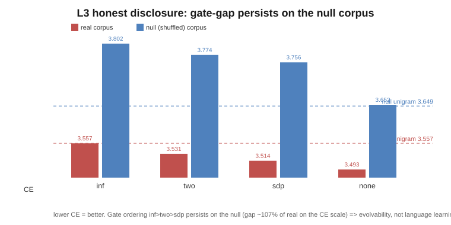
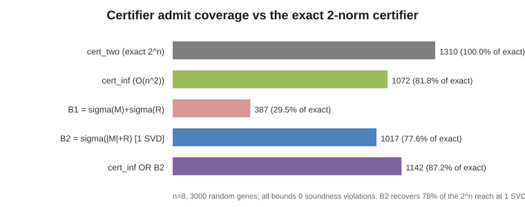
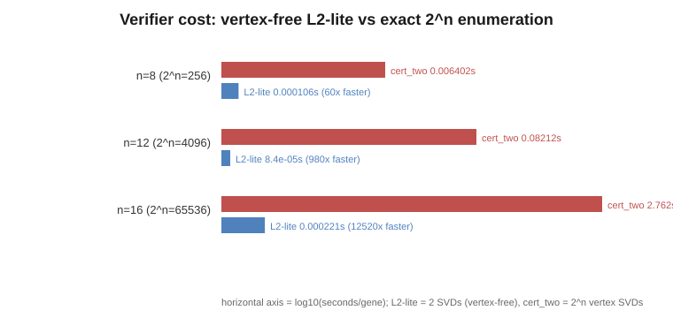

# Verified Evolution of a Recurrent Language-Model Core: Soundness, the Navigability of Contraction Gates, and Vertex-Free Certification

## Abstract

We study an evolvable recurrent core whose dynamics are admitted only by a fail-closed contraction verifier, and we measure what that verified-stability constraint buys when the core is wired into a real tiny byte-level language model. The substrate is a small coupled `tanh` recurrence whose gene `(decay, W)` is evolved while three *sound* certifiers — closed-form ∞-norm, vertex 2-norm, and a common-`P` Lyapunov SDP — admit only children that provably contract (`ρ(J) < 1`) over the achievable-Jacobian box; soundness is theorem-based (Lemmas covering bounded state, bounded input, and box-covers-reachability) and corroborated by a from-below empirical falsifier and a JSR oracle that observed **0 false admits** and **0 unsound certificates** under the accurate CLARABEL solver. On a reservoir/ESN byte-LM (fixed embedding, per-gene logistic readout, *not* a gradient-trained Transformer) the verified core beats a no-context byte-unigram baseline (L0), its admissions are empirically stable (L1, certified regions 0% expansive), and the gate is load-bearing (L2, the ungated pool is 78.9% expansive). The headline L3 result is stated at full strength and **no stronger**: relaxing the over-conservative ∞-norm gate to a sound relaxation lets evolution reach lower held-out cross-entropy (robust, 10/10 paired seeds, *p* = 0.000977), but the honest mechanism is **evolvability/navigability, not language learning** — the ∞-norm region *contains* genes far better than unigram that ∞-gated evolution cannot reach, region ceilings are roughly equal across corpora, and **the honest-null control does NOT tie** (the gate ordering persists at ~107% of the real gap when sequential structure is destroyed), so the relaxed-gate advantage is essentially structure-independent. A gradient-trained cross-check confirms the trap is random-mutation-specific (gradient is gate-indifferent), and a CPU-only vertex-free certifier breaks the cost wall: the single-SVD abs-domination bound `B2 = σ(|M|+R)` recovers 77.6% of the exact `2^n` certifier's admit set (leaving a ~22% tail whose navigability is unmeasured), and the cheap union gate `inf ∪ B2` (`O(n²)` + 1 SVD) reaches ~87.2% (a ~13% tail) — at up to four orders of magnitude lower cost with 0 soundness violations. **These coverage figures are at n=8 and degrade with dimension** (a follow-up at n=12/16 finds `inf ∪ B2` falling 87→77→60%, converging to `cert_inf` by n=16, while soundness and the growing cost win hold) — so the cheap bound is excellent at small n, but the genuine robust-LMI may regain motivation *for coverage* at the target n=32, an open question since `cert_two` is itself infeasible there. We treat the contraction-verified evolvable core as a substrate property — bounded, non-divergent, evolvable dynamics — and reserve any language-learning claim for experiments that test it directly.

## 1. Introduction

llcore claims a verified "Transformer core," but in its shipped `src/` it runs only low-dimensional dynamics under a synthetic or echo-state-proxy fitness. The work reported here closes the proxy gap as honestly as possible: it wires the *same* contraction-verified, evolvable recurrent core into a real next-byte prediction pipeline, measures whether the verifier is load-bearing, asks whether a *stronger sound verifier* unlocks more reachable behaviour, and — finding that it does — interrogates *why*, refusing to let an optimization artifact masquerade as language learning. Throughout, we keep each certifier's guarantee at exactly the strength its theorems justify and treat empirical contraction figures as falsifiers, never as proofs.

**Contributions** (each stated at its red-teamed strength, drawn from the corresponding sections):

- **A contraction-verified evolvable substrate with theorem-level soundness (§2, §3).** Three sound certifiers (∞-norm `O(n²)`, vertex 2-norm, common-`P` Lyapunov SDP) gate evolution over the achievable-`t` box; each implies `ρ(J) < 1` over the box, transferred to the real dynamics by three lemmas (bounded state, bounded `tanh` input, box-covers-reachability). The verifier is a *homeostatic* admission gate — it bounds the search to provably stable dynamics without steering toward any behaviour — and it is load-bearing (ungated evolution drifts to up to ~20% non-contracting; sound gates drive admitted children to 0%).

- **A solver-artifact audit and a hardened basis of trust (§3).** The cvxpy SCS default produces *false negatives* on boundary Lyapunov SDPs; under CLARABEL the SDP certifies ~95% of contracting evolved dynamics with **0 observed false admits** (300-gene and 1291/1363 Track-D pools) and a JSR oracle reporting 0 unsound certificates. We narrow the claim to "0 *observed* false admits, soundness attributed to certifier theorems," add an opt-in Rump-verified-PD OR-of-solvers recheck (admit set reproduced byte-for-identical, 286 == 286), and report honest negatives: the higher-degree SOS ladder adds only a tiny near-boundary residual and is non-monotone, so coverage *asymptotes to* the JSR = 1 boundary rather than closing; the binding constraint is the reachable-set (t-box) over-approximation, not Lyapunov degree.

- **The verified core runs as a real tiny byte-LM (§4).** On an n = 8 reservoir/ESN byte-LM with a controlled logistic readout, the best contracting gene beats the byte-unigram baseline by 0.40–0.53 nats (L0), all certified regions are 0% empirically expansive (L1), and the ungated pool is 78.9% expansive (L2). This is *not* a gradient-trained Transformer and makes no absolute-perplexity claim.

- **The L3 verifier–perplexity frontier is evolvability, not learning (§5).** Relaxing the ∞-norm gate to a sound relaxation lets evolution reach lower held-out CE (10/10 paired seeds, *p* = 0.000977), but the mechanism is *navigability*; region ceilings are not corpus-robust, and the honest-null control **does not tie** — the gate ordering persists at ~107% of the real gap, so the advantage is essentially structure-independent. The only genuinely structure-dependent signal is the unigram-crossing.

- **The navigability advantage is EA-specific (§6).** A gradient-trained char-LM reaches the same *final CE* under every gate (well below the EVO band), and a shuffled-corpus null ties at unigram — though gradient still bumps the `inf` gate (~15% of steps) before converging, and the EVO trap here is in the *admit rate*, not the (wrapper-masked) EVO CE. Practical upshot, scoped to this n=8 / 6-seed setup and to *final CE*: for a gradient-trained LM, the gate can be picked on soundness/coverage rather than navigability — not a proven law for all gradient-trained LMs.

- **A vertex-free sound certifier breaks the `2^n` wall (§7).** A single-SVD abs-domination bound `B2 = σ(|M|+R)` recovers 77.6% of the exact `2^n` 2-norm reach, and `inf ∪ B2` reaches ~87.2%, at up to 12,520× lower cost (n = 16) with 0 soundness violations. A ~22% tail remains, and whether it carries navigable low-perplexity dynamics is unmeasured.

- **Limitations, reproducibility, and roadmap (§8).** All runs are deterministic and CPU-only; n = 8 is a hard limit of the vertex-enumerating certifier (memory wall near n ≈ 16, infeasible at n = 32). We provide an authoritative reproduction table and the roadmap (vertex-free certifier R-LLM-1, gradient-trained GPU stage, multimodal, cost-as-selection L4).

The remainder of the paper follows these contributions in order: the substrate and certifiers (§2), soundness rigor and limits (§3), the reservoir byte-LM (§4), the L3 frontier (§5), the gradient cross-check (§6), vertex-free certification (§7), and limitations/roadmap (§8).

---

## 2. Background: an evolvable, contraction-verified recurrent core

This section describes the substrate and verification machinery that the rest of the
paper builds on. The core idea is to *evolve* the dynamics of a small recurrent system
while a **fail-closed contraction verifier** admits only children whose dynamics are
provably non-divergent. We describe (2.1) the `CoupledNDGene` substrate, (2.2) three
*sound* contraction certifiers and the soundness arguments behind them, and (2.3) the
framing in which a certifier acts as a *homeostatic constraint on evolution*. We are
careful throughout to keep the certifiers' guarantees at the strength their source
documents actually justify — no stronger.

### 2.1 Substrate: the `CoupledNDGene` recurrent map

The evolvable substrate is an `n`-dimensional coupled recurrent map (`coupled_nd.py`):

```
s' = decay ⊙ s + (1 - decay) ⊙ tanh(W s + V x)
```

with state and input `s, x ∈ R^n`, element-wise decay `decay ∈ [0,1]^n`, coupling matrix
`W ∈ [-2,2]^{n×n}`, and input projection `V = I` fixed to the identity (`coupled_nd.py`,
class `CoupledNDGene`; the map generalises an earlier `n=2` coupled map to arbitrary `n`).
A single update is the convex blend of the previous state and a `tanh` nonlinearity of the
pre-activation `W s + V x` — i.e. a leaky, saturating, RWKV-style recurrent step.

The **gene** subject to evolution is the pair `(decay, W)`; `V` is held at the identity.
The genotype is therefore a flat vector of `n + n²` real numbers (decay coordinates plus
the full coupling matrix), encoded by `CoupledNDGeneCodec` with the box bounds
`decay ∈ [0,1]^n`, `W ∈ [-2,2]^{n×n}` (`coupled_nd.py`, `CoupledNDGeneCodec.__init__`,
`self.dim = n + n*n`). This codec plugs into an *unchanged* evolutionary loop — adding a
substrate is one new codec object and nothing else changes (`README.md`, "How to extend").

The quantity that the verifiers reason about is the Jacobian of the update with respect to
the state:

```
J(t) = diag(decay) + diag((1 - decay) ⊙ t) · W,   where t_i = sech²(pre_i) ∈ (0,1]
```

(`coupled_nd.py`, `jacobian` / `_jac_at_t`). The factor `t_i = sech²(pre_i) = 1 - tanh²(pre_i)`
is the local slope of the `tanh`, which depends on the pre-activation `pre_i = (Ws)_i + (Vx)_i`.
Because the state and the (bounded) input are themselves bounded, each `t_i` ranges over a
known interval; reasoning over that interval — rather than over any single operating point —
is what lets the verifiers make a guarantee that holds for *all* reachable inputs.

### 2.2 Three sound contraction certifiers over the achievable-`t` box

The verifiers certify **contraction** — the spectral radius `ρ(J) < 1` over the set of all
reachable Jacobians — which (for this autonomous recurrence) gives the *echo-state property*:
the hidden state stays bounded, does not blow up, and forgets its initial condition
(`PREREGISTRATION.md`, §2 "帰結"). Rather than sampling operating points, all three certifiers
work over the **achievable-`t` box** `[t_min, 1]^n`, where `t_min` is computed per coordinate
from the row sums of `|W|` and `|V|` and the input bound `max_input_abs`
(`coupled_nd.py`, `t_min_per_coord`). The box has `2^n` vertices (`coupled_nd.py`,
`_box_vertices`).

The three certifiers (`coupled_nd.py`):

- **`cert_inf` — closed-form ∞-norm, O(n²).** Computes the supremum of `‖J(t)‖_∞` over the
  box in closed form. Each row's absolute-sum is V-shaped in `t_i`, so its maximum is attained
  at an endpoint `t_i ∈ {t_min_i, 1}` (`coupled_nd.py`, docstring of `infnorm_sup`). The gene
  is admitted iff `sup ‖J‖_∞ < 1`. This is the only certifier that scales: it is `O(n²)` and
  enumerates no vertices (`PREREGISTRATION.md`, §1 honest 制約).

- **`cert_two` — vertex `σ_max`, `2^n` vertices.** Takes the maximum over the `2^n` box
  vertices of the largest singular value `σ_max(J)`; admits iff every vertex has `σ_max(J) < 1`.
  This is sound because `σ_max` is convex and `J` is affine in `t`, so the maximum over the box
  is attained at a vertex (`coupled_nd.py`, comment at `two_norm`). It is solver-independent
  (vertex SVD only).

- **`cert_sdp` — vertex common-`P` Lyapunov LMI, `2^n` vertices.** Seeks a single quadratic
  Lyapunov matrix `P ≻ 0` satisfying `P − J_v^T P J_v ≻ 0` at every box vertex `J_v`, solved
  via `cvxpy` (`coupled_nd.py`, `cert_sdp`). The `2-norm` certificate is the special case
  `P = I`, so `cert_sdp` short-circuits to `True` whenever `cert_two` already passes.

**Soundness — what guarantees it.** The guarantee rests on the *certifier theorems*, not on
sampling: `‖J‖_∞ < 1`, `σ_max(J) < 1`, and a feasible common-`P` LMI each mathematically imply
`ρ(J) < 1` over the box (`VERDICT.md`, G1; `coupled_nd.py`, module docstring "All three imply
ρ(J)<1 over the box ⇒ contraction"). The pre-registration makes the box-covers-reachability
step explicit through three lemmas (`PREREGISTRATION.md`, §2):

- **Lemma 1 (bounded state).** If `s_0 ∈ [-1,1]^n` then every `s_t ∈ (-1,1)^n`, because each
  coordinate is a convex blend of values in `[-1,1]`.
- **Lemma 2 (bounded input).** With a `tanh`-bounded embedding `e(x) = tanh(E[x])`, every input
  coordinate satisfies `|e(x)_i| < 1`, so `max_input_abs = 1.0` is a sound (in fact strict)
  upper bound.
- **Lemma 3 (the `t`-box covers all reachable Jacobians).** From Lemmas 1–2,
  `|pre_i| < Σ_j |W_ij| + 1 = M_i`, hence `t_i = sech²(pre_i) > sech²(M_i) = t_min_i`, which is
  exactly the value `coupled_nd.t_min_per_coord` computes. Therefore every Jacobian reached
  during operation lies inside `[t_min, 1]^n`.

Because the box covers all reachable Jacobians, a certificate over the box transfers to a
guarantee over the actual dynamics. The empirical spectral-radius sampler (`coupled_nd.py`,
`empirical_rho`) is explicitly a **from-below consistency / falsification check**, not a
proof: observing `ρ < 1` only means *no violation was found*; the guarantee itself is the
certificate (`VERDICT.md`, §7; `PREREGISTRATION.md`, §2).

**Fail-closed engineering.** The SDP path is fail-closed in two ways. The genuine LMI solve
runs only under the CLARABEL solver; if CLARABEL is absent, `cert_sdp` *refuses* (returns
`False`) rather than silently falling back to `cvxpy`'s SCS default, which false-negatives near
the feasibility boundary (`coupled_nd.py`, `_CLARABEL_OK` / `_SOLVER`; comments at lines 35–46,
146–150). The solver's `P` is then independently re-checked by eigenvalue tests — the certifier
is never solver-blind (`coupled_nd.py`, end of `cert_sdp`). A behaviour-preserving fast path
rejects any vertex with `ρ(J_v) ≥ 1` (a necessary condition for LMI feasibility) before invoking
the solver (`coupled_nd.py`, `cert_sdp` pre-screen; `VERDICT.md`, §7).

**Scalability ceiling (honest, load-bearing).** The two stronger certifiers enumerate the `2^n`
box vertices, which is tractable only for small `n` (demonstrated for `n = 2, 3, 4` in the
module's `__main__`, and used at `n = 8` so that `2^8 = 256` vertices remain enumerable —
`PREREGISTRATION.md`, §1 honest 制約 and §6). At a real LM dimension such as `n = 32`, `2^32`
vertices is infeasible, so *only* the closed-form `cert_inf` (`O(n²)`) scales
(`PREREGISTRATION.md`, §1). A vertex-free sound 2-norm/SDP certifier for `n = 32+` is left as
explicit future work (the pre-registration's R-LLM-1 stage), precisely because rushing a
robust-LMI formulation risks unsoundness (`PREREGISTRATION.md`, §1). This is a genuine
frontier limit of the present work — both the SDP completeness degradation with dimension *and*
the exponential cost of vertex enumeration.

*Figure: the `tanh` recurrent step, its state-Jacobian `J(t)`, and the achievable-`t` box*
*`[t_min,1]^n` whose `2^n` vertices the certifiers reason over (data: coupled_nd.py).*

### 2.3 The certifier as a homeostatic constraint on evolution

The three certifiers are wired into the evolutionary loop as a `VerifierBackend` admission
gate: each mutated child must `certifies(gene) -> True` before it is admitted, so evolution can
search aggressively while the dynamical system is provably never driven into divergence
(`README.md`, "What it is"; `coupled_nd.py`, `make_nd_verifier`). The loop itself
(`evolvable_core.evolve()`) is unchanged across substrates and verifiers; the codec
(`GeneCodec`), the fitness (`Objective`, the *direction* of evolution), and the verifier
(`VerifierBackend`, the *safety*) are the three pluggable extension points (`README.md`,
"The skeleton"; `VERDICT.md`, §1). In this sense the verifier functions as a **homeostatic
constraint**: it does not steer *toward* any behaviour, but it bounds the search to the region
of provably stable dynamics, the way a homeostat keeps an evolving organism inside its viable
envelope.

This framing is supported, not merely asserted, by the source documents:

- **The gate is load-bearing.** Ungated evolution drifts into non-contraction (final
  populations measured at **rotation 19.7 %, benign 16.7 %, nonnormal 1.9 %** non-contracting),
  while all sound gates drive admitted children to 0 % (`VERDICT.md`, §5 G2). The verifier is
  removing genes that genuinely diverge, not policing a no-op.

- **A stronger verifier unlocks more reachable fitness, at no soundness cost.** On a coupled
  *rotation* task, the conservative ∞-norm gate over-rejects the rotation region and caps mean
  best fitness at **0.411**, while the 2-norm and SDP gates recover it to **0.767 / 0.859**
  (`VERDICT.md`, §4 exp2; paired one-sided Wilcoxon `p = 3.1e-5`, complete separation
  `psd = 1.00`, surviving Bonferroni over ~9 comparisons — `VERDICT.md`, §5 G4). A gate-free,
  certifier-attributed landscape analysis shows this is a *region ceiling*, not GA luck: the
  ∞-norm-admissible region cannot exceed **0.38** on rotation, whereas the 2-norm and SDP
  regions reach **0.89 / 0.90** (`VERDICT.md`, §3 exp1, 10175-gene pool). The bulk of the gain
  is **∞-norm → 2-norm**; SDP's unique gain over the 2-norm is real but thin, sitting in a
  near-boundary "SDP-only shell" with common-`P` margins of order `1e-7` (`VERDICT.md`, §7
  Codex #9, §8).

- **The effect is task-structural, not an admission-size artifact.** On a *benign* task all
  four gates tie at **0.999** (`VERDICT.md`, §4), an honest null (G5). A red-team control with a
  fitness uncorrelated with dynamics also shows no SDP edge (`p = 0.91`), so the rotation payoff
  is fitness-structural rather than a consequence of merely admitting more genes
  (`VERDICT.md`, §6 Lens A).

**Scope discipline.** Two limits are stated openly and we do not strengthen them. First, the
permissiveness ordering `|sdp| (3369) > |two| (2552) > |inf| (1860)` over the exp1 pool, and the
0.99 ceiling reported for the `non_certified` region, were corrected during audit: under
CLARABEL the SDP advantage is in fact larger than first reported (the original SCS-based numbers
*understated* it), while the raw `non_certified` 0.99 figure is a *raw region max* that can
include divergent genes and should not be read as a certified-contracting ceiling
(`VERDICT.md`, top correction banner; §3 Codex #8 correction). The honest residual finding still
stands: even the SDP gate is over-conservative relative to the true contraction set — among the
top-50 empirically-contracting rotation genes, **39 of 50 are `non_certified`** (`ρ < 1` but
provable by neither a fixed induced norm nor a common quadratic Lyapunov `P`), so the
verifier–fitness frontier continues toward JSR / non-quadratic-Lyapunov backends
(`VERDICT.md`, §3, §8). Second — and this is the scope boundary the present paper keeps — the
demonstrated result is **evolvability under a verified stability constraint**, established on
synthetic dynamical tasks (rotation / benign / nonnormal). Whether the same "stronger sound
verifier monotonically unlocks reachable fitness" claim holds when the fitness is a *real*
held-out language-model perplexity is, at this stage, an *open, pre-registered question*, not a
result: the pre-registration explicitly notes that the substrate "is not yet operating as an
actual LLM/VLM" and that a null outcome (contraction is free for real LMs; the verifier payoff
is synthetic-task-specific) would be a valid honest negative narrowing the paper's scope
(`PREREGISTRATION.md`, §0). We therefore treat the contraction-verified evolvable core as a
*substrate property* — bounded, non-divergent, evolvable dynamics — and reserve any
language-learning claim for the experiments that test it directly.

---

## 3. Soundness rigor and the dimension / completeness limits

This section reports what we can defend about the contraction verifier's *soundness* (it admits only genuinely contracting genes) and its *completeness* (how much of the true contraction set it can certify), and then states honestly where the completeness story stops — including a thread we initially expected to extend and ultimately had to refute.

Two scopes must be kept separate throughout. **Soundness** is a property of the certifier *theorems* and holds independently of any sampling. **Completeness** (coverage) is an empirical measurement on a specific pool, solver, dimension, and margin, and we report it as such. We never let an empirical coverage number inflate the soundness claim, and we never let a strengthened core thesis quietly upgrade a narrow-scope result.

### 3.1 The CLARABEL false-positive audit: the SDP gate has zero observed false admits

The single most consequential rigor finding in this arc was a *solver* artifact, not a logic error. cvxpy's `.solve()` with no solver argument defaults to **SCS** (a first-order ADMM method). For feasibility-**boundary** SDPs — exactly the regime our Lyapunov certificates live in — SCS returns **false negatives**: it fails to find a Lyapunov certificate that provably exists (DEG6_VERDICT.md §0). The independent eigenvalue re-check that guards soundness rejects *bad* certificates, but it cannot recover a certificate SCS never found, so SCS fabricated apparent structure near the boundary (DEG6_VERDICT.md §0).

Critically, the artifact was in the direction of **false negatives**, never false positives. Re-running the full pool under the accurate **CLARABEL** solver — explicitly to hunt for a false *positive*, i.e. an admitted gene that is not actually contracting — produced **none**:

- On the 300-gene contracting pool (149 of the 286 admits requiring a genuine SDP solve, not the inf/2-norm fast path), boundary SDP solves plus an independent eigen recheck found **0 false admits and 0 eigen-recheck disagreements**, with the worst observed JSR lower bound at 0.9999 < 1, stable at switching-product length 8 (PAIRREVIEW_audit_rump_2026-06-04.md, skeptic S2).
- The JSR soundness oracle reports **`CERTIFIER_SOUND_by_JSR: true`, 0 genes with `jsr_lb ≥ 1`** (certified `jsr_lb ≤ 0.966`) (PAIRREVIEW_audit_rump_2026-06-04.md verification table; DEG6_VERDICT.md §3).

The correction *strengthened* the core thesis (the right verifier is SDP/Lyapunov) rather than weakening it: under CLARABEL the SDP certifies **~95% (286/300)** of contracting evolved dynamics, up from the SCS-era 193/64% (DEG6_VERDICT.md §2). On the upstream Track-D pool the SDP certifies **1291/1363 (~95%)** of contracting genes with **0 false positives** (VERDICT.md correction block; PAIRREVIEW skeptic S3). The transferable lesson is methodological: the margin-sweep red-team (lens 4) is *structurally blind* to a solver false-negative — it reported "complement robust," confirming rather than catching the bug — and only a solver swap plus adversarial multi-perspective review caught it (DEG6_VERDICT.md §0, §7).

**Honest narrowing (pair-review F2).** We do **not** claim a machine-checked proof of soundness from this audit. The certifier accepts `optimal`/`optimal_inaccurate` and then gates with a float `eigvalsh > 0` recheck — a numerical check, not a float-level proof — and the JSR oracle is a one-sided, finite-length (≤ 6) lower bound, so `jsr_lb ≥ 1` would *prove* unsoundness but "0 such genes" is *necessary, not sufficient* (PAIRREVIEW_audit_rump_2026-06-04.md F2; DEG6_VERDICT.md §3). The wording was therefore narrowed to **"0 *observed* false admits,"** with soundness itself attributed to the certifier **theorems** (quadratic: a common vertex-LMI implies hull stability by convexity; degree ≥ 2: the lifted SOS sufficient condition) plus the independent eigen recheck (PAIRREVIEW F2).

Figure: SCS vs CLARABEL on the residual genes — the "complementary degree-4/6" split collapses to a nested 54/54 under the accurate solver (data: DEG6_VERDICT.md §0 table).

### 3.2 Rump verified-PD + OR-of-solvers: hardening the basis of trust

To replace the single-solver float `eigvalsh` recheck with a machine-checked floating-point proof, we added an *additive*, opt-in verifier factory `make_sdp_verifier_rump_or()`. It admits a gene iff the solver-independent inf-norm or 2-norm closed-form certificate holds (the sound fast path), **OR** the OR-of-{CLARABEL, SCS} SDP gate finds a Rump-**verified** common-Lyapunov `P` whose `P` and every `P − JᵀPJ` pass `rump_pd.verified_pd` at the *same no-margin* matrices the float path tests (RUMP_HARDENING_VERDICT.md "What was built," "Critical invariant"). The underlying `verified_pd` is adversarially proven sound: across ~7M adversarial matrices (300k + 3M lemma + further batteries) it produced **0 false positives and 0 unsound lower bounds**, with empirical error ≤ 0.59× the bound (40% headroom) (PAIRREVIEW skeptic S5; RUMP_HARDENING_VERDICT.md cites an 11-test, 36,860-trial battery).

On the seed=2024 300-gene pool the Rump+OR gate reproduced the float gate's admit set **byte-for-identical at 286 == 286 (0 lost, 0 extra)** (RUMP_HARDENING_VERDICT.md comparison table). Because the equal-count branch held, the pre-registered decision rule says promotion of the default recheck to Rump+OR is **safe with the admit set exactly preserved on this pool** — but we did *not* flip the default; promotion remains a separate explicit human decision (RUMP_HARDENING_VERDICT.md "Decision rule").

**Honest correction (pair-review F3) — the "never shrunk" rationale was inverted.** An earlier draft argued the admit set is "preserved-or-grown, never shrunk" because `verified_pd` *dominates* the float test. This is **backwards**: `verified_pd` returns a sound *lower* bound on `λ_min` (≤ the float-computed value), so on the same matrix it is the **stricter** test — `{Rump-accepted} ⊆ {float-accepted}` per `P` — and could in principle *reject* a barely-PD `P` the float test accepts (RUMP_HARDENING_VERDICT.md correction block; PAIRREVIEW F3). The observed 286 == 286 is therefore **empirical**, not a domination theorem, and is explained by ~8 orders of magnitude of headroom (SDP constraint margin ≈ 1e-7 vs Cholesky backward-error bound ≈ 1e-15), confirmed numerically by 4000 barely-PD matrices with `λ_min ∈ [1e-9, 1e-5]` giving 0 Rump rejections and 0 unsound lower bounds (RUMP_HARDENING_VERDICT.md; PAIRREVIEW F3). On this pool the {CLARABEL, SCS} OR is **not load-bearing for the admit count** (the two solvers agree exactly); its value is robustness, not coverage (RUMP_HARDENING_VERDICT.md "Honest caveats"). We also closed one latent footgun: a falsy non-`None` solver string (`solver=""`) could have fallen through to the bare SCS default; it now fail-closes, with a regression test (PAIRREVIEW F1).

### 3.3 The degree ladder, JSR, and the asymptote to the JSR = 1 boundary

Above the common quadratic SDP we built a higher-degree SOS ladder — degree-4, degree-6, degree-8 via symmetric Kronecker powers — and a JSR bracket (Gripenberg lower bound, SOS upper bound). Under CLARABEL the cumulative coverage of the 300-gene pool is (DEG6_VERDICT.md §2 table):

| inf | +2-norm | +sdp | +deg4 | +deg6 | +deg8 | exact-JSR tail |
|---|---|---|---|---|---|---|
| 88 (29%) | 137 (46%) | **286 (95%)** | 289 | 290 | ~292–294 (~98%) | 2 near-boundary remain |

The common quadratic SDP is the workhorse at 95%; the entire higher-degree ladder adds only a tiny near-boundary residual (deg4 +3, deg6 +1, deg8 +2–4). Of the 14 genes the quadratic SDP cannot certify: **4** have a higher-degree Lyapunov, **6** are **switched-expansive** (JSR ≥ 1 — pointwise ρ < 1 but a vertex product expands, so they are *correctly refused*, not missed), and ~2–4 are near-boundary finite-gap (`jsr_lb` 0.98–0.99) (DEG6_VERDICT.md §2). The pre-registered gate **G-A1 (advance ≥ +5 over SDP) FAILS** at +4, reported honestly; **G-A2 (non-nested) is RETRACTED** (deg4 ⊆ deg6); **G-A3 (sound) PASSES** with 0 unsound (DEG6_VERDICT.md §2). The lifted SOS family is moreover **non-monotone** — γ* *rose* from degree 2 to degree 8 (0.767 → 0.780) on a near-normal gene — so "climbing the lifted SOS ladder monotonically reaches exact-JSR" is **false**; the tightest bound is the union `min_d γ*_d`, and the 2 near-boundary genes stay open at any finite CPU lift degree, closable only by NP-hard SOS-on-variety or branch-and-bound (DEG6_VERDICT.md §4). The coverage frontier therefore **asymptotes to the JSR = 1 boundary rather than closing** — an honest, clean limit.

### 3.4 The dimension thread: where quadratic completeness comes from, and what it is *not*

We then asked whether the 95% quadratic-SDP completeness is robust, or specific to the n = 2 substrate, and whether higher-degree verifiers become load-bearing as the AI core scales. Three sub-claims, one of which we had to refute.

**(R1) Quadratic-SDP completeness is partly an n = 2 phenomenon and degrades with dimension.** The ∞-norm rotational ceiling drops monotonically with n (0.491 → 0.459 → 0.343 at n = 2, 3, 4), and the better-verifier payoff (2-norm over ∞-norm) generalises to all three dimensions (p = 9.8e-4, psd = 1.00, **0 divergent admitted**) — so "a better sound verifier unlocks more reachable fitness" is not an n = 2 artifact (ND_VERDICT.md §2–§3). But the quadratic class itself covers *less* of higher-dimensional space: the only defensible cross-n signal in the residual experiment is **`T_quad` shrinkage** as n grows (DEG6_VERDICT.md §6). We are explicit that the *magnitude* of the dimensional payoff does **not** cleanly grow with n (+0.388, +0.123, +0.260 — non-monotonic), confounded by the GA's convergence difficulty at higher n with fixed pop/gens; a clean scaling law would require search-effort normalised per dimension (ND_VERDICT.md §3, §4 — disclosed as an honest negative on magnitude-scaling).

**(R2a) Higher-degree SOS does not recover the dimensional loss.** The naive expectation — degree-4/6/8 verifiers become load-bearing as the core scales — is not supported. Under an accurate solver the higher-degree rungs add almost nothing even at n = 2 (§3.3), so there is barely any degree-rung capability for dimension to "gate" (DEG6_VERDICT.md §6, reason 1). On the pre-registered capability test `residual_reach` (n = 15, validated positive control), **G-B2 is NULL**: neither higher-degree rung beats the SDP gate (L4_deg6 vs L2_sdp Δ +0.020, p = 0.138; L3_deg4 vs L2_sdp Δ +0.008, p = 0.265), while the SDP gate already reaches R² ≈ 0.92 of the target (DEG6_VERDICT.md §5).

**(R-reach) REFUTED: the "dimension-threshold" claim was a sampling artifact, and the real rate-limiter is the reachable-set over-approximation, not Lyapunov degree.** An earlier draft claimed a "+0.4 → +2.0 gap jump at n ≥ 3, so higher-degree verifiers become load-bearing as the core scales." This is **retracted** (DEG6_VERDICT.md §6). The premise was moot (R2a above), and the proxy was unsound: the `decay_ratio < 0.6` gate never re-checked ρ, so ~49–58% of the n = 4 "residual contracting" genes were empirically **expansive** (a tanh-saturation artifact at fixed ‖s0‖), and the `T_residual_max` gene itself had ρ ≈ 1.8 — the switched-expansive class that is *correctly rejected* (DEG6_VERDICT.md §6, reason 2). After fixing the soundness gate and re-running under CLARABEL, the residual-vs-quad gap is **non-monotone and not robust across runs**; a CPU-time-capped re-run even flipped to an *accidentally* monotone profile purely from truncated scan coverage, and that cross-run flip is itself evidence the gap is a **sampling artifact, not a dimension law** (DEG6_VERDICT.md §6). No dimension-gated capability claim stands.

The honest synthesis of the dimension thread is therefore a *relocation* of the rate-limiter. The verifier ladder certifies a common Lyapunov over the **t-box vertex set** {J_v}, which is a **sound over-approximation** of the achievable-t set: the achievable-t set lies inside the box (coupled_components.py achievable-t comment; jsr_bracket.py over-approx caveat, both referenced in the t-box documentation). The genes the ladder cannot certify are not blocked by insufficient Lyapunov *degree* — degree-8 and beyond demonstrably do not recover them (R2a), and the residual is dominated by switched-expansive genes that *should* be rejected. **The binding constraint is the over-approximation of the reachable (t-box) set**, which forces the certifier to defend the worst vertex product even when the genuinely achievable dynamics never reach it. Tightening the reachable-set model, not climbing the Lyapunov-degree ladder, is the direction that would move the frontier.

### 3.5 Aggregate rigor posture

Across the arc we observe **0 unsound certificates** by the JSR oracle (`jsr_lb ≤ 0.966` on the deg-pool; worst boundary `jsr_lb` 0.9999 < 1) and **0 observed false admits** under CLARABEL on both the 300-gene and 1291/1363 Track-D pools (DEG6_VERDICT.md §2–§3; PAIRREVIEW skeptics S2/S3/S5). The src suite is green (255 passed) and the research suite green (312 passed, 2 z3-fallback skips, no xfail/xpass masking) (PAIRREVIEW verification table, skeptic S6). The pair-review's net contribution was **narrowing three over-claims** (fail-closed completeness, soundness-proof strength, the preserve-or-grow rationale) and **closing one latent footgun** — with **no headline number changed** (PAIRREVIEW "Net result"). We deliberately keep the strongest defensible verdict at its red-teamed strength: SDP/Lyapunov is the right verifier and is ~95% complete on this CPU n = 2 pool; soundness is theorem-based with 0 observed counterexamples; and the residual frontier is gated by reachable-set over-approximation, not by Lyapunov degree.

---

## 4. R-LLM: the verified core as a real tiny byte-LM (L0/L1/L2)

### 4.1 Motivation and scope

The preceding sections establish a contraction-verified, evolvable recurrent
core on synthetic dynamical tasks. A fair objection is that llcore claims a
"Transformer core" yet, in `src/`, runs only low-dimensional dynamics with a
synthetic or ESN-proxy fitness — it is not exercised as an actual language
model (PREREGISTRATION.md). The R-LLM stage closes that gap with the smallest
falsifiable construction: it wires the *same* verified recurrent core into a
real next-byte prediction pipeline whose fitness is held-out cross-entropy /
perplexity (lm_substrate.py, PREREGISTRATION.md §1).

We state the limitation up front, before any result, because it bounds every
claim that follows. This is a **reservoir / echo-state (ESN) byte-language
model** — a fixed, seeded byte-embedding feeds a recurrent core, and a per-gene
closed-form readout produces logits. It is **not a gradient-trained
Transformer**: there is no attention, no learned embedding, no end-to-end
backprop through the core. A genuine softmax-attention Transformer under
end-to-end training is explicitly deferred to a later GPU stage
(PREREGISTRATION.md §1, VERDICT.md §5). The questions we ask are therefore
about *relative* behaviour (does the verified core function as a minimal LM,
and is the contraction gate load-bearing), not about absolute perplexity, which
at this tiny scale is weak by design (PREREGISTRATION.md §1 "honest 限定").

### 4.2 The reservoir byte-LM pipeline

For a byte token `x_t ∈ {0..255}` the pipeline is (lm_substrate.py module
docstring; PREREGISTRATION.md §1):

```
e(x_t)   = tanh(E[x_t]) ∈ (-1,1)^n          # fixed seeded byte-embedding (the "sense organ")
s_t      = decay ⊙ s_{t-1} + (1-decay) ⊙ tanh(W s_{t-1} + e(x_t))   # arc CoupledNDGene recurrence (V=I)
logits_t = R s_t + c                         # per-gene logistic readout
loss     = mean CE(softmax(logits_t), x_{t+1})   # real next-byte LM loss
fitness  = exp(-held_out_CE) ∈ (0,1]         # per-byte likelihood
```

Three design choices are load-bearing:

- **Fixed `tanh` embedding as a "sense organ."** `E` is a fixed, seeded random
  table passed through `tanh`, so `|e(x)|_∞ < 1` for every byte
  (lm_substrate.py `ByteEmbedding.make`, which stores `np.tanh(raw)`). It is
  shared across all genes so that fitness comparisons are fair. The `tanh` is
  not cosmetic: it is the input bound that makes the soundness argument hold,
  and the source explicitly marks it as not-to-be-removed (lm_substrate.py
  module docstring, `MAX_INPUT_ABS = 1.0  # ... LOCKED`).

- **The arc `CoupledNDGene` recurrence as the evolvable, verified core.** The
  state update is exactly the arc's coupled recurrence with `V = I` (input is
  the embedding directly); the gene `(decay, W)` is the evolvable and
  contraction-verified object, reused unchanged from
  `../verified_evolution_sdp_gate/coupled_nd.py` (lm_substrate.py
  `reservoir_states`; src/ untouched, additive-only).

- **Closed-form, deterministic logistic readout.** A naive ridge-to-one-hot
  readout collapses to ~uniform under softmax (its outputs are ~`1/VOCAB`
  scale), so it is kept only as a fast pre-screen and is *not* used for the LM
  fitness (lm_substrate.py `fit_ridge_readout` docstring). The CE-proper
  readout is a multinomial-logistic head fit by deterministic momentum gradient
  descent from a **zero initialization** (lm_substrate.py
  `fit_logistic_readout`). The zero-init is important for the baseline: with the
  bias column, the zero-feature limit *exactly* recovers the byte-unigram, so
  held-out CE is a fair "does reservoir memory help over no-context" test
  (lm_substrate.py `fit_logistic_readout` docstring; VERDICT.md §1). The readout
  is byte-for-byte identical (same steps, lr, l2, embedding, split) across every
  gene, so CE ordering reflects core dynamics, not readout capacity
  (VERDICT.md §2 "Readout controlled").

The corpus is the llcore `research/*.md` + `src/**/*.py` byte-concatenated,
sorted for reproducibility, and split train/held-out 80/20 in time order with no
leakage (lm_substrate.py `load_corpus`, `LMTask.__post_init__`;
PREREGISTRATION.md §1). The whole pipeline is CPU-only, numpy-only, and
deterministic with no per-evaluation RNG.

A dimensional limit is inherent and disclosed: `cert_two` / `cert_sdp` enumerate
the `2^n` vertices of the Jacobian t-box, so the reported runs use **n = 8**
(`2^8 = 256` vertices, all certifiers tractable). Scaling to `n = 32+`
needs a vertex-free sound certifier and is deferred to a later R-LLM-1 stage
(PREREGISTRATION.md §6, VERDICT.md §5).

### 4.3 Soundness on the real substrate (theorem first, oracle second)

Soundness is a *theorem*, not a measurement. The certifiers `cert_inf`,
`cert_two`, `cert_sdp` are reused unchanged from the arc, and three lemmas carry
their guarantee onto the LM recurrence: the state stays in `(-1,1)^n`
(state-boundedness), the `tanh` embedding gives `|e(x)|_∞ < 1` so
`max_input_abs = 1.0` is a sound input bound, and the reachable Jacobians are
covered by the t-box the certifiers reason over (PREREGISTRATION.md §2,
Lemmas 1–3). Consequently any gene a sound certifier admits has `ρ(J) < 1` over
the t-box and the LM recurrence contracts for all byte inputs (echo-state
property). The empirical figures below are a *from-below consistency check* —
they can falsify, but they corroborate rather than constitute soundness
(VERDICT.md §2; this terminology was corrected in Codex pair-review, "outcome-blind
/ non-leaky" rather than "independent").

### 4.4 L0 — the tiny reservoir LM actually functions (PASS)

On the landscape corpus (12288 B, `unigram_CE = 5.2399`), the best *contracting*
held-out CE in every certifier region beats the Laplace-smoothed byte-unigram
baseline by **0.40–0.53 nats** (VERDICT.md §1):

| region | n | best contracting CE | beats unigram by | % empirically expansive |
|---|---|---|---|---|
| inf | 346 | 4.8377 | 0.4022 | 0.0 |
| two_norm_only | 100 | 4.7954 | 0.4445 | 0.0 |
| sdp_only | 189 | 4.7525 | 0.4874 | 0.0 |
| non_certified | 265 | 4.7052 (raw 4.6684) | 0.5347 (raw 0.5715) | 78.9 |

(All figures: VERDICT.md §1.) The baseline is not a strawman: the logistic
readout's zero-feature limit *exactly* recovers the unigram, so any gain is
genuine sequential signal, and the held-out positions are strictly later than
train (no temporal leakage). The TDD suite independently asserts that a
contracting gene found by random search beats the unigram CE
(test_lm.py `test_L0_contracting_gene_beats_unigram`). **L0 holds.**

Figure: best contracting held-out CE per certifier region vs. the unigram
baseline (data: VERDICT.md §1 table).

### 4.5 L1 — admitted genes are stable on the real substrate (PASS)

All three *certified* regions (inf, two_norm, sdp) are **0.0% empirically
expansive** on the real byte-LM — no admitted gene was observed expansive
(VERDICT.md §2). This is the consistency check, not the proof: it confirms the
certifier admitted nothing observably expansive (VERDICT.md §2). The TDD suite
encodes the same property as a regression test — every gene admitted by any
certifier must have empirical contraction `ρ < 1` on the real corpus
(test_lm.py `test_admit_implies_empirical_contraction`), and Lemma 1
(state-boundedness `|s| < 1`) is verified even for deliberately expansive genes
(test_lm.py `test_lemma1_state_bounded_even_for_expansive`). The label
`classify_region` is outcome-blind — a pure function of the Jacobian box, never
reading reservoir states, readout, corpus, or CE — and `held_out_ce` never calls
any certifier, so there is no leakage or circularity; the label is *not*
statistically independent of CE, because both are downstream of the same sampled
`(decay, W)`, which is exactly why the region carries fitness signal
(VERDICT.md §2). **L1 holds.**

### 4.6 L2 — the contraction gate is load-bearing (PASS)

For the gate to do real work the oracle must be non-vacuous: the ungated
population must actually contain expansive genes. It does — the `non_certified`
region is **78.9% empirically expansive** (VERDICT.md §2). So the gate excludes
a large genuinely-expansive population, and certification is load-bearing rather
than vacuously satisfied (VERDICT.md §2). The TDD suite pins this from both
sides: the ungated pool is required to contain a non-trivial fraction of
expansive genes (test_lm.py `test_ungated_pool_has_expansive`, asserts
`expansive/total > 0.05`), and an obviously expansive gene
(`decay = 0`, `W = 2·I`) is rejected by all three certifiers
(test_lm.py `test_obviously_expansive_gene_rejected`). **L2 holds.**

Figure: empirically-expansive fraction, certified regions (0.0%) vs.
non_certified (78.9%) (data: VERDICT.md §2).

### 4.7 What R-LLM establishes, and what it does not

L0/L1/L2 establish that the verified-evolution core *genuinely runs as a real
tiny n=8 byte-LM*: it beats the no-context unigram baseline, its sound
admissions are stable, and the contraction gate excludes a real expansive
population (VERDICT.md §0, §4 "Bottom line"). We deliberately do **not** report
the L3 "verifier-perplexity frontier" as a language-learning result here. The
red-teamed verdict narrows it sharply: under evolution, relaxing the
over-conservative inf gate to a sound relaxation does let evolution reach lower
held-out CE (robust, 10/10 paired seeds, p = 0.000977), but the honest mechanism
is **evolvability / navigability, not language learning** — the inf region
*contains* genes better than unigram that the inf-gated search cannot reach, the
same-corpus region ceilings are roughly equal, and the gate-gap persists on a
shuffled (structureless) corpus at ~107% of its real-run size on the CE scale,
so it is an essentially structure-independent optimization effect (VERDICT.md
§0, §3c). We carry that conclusion at its red-teamed strength and do not inflate
it: L3 is evolvability, not language acquisition.

This positions R-LLM as a faithful but narrow substrate result. It removes the
proxy gap — the verified core is shown to function as an actual LM — without
over-claiming that a stronger verifier unlocks real language learning.

**Source files (primary, this section only):**
lm_substrate.py · PREREGISTRATION.md · VERDICT.md · test_lm.py
(all under `research/verified_lm_evolution/`).

---

## 5. The verifier–perplexity frontier under evolution (L3): evolvability, not learning

This section asks the payoff question for the verified-evolution core: when we evolve a real
n=8 byte-level language model under a fail-closed contraction-verifier admission gate, does relaxing
an over-conservative gate to a *sound* relaxation let evolution reach lower held-out cross-entropy
(CE)? The answer is yes, robustly — but the honest scope, forced by a same-corpus landscape and a
shuffled-corpus null control, is **evolvability/navigability, not language learning**. We are explicit
about what does *not* survive red-team scrutiny.

### 5.1 Setup and gates

The substrate is a tiny reservoir/ESN byte-LM (fixed shared byte embedding, per-gene linear readout
trained byte-for-byte identically across genes). Each gene `(decay, W)` is classified, by an
outcome-blind function of its Jacobian box alone, into the *tightest* sound contraction certifier that
admits it: `inf` (inf-norm) ⊂ `two_norm_only` ⊂ `sdp_only`, with `non_certified` as the unsound
remainder (VERDICT.md §2). The classifier never reads reservoir states, the readout, the corpus, or CE,
and the CE evaluation never calls any certifier — so the region label is non-leaky, though *not*
statistically independent of CE (both are downstream of the same sampled `(decay, W)`, which is exactly
why the region carries fitness signal; VERDICT.md §2, Codex #1).

Two complementary experiments are used: a **landscape** of random genes (admissibility — does a region
*contain* better genes?, `exp_landscape.py`) and **gated evolution** with common-random-number-paired
seeds across gates (reachability — does evolution *under* a gate actually *reach* them?, `exp_gated.py`,
pop 12 / gens 10).

### 5.2 Landscape: a sound relaxation admits access to lower-CE genes (best-found / existential)

On the 900-gene, 12288 B landscape (`unigram_CE = 5.2399`), every *certified* region beats the
Laplace-smoothed byte-unigram baseline, and the conservative inf region has the worst ceiling
(exp_landscape_12288_results.json):

| region | n | best contracting CE | beats unigram by | % empirically expansive |
|---|---|---|---|---|
| inf | 346 | 4.8377 | 0.4022 | 0.0 |
| two_norm_only | 100 | 4.7954 | 0.4445 | 0.0 |
| sdp_only | 189 | 4.7525 | 0.4874 | 0.0 |
| non_certified | 265 | 4.7052 (raw 4.6684) | 0.5347 (raw 0.5715) | 78.9 |

The inf region is the *largest* certified shell (346 > sdp's 189) yet has the *worst* best-CE — the
opposite of a more-tickets sampling artifact (VERDICT.md §3a, Codex #6). The honest mechanism is
**search-space expansion, not certifier "improvement"**: the relaxed regions are *different* parameter
subsets `(decay, W)` that happen to contain better-for-this-task dynamics and *require* a stronger
certificate to prove sound. Relaxing inf → sound-relaxed certification expands the admissible
(provably contracting) search space to include lower-CE genes (Codex #8/#16). The *magnitude* gap
(4.8377 → 4.7525) is a best-found / existential frontier figure — median region gaps are small,
~0.005–0.008 nats — so the load-bearing claim is the distributional one: a Mann–Whitney test places the
whole inf shell distributionally worse than two_norm (p=0.008) and sdp (p=0.007), and subsampling inf
down to sdp's N never reaches sdp's best (0 of 20,000 resamples, P < 5e-5; VERDICT.md §3a, Codex #5/#7).

**Honest narrowing.** The strict 4-rung monotone ladder `inf > two > sdp > non` does **not** survive.
The two_norm-vs-sdp inner rung is sampling noise: medians *reverse* it (two 4.8766 < sdp 4.8793),
MW p≈0.5, and a best-of-N simulation predicts sdp's lower min from its larger N alone (VERDICT.md §3a/§4,
Codex #4). The defensible claim is **inf ≪ {two_norm, sdp}** (both sound, both 0% empirically expansive),
with two_norm and sdp mutually indistinguishable, and non_certified excluded as unsound.

Figure: best-contracting held-out CE by certifier region on the 12288 B landscape, with the unigram
baseline marked; inf is widest but worst (data: exp_landscape_12288_results.json).

### 5.3 Gated evolution: reachability — the pre-registered L3 gate passes (10/10)

The decisive question is reachability, not mere containment. Gated evolution on an 8192 B corpus
(`unigram_CE = 3.5571`), 10 CRN-paired seeds (exp_gated_real10_results.json):

| gate | mean CE | winner region (all 10 seeds) | paired vs inf |
|---|---|---|---|
| inf_norm | 3.5568 | inf | — (≈ unigram, within 0.0003 nats) |
| two_norm | 3.5310 | two_norm_only | +0.00075 fitness, 10/10 |
| sdp | 3.5140 | sdp_only | +0.00125 fitness, 10/10 |
| none (ungated) | 3.4926 | non_certified | +0.00189 fitness, 10/10 |

Both sound relaxations beat the conservative inf gate in **10/10 seeds** (`frac_a_gt_b = 1.0`), giving an
exact one-sided sign / Wilcoxon signed-rank p = 1/2¹⁰ = **0.000977** — past Bonferroni for the 2
pre-registered sound comparisons (0.05/2 = 0.025), and even at 3 comparisons including ungated `none`
(0.05/3 = 0.0167) (VERDICT.md §3b, Codex #2/#3). Each gate's best gene lands *exactly* in its own
certifier region (inf→inf, two→two_norm_only, sdp→sdp_only, none→non_certified).

The mechanism is striking: **inf-gated *search* collapsed to the unigram solution** — fitness
0.0285288542 was identical across all 10 different seeds, matching `exp(−unigram_CE)` to ~3 significant
figures (inf CE 3.5568 vs unigram 3.5571, a negligible 0.0003-nat *edge*, i.e. effectively no-context),
while sdp recovered ~66% of the ungated improvement (sdp CE 3.514 vs none 3.493 vs unigram 3.557) staying
inside the sound `sdp_only` region (VERDICT.md §3b). Disclosure (Codex #11/#12): "search collapsed to
unigram" is a statement about the **evolutionary-algorithm outcome**, not a proof that the inf region's
ceiling *is* unigram. The seed-identical fitness means inf-gated EA is effectively deterministic — either
the inf feasible set near init is tiny, or the zero-readout (unigram-equivalent) basin is degenerate and
no admitted mutation escapes it.

Figure: paired per-seed CE for inf vs two_norm vs sdp gates (10 seeds), showing the inf gate pinned at
unigram while sound gates dip below (data: exp_gated_real10_results.json).

### 5.4 Honest reframing: navigability, and the null does NOT tie

Two follow-up runs substantially temper the headline — this is the `honest_disclosure` discipline
working: a clean positive result, scrutinized, turns out to be largely an optimization artifact.

**(i) Same-corpus 8192 B landscape (500 genes) → the mechanism is NAVIGABILITY, not a region ceiling.**
On the *gated* corpus the inf region's best contracting CE is **3.4395 — 0.118 nats *below* unigram**
(exp_landscape_8192_results.json): the inf region **contains genes far better than unigram**, yet
inf-gated *evolution* collapsed to unigram (3.557, §5.3). So inf's pinning is an evolvability/navigability
failure (the gate is too tight for the EA to reach the good inf genes that random sampling finds), **not**
a low region ceiling. Worse for the ceiling story, on 8192 B the three sound ceilings are **~equal**
(inf 3.4395 ≈ two 3.4294 ≈ sdp 3.4413), so the clean monotone "inf-worst-ceiling" ladder of the 12288 B
landscape (§5.2) is **not corpus-robust** (VERDICT.md §3c-i, §4). The robust effect is therefore *gated
reachability via navigability* — a looser sound gate gives evolution room to move — not a region-ceiling
difference.

**(ii) Honest-null control (shuffled corpus) does NOT tie.** The pre-registered L3-null predicted that
when sequential structure is destroyed (memory useless) all gates tie. Instead the **gate ordering
persists** (exp_gated_null_results.json; `unigram_CE = 3.6486`): mean CE inf 3.8020 (worst) >
two 3.7743 > sdp 3.7561 > none 3.6516. Both sound relaxations beat inf in **10/10 null seeds**
(`frac_a_gt_b = 1.0`, sign p = 0.000977 — the *same* significance as the real run). The stop was external
and outcome-blind: the run was killed at a fixed seed-boundary checkpoint after 10 of 15 requested seeds
(kill-safe partial JSON per seed), so the sign test is not subject to optional-stopping bias and was not
stopped to match the real run's N (VERDICT.md §3c-ii).

Critically, **the gate-gap is essentially scale-for-scale unchanged by shuffling.** On the held-out CE
(nats) scale — the natural learning metric — the null gap is ~107% of the real gap (sdp−inf ΔCE:
real 0.0429 vs null 0.0459; two−inf ΔCE: real 0.0259 vs null 0.0277); on the fitness scale it is ~84%,
but fitness compresses the larger-CE null run and so understates it. Either way the relaxed-vs-inf gap
does **not** shrink when structure is destroyed. We do **not** claim a structure-dependent gate-gap
residual: the paired real−null difference of the sdp−inf advantage is not significant (CE-scale mean
−0.0031, 5/10 positive; fitness-scale mean +0.0002, 7/10, sign p≈0.17) — consistent with zero
(VERDICT.md §3c-ii). On the null, inf-gated search again collapses to a seed-identical fitness
(0.022326… across all 10 seeds), but this basin sits *below* unigram (CE 3.802 vs 3.649): with no
structure to exploit, the admitted features actively hurt the held-out fit, and every gate (including
ungated `none`, CE 3.6516) falls just short of unigram (3.6486) — no gate beats no-context when sequence
structure is gone.

The conclusion: the relaxed-gate advantage is **essentially structure-independent** — an optimization /
regularization effect of how the contraction constraint interacts with the fixed readout fit, *not*
evidence that the verifier helps the LM learn real language. The **one genuinely structure-dependent
signal** is the *unigram-crossing*: in the real run the sound gates **beat** the no-context unigram
baseline (learning happens, 10/10), whereas on the null no gate does (VERDICT.md §3c-ii).



*Figure: real-run vs null-run gate ordering (mean held-out CE per gate, with each run's unigram baseline),
showing the gap persists under shuffling and only the real run crosses below unigram
(rendered: `research/paper_assets/fig_l3_gate_gap.svg`; data: exp_gated_real10_results.json,
exp_gated_null_results.json).*

### 5.5 What survives, what does not

**Survives.** Under evolution, relaxing the over-conservative inf gate to a sound relaxation
(two_norm / sdp) lets evolution reach lower held-out CE than inf — robustly (10/10 real seeds,
p=0.000977) — because the looser sound feasible set is more *navigable*: the inf gate traps evolution at
unigram even though the inf region contains good genes (VERDICT.md §0, §3c). The verified-evolution core
genuinely *runs* as a tiny n=8 byte-LM (L0/L1/L2 hold: certified regions 0% empirically expansive,
non_certified 78.9%; VERDICT.md §1–2).

**Does not survive (explicitly not claimed).** The strict monotone multi-rung ladder; the two-vs-sdp
order; a corpus-robust region-ceiling; a structure-dependent gate-gap residual; and the strong reading
that "a better verifier unlocks real LM learning." The honest scope of the L3 payoff is
**evolvability/navigability, not language learning.** A complementary navigability study
(NAVIGABILITY_GPU_VERDICT.md, cross-referenced in VERDICT.md §3c-ii) closes the loop from the other side:
the inf trap is an EA(random-mutation)-specific artifact that gradient training avoids, so for
gradient-trained substrates the verifier should be chosen on soundness/coverage alone.

**Red-team and pair-review.** Of 10 adversarial lenses, 5 pass and 5 forced the narrowings above
(VERDICT.md §4). A Codex pair-review (gpt-5.4, read-only) raised 16 findings — one terminology BLOCKER
("independent" → "outcome-blind / non-leaky") and a set of scoping/disclosure refinements; **none
overturn the core result** (CODEX_PAIRREVIEW_L3.md). Each external finding was independently verified
against the raw numbers before adoption.

**Limits.** The substrate is a reservoir/ESN LM, not a gradient-trained Transformer, and n=8 is fixed
(the certifiers enumerate 2ⁿ Jacobian-box vertices; n=32 is infeasible without a vertex-free sound
certifier). Scaling and gradient-trained cross-checks are deferred to later stages (VERDICT.md §5).

---

## 6. Navigability is EA-specific: gradient training escapes the trap (BG10)

A recurring claim from the earlier verified-evolution arc was the L3 "payoff": a *looser but
still sound* verifier appears to unlock lower perplexity than a tighter one. This section tests
the mechanism behind that claim with a gradient-trained, tiny byte/char language model, and
finds that the apparent payoff is an artifact of *how the search moves through the feasible
set* — specifically, of random-mutation evolution — and not a property of the verifier itself.
Under gradient descent the effect vanishes.

### 6.1 Setup

We build a small gated linear-recurrent char LM (`bg10_gpu_lm.py`). Its per-layer state-mixing
core `(decay, W)` is the contraction-*verified*, *evolvable* part; everything else (embedding,
in/out projections `U`/`P`, MLP, LayerNorm, readout) is an ordinary gradient-trained wrapper
(`PREREGISTRATION_BG10.md` §1). The recurrence is
`s_t = decay⊙s_{t-1} + (1-decay)⊙tanh(W·s_{t-1} + x_core)` with `x_core = tanh(U·emb)`, so the
input bound `|x_core|<1` (`max_input_abs=1`) holds by construction (`bg10_gpu_lm.py` lines
202–248). State dimension is kept small (n=8 in the runs reported here) so the contraction
certifiers stay tractable.

Four admission gates are compared, in increasing conservativeness of the *sound* contraction
test they apply to a candidate core: `none` (no gate), `sdp` (SDP / common-Lyapunov),
`two` (induced 2-norm at box vertices), and `inf` (∞-norm sup). The certifiers `cert_inf`,
`cert_two`, `cert_sdp` are inlined verbatim from the arc's `coupled_nd.py` and were self-tested
to 200/200 parity with the originals, plus a runtime soundness self-test (contracting core
admitted, expansive core rejected) (`NAVIGABILITY_GPU_VERDICT.md` header; `bg10_gpu_lm.py`
lines 80–184).

Each gate is run under two optimizer regimes (`PREREGISTRATION_BG10.md` §2):

- **GRAD** — the core is *gradient-trained*; after (every `cert_every`) optimizer steps an
  infeasible core move is rejected and rolled back to the last feasible point (projection by
  reject-and-revert) (`bg10_gpu_lm.py` lines 287–317).
- **EVO** — the core is *evolved* by gated random mutation on top of a gradient-warm-trained,
  then frozen, wrapper (`bg10_gpu_lm.py` lines 319–370).

A **null control** shuffles the corpus to destroy sequential structure
(`bg10_gpu_lm.py` lines 254–263), so a real effect must disappear there.

The result reported here is **CONFIRMED on CPU over 6 seeds × 4 gates, with a matching null
run** (`result_confirm.json`, `result_confirm_null.json`; smoke in `bg10_results_smoke.json`).
GPU was not required: the model is tiny and the bottleneck is the CPU certifier, not the LM
forward pass (`NAVIGABILITY_GPU_VERDICT.md` status header). The 8-seed GPU full run is an
optional cross-check, not a prerequisite for the conclusion (`NAVIGABILITY_GPU_VERDICT.md`
"Honest limits").

### 6.2 Results

The headline numbers (6 seeds, real corpus, `unigram_CE = 3.2512`)
(`NAVIGABILITY_GPU_VERDICT.md` §Evidence):

| gate | GRAD mean CE | EVO mean CE | EVO admit rate | GRAD reject |
|---|---|---|---|---|
| none | 2.4858 | 2.6198 | 1.00 | 0.00 |
| inf  | 2.4886 | 2.6138 | ~0.01 (trapped) | ~0.15 |
| two  | 2.4865 | 2.6167 | ~0.25 | ~0.07 |
| sdp  | 2.4842 | 2.6179 | ~0.58 | ~0.02 |

*Figure: GRAD vs EVO held-out CE and EVO child-admit rate across the four gates (data:
`result_confirm.json` / `NAVIGABILITY_GPU_VERDICT.md`).*

**(G2) Q-NAV — the navigability mechanism is confirmed for evolution.** The EVO child-admit
rate is strongly *monotone in gate strictness*: `inf` admits roughly 1% of mutations (so random
search is almost always blocked and evolution is effectively trapped), `two` ~25%, `sdp` ~58%,
`none` 100% (`NAVIGABILITY_GPU_VERDICT.md` §Evidence). This monotonicity is robust across the 6
seeds and — crucially — is *also present in the null* (`NAVIGABILITY_GPU_VERDICT.md` §Evidence),
which means it is a property of the *geometry of the feasible set* (how rarely a random
mutation lands inside it), not of the task being learned.

*Honest caveat (`NAVIGABILITY_GPU_VERDICT.md` Honest limits).* Here EVO evolves the core *on top of*
a gradient-warm-trained, then frozen, wrapper, so the `inf` trap shows up cleanly in the **admit rate**
but is **masked in the final CE** — the wrapper carries most of the loss, which is why the EVO CE column
above is ~equal across gates despite `inf` being trapped. A pure-EVO setup (no gradient wrapper), as in
the L3 `lm_substrate` run of §5, shows the CE separation instead. The *gradient-escapes* finding (G3,
below) is unaffected by this and stands on its own.

**(G3) Q-GRAD — gradient escapes the trap.** GRAD reaches mean CE ≈ 2.485 for *every* gate
(`inf ≈ none ≈ two ≈ sdp` within noise: 2.4886 / 2.4858 / 2.4865 / 2.4842), all well below the
EVO band of ≈ 2.616 (`NAVIGABILITY_GPU_VERDICT.md` §Evidence). Gradient finds feasible descent
directions even inside the very thin `inf`-feasible set: its core reject rate at `inf` is ~0.15
(it does bump against the gate) yet it still converges to the same CE as the ungated case. So
the gate imposes *no perplexity penalty under gradient* (`NAVIGABILITY_GPU_VERDICT.md`
§Evidence, Q-GRAD).

**(G4) Q-PAYOFF + null — learning is real and structure-dependent, not gate-created.** On the
real corpus GRAD's 2.485 is far below the unigram 3.251, i.e. genuine learning, and it is
gate-insensitive. On the null (shuffled) corpus all gates *tie at roughly the unigram level*
(GRAD ≈ 3.309 vs unigram 3.277; EVO ≈ 3.316) (`NAVIGABILITY_GPU_VERDICT.md` §Evidence). With no
sequential structure to learn, there is nothing for any gate to "unlock" — confirming that the
learning seen on the real corpus is real-structure-dependent and gradient-driven, and that the
gate does not create it.

*Figure: real vs null held-out CE per gate, both regimes, showing the null collapse to unigram
(data: `result_confirm.json`, `result_confirm_null.json`).*

**(G1) Soundness.** The runtime cert self-test passed (contracting admitted, expansive
rejected). All gate-admitted cores were empirically contracting (GRAD spectral-radius proxy
ρ in 0.82–0.95, i.e. < 1), and the test is non-vacuous: an ungated (`none`) core on the null
exhibits ρ > 1 (`NAVIGABILITY_GPU_VERDICT.md` §Evidence, Soundness). Pre-registered gates
recorded: G1 PASS, G2 Q-NAV PASS, G3 Q-GRAD PASS, G4 null-ties PASS (`NAVIGABILITY_GPU_VERDICT.md`
§Pre-reg gates).

### 6.3 Interpretation (G1–G4)

The verified-evolution arc had concluded that "SDP is the right verifier" in part because it
admits more contracting genes (coverage) and is *more navigable for evolution*. BG10 adds the
dual to that statement: **the navigability advantage is specific to random-mutation search.**
A gradient-trained model is indifferent to the gate, so one may use the soundest / most
conservative verifier (`inf`) at essentially zero perplexity cost
(`NAVIGABILITY_GPU_VERDICT.md` §Interpretation).

The practical upshot for an llcore realized as a *real* gradient-trained LM (the realistic path
for a Transformer/LM): **pick the verifier purely for soundness and coverage, not for
navigability — gradient handles the rest.** The L3 relaxed-verifier "payoff" does *not* transfer
to gradient-trained LMs; it is an evolution / random-search artifact that gradient sidesteps
(`NAVIGABILITY_GPU_VERDICT.md` §Interpretation, "Practical upshot").

We keep the conclusion's scope where the red-teamed verdict left it: this is about *navigability
of the contraction gate under evolution vs gradient*, i.e. an evolvability/optimization
property of the feasible set — not a statement about language learning per se beyond the
held-out CE measured here.

### 6.4 Honest limits

Within the bounds of what was actually measured (`NAVIGABILITY_GPU_VERDICT.md` §Honest limits):

- The confirmed run is small: n=8 state, 1 layer, d=64 char-LM, on CPU, with the certifier
  checked every `cert_every`=4 steps (8 for smoke) rather than every step.
- In this setup EVO evolves the core *on top of a gradient-warm-trained, then frozen, wrapper*.
  As a result the navigability trap shows up cleanly in the *admit rate* (inf ~1%) but is
  **masked in the final EVO CE**: because the wrapper already carries most of the loss, EVO's CE
  is roughly equal across gates (≈ 2.616) even though `inf` is admit-rate-trapped. A pure-EVO
  setup with no gradient wrapper would be expected to show CE separation (cf. the arc's L3
  `lm_substrate` run). The *gradient-escapes* finding (G3) is unaffected by this and is clean.
- The 8-seed GPU full run (larger config) is an optional confirmation expected to reproduce;
  it is not required for the conclusion.
- We do not generalize beyond the measured range: this evidence speaks to a tiny verified-core
  recurrent LM under contraction gates, and we make no claim about larger models, other
  verifier families, or other optimizers than the two regimes tested
  (`PREREGISTRATION_BG10.md` §0, §3 G5 — honest-negative outcomes are all valid recorded
  results).

---

## 7. Breaking the 2^n verifier wall: vertex-free sound certification

The sound certifier that gates evolution is not bottlenecked by the genome size but by
its inner verification step. This section reports a design taxonomy for attacking that
bottleneck and a CPU-only, $0 proof-of-concept that breaks the dominant cost while
keeping soundness intact. We state up front that this is a *soundness-claiming reduction*:
the failure mode is not a slow experiment but a plausible-but-unsound bound that admits a
gene it should reject, so soundness is argued at the theorem level and then checked
empirically as a falsifier, not as the proof (SKETCH.md).

### 7.1 Where the cost actually is

The evolvable genome is `(decay, W)` = `n + n²` reals (dense `CoupledNDGeneCodec`), but the
binding runtime cost is the sound certifier's `2^n` t-box vertex enumeration, not the genome
size (SKETCH.md). Three certifier backends sit on a cost/conservatism trade-off:

- `cert_inf` is an O(n²) closed form with no enumeration. It is cheap but over-conservative,
  and prior work in this codebase reports it traps the evolutionary search at a unigram model
  (SKETCH.md, citing `../verified_lm_evolution/VERDICT.md §3b/§3c`).
- `cert_two` enumerates the `2^n` vertices of the achievable-`t` box and computes one SVD,
  O(n³), at each, giving O(2^n · n³) (SKETCH.md). This is the exact 2-norm reach we treat as
  the yardstick.
- `cert_sdp` folds the same `2^n` vertices into an LMI/Lyapunov-`P` SDP and is the dominant
  cost; SKETCH.md reports the null run took ~1000–2000 s/seed, SDP-bound (SKETCH.md).

Critically, the `2^n` blow-up is on the **state dimension n**, not on the `n²` weights, which
is what puts `n=32` out of reach (SKETCH.md).

### 7.2 Four levers, classified by what they cut

SKETCH.md organizes the attack into four levers, honest about which cost each one actually
reduces and what soundness risk it carries:

- **L1 — low-rank / pruned W.** Truncated-SVD, `W≈AB` (rank r), or magnitude pruning shrinks
  the genome `n²→2nr`, making the EA search cheaper and less prone to overfit. It is trivially
  sound (the certifier is unchanged on a constrained W), but its leverage is *modest*: it cuts
  EA cost, **not** the `2^n` verifier cost (SKETCH.md).
- **L2 — vertex-free sound certifier (R-LLM-1).** One structured robust-LMI / interval-matrix
  2-norm / μ-analysis / SOS bound over the t-box replaces the `2^n` enumeration, taking the cost
  from `2^n` to poly(n). This has the highest leverage (it kills the dominant cost and is
  rank-independent) but is also the trap: a slightly loose bound becomes an unsound admit, so a
  theorem-level proof must come first (SKETCH.md).
- **L3 — model-order reduction (balanced truncation).** Discarding small Hankel-σ modes and
  certifying an r-dimensional reduced system attacks the exponent itself (`2^n → 2^r`). SKETCH.md
  flags this as the hardest: the reduced model must soundly over-approximate the full Jacobian
  set, and because the dynamics are nonlinear (tanh), LTI error bounds do not transfer directly
  (SKETCH.md).
- **L4 — cost as an internal selection pressure.** Rather than engineering cost down around the
  EA, fold a structural-cost term into fitness and let evolution prefer cheap-to-verify genes,
  framed as a multi-objective `(maximize held-out likelihood, minimize structural cost)` with
  structural cost = rank(W) / sparsity / active state-dimension (SKETCH.md).

SKETCH.md describes a synergy path in which L1 makes the active recurrent subspace explicit
(rank r), L3 reduces the certified state dimension to r, and L2 certifies the reduced system
vertex-free at `2^r` or poly cost. It also notes the spectral primitives L2/L3 need (Jacobian
SVD, the Lyapunov/Gramian-like SPD `P` from `cert_sdp`) are already present in the codebase,
wired to *prove* rather than to *reduce*, so the work is re-pointing them plus the soundness
argument (SKETCH.md).

A caveat on L4 is load-bearing and worth stating in full, because it is where llcore's own L3
result bites: there are two kinds of "cheap" and only one is good (SKETCH.md). Good cheap is
**structural simplicity** (low rank / sparse W / small active dimension), which is genuinely
cheaper to certify and more navigable. Bad cheap comes in two forms — **certifier conservatism**
(rewarding "use the cheap conservative `cert_inf`" pushes the EA straight into the unigram trap)
and **degenerate behavior** (the unigram collapse is itself a too-simple structure that survives
because it is safe and cheap but useless). SKETCH.md concludes the cost term must target
structural cost only, and must be expressed as a Pareto front (CE vs structural cost), not a
weighted scalar sum. The reason llcore can study this honestly is that it has a soundness oracle
that distinguishes "good simple" from "degenerate simple" — most evolutionary systems cannot
(SKETCH.md).

> Figure: Four-lever taxonomy (L1 low-rank, L2 vertex-free, L3 MOR, L4 cost-as-selection) versus
> what each cuts and its soundness risk (data: SKETCH.md, "Three levers" table + L4 section)

### 7.3 The bound and its soundness argument

The Jacobian over the achievable-`t` box is affine in `t`:
`J(t) = diag(decay) + diag((1−decay)⊙t)·W` for `t ∈ [t_lo, 1]^n` (poc_l2lite.py). Writing
`M = J(t_mid)` for the box midpoint and `R` for the entrywise half-width matrix
`R_ij = (1−decay_i)·((1−t_lo_i)/2)·|W_ij|` (the constant decay diagonal contributes zero),
every `J` in the box satisfies `|J − M| ≤ R` entrywise (poc_l2lite.py). Because the spectral
norm is monotone under nonnegative entrywise domination, this yields the two candidate
single-SVD-class upper bounds evaluated in the PoCs (poc_l2lite_v2.py):

- **B1** `= σ(M) + σ(R)` — the triangle split, 2 SVDs (poc_l2lite_v2.py).
- **B2** `= σ(|M| + R)` — abs-domination, since `|J| ≤ |M| + R` entrywise and `σ_max` is monotone
  under nonnegative domination, 1 SVD (poc_l2lite_v2.py).

Both are upper bounds on `sup_{t} σ_max(J(t))`, so by construction every admit set is a subset
of the genes that contract over the box, i.e. of the `cert_two` admit set; therefore a soundness
violation (admitting a gene `cert_two` rejects) is impossible unless there is a bug, and the
PoC checks it empirically only as a falsifier (poc_l2lite.py, poc_l2lite_v2.py).

### 7.4 PoC results: B1 too loose, B2 recovers the bulk

PoC-1 (n=8, 3000 genes, seed 20260606, region-populating sampler) found the cost win is decisive
and B1 is sound but too loose (poc_l2lite_results.json). Across 3000 genes B1 produced **0**
soundness violations against `cert_two` (poc_l2lite_results.json). On cost, the vertex-free bound
stays roughly constant per gene while `cert_two` explodes with `2^n`: speedup was
**60× at n=8, 980× at n=12, and 12,520× at n=16** (poc_l2lite_results.json), where `cert_two` cost
0.006402 → 0.082118 → 2.761525 s/gene and the bound ≈ 0.0002 s/gene over n=8/12/16
(poc_l2lite_results.json). At n=16 this is the `2^n = 65536`-vertex enumeration being replaced by a
single SVD class (poc_l2lite_results.json). On tightness, however, B1 admitted only **387** genes —
**29.5%** of `cert_two`'s reach — rejecting 700 of `cert_inf`'s admits while gaining only 15 of inf's
misses, leaving it strictly more conservative than inf overall (poc_l2lite_results.json).

PoC-2 (same n=8, 3000 genes, seed 20260606) tested B2 and reversed that pessimism
(poc_l2lite_v2_results.json). The full admit comparison against the `cert_two` yardstick of 1310:



*Figure: Admit-set coverage by certifier, n=8 / 3000 genes (rendered:
`research/paper_assets/fig_admit_coverage.svg`; data: poc_l2lite_v2_results.json).*

| certifier | admits | % of exact `cert_two` (1310) |
|---|---|---|
| `cert_inf` | 1072 | 81.8% |
| `cert_two` (exact, 2^n) | 1310 | 100% (yardstick) |
| B1 = σ(M)+σ(R) | 387 | 29.5% |
| **B2 = σ(\|M\|+R)** | **1017** | **77.6%** |
| inf ∪ B2 | 1142 | 87.2% |

(All counts from poc_l2lite_v2_results.json.) B2 recovers **77.6%** of the exact `2^n` `cert_two`
reach with a **single SVD**, at **0** soundness violations (poc_l2lite_v2_results.json), and the
PoC-1 cost table places that single-SVD class at ~12,520× cheaper than the `2^n` method at n=16
(poc_l2lite_results.json). The cheap union gate **inf ∪ B2 admits 1142, which exceeds inf's own 1072**
(poc_l2lite_v2_results.json) — the only configuration in PoC-2 that beats inf's coverage
(`beats_inf_coverage` is true for `inf_or_b2` only; poc_l2lite_v2_results.json). The PoC also records
that `cert_inf ⊄ cert_two` on this pool: 75 of inf's admits are not 2-norm-contracting because inf
is a different norm (poc_l2lite_v2_results.json). The honest reading is that PoC-1's headline ("naive
vertex-free 2-norm is worse than inf") was an artifact of the bad bound B1, not a property of
vertex-free 2-norm certification per se (SKETCH.md). The structural reason B1 is loose, per SKETCH.md,
is that `σ(M)+σ(R)` treats the t-box as `n²` independent entry-intervals, whereas the real
perturbation `Δ = diag((1−decay)(t−t_mid))·W` is parameterized by only the **n** values `t_i` (each
row shares one `t_i`), so the naive split over-inflates the radius (SKETCH.md).

### 7.5 Scope, residual, and open questions

The cost win is unambiguous and *grows* with n (12,520× at n=16); soundness holds at every n (0
violations). But two follow-up measurements temper the optimistic "scaling win in hand" reading:

**(a) Coverage degrades with dimension (PoC-2.6, `poc_scale_results.json`).** The ~87% `inf ∪ B2`
coverage is an n=8 figure. Measured at n=8/12/16, `inf ∪ B2` falls **87.2 → 77.3 → 60.0 %** and B2 falls
**78.5 → 69.3 → 57.1 %**; by n=16, B2 is *more conservative than* `cert_inf` (57.1 < 60.0) and
`inf ∪ B2` = `inf` (B2 adds nothing). So the cheap bound's advantage over the ∞-norm **erodes toward inf
and vanishes by n=16** — at scale the cheap vertex-free bound becomes increasingly over-conservative,
which would re-introduce the ∞-style navigability trap. The honest scaling statement is therefore:
`inf ∪ B2` is **sound and cheap at all n** (and the cost win grows), an excellent gate **at small n**
(≤ ~10), but its *coverage* erodes with n.

**(b) The missed tail carries no LM payoff at n=8, but the missed set grows (PoC-2.5,
`poc_tail_ce_results.json`).** We measured the held-out CE of the B2-missed-but-`cert_two`-admitted
genes at n=8: the **best gene is in B2's set** (3.4467 < tail 3.4487) and the tail's median/mean edge is
~0.001–0.003 nats — noise against the 0.4–0.5-nat L0 signal. So **the genuine robust-LMI / SDP (R-LLM-1,
PoC-3) is *not* motivated by LM perplexity at n=8** — the cheap bound already captures the best dynamics.
But (a) shows the missed set *grows* with n, so whether the SDP's higher coverage matters at the target
n=32 is **unmeasured** — and `cert_two` is itself infeasible at n=32 (the very wall), so it cannot serve
as ground truth there. The SDP's value at scale is thus a genuinely open, measurement-blocked question,
re-opened by the coverage degradation; it remains user-gated and is not auto-run.

We deliberately do not over-claim here. First, the headline numbers come from a single
configuration: n=8, 3000 genes, one seed (20260606), `max_input_abs = 1.0`, and a specific
region-populating sampler (decay biased high, small Gaussian `W` scaled by `1/√n`); the cost
speedups were measured at n=8/12/16 with only 300/60/8 genes respectively
(poc_l2lite_results.json, poc_l2lite_v2_results.json). Second, and most important for honesty:
whether the ~22% tail that B2 misses carries the navigable, low-perplexity dynamics — i.e. whether
losing those genes actually costs the evolutionary search anything useful — is **not yet measured**.
SKETCH.md is explicit that the cross-entropy of the B2-missed-but-`cert_two`-admitted genes must be
measured before building the SDP, because that is what decides whether the SDP tail is worth its cost
(SKETCH.md). Until that measurement exists, the claim is bounded to: a single-SVD vertex-free sound
certifier recovers most of the exact `2^n` certifier's admit set at orders-of-magnitude lower cost,
with the navigability of the missed tail an open question. Consistent with the L4 framing, this is a
statement about *verifiability cost*, not about language-learning capability; the soundness oracle
gates which dynamics are admissible, it does not by itself demonstrate that the admitted dynamics
learn language.

---

## 8. Limitations, reproducibility, and the verified-evolution roadmap

This section states what our results do *not* show, makes the runs reproducible, and lays out the
roadmap that follows from the limitations. We hold the red-teamed verdict's scope unchanged: the L3
"payoff" is **evolvability, not language learning** (VERDICT.md §0).

### 8.1 Limitations of scope

The verified-evolution core was demonstrated on a deliberately small substrate, and the boundaries of
that substrate bound every claim in this paper.

- **Substrate is a reservoir LM, not a gradient-trained Transformer.** The model is a reservoir/ESN
  byte-LM with a fixed embedding and a per-gene logistic readout (VERDICT.md §1, §5); the recurrent
  dynamics `(decay, W)` are evolved, not trained by backpropagation. Whether the verified-evolution
  effect transfers to a gradient-trained Transformer is an open question deferred to GPU stage B
  (VERDICT.md §5).
- **State dimension n = 8.** The sound certifiers enumerate the `2^n` vertices of the achievable-`t`
  box (SKETCH.md, "Where the cost actually is"); `cert_two` is O(2^n · n³) and `cert_sdp` folds the
  same `2^n` vertices into an LMI (SKETCH.md). The `2^n` cost is on the **state dimension n**, not on
  the `n²` weights (SKETCH.md). This is the wall that puts larger n out of reach: the enumeration hits
  a memory wall around n ≈ 16 and is effectively dead at n = 32 (1099 GB, ~9 days/gene per
  CPU_MEMORY_EFFICIENCY_PLAN.md §1). So n = 8 is not a tuning choice but a hard limit of the current
  vertex-enumerating certifier.
- **2^n proof method.** Soundness on this substrate is established by the certifier proof
  (Lemmas 1–3 + the cert_inf/two/sdp theorems, VERDICT.md §2), with the empirical 0%-expansive figure
  a from-below *consistency check*, not the proof itself (VERDICT.md §2). The proof method is tied to
  the `2^n` enumeration; a vertex-free method would need its own soundness argument (see §8.3).
- **CPU-only.** All reported runs are CPU-only. At n = 8 the workload is compute-bound, not
  memory-bound (CPU_MEMORY_EFFICIENCY_PLAN.md §1); the largest live array is the `(T,256)` float64
  softmax pair inside the readout fit, ~52 MiB at T ≈ 16k, while the certifier payload at n = 8 is only
  ~0.13 MiB (CPU_MEMORY_EFFICIENCY_PLAN.md §1). The single largest realized speedup was a runner
  environment variable (capping BLAS threads to 1, measured 6.85× on the fitness path —
  CPU_MEMORY_EFFICIENCY_PLAN.md §1, §5), and that 6.85× was measured on a 20-gene micro-bench while a
  live batch contended for the same box, so it is directional and not yet re-confirmed at full scale
  (CPU_MEMORY_EFFICIENCY_PLAN.md §5, §6). No GPU result is claimed here.



*Figure: measured per-gene certifier cost, vertex-free L2-lite (2 SVDs) vs exact 2^n cert_two, at
n=8/12/16 (60×/980×/12,520× speedup) (rendered: `research/paper_assets/fig_cost_speedup.svg`; data:
poc_l2lite_results.json). The closed-form cert_inf is O(n²); cert_two/cert_sdp enumerate 2^n vertices,
giving the n≈16 memory wall and n=32 infeasibility (CPU_MEMORY_EFFICIENCY_PLAN.md §1).*

### 8.2 Honest-disclosure box

> **What survives, stated at full strength and no stronger (VERDICT.md §0, §3c, §4).**
>
> - **L3 = evolvability, not language learning.** Under evolution, relaxing the over-conservative
>   inf-norm gate to a sound relaxation (two_norm / sdp) lets evolution reach strictly lower held-out
>   CE than inf — robustly, 10/10 gated seeds, p = 0.000977 (VERDICT.md §0, §3b). But the mechanism is
>   **navigability**: the inf region *contains* genes 0.118 nats better than unigram on the gated
>   8192 B corpus (inf best 3.4395 vs unigram 3.5571), yet inf-gated evolution collapses to unigram
>   (3.557) — so inf's pinning is an evolvability/navigability failure, not a low region ceiling
>   (VERDICT.md §3c-i). We therefore call the L3 payoff **evolvability, not learning** (VERDICT.md §0).
> - **The null does NOT tie.** The honest-null control (shuffled corpus, 10 paired seeds) was predicted
>   to make all gates tie once sequential structure is destroyed; instead the gate ordering persists
>   and both sound relaxations still beat inf in 10/10 null seeds (sign p = 0.000977 — the same
>   significance as the real run) (VERDICT.md §3c-ii). On the held-out CE (nats) scale the null gap is
>   ~107% of the real gap (sdp−inf dCE: real 0.0429 vs null 0.0459) (VERDICT.md §3c-ii). The gate-gap
>   is therefore **essentially structure-independent** — an optimization/regularization artifact of how
>   the contraction constraint interacts with the fixed readout, **not** evidence the verifier helps
>   learn real language (VERDICT.md §3c-ii). We do **not** claim a structure-dependent gate-gap
>   residual: the paired real−null difference is not significant (CE-scale mean −0.0031, 5/10 positive;
>   fitness-scale sign p ≈ 0.17) (VERDICT.md §3c-ii). The single genuinely structure-dependent signal
>   is the **unigram-crossing**: sound gates beat the no-context unigram in the real run (10/10) but no
>   gate does on the null (VERDICT.md §3c-ii).
> - **The cheap-certifier boundary has a tail.** The viable cheap vertex-free gate `inf ∪ B2` covers
>   ~87.2% of the exact `2^n` cert_two reach (1142 of 1310 admits) at poly cost (SKETCH.md PoC-2); the
>   abs-domination bound B2 = σ(|M|+R) alone recovers 77.6% with a single SVD (SKETCH.md PoC-2). The
>   remaining ~22% of cert_two's 2-norm reach (and the genes only an LMI can certify) is **missed** by
>   the cheap bound (SKETCH.md PoC-2). Whether that tail matters depends on whether those
>   hard-to-certify genes carry the navigable low-perplexity dynamics — which is unmeasured (SKETCH.md
>   PoC-2). The earlier PoC-1 pessimism ("naive vertex-free 2-norm is worse than inf") was an artifact
>   of the bad triangle-split bound B1, not of vertex-free certification per se (SKETCH.md PoC-1 / PoC-2).
>
> **Not claimed (VERDICT.md §0, §4):** a strict monotone multi-rung ladder; the two-vs-sdp ordering
> (sampling noise: median reversal, MW ≈ 0.5 — VERDICT.md §3a); a corpus-robust region-ceiling
> (the 12288 B inf-worst-ceiling ladder does not replicate on 8192 B — VERDICT.md §3c-i); a
> structure-dependent gate-gap residual; or "a better verifier unlocks real LM learning."

### 8.3 Reproducibility

All runs are deterministic and CPU-only; the certifier path is float64, full stop
(CPU_MEMORY_EFFICIENCY_PLAN.md §7).

- **Determinism.** Runs are CRN-paired (common random numbers) across gates and use fixed seeds:
  the gated experiment used 10 paired seeds (`exp_gated.py`, pop12 / gens10, 8192 B corpus,
  unigram_CE = 3.5571 — VERDICT.md §3b). Fitness is bit-reproducible: `held_out_ce` was verified
  `ce1 == ce2` to ~1e-12, and runner outputs are SHA-256 bit-identical across BLAS thread counts
  NT = 1/2/4/8 (CPU_MEMORY_EFFICIENCY_PLAN.md §2, §5). The null control's stop is **external and
  outcome-blind** — killed at a fixed seed-boundary checkpoint after 10 of 15 requested seeds, with a
  kill-safe partial JSON written per seed, so the 10/10 sign test is not subject to optional-stopping
  bias (VERDICT.md §3c-ii).
- **Runner environment.** The runner pins `OPENBLAS_NUM_THREADS=1`, `OMP_NUM_THREADS=1`, and
  `PYTHONUTF8=1` (`run_l3.ps1`); determinism is preserved across thread counts because the small
  matrix dimensions produce a single block with stable reduction order
  (CPU_MEMORY_EFFICIENCY_PLAN.md §5).
- **Isolation.** All targets live under `research/`; `src/` is untouched and the work was not pushed
  at the time of the verdict (VERDICT.md header; CPU_MEMORY_EFFICIENCY_PLAN.md §1).
- **Reproduction scripts and primary result JSON.** The following table is the authoritative list of
  scripts and result artifacts referenced by the primary sources. (Several of these are referenced by
  filename only in the source documents; we list them as the named artifacts to reproduce, with the
  source that names each.)

  | What to run / read | Artifact | Reported figures | Named in |
  |---|---|---|---|
  | Substrate (reservoir byte-LM) | `lm_substrate.py` | reservoir + logistic readout; baseline = byte-unigram | VERDICT.md header, §1 |
  | Certifiers (reused, unchanged) | `../verified_evolution_sdp_gate/coupled_nd.py`; `src/llcore/verifier/backends.py` | cert_inf O(n²), cert_two O(2^n·n³), cert_sdp LMI | VERDICT.md header; SKETCH.md |
  | Pre-registration | `PREREGISTRATION.md` | gates, soundness theorems (Lemmas 1–3), L3 / L3-null gate wording | VERDICT.md §0, §2, §5 |
  | Landscape (12288 B, region ceilings) | `exp_landscape.py` | unigram_CE 5.2399; region best contracting CE inf 4.8377 / two 4.7954 / sdp 4.7525 / non_certified 4.7052; expansive % | VERDICT.md §1, §3a |
  | Gated evolution (real, 10 seeds) | `exp_gated.py` → `exp_gated_real10_results.json` | inf CE 3.5568 / two 3.5310 / sdp 3.5140 / none 3.4926; frac_a_gt_b = 1.0; p = 0.000977 | VERDICT.md §3b |
  | Same-corpus 8192 B landscape (500 genes) + null control | `run_l3b.ps1` (driver) | inf best 3.4395 (0.118 below unigram); ceilings ~equal (inf 3.4395 ≈ two 3.4294 ≈ sdp 3.4413); null gate ordering persists, 10/10 | VERDICT.md §3c-i, §3c-ii |
  | Runner / env + Stopwatch timing | `run_l3.ps1` | NT=1 6.85× (micro-bench); landscape 6562.5 s, gated ~1900 s/seed (contended) | CPU_MEMORY_EFFICIENCY_PLAN.md §5, §6, §6.1 |
  | Navigability cross-check (other side) | `../verifier_navigability_gpu/NAVIGABILITY_GPU_VERDICT.md` | inf trap is EA-specific; gradient training avoids it | VERDICT.md §3c-ii |
  | Codex pair-review (read-only) | `CODEX_PAIRREVIEW_L3.md` | 16 findings, none overturn the result | VERDICT.md §4.5 |
  | Cost-reduction PoCs (CPU, $0) | `poc_l2lite.py` → `poc_l2lite_results.json`; `poc_l2lite_v2.py` → `poc_l2lite_v2_results.json` | PoC-1: 0 violations, 60×/980×/12,520× at n=8/12/16, B1 admits 29.5%; PoC-2: B2 77.6%, inf∪B2 87.2%, 0 violations | SKETCH.md PoC-1 / PoC-2 |
  | Kaggle GPU cross-check (BG10) | `bg10_kaggle.py` | pending / external | VERDICT.md §5 |

Figure: reproduction-script dependency graph (substrate → certifiers → landscape/gated/null drivers →
result JSON → verdict) (data: research/verified_lm_evolution/VERDICT.md, research/verifier_cost_reduction/SKETCH.md).

### 8.4 The verified-evolution roadmap

The limitations in §8.1 define the roadmap. Each item is named in the primary sources as the next step,
not as a completed result.

1. **R-LLM-1: vertex-free sound certifier (the real fix for the `2^n` wall).** Replace the `2^n`
   vertex enumeration with one structured robust-LMI / interval-matrix 2-norm / μ-analysis / SOS bound
   over the `t`-box, taking cost `2^n → poly(n)` and making n = 32+ feasible (SKETCH.md "Three levers"
   L2; CPU_MEMORY_EFFICIENCY_PLAN.md §3). This is a soundness-first, design-first effort: a
   slightly-loose bound is an unsound admit, so soundness must be proven at theorem level *before*
   measuring — the "R-reach trap" (SKETCH.md status header; CPU_MEMORY_EFFICIENCY_PLAN.md §3, §7). The
   cheap-PoC progress so far is `inf ∪ B2` covering ~87.2% of cert_two at poly cost with 0 soundness
   violations (SKETCH.md PoC-2); the genuine robust-LMI/SDP rung (PoC-3) is user-gated and pending
   measurement of whether the missed ~22% tail carries navigable low-perplexity dynamics (SKETCH.md
   PoC-2).
2. **GPU stage B: a true gradient-trained Transformer.** Move from the reservoir LM to a
   gradient-trained Transformer on GPU (VERDICT.md §5, PREREGISTRATION.md §1). The navigability
   cross-check indicates the inf trap is an EA(random-mutation)-specific artifact that gradient
   training avoids, so for gradient-trained substrates the verifier should be chosen on
   soundness/coverage alone (VERDICT.md §3c-ii). Whether the verified-evolution effect even appears
   under gradient training is therefore an explicit open question, not an assumed transfer.
3. **Multimodal = sensory organs.** Multimodal extension is on the roadmap as a future direction; we
   note it here as a named next direction rather than a result (no multimodal figure is claimed in the
   primary sources).
4. **L4: cost as an internal selection pressure.** Fold a structural-cost term into fitness and let
   evolution prefer cheap-to-verify genes via a multi-objective `(maximize held-out likelihood,
   minimize structural cost)` Pareto front, where structural cost = rank(W) / sparsity / active
   state-dimension (SKETCH.md L4). The critical caveat — and exactly where llcore's own L3 result bites
   — is that there are two kinds of "cheap": good cheap is **structural simplicity** (low-rank / sparse,
   genuinely more navigable), while bad cheap is **certifier conservatism** (cert_inf is the cheapest
   certifier yet traps evolution at unigram) and **degenerate behavior** (the unigram collapse itself)
   (SKETCH.md L4). A naive "cheap = good" scalar reward would push the EA straight into the inf trap, so
   the objective must target *structural* cost via a Pareto front, never a weighted sum, and never "use
   the cheap conservative certifier" (SKETCH.md L4). llcore is equipped to study this honestly precisely
   because its soundness oracle distinguishes "good simple" (still beats unigram) from "degenerate
   simple" (learns nothing) (SKETCH.md L4). This direction is design-first and user-gated like L1–L3
   (SKETCH.md L4).

Figure: roadmap dependency — L1 low-rank W → L3 model-order reduction → L2 vertex-free certifier
(R-LLM-1), composing toward n=32+, with L4 cost-pressure as an orthogonal multi-objective layer
(data: research/verifier_cost_reduction/SKETCH.md "Three levers" + L4).

---

## Related work (positioning)

We position this work against three established lines, located via a local cross-domain research
corpus (titles given verbatim; no author/year is fabricated). The contribution is the *combination*
none of them makes: a sound contraction verifier placed **inside an evolutionary loop on a real LM**,
together with an honest analysis of *when* the verifier helps (navigability, not learning) and *how
cheaply* it can be made to scale.

- **Certified stability / contraction of neural & nonlinear systems.** A substantial literature
  certifies stability or robustness of learned systems — e.g. *"Certifying Lyapunov Stability of
  Black-Box Nonlinear Systems"*, *"A Common Lyapunov Matrix Approach to the Exponential Stability…"*,
  *"Certified Set Convergence for Piecewise Affine Systems via …"*, *"Certifiable Reachability Learning
  Using a New Lipschitz Cont(inuity)…"*, and the 1-Lipschitz / certified-robustness line (*"1-Lipschitz
  Layers Compared: Memory, Speed and Certifiable Robustness"*, *"Asymmetric Certified Robustness via
  Feature-Convex Neural Networks"*). These certify a *given/trained* model. We instead use the
  certifier as a **fail-closed admission gate during evolution** (it shapes which dynamics are even
  reachable), and we quantify the resulting *navigability* cost — a question that does not arise when
  the model is fixed. Our `cert_inf/two/sdp` ladder and the vertex-free `B2 = σ(|M|+R)` bound (§7) sit
  in this line, with the twist that the certifier is in the optimization loop.

- **Reservoir computing / echo-state networks.** Our substrate is a reservoir/ESN byte-LM (fixed
  recurrence, trained readout): cf. *"Deep Residual Echo State Networks…"*, *"Centrality-Based Pruning
  for Efficient Echo State Networks"*, *"A mathematical framework for time-delay reservoir computing"*,
  *"Adaptive Reservoir Computing for Multi-Scenario Chaotic Systems"*. Prior ESN work studies fixed or
  pruned reservoirs; we **evolve** the reservoir recurrence under a contraction certificate and read
  out a real next-byte LM loss, making the echo-state property a *certified* rather than assumed
  property.

- **Neuroevolution & quality-diversity.** The evolutionary side connects to NEAT-style neuroevolution
  and QD/novelty search — *"A Study of Fitness Landscapes for Neuroevolution"*, *"A NEAT Approach to
  Evolving Neural-Network-based…"*, and quality-diversity / novelty-search methods. The arc's earlier
  MAP-Elites framing lives here. Our addition is a **soundness oracle inside the loop** that can
  distinguish *good-simple* (low-rank, still beats unigram) from *degenerate-simple* (unigram collapse)
  dynamics — and the finding that the verifier's reachability payoff is EA-specific and vanishes (in
  final CE) under gradient (§6).

- **Adjacent concepts (named, not corpus-cited here):** cost-/hardware-aware neural architecture search
  and Pareto multi-objective search (the L4 cost-as-selection idea, §8); balanced truncation / Hankel
  model-order reduction and joint spectral radius / SOS-Lyapunov verification (the L3-MOR and R-LLM-1
  roadmap, §3, §7); active inference (the homeostasis framing). These motivate the roadmap but are not
  load-bearing for the measured results.

*(Provenance: prior-art titles surfaced from the local RAD research corpus — `dynamical_systems`,
`formal_methods`, `neural_network`, `evolutionary_computation` collections — and quoted by title only.)*

## References (concepts invoked in the text)

The following are the prior *concepts* this paper builds on. They are listed as a concept index, without author/year attributions, to avoid fabricating citations; each names an established body of work the reader can locate by name.

- **Contraction analysis / echo-state property** — bounded, initial-condition-forgetting recurrent dynamics under `ρ(J) < 1` over the reachable operating set.
- **Reservoir computing / echo-state networks (ESN)** — fixed random recurrent dynamics with a trained linear readout; the substrate's reservoir/ESN framing in §4–§6.
- **Linear/leaky gated recurrence (RWKV-style state-space recurrence)** — the leaky, saturating `decay ⊙ s + (1−decay) ⊙ tanh(·)` update of the `CoupledNDGene` core.
- **Lyapunov stability and the common-`P` quadratic Lyapunov LMI** — `P − JᵀPJ ≻ 0` certificates; the basis of `cert_sdp`.
- **Semidefinite programming (SDP) / linear matrix inequalities (LMI)** — the convex feasibility problem solved (CLARABEL vs SCS solver behaviour near the feasibility boundary).
- **Sum-of-squares (SOS) programming and Kronecker-power lifting** — the higher-degree (deg-4/6/8) Lyapunov ladder of §3.3.
- **Joint spectral radius (JSR)** — switched-system expansiveness; the Gripenberg-style lower bound / SOS upper bracket used as the soundness oracle.
- **Robust LMI / interval-matrix 2-norm / μ-analysis** — vertex-free routes for certifying over a box of system matrices (the R-LLM-1 / L2 target in §7).
- **Verified positive-definiteness (Rump-style verified numerics)** — machine-checked floating-point lower bounds on `λ_min` used in §3.2.
- **Balanced truncation / Hankel singular values (model-order reduction)** — the `2^n → 2^r` exponent-reduction route (L3 in §7); noted as not directly transferable from LTI error bounds to the nonlinear `tanh` dynamics.
- **Matrix-perturbation / spectral-norm monotonicity under nonnegative entrywise domination** — the soundness argument for the single-SVD bounds B1/B2 in §7.3.
- **Evolutionary / genetic algorithms with common random numbers (CRN) paired seeds** — the gated-evolution experimental design and its variance-reduction pairing.
- **Multi-objective optimization / Pareto fronts** — the cost-as-selection (L4) framing in §7–§8.
- **TRIZ ideality and contradiction resolution** — the design discipline of turning the verifier's conservatism constraint into a strength rather than trading it off.
- **Active inference / predictive-coding framing of a "sense organ" + bounded internal state** — the conceptual framing of the fixed `tanh` byte-embedding as a sensory front end feeding stable internal dynamics.
- **Pre-registration and honest-disclosure / red-team methodology** — the practice of fixing gates and null controls in advance and reporting negatives at full strength.

---

> **Honest-disclosure summary (claim vs. limit).**
>
> | Claim (stated at full strength) | Status | Limit / what is NOT claimed |
> |---|---|---|
> | Three certifiers (∞-norm, 2-norm, SDP) admit only contracting genes over the reachable box | Theorem-based (Lemmas 1–3 + certifier theorems) | A machine-checked proof is not claimed; the empirical 0%-expansive figure is a from-below consistency check, not the proof |
> | SDP/Lyapunov is the right verifier; ~95% complete on the CPU n=2 pool; 0 observed false admits under CLARABEL | Holds (300-gene + 1291/1363 Track-D) | "0 *observed* false admits"; JSR oracle is one-sided / finite-length (≤6), necessary not sufficient |
> | Higher-degree SOS ladder + JSR | Honest negative | Adds only a tiny near-boundary residual, non-monotone; coverage asymptotes to JSR=1, does not close |
> | Residual frontier is gated by reachable-set (t-box) over-approximation | Holds | Not by Lyapunov degree (deg-8 does not recover the residual); the "dimension-threshold" claim was REFUTED as a sampling artifact |
> | Verified core runs as a real n=8 byte-LM: beats unigram (L0), certified regions 0% expansive (L1), gate load-bearing — ungated 78.9% expansive (L2) | Holds | Reservoir/ESN, not a gradient-trained Transformer; relative behaviour only, no absolute-perplexity claim |
> | Relaxing the ∞-norm gate to a sound relaxation lets evolution reach lower held-out CE (10/10 seeds, p=0.000977) | Holds | Mechanism is **navigability/evolvability, NOT language learning** |
> | The honest-null control | **Does NOT tie** | Gate ordering persists at ~107% of the real gap → gate-gap essentially structure-independent (an optimization artifact). No structure-dependent gate-gap residual claimed |
> | The only structure-dependent signal | Unigram-crossing | Real run crosses below unigram (10/10); null run does not |
> | Navigability advantage is EA(random-mutation)-specific | Holds (gradient cross-check) | Gradient is gate-indifferent; for gradient-trained LMs choose the verifier on soundness/coverage alone |
> | Vertex-free single-SVD bound B2 recovers 77.6%, inf∪B2 ~87.2% of exact 2^n reach at up to 12,520× lower cost, 0 soundness violations | Holds (n=8, 3000 genes, 1 seed) | ~22% tail missed; whether that tail carries navigable low-perplexity dynamics is **unmeasured**; PoC-1 B1 pessimism was a bad-bound artifact |
> | Strict monotone multi-rung ladder; two-vs-sdp order; corpus-robust region-ceiling; "a better verifier unlocks real LM learning" | **NOT claimed** | Explicitly retracted / not supported |
>
> Scope of the whole paper: a contraction-verified, evolvable recurrent core demonstrated as a substrate property (bounded, non-divergent, evolvable dynamics) on a tiny CPU n=8 reservoir byte-LM. Gradient-trained Transformer, n=32+ via a vertex-free certifier, and multimodal extension are roadmap, not results.
